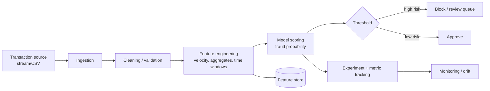

# Capstone — Real-Time Fraud / Anomaly Detection

> Built incrementally, one component per chapter of *Grokking Machine Learning*.
> By the end you can explain the full architecture and trade-offs in an interview.

---

## 1. Problem statement

A payments company processes a continuous stream of card transactions. A tiny fraction
(~0.1–2%) are fraudulent. We must **score each transaction in near real time** and flag the
risky ones for blocking or human review — **without** drowning analysts in false alarms or
letting fraud through.

This is a **binary classification** problem with three defining challenges that make it a
great interview story:

1. **Severe class imbalance** — fraud is rare, so accuracy is a useless metric (Ch 7).
2. **Asymmetric costs** — a missed fraud (false negative) ≠ a false alarm (false positive).
3. **Real-time + streaming** — features must be computable fast, on fresh data (the DE part).

---

## 2. Target architecture (where we're headed)

We will NOT build all of this at once. Each chapter adds one box (see roadmap table).

---

## 3. Build order (chapter → component)

| Ch | Capstone deliverable |
|----|----------------------|
| 1 | Problem framing doc, data contract for a transaction, project skeleton |
| 2 | Label definition for "fraud"; supervised framing; imbalance noted |
| 3 | Gradient-descent engine (reused everywhere); a first numeric predictor |
| 4 | Leakage-safe train/val/test harness + evaluation scaffold |
| 5 | Perceptron baseline classifier |
| 6 | Logistic model producing fraud *probabilities* + threshold logic |
| 7 | Metric layer: precision/recall/F1, PR curve, cost-weighted threshold |
| 8 | Naive Bayes probabilistic signal |
| 9 | Decision-tree rules engine (analyst-readable) |
| 10 | Neural-net non-linear detector |
| 11 | SVM + kernel comparison |
| 12 | Ensemble (likely the winning model) |
| 13 | Full pipeline integration, scoring API, deployment + trade-off write-up |

---

## 4. Tech choices (kept simple, justified)

- **Python** for all ML (NumPy first, then scikit-learn / Keras as the book introduces them).
- **SQL** for the feature/aggregate layer; **Go or Python** for the streaming ingestion service when we get there.
- **No frameworks before the book introduces them** — we implement gradient descent, perceptron, and logistic regression *from scratch* first, then swap in libraries. That contrast is gold in interviews.

---

## 5. Dataset plan

We'll start with a **synthetic transaction generator** (full control over fraud rate and
feature drift — ideal for teaching), and optionally validate against a public set
(e.g., the Kaggle credit-card fraud dataset) later. Chapter 1 defines the schema.

---

## 6. Interview narrative (the 60-second version — we'll refine it every chapter)

> "I built a real-time fraud detection system. The hard part wasn't the model — it was that
> fraud is ~1% of traffic, so I had to design around class imbalance and asymmetric error
> costs. I started with a from-scratch logistic baseline to understand the mechanics, tuned
> the decision threshold against a cost function rather than accuracy, then moved to an
> ensemble that gave the best precision-recall trade-off. On the data side I built a streaming
> feature pipeline computing velocity and aggregate features in time windows, with drift
> monitoring so the model degrades gracefully."

(Empty for now — you'll be able to say this for real by Chapter 13.)
