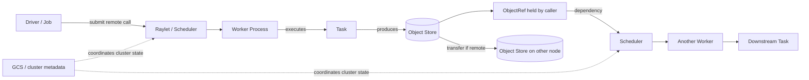
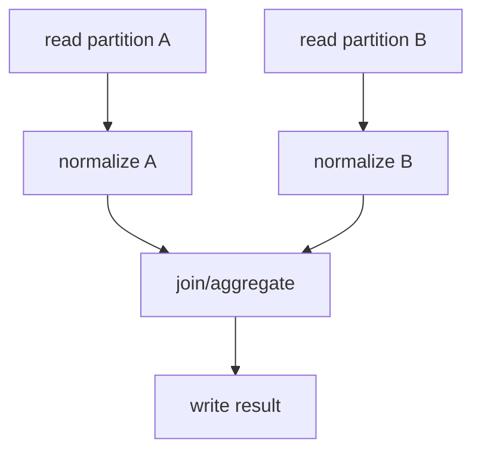

# Day 1 — Ray + Python Foundations

> **Purpose:** Build the mental model required to reason about Ray as a distributed runtime before touching higher-level APIs.
>
> **Primary sources:**
> - *Learning Ray: Flexible Distributed Python for Machine Learning* — Max Pumperla, Edward Oakes, Richard Liaw. Primary Day 1 material: Chapters 1–2, with selected ideas from later chapters where they clarify execution, memory, and workload design.
> - *Scaling Python with Ray: Adventures in Cloud and Serverless Patterns* — Holden Karau, Boris Lublinsky. Primary Day 1 material: Chapters 1–5, especially remote functions, actors, design details, resources, fault tolerance, object movement, and placement.
>
> **Current-docs reconciliation:** The books were written around the Ray 2.0–2.2 era. Where modern Ray behavior or terminology matters, this notebook explicitly marks a **Current Ray note** instead of silently rewriting the books.
>
> **Reading target:** The section titled **15-minute core reading path** is the required first pass. The remainder is a durable technical reference to return to during exercises.

---

# 1. 15-minute core reading path

## 1.1 The single most useful definition of Ray

Ray is best understood as a **distributed execution runtime for Python applications**.

It lets you express computation using normal Python concepts—functions, classes, objects, generators, async code—and then execute that computation across multiple worker processes and potentially multiple machines.

The first book emphasizes three design goals: **simplicity**, **flexibility/heterogeneity**, and **speed/scalability**. The second book emphasizes where Ray fits among scalable Python and distributed systems. Together, the right mental model is:

> **Ray turns Python program structure into distributed execution structure.**

That sentence is more useful than memorizing individual APIs.

A normal Python function can become a distributed **task**. A Python class can become a distributed **actor**. A Python value can become a remotely stored **object** referenced by an **ObjectRef**. Resource declarations tell Ray where those computations are allowed to run.

The first book explicitly treats **tasks, actors, and objects as three first-class primitives**. Do not mentally reduce Ray to “remote functions.” The object store and the dependency graph created by ObjectRefs are just as important as task execution.

## 1.2 What Ray is not

Do **not** conflate Ray with any of the following:

- a database;
- durable object storage;
- a data warehouse;
- a SQL query engine;
- Kubernetes;
- a message broker;
- a durable workflow engine;
- a replacement for every Spark/Flink workload;
- “Python multiprocessing on several machines.”

Ray can participate in systems containing all of those things, but its primary job is **distributed computation and coordination**.

This distinction matters in Data Engineering. Spark is usually stronger when the core problem is large-scale relational/SQL-style transformation, mature shuffle-heavy ETL, or integration with the traditional big-data ecosystem. Ray is especially attractive when the workload is Python-heavy, dynamically structured, stateful, heterogeneous, ML/AI-oriented, or combines many different computation patterns in one application.

## 1.3 The ontology: six things to keep separate

The following concepts form the foundation of almost everything else in Ray:

| Concept | Meaning | Best mental model |
|---|---|---|
| **Driver** | The Python process that submits work and coordinates the application/job | The program’s conductor |
| **Task** | An asynchronously executed remote function | Stateless distributed work unit |
| **Actor** | A stateful worker created from a class | Stateful service/shard with identity |
| **ObjectRef** | A handle naming the future/current result of distributed computation | Claim ticket / future, **not the value itself** |
| **Raylet** | Per-node system process responsible for local resource/scheduling coordination and worker management | Node-local dispatcher |
| **Object store** | Per-node shared-memory store used to hold and exchange Ray objects | Distributed shared data plane |

A Ray cluster also has a **head node** and a **Global Control Service (GCS)** for cluster-level metadata/control functions.

The key conceptual separation is:

> **Tasks and actors are computation. Objects are data. ObjectRefs connect computation to data dependencies. Resources constrain where computation may execute.**

## 1.4 Task execution is asynchronous by default

Suppose we write conceptually:

```python
ref = work.remote(x)
```

The important event is not “the function returned a value.” The important event is:

1. the driver submitted a task;
2. Ray returned an **ObjectRef immediately**;
3. the task may run later, elsewhere, on a different process or machine;
4. the eventual value belongs to the Ray object system;
5. calling `ray.get(ref)` crosses a synchronization boundary and asks for the concrete value.

This is why `ObjectRef` is conceptually similar to a **future/promise**.

If you call `ray.get()` immediately after every remote invocation, you destroy much of the available parallelism. You have converted an asynchronous execution model back into a mostly serial program.

The first book’s key insight is that you can pass ObjectRefs directly into downstream tasks. Ray then infers the dependency and schedules the downstream task when its inputs become available.

Conceptually:

```text
Task A ──> ObjectRef A ──┐
                        ├──> Task C
Task B ──> ObjectRef B ──┘
```

You usually do **not** need to fetch A and B back into the driver just to send them to C.

That is one of the central ideas of Ray.

## 1.5 Tasks versus actors

A **task** is the natural unit for work that can be represented as a function and does not require durable in-process state between invocations.

An **actor** is the natural unit when state or expensive initialization must live with a particular worker over time.

Use this test:

> If two invocations need to share changing in-memory state, a task alone is not enough.

Examples:

- parse 10,000 independent files → tasks;
- run CPU feature extraction per partition → tasks;
- keep a model loaded in GPU memory across many requests → actor;
- maintain a shard of mutable state → actor;
- pool database connections or hold an expensive native client → often actor;
- count global events safely → actor or external state system, depending durability requirements.

Do not assume an actor is “a task with a class syntax.” An actor has **identity, lifecycle, state, placement, and failure semantics** that a task does not.

## 1.6 Objects and ObjectRefs

An `ObjectRef` is not the object. It is a distributed reference to an object.

That distinction explains much of Ray’s behavior:

- a task can start before you call `ray.get`;
- downstream tasks can depend on unresolved refs;
- Ray can move the underlying data between nodes only when needed;
- multiple workers can refer to the same object;
- memory pressure depends on the lifetime of references;
- object ownership and failure semantics matter.

Ray maintains an object store on each node. Large objects can be placed in shared memory so multiple local workers can read them without each holding independent serialized copies. Remote consumers may cause object transfer between nodes.

**Mental model:**

> An ObjectRef is a location-independent capability to obtain a value, not a Python pointer to that value.

## 1.7 Ray resources are logical scheduling resources

A Ray resource request such as `num_cpus=2` means “this task requires two logical CPU units to be scheduled.” It does **not** mean Ray is a hard OS-level CPU limiter.

Likewise, memory/resource declarations are primarily part of **scheduling/admission control**, not an automatic sandbox that prevents code from consuming too much memory.

This distinction is essential in production.

Ray uses resources to answer questions such as:

- Can this task run on this node?
- Should this GPU actor run here or elsewhere?
- Does the cluster have enough capacity?
- Should the autoscaler add nodes?
- Can a placement group reserve all required resources atomically?

**Current Ray note:** Ray’s documentation still recommends explicitly specifying actor CPU requirements rather than relying on historical actor defaults.

## 1.8 The distributed-systems ideas hiding beneath the API

Ray’s Python surface looks simple because the runtime hides distributed-systems machinery. Underneath even a tiny program are questions about:

- asynchronous execution;
- dependency resolution;
- scheduling;
- serialization;
- data locality;
- remote object transfer;
- process and node failure;
- retries;
- duplicate execution;
- resource admission;
- backpressure;
- ownership and liveness;
- cluster metadata;
- partial failure.

This leads to a critical rule for the rest of this study track:

> **Never stop at “the API works.” Always ask what process owns the state, where the data lives, what crosses a process/node boundary, what can fail, what gets retried, and what must be idempotent.**

## 1.9 The Day 1 mental model in one diagram



Do not read the diagram as a literal packet-by-packet sequence. Read it as an ontology: **driver submits, schedulers place, workers execute, object stores hold data, refs express dependencies, GCS maintains cluster-level control metadata.**

---

# 2. Primary-source synthesis: what the two books contribute

## 2.1 *Learning Ray* — the conceptual spine

The first book is strongest for understanding why Ray’s API is intentionally small and composable. Its early chapters present Ray Core through six important operations:

```python
ray.init()
@ray.remote
.remote()
ray.put()
ray.get()
ray.wait()
```

The important lesson is not that there are “six methods to memorize.” The lesson is that a small API can express a large distributed execution space because the power comes from composition:

- functions become tasks;
- classes become actors;
- values become distributed objects;
- refs become dependency edges;
- scheduling emerges from resources and dependencies;
- asynchronous composition creates a dynamic computation graph.

The book also emphasizes Ray’s suitability for heterogeneous workloads: different tasks may have radically different durations, dependency structures, CPU/GPU requirements, and levels of statefulness.

That is one reason Ray maps naturally to AI and simulation workloads, but the underlying programming model is general.

## 2.2 *Scaling Python with Ray* — the engineering counterweight

The second book spends more time on what happens when the simple programming model meets real operational constraints:

- task composition;
- actor state and persistence;
- actor scaling;
- serialization;
- resource requests;
- placement groups;
- autoscaling;
- failures;
- memory;
- production concerns.

For Day 1, its biggest contribution is forcing us to stop thinking of Ray as syntactic sugar and start thinking in terms of **processes, memory boundaries, actor state, scheduling, and failure recovery**.

The books complement each other well:

```text
Learning Ray:
    "Here is the clean abstraction and why it composes."

Scaling Python with Ray:
    "Now reason about state, memory, placement, failure, and production behavior."
```

---

# 3. Ray terminology and conceptual ontology

## 3.1 Runtime

The **Ray runtime** is the set of system processes and services that make remote tasks, actors, distributed objects, scheduling, and cluster coordination possible.

When you run Ray locally, it still creates a distributed-style runtime using multiple processes on one machine. This is extremely useful pedagogically: you can observe many distributed behaviors without initially needing several physical machines.

## 3.2 Cluster

A **Ray cluster** is a collection of nodes participating in one Ray runtime.

A node is a machine or container/VM environment with Ray system processes and workers.

The cluster usually contains one **head node** and zero or more **worker nodes**.

Do not interpret “head” as “the machine where all computation happens.” Its defining role is cluster coordination/bootstrap. Production systems often try to reserve head-node capacity for Ray system processes rather than ordinary user work.

## 3.3 Job and driver

A **job** is an application submitted to a Ray cluster.

The **driver** is the process running the top-level application code that submits tasks and creates actors.

This distinction matters because the driver is both ordinary Python code and part of the distributed system. If the driver eagerly materializes every result with `ray.get`, it can become a throughput bottleneck and a memory bottleneck.

A good Ray application generally tries to keep distributed data distributed rather than repeatedly pulling it back through the driver.

## 3.4 Worker process

Ray executes user code in **worker processes**.

Different workers have separate process memory. Normal Python objects are not magically shared between them.

If process A mutates a local dictionary, process B does not see that mutation unless state is communicated through Ray, an actor, an external service, or another IPC/distributed mechanism.

This is the first major shift from ordinary single-process Python thinking.

## 3.5 Raylet

Each node has a **Raylet**. For Day 1, think of it as the node-local control component responsible for coordinating local resources, workers, scheduling interactions, and object-management interactions.

The exact internal scheduling architecture has evolved across Ray versions. The books contain useful architecture descriptions, but do not freeze their historical diagrams into your mental model as eternal implementation truth.

The stable conceptual role is:

> **Raylet = node-local runtime manager and scheduler-side participant.**

## 3.6 Global Control Service (GCS)

The **GCS** maintains cluster-level control metadata and coordinates information such as nodes, actors, placement groups, and other global runtime state.

Older explanations sometimes oversimplify the head node as an unavoidable single point of failure.

**Current Ray note:** modern Ray supports GCS fault-tolerance configurations. The exact production design depends on deployment architecture. For Day 1, the important distinction is that the **GCS is control-plane metadata**, while user object data lives in the distributed object/data plane.

## 3.7 Task

A **Ray task** is an asynchronous invocation of a remote function.

Properties worth remembering:

- usually stateless across invocations;
- scheduled according to dependencies and resources;
- produces one or more distributed results;
- returns ObjectRefs immediately to the caller;
- may be retried under some failure conditions;
- can create additional tasks, producing dynamic nested execution.

A task is not the same thing as a thread, a process, a Kubernetes pod, or a queue message.

## 3.8 Actor

A **Ray actor** is a stateful worker abstraction created from a Python class.

An actor gives you:

- a specific worker process with identity;
- in-process mutable state;
- methods invoked remotely;
- placement/resource requirements;
- a lifecycle distinct from ordinary tasks;
- restart/recovery considerations;
- potential concurrency configuration.

The second book connects actors to the classic actor model: state is private to the actor and modified through messages/method calls rather than shared-memory mutation from outside.

For a default synchronous actor, the useful Day 1 simplification is that its methods execute serially, helping protect actor state from ordinary concurrent mutation. Later we will study async actors, threaded actors, concurrency groups, ordering rules, and throughput design.

## 3.9 Object

A **Ray object** is a value managed by Ray and addressable through an ObjectRef.

Objects may be produced by:

- task returns;
- actor method returns;
- `ray.put`.

The object itself may live in a node’s object store or be transferred/spilled/reconstructed depending on runtime circumstances.

## 3.10 ObjectRef

An **ObjectRef** is a distributed reference to a Ray object.

It combines several useful ideas:

- future/promise;
- dependency token;
- distributed object identity;
- liveness/ownership relevance;
- scheduling input.

Do not write code that treats an ObjectRef as if it were the actual Python value.

## 3.11 Resource

A **resource** is a scheduler-visible logical quantity.

Common resources:

- CPU;
- GPU;
- memory-related scheduling quantities;
- custom numeric resources;
- node labels/scheduling selectors in modern Ray.

Resources answer placement questions. They do not automatically enforce business-level fairness, operating-system isolation, or application correctness.

## 3.12 Placement group

A **placement group** atomically reserves resource bundles across nodes.

This is essentially **gang scheduling**: reserve the required group of resources as a unit before launching a tightly related distributed workload.

Typical strategies include packing related workers for locality or spreading them for resilience/load distribution.

A bundle must fit on one node. A placement group may contain multiple bundles across several nodes.

Common real use cases include distributed training trials and multi-worker model-serving systems.

## 3.13 Runtime environment

A **runtime environment** defines dependencies that remote workers need: Python packages, environment variables, working directories, and related runtime context.

This solves a fundamental distributed-systems problem:

> “My driver can import this package” does not imply “every remote worker can import this package.”

---

# 4. Python concepts you must be strong on for Ray

Ray is Pythonic, but distributed Python punishes weak assumptions about Python execution.

## 4.1 Functions are values and decorators transform behavior

Ray commonly uses:

```python
@ray.remote
def f(...):
    ...
```

The decorator conceptually transforms the callable interface into one that submits work to Ray. You no longer call it exactly like an ordinary function; `.remote(...)` creates distributed execution.

You should be comfortable with:

- first-class functions;
- decorators;
- closures;
- lexical scope;
- function arguments and unpacking;
- exceptions;
- type hints.

Closures become particularly important because captured variables may need serialization. Accidentally capturing a huge object in a closure can create hidden data transfer and memory cost.

## 4.2 Classes, instances, and state

A normal Python instance lives in one process. A Ray actor handle is a client-side handle to an actor living in another worker process.

The actor’s `self` exists **inside the actor process**, not inside the driver.

That single sentence prevents many conceptual mistakes.

If you write:

```python
counter = Counter.remote()
```

`counter` in the driver is a handle. The actual actor state is remote.

## 4.3 Processes versus threads

The first book describes Python’s limitations for parallel/distributed execution. The precise modern Python interpretation is:

- ordinary CPython threads share one process memory space;
- the GIL historically prevents multiple threads from executing Python bytecode in parallel in the common CPython build;
- I/O can overlap, and native extensions can release the GIL;
- multiprocessing uses separate processes and therefore separate memory;
- Ray primarily obtains parallel execution through distributed worker processes, not shared-thread magic.

Do not reduce the story to “Python is single-threaded.” That is too imprecise to be useful.

The practical question is:

> Is this work CPU-bound Python, native code that releases the GIL, I/O-bound, async, or distributed across processes?

That answer affects architecture.

## 4.4 Serialization

Separate processes and separate nodes do not share arbitrary Python object memory. Data must be serialized or placed in a shared transport format.

Ray uses Python serialization mechanisms including `cloudpickle`-based behavior and optimized handling for common data such as NumPy arrays.

Serialization has four engineering consequences:

1. Not every Python object is safely serializable.
2. Serialization has CPU cost.
3. Serialized data has network/memory cost.
4. Captured closures and arguments determine what is shipped.

A function that is fast locally may become slow remotely because its data movement dominates its compute time.

## 4.5 Mutability and copying

Distributed computation changes the meaning of mutation.

A task receives values in its own process context. Mutating a local argument does not mutate some magical cluster-wide Python object.

Ray object-store data should generally be treated as immutable shared results. Current Ray documentation notes that some NumPy data can be read zero-copy from shared memory and therefore appears read-only unless copied before mutation.

This is good: immutable shared data is dramatically easier to reason about than distributed shared mutable memory.

## 4.6 Futures/promises

You should understand the classic future/promise idea before serious Ray work.

An ObjectRef means:

> “A value identified by this reference may not be available yet, but computation can be composed around the reference now.”

That lets the program express a dependency graph without blocking the driver at every edge.

## 4.7 Iterators, generators, and streaming

Python generators matter because modern Ray can stream outputs from generator tasks rather than materializing one giant result at the end.

This becomes important later for:

- reducing peak memory;
- pipelining;
- incremental result processing;
- backpressure-aware designs.

## 4.8 `asyncio`

Async programming is not the same as distributed parallelism.

`asyncio` gives cooperative concurrency inside a process/event loop. Ray can use async actors and ObjectRefs can participate in async workflows, but do not conflate:

```text
asyncio concurrency
!= threads
!= multiprocessing
!= Ray distributed execution
```

Each solves a different class of scheduling problem.

---

# 5. Execution model: from Python source code to distributed work

Consider a conceptual program:

```python
@ray.remote
def load(path):
    ...

@ray.remote
def transform(batch):
    ...

raw_ref = load.remote("s3://bucket/x")
clean_ref = transform.remote(raw_ref)
result = ray.get(clean_ref)
```

The useful execution interpretation is:

### Step A — registration/definition

The driver defines remote-callable functions. Ray has enough metadata to execute them in worker processes when invoked.

### Step B — task submission

`load.remote(...)` submits a task and returns an ObjectRef.

The driver does not need to wait for `load` to finish.

### Step C — dependency construction

`transform.remote(raw_ref)` submits another task whose direct argument is an ObjectRef.

Ray understands that `transform` depends on `load`’s result.

### Step D — scheduling

Ray considers resource requirements, node availability, dependencies, locality, and scheduling strategy.

### Step E — execution

A worker process executes `load`.

### Step F — result materialization

The result becomes a Ray object. The reference now points to an available object.

### Step G — dependent execution

Once the dependency is satisfied, `transform` can run where Ray schedules it. If the underlying object is remote, Ray may transfer it to the consumer’s node.

### Step H — synchronization

Only when the driver calls `ray.get(clean_ref)` must the driver wait for the concrete result to become locally available.

This is why `ray.get` is best understood as a **synchronization and data-materialization boundary**.

---

# 6. Dependencies: the hidden DAG

Ray tasks naturally form a directed dependency graph.



Unlike a static SQL plan, Ray applications can dynamically create more tasks during execution. That makes Ray suitable for workloads whose structure is not fully known at the beginning.

This is one important distinction from frameworks whose primary abstraction is a static relational DAG.

## Direct versus nested ObjectRefs

A subtle but important concept from current Ray usage:

- **direct ObjectRef arguments** to a task are treated as dependencies and resolved for the task;
- ObjectRefs buried inside arbitrary nested containers may require explicit handling depending on structure/API behavior.

The recommended pattern is often to expose true dependencies directly rather than pass a container full of refs and call `ray.get()` inside the task.

Why? Because blocking inside worker tasks can consume process/memory resources and reduce scheduler flexibility.

---

# 7. `ray.get` and `ray.wait`: synchronization, ordering, and backpressure

## 7.1 `ray.get`

`ray.get` converts one or more ObjectRefs into concrete Python values and blocks until they are available.

Good uses:

- final boundary where the driver really needs the value;
- small synchronization barriers;
- explicit result inspection;
- tests and debugging.

Dangerous patterns:

```python
for x in items:
    result = ray.get(work.remote(x))
```

This submits one unit of work and immediately waits, largely serializing the loop.

Better conceptual pattern:

```python
refs = [work.remote(x) for x in items]
results = ray.get(refs)
```

But even this can be dangerous if every result is huge.

## 7.2 `ray.wait`

`ray.wait` allows you to ask which refs are ready without forcing all results to complete.

This supports:

- processing results in completion order;
- handling stragglers;
- bounded in-flight work;
- backpressure;
- memory control;
- streaming-style pipelines.

A powerful production pattern is to keep only N tasks in flight and submit more as prior ones finish.

**Mental model:**

> `ray.get` says “give me the value.” `ray.wait` says “tell me what is ready.”

That difference is central to designing nonblocking systems.

---

# 8. Tasks: when stateless distributed functions are the right abstraction

Use tasks when computation is naturally functional or independently retryable.

Strong task properties:

- inputs fully describe required work;
- result can be recomputed;
- no hidden mutable process state is required;
- work duration is large enough to justify distributed scheduling overhead;
- failures can be retried safely or explicitly handled.

## 8.1 Granularity

Do not make every tiny function remote.

A remote task has scheduling, serialization, bookkeeping, and execution overhead. If the function takes microseconds, distributing it can be slower than running locally.

This is a classic parallel-computing problem:

```text
Useful work per task
--------------------
coordination overhead
```

must be large enough to justify distribution.

If tasks are too fine-grained, batch multiple records/items into one task.

## 8.2 Idempotency

A production Ray task may execute more than once under retry/reconstruction scenarios.

Therefore, a task that writes external side effects requires careful design.

Unsafe naïve task:

```python
@ray.remote
def charge_credit_card(...):
    external_api.charge(...)
```

If retries are possible, duplicate execution could create duplicate side effects.

Data Engineering analogue: writing the same partition twice, incrementing a counter twice, or emitting duplicate events.

The distributed-systems question is:

> Can this operation be repeated without changing the intended result?

If not, introduce idempotency keys, transactional sinks, deduplication, or separate compute from commit.

---

# 9. Actors: state, identity, and lifecycle

Actors exist because not all distributed computation can be expressed cleanly as stateless functions.

## 9.1 Actor state is process-local state

An actor can load state once and reuse it:

```text
Actor process
├── model weights
├── cache
├── connection pool
├── mutable counters
└── methods
```

This is ideal when initialization is expensive.

Example: loading a 10 GB model for every task would be disastrous. An actor can load the model once and serve many calls.

## 9.2 Actor handles

The caller holds an actor **handle**, not the actor object itself.

Calls through the handle become remote actor tasks.

Do not confuse a handle with local object ownership.

## 9.3 State durability

Actor memory is not durable storage.

If the actor process or node dies, in-memory state may be lost unless you deliberately persist/checkpoint it or reconstruct it from a durable source.

This is one of the most important actor misconceptions.

> **Actor state is convenient distributed state, not automatically durable state.**

For financial/data systems, durable truth usually belongs in a database, log, object store, or checkpoint—not solely in actor RAM.

## 9.4 Actor scaling is not “increase replicas and state magically merges”

If you create five actors, you now have five independent stateful workers.

Their state does not merge automatically.

To scale stateful actors, choose a strategy:

- shard state;
- replicate read-only state;
- externalize state;
- use consistent routing;
- make state reconstructable;
- use a pool for stateless/immutable initialized state.

This is distributed-state design, not just Ray API usage.

---

# 10. Object store and data movement

## 10.1 Why Ray needs an object store

Without a shared object system, distributed Python would repeatedly pickle values through the driver or peer-to-peer RPC calls.

Ray instead treats distributed objects as first-class runtime entities.

The object store enables:

- sharing large immutable values between local workers;
- remote transfer when another node needs the data;
- reference-based dependency tracking;
- spilling under memory pressure;
- avoiding repeated copies for some supported local data layouts.

## 10.2 Object store versus worker heap

Keep these memory domains conceptually separate:

```text
Worker heap
    ordinary Python objects used by a worker process

Object-store memory
    Ray-managed shared objects used for distributed exchange

Spill storage
    disk/external backing used when object-store pressure requires spilling
```

An out-of-memory problem can arise in different places, and the fix depends on which domain is actually exhausted.

## 10.3 `ray.put`

`ray.put(value)` manually places a value into Ray’s object system and returns an ObjectRef.

Good use case:

- one large immutable object reused by many tasks.

Instead of repeatedly passing the same giant Python object and causing repeated serialization, place it once and reuse the ref.

But do not assume `ray.put` is durable persistence.

**Current Ray note:** avoid the anti-pattern where a remote task creates an object with `ray.put` and returns that nested ref as its durable result. Object ownership can make that fragile if the owner dies. Prefer ordinary task returns when possible.

## 10.4 Data locality

Where the data already lives can matter as much as where CPUs are available.

Moving 50 GB over the network to an idle worker may be much slower than waiting briefly for compute near the data.

Ray’s scheduling and placement mechanisms therefore interact with locality.

This connects directly to Data Engineering systems such as Hadoop and Spark, where “move compute toward data” is a classic optimization principle.

---

# 11. Scheduling and resource management

## 11.1 Feasibility versus availability

A node may be:

- capable of ever satisfying a task’s resources;
- temporarily full;
- unsuitable because of GPU/custom-resource/label constraints.

This distinction helps debug “why is my task pending?”

A request for 8 GPUs cannot run on a node with only 4 logical GPUs even if every GPU is idle.

## 11.2 Logical resources

Ray scheduling resources are accounting units.

If you declare:

```python
@ray.remote(num_cpus=4)
def f():
    ...
```

Ray reserves four logical CPU units while scheduling/executing the task. That does not guarantee that the code physically uses exactly four cores, nor does it prevent badly behaved native code from spawning additional threads.

This matters with NumPy, BLAS, PyTorch, XGBoost, and other native libraries that may have their own threading behavior.

## 11.3 Custom resources and labels

Custom scheduling dimensions can represent constraints such as:

- accelerator type;
- architecture;
- special license availability;
- local dataset affinity;
- hardware capability.

Do not misuse custom resources as application data. They are scheduler metadata.

## 11.4 Placement groups

Placement groups reserve bundles atomically.

Example conceptual requirement:

```text
One training trial needs:
- 1 coordinator CPU bundle
- 4 worker bundles, each with 1 GPU + 4 CPU
```

Without gang scheduling, part of the workload could acquire resources and wait forever for the rest.

Placement groups let Ray reserve the set coherently.

Use packing when locality/communication dominates. Use spreading when fault isolation or load distribution dominates.

---

# 12. Fault tolerance: the beginning of production reasoning

The books correctly emphasize that distributed failures are normal, not exceptional.

## 12.1 Application failure versus system failure

These are different categories.

**Application failure:**

```python
raise ValueError("bad input")
```

The code ran and intentionally/accidentally raised a Python exception.

**System failure:**

- worker crashes;
- process is killed;
- node disappears;
- runtime component fails;
- object is lost.

Ray can apply different retry/recovery behavior depending on the category and configuration.

Do not assume “Ray retries failures” means every Python exception is automatically retried forever.

## 12.2 Stateless tasks are easier to recover

If a task is a pure function of its inputs:

```text
output = f(input)
```

then losing the worker is often recoverable by running `f(input)` again.

This is one reason functional/stateless designs are powerful in distributed systems.

## 12.3 Actors are harder

If an actor has performed:

```text
state = state + mutation
```

and then crashes, a restart does not automatically recreate the correct state unless you designed a recovery mechanism.

Possible patterns:

- checkpoint state;
- event-source state;
- reconstruct from durable DB;
- use actor only as cache;
- make authoritative state external.

## 12.4 Retries imply duplicate execution risk

Whenever retry exists, ask:

> Could the previous attempt have partially succeeded before the system decided it failed?

This is the heart of distributed side-effect safety.

For Data Engineering, common answers include:

- transactional table writes;
- overwrite-by-partition;
- exactly-once-like sink protocol;
- dedupe keys;
- idempotent UPSERT;
- write-to-temp then atomic commit.

## 12.5 Object loss and lineage

Some Ray objects can be reconstructed by re-executing the task that produced them.

But not every object is reconstructable in every circumstance. Ownership and how the object was created matter.

That is why “object store” must never be mentally equated with durable storage.

---

# 13. Backpressure and bounded concurrency

A distributed system can fail even when every individual task is correct.

Imagine the driver can submit 100,000 tasks per second, but workers complete only 5,000 per second.

Pending work grows indefinitely:

```text
arrival rate > service rate
        ↓
queue grows
        ↓
metadata + refs + object results grow
        ↓
memory pressure
        ↓
OOM / instability
```

This is a queueing/backpressure problem.

`ray.wait` can be used to bound the number of in-flight tasks.

This concept will matter repeatedly in:

- file ingestion;
- API fan-out;
- batch inference;
- streaming pipelines;
- actor request queues;
- data preprocessing.

Do not confuse “maximum parallelism” with “maximum throughput.” Unbounded parallelism often reduces throughput by causing contention and memory pressure.

---

# 14. Common misconceptions to eliminate now

| Incorrect belief | Correct model |
|---|---|
| “`.remote()` is basically a normal function call on another thread.” | It is asynchronous distributed task/actor submission to separate workers. |
| “`ObjectRef` contains the object.” | It identifies a remotely managed object/future result. |
| “Calling `ray.get` is harmless.” | It is a blocking/materialization boundary and can destroy parallelism or overload memory. |
| “An actor is durable state.” | Actor memory is process-local state; durability requires deliberate persistence/reconstruction. |
| “If I request 4 CPUs, Ray hard-limits the process to four cores.” | Resource requests are primarily logical scheduling/admission units. |
| “More tasks always means more speed.” | Task overhead and data movement can dominate; granularity matters. |
| “Ray replaces Spark.” | They overlap in some areas but optimize for different programming/data models. |
| “Ray object store is a distributed database.” | It is a runtime data plane/cache/exchange layer, not durable authoritative storage. |
| “Retries mean reliability is solved.” | Retries create side-effect/idempotency problems and do not restore arbitrary lost actor state. |
| “The driver should collect every intermediate result.” | Keep data distributed and pass refs between tasks whenever possible. |
| “Local mode and cluster mode are conceptually different APIs.” | Ray intentionally keeps the programming model similar; deployment and failure domains change. |
| “AsyncIO and Ray are the same type of concurrency.” | AsyncIO is cooperative concurrency within event loops; Ray distributes execution across processes/nodes. |

---

# 15. Ray versus neighboring technologies

## 15.1 Ray versus Python multiprocessing

`multiprocessing` is useful for parallel processes on one machine.

Ray adds distributed scheduling, cluster resources, remote object management, actors, failure handling, cluster scaling, and higher-level libraries.

Do not use Ray merely because “I want two local CPU cores.” Use it when the distributed programming model or ecosystem provides value.

## 15.2 Ray versus Celery-style task queues

A task queue is typically organized around durable-ish job/message dispatch to workers through a broker.

Ray is designed as a tightly integrated distributed execution runtime with ObjectRefs, dynamic dependencies, actors, and shared distributed object management.

A queue and Ray can coexist. They solve different coordination problems.

## 15.3 Ray versus Spark

A useful simplification from the second book:

```text
Spark:
    data-centric distributed computation
    mature SQL/DataFrame ecosystem
    large ETL and shuffle-heavy analytical processing

Ray:
    Python-computation-centric distributed runtime
    dynamic tasks + actors
    heterogeneous CPU/GPU workloads
    AI/ML and stateful distributed applications
```

Modern Ray Data creates more overlap, but the architectural instincts remain useful.

For a classic warehouse ETL pipeline with heavy SQL, Spark may be the obvious tool.

For a pipeline combining Python parsing, model inference, GPU actors, simulation, dynamic fan-out, and online serving, Ray may provide a more natural unified runtime.

## 15.4 Ray versus Kubernetes

Kubernetes schedules containers/pods and manages cluster application infrastructure.

Ray schedules **application-level tasks and actors** inside a Ray cluster.

KubeRay integrates them:

```text
Kubernetes:
    manages Ray cluster infrastructure

Ray:
    manages distributed application execution inside that cluster
```

Do not make Kubernetes schedule every tiny Python function. That is exactly the layer Ray is designed to avoid.

## 15.5 Ray versus a workflow orchestrator

Airflow/Temporal/Dagster-style systems coordinate durable workflows, schedules, retries, external jobs, and long-lived business processes.

Ray coordinates distributed computation.

The second book includes Ray Workflows, but that material is now historical for new design work.

**Current Ray note:** Ray Workflows has been deprecated; do not design new durable workflow orchestration around it. Study it later only as an architectural comparison.

---

# 16. Data Engineering connections

Ray becomes easier to understand when mapped to familiar DE patterns.

## 16.1 Partitioned file processing

```text
10,000 files
    ↓
N independent read/parse tasks
    ↓
ObjectRefs representing parsed partitions
    ↓
transform tasks
    ↓
aggregation / write
```

Questions to reason about:

- What is the right file/task granularity?
- Does each task repeatedly initialize expensive libraries?
- Are large results unnecessarily returned to the driver?
- Where does shuffle happen?
- What is the backpressure strategy?
- What if a file task is retried after writing output?

## 16.2 Batch model inference

```text
Object storage → Ray Data / partitioning → CPU preprocessing tasks
                                      → GPU model actors
                                      → CPU postprocessing
                                      → durable sink
```

Ray’s heterogeneous scheduling becomes valuable because CPU and GPU stages have different resource shapes.

## 16.3 Stateful enrichment

Suppose events must be enriched using an expensive model/cache.

A task-per-event design may repeatedly load the model.

An actor can hold the model once, but then you must reason about:

- routing;
- actor throughput;
- actor replicas;
- batching;
- failure/restart;
- cache warmup;
- durability of any mutable state.

## 16.4 Dynamic fan-out

Some data workloads do not know the number of children until data is inspected.

Example:

```text
crawl manifest
    ↓
discover 1–N datasets
    ↓
spawn dataset-specific work dynamically
```

Ray’s dynamic task graph is well suited to this pattern.

## 16.5 When not to use Ray for DE

Be skeptical when the workload is mostly:

- SQL transformations;
- mature warehouse/lakehouse operations;
- very shuffle-heavy relational processing;
- strict event-time stream processing with sophisticated watermarking/state semantics;
- durable business orchestration;
- storage-first rather than compute-first.

The senior decision is not “Can Ray do it?” The question is:

> **Does Ray’s execution model reduce system complexity relative to the alternatives?**

---

# 17. Practical engineering best practices for Day 1

1. **Delay `ray.get` as long as possible.** Compose ObjectRefs instead of materializing intermediates in the driver.
2. **Batch tiny work.** A distributed task must contain enough useful work to justify overhead.
3. **Reuse large immutable inputs with refs.** Avoid repeatedly serializing the same large object.
4. **Treat actors as stateful services, not magic shared objects.** Design state ownership explicitly.
5. **Make retryable side effects idempotent.** Never assume a failed distributed call produced no external effect.
6. **Bound in-flight work.** Use backpressure instead of flooding the cluster.
7. **Declare resources intentionally.** Especially actor CPU/GPU requirements.
8. **Measure data movement.** CPU utilization alone is a terrible distributed-system performance metric.
9. **Distinguish worker heap from object-store memory.** “Ray OOM” is not one single failure category.
10. **Prefer durable external truth for important state.** Actors and object-store objects should usually be reconstructable/cached computational state.
11. **Keep cluster dependencies explicit.** Remote workers need packages/files/env vars too.
12. **Observe before guessing.** Dashboard, task timelines, state APIs, logs, `ray status`, and memory tooling will be part of our practice.

---

# 18. Failure modes we will deliberately create in practice

Day 1 and Day 2 exercises should not stop at successful execution. We will intentionally create:

- serialized execution caused by premature `ray.get`;
- task explosion from too-fine granularity;
- object-store pressure from too many large results;
- driver heap pressure from materializing too much data;
- backlog growth from unbounded task submission;
- worker crashes;
- Python exceptions;
- actor crashes and state loss;
- unserializable arguments/closures;
- duplicated side effects under retry;
- infeasible resource requests;
- pending placement groups;
- dependency/environment failures on workers;
- stragglers and completion-order effects.

For every failure we will answer four questions:

```text
1. What failed?
2. Which Ray component/process owned the failing responsibility?
3. What observable evidence proves that diagnosis?
4. What production design prevents or contains it?
```

---

# 19. Book-era material that must not be memorized as current truth

The books are excellent primary learning material, but several implementation/API details are from the Ray 2.0–2.2 period.

## 19.1 Ray AIR

*Learning Ray* uses **Ray AIR** as a unifying umbrella for Data, Train, Tune, and related ML APIs.

Treat AIR as useful historical architecture context. Modern Ray documentation generally teaches the individual libraries directly rather than requiring AIR as the primary mental entry point.

## 19.2 DatasetPipeline

The book’s `DatasetPipeline` material is historical. Modern Ray Data uses streaming execution directly in Dataset pipelines and has moved away from the old DatasetPipeline abstraction.

## 19.3 Ray Workflows

The second book devotes a full chapter to Ray Workflows.

Do not use it as a current recommendation for new durable workflow systems. Ray Workflows has been deprecated.

## 19.4 Head-node/GCS failure assumptions

Older explanations frequently state that head failure destroys the cluster.

Modern Ray has GCS fault-tolerance options, so production architecture is more nuanced. We will study exact guarantees later rather than relying on a single old sentence.

## 19.5 Exact retry/default values

Defaults can change. Understand semantics first, then verify current API defaults when designing production behavior.

For production code, explicitly configure behavior that correctness depends on.

---

# 20. Useful mental models

## 20.1 Ray as a distributed operating layer for Python computation

```text
Your Python program
    ↓
Tasks / Actors / ObjectRefs / Resources
    ↓
Ray runtime
    ↓
Processes + nodes + memory + network + accelerators
```

Ray does not remove the lower layer. It gives you a programming model over it.

## 20.2 Task = equation

```text
output = f(input)
```

The closer your task is to this model, the easier retries, testing, and scaling become.

## 20.3 Actor = state owner

```text
messages → [ ACTOR | private state ] → results
```

If you cannot clearly state what state the actor owns, why it must be in-process, and how it recovers, the actor design is probably premature.

## 20.4 ObjectRef = dependency token

Think of an ObjectRef less as a pointer and more as:

```text
"This downstream computation needs the result identified by this token."
```

That makes the DAG model intuitive.

## 20.5 `ray.get` = crossing back into local synchronous Python

Every time you type `ray.get`, ask:

> Why must this value become concrete **here, now, in this process**?

If you do not have a good answer, the `get` may be too early.

## 20.6 Resources = scheduling currency

Logical CPUs/GPUs/custom resources are tokens the scheduler uses to decide which work fits where.

They are not an operating-system prison around the process.

## 20.7 Actor RAM = cache unless proven otherwise

For production architecture, assume actor memory can disappear. If losing it is unacceptable, persist or reconstruct it.

---

# 21. What you absolutely need to understand before moving on

You are ready for hands-on Ray Core only when you can explain, without looking up syntax:

1. why `.remote()` returns an ObjectRef instead of the actual result;
2. how ObjectRefs create task dependencies without the driver calling `ray.get`;
3. why an actor is a state-owning worker rather than simply a “remote class”;
4. where ordinary Python state lives relative to driver, workers, actors, and object stores;
5. why serialization and network movement can dominate runtime;
6. why Ray resources are logical scheduling constructs;
7. why `ray.get` in a loop commonly destroys parallelism;
8. why unlimited task submission can cause memory/backpressure failure;
9. why task retries force you to think about idempotency;
10. why actor memory and Ray object storage are not durable business storage;
11. when Ray is a more natural execution model than Spark, and when Spark is the better tool;
12. the roles of driver, worker, Raylet, object store, head node, and GCS.

If any of those answers are fuzzy, that is exactly what the Day 1 exercises will target.

---

# 22. Practice-material research completed for the hands-on phase

The next phase will use the sources below as **exercise inspiration**, not copy-along tutorials. We will rewrite them into medium → hard engineering problems with measurement, failure injection, and explanation requirements.

## Priority A — Official Ray Core patterns and documentation

Current Ray docs (checked against Ray 2.58 documentation) contain particularly strong practice material around:

- tasks, actors, and objects;
- `ray.get` versus `ray.wait`;
- limiting pending tasks with backpressure;
- avoiding nested/premature `ray.get`;
- avoiding too-fine-grained tasks;
- avoiding materializing too many objects at once;
- logical CPU/GPU/custom resources;
- placement groups;
- task/actor/object fault tolerance;
- Ray generators;
- Dashboard, task timeline, State API, and `ray status`.

Useful starting points:

- https://docs.ray.io/en/latest/ray-core/key-concepts.html
- https://docs.ray.io/en/latest/ray-core/tasks.html
- https://docs.ray.io/en/latest/ray-core/actors.html
- https://docs.ray.io/en/latest/ray-core/scheduling/resources.html
- https://docs.ray.io/en/latest/ray-core/fault-tolerance.html
- https://docs.ray.io/en/latest/ray-core/advanced-topics.html
- https://docs.ray.io/en/latest/ray-observability/getting-started.html

## Priority B — Official Ray tutorial repository

The Ray project maintains a tutorial repository with a useful progression of exercises:

- remote functions;
- dependent remote functions;
- nested remote functions;
- actors for shared state;
- passing actor handles;
- `ray.wait` for stragglers;
- `ray.wait` for completion order;
- `ray.put` for avoiding repeated copies;
- GPU requirements;
- custom resources;
- distributed neural-network weight transfer;
- tree reduction through ObjectRef dependencies;
- sharded parameter server;
- MapReduce.

Repository:

- https://github.com/ray-project/tutorial

We will **not** simply execute those notebooks. We will use them as raw material, remove scaffolding, add instrumentation, and introduce failure/debug requirements.

## Priority C — MIT 6.5840 Distributed Systems

MIT 6.5840 is not a Ray course, and its programming labs are primarily Go-based, but it is excellent supplemental material for the concepts Ray hides:

- RPC;
- partial failure;
- fault tolerance;
- replication;
- consistency;
- distributed coordination.

Course:

- https://pdos.csail.mit.edu/6.5840/

We will borrow **reasoning patterns**, not attempt to turn Day 1 into the full 6.5840 lab sequence.

## Lower priority for Day 1

Kaggle and generic Colab tutorials are useful for convenient hosted execution, but the advanced Day 1 objective is runtime reasoning, process behavior, profiling, failure injection, and observability. Official Ray examples plus systems-course material are stronger primary practice sources for that objective.

---

# 23. Planned Day 1 hands-on progression

The reading stops here. The next session phase should progress in this order:

```text
Environment
    ↓
Python execution/concurrency diagnostic exercises
    ↓
Ray local runtime inspection
    ↓
Remote tasks + ObjectRefs
    ↓
Dependency graphs
    ↓
Actors and state
    ↓
Serialization + object movement
    ↓
Resource scheduling
    ↓
Backpressure / ray.wait
    ↓
Failure injection
    ↓
Observability and explanation
```

The exercise standard will be:

> **reason → predict → implement → measure → break → inspect → fix → explain**

No copy-and-paste tutorial completion will count as mastery.

---

# 24. Day 1 self-check before opening the terminal

Answer these from memory:

### A. Execution

You submit 100 tasks and immediately receive 100 ObjectRefs. Have the tasks finished? Why or why not?

### B. Dependency

Task B receives Task A’s ObjectRef as a direct argument. Must the driver first call `ray.get(A)`? Explain the scheduler-level reason.

### C. State

Two independent tasks increment a module-level Python variable. Should you expect a reliable global count? Explain the process-memory model.

### D. Actor

A model actor loads a 4 GB model in `__init__`. Why might that be superior to a normal task? What new failure/state problem does it create?

### E. Data movement

A task returns a 5 GB object consumed by another task on a different node. Name the likely performance bottlenecks besides CPU.

### F. Resources

A task requests `num_cpus=4`. Does Ray guarantee the operating system will prevent it from using a fifth CPU? Explain.

### G. Backpressure

The driver submits tasks faster than the cluster completes them for 30 minutes. What grows, and how can `ray.wait` participate in the solution?

### H. Reliability

A task writes to an external database and crashes after the database commit but before Ray observes successful completion. Why can automatic retry be dangerous?

### I. Architecture

Explain the difference between Raylet, worker process, object store, and GCS without using the phrase “they manage Ray.”

### J. Tool choice

Give one workload where Spark is the better default and one where Ray is the better default. Justify based on the programming model, not product preference.

---

# 25. Source map

## Book-derived material

The notebook’s primary conceptual basis comes from:

### *Learning Ray*

- Chapter 1 — What Ray is, design principles, Core/libraries/ecosystem, cluster framing.
- Chapter 2 — Ray Core, tasks, actors, objects, ObjectRefs, `ray.put`, `ray.get`, `ray.wait`, dependencies, system components, node/cluster execution.
- Selected later architecture/memory/failure explanations only where they reinforce the Day 1 mental model.

### *Scaling Python with Ray*

- Chapter 1 — where Ray fits, relationship to big data/ML/workflow/streaming, and what Ray is not.
- Chapter 2 — local Ray execution and task/data/actor introductions.
- Chapter 3 — remote-function composition and best practices.
- Chapter 4 — actor model, actor state, persistence, scaling, concurrency considerations.
- Chapter 5 — fault tolerance, Ray objects, serialization, resources, memory, autoscaling, placement groups, runtime environments.

## Current authoritative supplements

Current Ray documentation was used only to identify version-sensitive changes and to research the practice phase. The book-era ideas were not silently replaced.

Key updates called out in this notebook:

- Ray 2.58 current key-concept framing;
- logical-resource semantics and explicit actor CPU guidance;
- current `ray.get` / `ray.wait` anti-pattern guidance;
- current object ownership/fault-tolerance cautions;
- current Dashboard/State API observability workflow;
- DatasetPipeline as historical rather than current architecture;
- Ray Workflows deprecation;
- modern GCS fault-tolerance nuance.

---

# End of reading

**Next action:** configure the Python/Ray development environment and begin the medium → hard Day 1 exercise sequence. Do not read more theory first. The next learning should come from running code, observing processes, measuring execution, and breaking assumptions deliberately.
