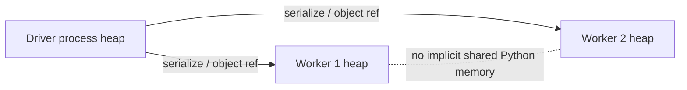
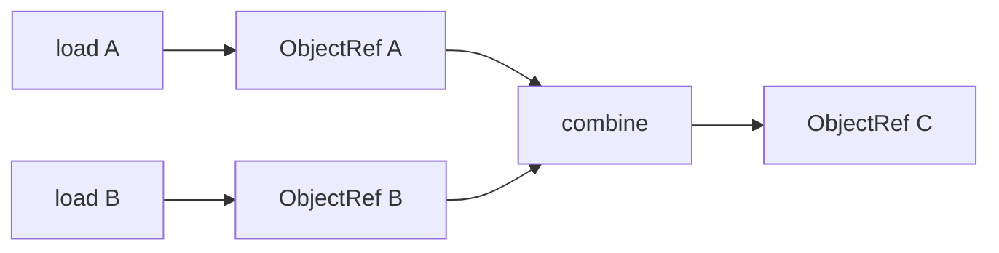
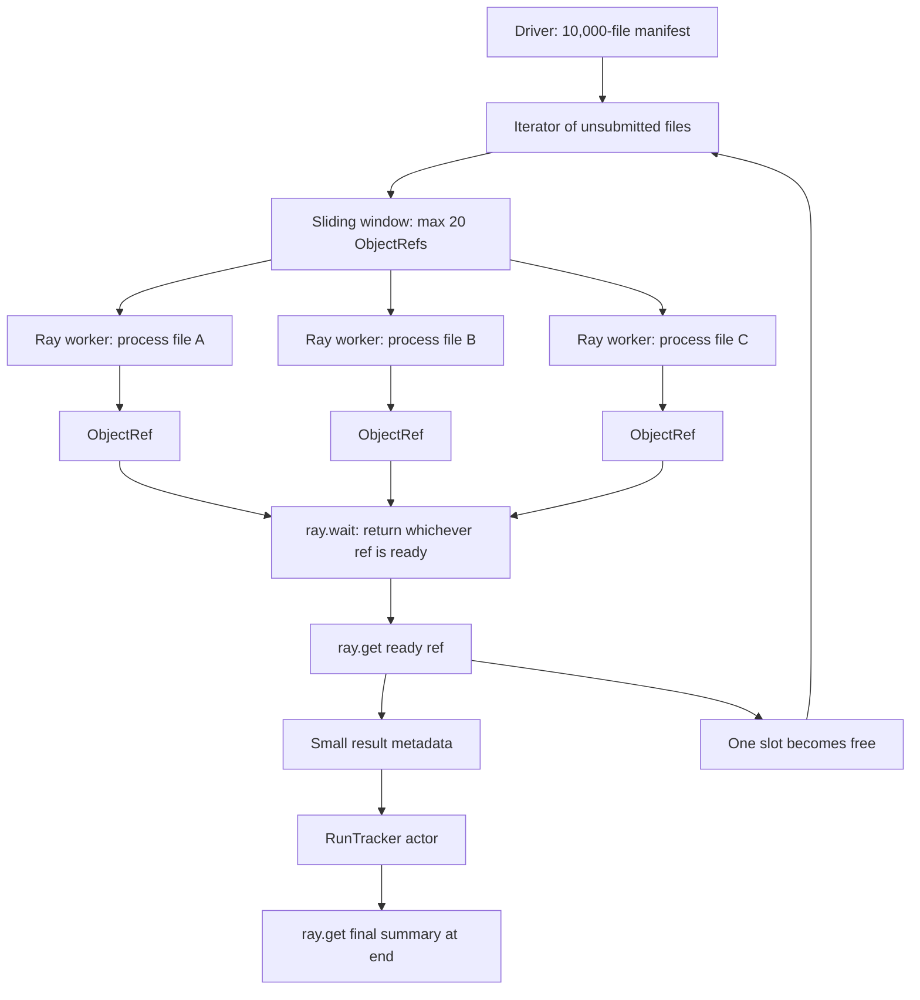
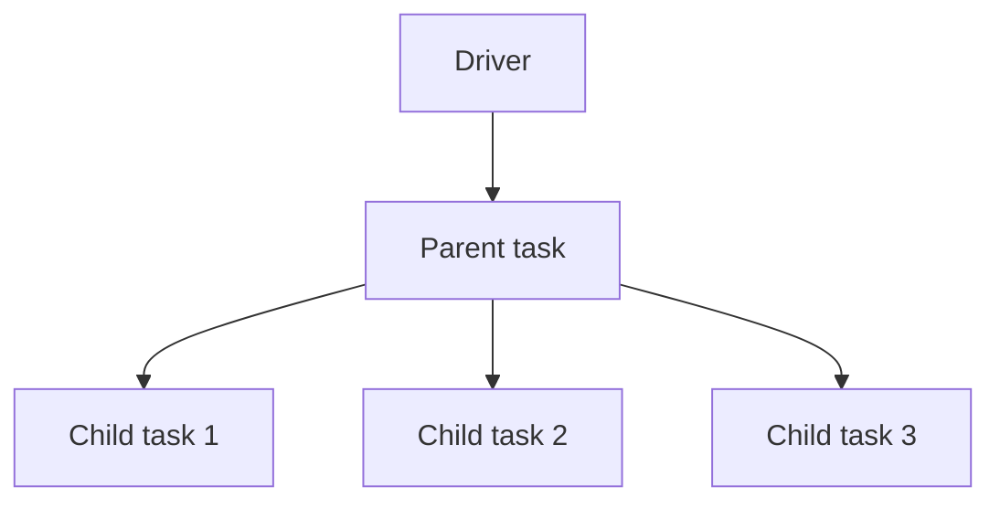
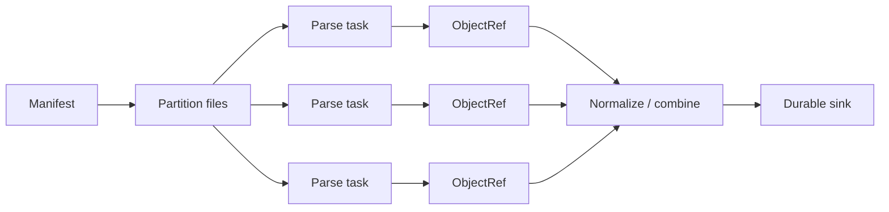

# Ray Core Execution and the Python Runtime

## Why this module exists

Ray looks deceptively simple because its public API mirrors ordinary Python. The difficulty is not syntax. The difficulty is understanding what stops being local once Python code crosses a process or node boundary.

This notebook extracts the useful engineering knowledge from the two Ray books around remote functions, ObjectRefs, dependency composition, Python process semantics, and distributed execution.

---

## 1. Core ontology

| Concept | What it is | What it is not |
|---|---|---|
| Driver | Top-level Python process submitting distributed work | A central executor for all tasks |
| Worker | Separate process executing user code | A thread inside the driver |
| Task | Asynchronous invocation of a remote function | A queue message or OS process |
| ObjectRef | Distributed reference/future for a Ray object | The Python value itself |
| Dependency | An ObjectRef required by downstream work | A manually managed barrier |
| Job | One submitted Ray application | The entire Ray cluster |

### Mental model

```text
ordinary Python function
        ↓ @ray.remote
remote function definition
        ↓ .remote(...)
submitted task
        ↓
ObjectRef returned immediately
        ↓
worker executes elsewhere
        ↓
Ray object becomes available
```

The most important fact is that `.remote()` changes the **execution contract**. The call is asynchronous and the returned object is a reference to future distributed state.

---

## 2. Python knowledge that matters for Ray

### 2.1 Processes versus threads

Ray primarily gets parallelism through separate worker processes. Separate processes do not share ordinary Python heap state.



Do not use module globals, mutable singletons, or local caches as if they were cluster-global state.

### 2.2 GIL implications

The book discussions correctly motivate why plain Python threads are insufficient for general CPU-parallel Python execution. The important nuance is:

- pure Python bytecode is historically constrained by the GIL in normal CPython builds;
- I/O can overlap;
- NumPy/PyTorch/native extensions may release the GIL;
- multiprocessing and Ray workers use separate processes and therefore can execute CPU work in parallel.

Do not reduce this to “Python is single-threaded.” That statement is too imprecise to guide architecture.

### 2.3 Serialization

A remote function must be executable in another process. Its arguments, captured closure state, and return values may therefore need serialization.

This creates three hidden costs:

```text
serialization CPU
+ memory copies
+ network transfer
```

A local function that takes 10 ms can easily become a bad Ray task if sending its arguments costs 100 ms.

---

## 3. Remote functions

### Durable concept

A remote function is best viewed as a **stateless distributed computation unit**.

```python
@ray.remote
def transform(x):
    return expensive_work(x)
```

Calling:

```python
ref = transform.remote(x)
```

means:

1. submit work;
2. receive a future-like ObjectRef;
3. allow Ray to schedule execution;
4. synchronize later only if necessary.

### Good task properties

| Property | Why it helps |
|---|---|
| Inputs fully determine result | Retry and reasoning become simpler |
| Large enough compute unit | Amortizes scheduling/serialization overhead |
| Few external side effects | Reduces duplicate-execution risk |
| Reconstructable output | Supports fault recovery |
| Explicit resource needs | Improves scheduling predictability |

---

## 4. ObjectRefs are dependency edges

The first book’s strongest Core lesson is that ObjectRefs are not merely handles you later pass to `ray.get`. They are what allow Ray to infer a distributed dependency graph.

```python
a = load.remote(path_a)
b = load.remote(path_b)
c = combine.remote(a, b)
```

No driver-side `ray.get(a)` or `ray.get(b)` is required before submitting `combine`.



### Why this matters

Premature materialization causes:

- blocked driver execution;
- unnecessary data movement to the driver;
- lost parallelism;
- extra copies;
- driver-memory pressure.

A useful rule:

> Keep data represented as ObjectRefs until a local consumer truly needs the concrete value.

---

## 5. `ray.get` is a synchronization boundary

### Common anti-pattern

```python
results = []
for item in items:
    results.append(ray.get(work.remote(item)))
```

This mostly serializes execution.

### Better

```python
refs = [work.remote(item) for item in items]
results = ray.get(refs)
```

But this still materializes every result at once. If results are large, it can overload the driver.

### Production lesson

Ask every time you see `ray.get`:

> Why does this value need to become concrete in this process, at this exact point?

If there is no strong answer, the `get` is probably too early.

---

## 6. `ray.wait` and completion-order processing

`ray.wait` allows the driver or another control loop to work with ready results without waiting for everything.

Useful for:

- straggler handling;
- bounded in-flight work;
- backpressure;
- completion-order processing;
- memory control;
- timeout logic.

### Bounded-concurrency pattern

```text
submit N tasks
    ↓
wait for 1 or k completions
    ↓
consume results
    ↓
submit same number of replacements
    ↓
repeat
```

This is often superior to submitting millions of tasks immediately.

### End-to-end DE example — bounded Parquet normalization

Scenario: a daily ingestion job receives 10,000 Parquet files. Each file must be read, validated, normalized, and written to a clean zone. We want at most 20 outstanding Ray tasks at a time, we want to process whichever file finishes first, and we want one explicit state owner to track run statistics.

The example deliberately uses all four Core concepts together:

| Concept | Role |
|---|---|
| `@ray.remote` | Stateless file transformation |
| Ray actor | Stateful run tracker |
| `ray.wait()` | Sliding window / completion-order processing |
| `ray.get()` | Materialize only a result that the driver actually needs |

#### Flow



This is a **sliding window**, not fixed batches of 20. If one task finishes, one replacement is submitted immediately; the other 19 do not need to finish first.

```text
initial:       1  2  3  ... 20
7 finishes:   remove 7, submit 21
3 finishes:   remove 3, submit 22
18 finishes:  remove 18, submit 23
...
```

#### Complete example

```python
import ray
import pandas as pd
from pathlib import Path

ray.init()


# ---------------------------------------------------------
# 1. Stateful component: one explicit owner of run metrics
# ---------------------------------------------------------

@ray.remote
class RunTracker:
    def __init__(self):
        self.files_succeeded = 0
        self.files_failed = 0
        self.rows_read = 0
        self.rows_written = 0
        self.bad_rows = 0
        self.failures = []

    def record_success(self, result):
        self.files_succeeded += 1
        self.rows_read += result["rows_read"]
        self.rows_written += result["rows_written"]
        self.bad_rows += result["bad_rows"]

    def record_failure(self, path, error):
        self.files_failed += 1
        self.failures.append({
            "path": path,
            "error": error,
        })

    def summary(self):
        return {
            "files_succeeded": self.files_succeeded,
            "files_failed": self.files_failed,
            "rows_read": self.rows_read,
            "rows_written": self.rows_written,
            "bad_rows": self.bad_rows,
            "failures": self.failures,
        }


# ---------------------------------------------------------
# 2. Stateless distributed unit of work
# ---------------------------------------------------------

@ray.remote
def process_file(input_path: str, output_dir: str):
    input_path = Path(input_path)
    output_dir = Path(output_dir)

    # Extract
    df = pd.read_parquet(input_path)
    rows_read = len(df)

    # Validate
    required_columns = {
        "event_id",
        "user_id",
        "event_time",
        "amount",
    }

    missing = required_columns - set(df.columns)
    if missing:
        raise ValueError(f"{input_path}: missing columns {missing}")

    # Transform
    valid = (
        df["event_id"].notna()
        & df["user_id"].notna()
        & df["event_time"].notna()
        & (df["amount"] >= 0)
    )

    clean_df = df[valid].copy()
    clean_df["event_date"] = pd.to_datetime(
        clean_df["event_time"]
    ).dt.date

    rows_written = len(clean_df)
    bad_rows = rows_read - rows_written

    # Load
    output_dir.mkdir(parents=True, exist_ok=True)
    output_path = output_dir / input_path.name
    clean_df.to_parquet(output_path, index=False)

    # Return small metadata instead of the whole DataFrame.
    return {
        "input_path": str(input_path),
        "output_path": str(output_path),
        "rows_read": rows_read,
        "rows_written": rows_written,
        "bad_rows": bad_rows,
    }


# ---------------------------------------------------------
# 3. Driver control loop
# ---------------------------------------------------------

files = [
    f"/data/raw/part-{i:05d}.parquet"
    for i in range(10_000)
]

output_dir = "/data/clean"
MAX_IN_FLIGHT = 20

tracker = RunTracker.remote()
file_iter = iter(files)

# Map ObjectRef -> source path so failures remain attributable.
in_flight = {}

# Seed only the first 20 tasks.
for _ in range(MAX_IN_FLIGHT):
    try:
        path = next(file_iter)
    except StopIteration:
        break

    ref = process_file.remote(path, output_dir)
    in_flight[ref] = path


# Maintain a sliding window until all input is exhausted and
# every outstanding task has completed.
while in_flight:
    ready_refs, _ = ray.wait(
        list(in_flight.keys()),
        num_returns=1,
    )

    ready_ref = ready_refs[0]
    path = in_flight.pop(ready_ref)

    try:
        # The task is already ready. Materialize only its small metadata.
        result = ray.get(ready_ref)

        # Actor update is asynchronous; the driver does not need to wait.
        tracker.record_success.remote(result)

    except Exception as exc:
        tracker.record_failure.remote(path, str(exc))

    # Exactly one slot became free, so submit exactly one replacement.
    try:
        next_path = next(file_iter)
        new_ref = process_file.remote(next_path, output_dir)
        in_flight[new_ref] = next_path
    except StopIteration:
        pass


# The actor has received all updates from this driver.
# Now the driver genuinely needs one concrete final value.
summary = ray.get(tracker.summary.remote())
print(summary)
```

#### What each primitive means in this pipeline

```text
process_file.remote(path)
    -> submit distributed work
    -> receive ObjectRef immediately

ray.wait(in_flight, num_returns=1)
    -> tell the driver which submitted work is ready
    -> do not wait for every task

ray.get(ready_ref)
    -> materialize that one completed result in the driver

tracker.record_success.remote(result)
    -> send a state update to the actor
    -> no driver-side wait required

ray.get(tracker.summary.remote())
    -> materialize final actor state because the driver now needs it
```

#### Why this is not batch processing in groups of 20

A fixed batch would do this:

```text
submit 1..20
wait for ALL 20
submit 21..40
wait for ALL 20
```

One slow file would hold the next batch hostage.

The sliding-window design does this:

```text
submit 1..20
one finishes -> submit 21
one finishes -> submit 22
one finishes -> submit 23
...
```

The window controls **outstanding work**, while Ray's scheduler independently controls how many tasks are actually executing based on available resources.

#### Production caveat

The example writes output from a task that may be retried. A production sink therefore needs idempotent or transactional commit semantics: for example deterministic output keys, write-to-temp then atomic rename/commit, or a sink-specific transaction/idempotency token. `ray.wait` controls flow; it does not provide exactly-once side effects.

---

## 7. Task granularity

The second book repeatedly warns against remote functions that are too small. The reusable rule is not a fixed duration threshold. The reusable rule is:

```text
useful compute time >> scheduling + serialization + transfer overhead
```

### Too fine-grained

- one task per integer;
- one task per tiny JSON record;
- recursive distributed factorial;
- millions of sub-millisecond tasks.

### Better

Batch work by:

- partition;
- file group;
- record batch;
- time window;
- model batch;
- shard.

---

## 8. Pipelining and nested parallelism

Ray allows tasks to submit other tasks.



This makes execution graphs dynamic.

### When nested parallelism is useful

- recursive divide-and-conquer;
- hierarchical simulations;
- each dataset partition discovers additional work;
- HPO trial launches distributed training workers;
- distributed tree reduction.

### Failure mode

Nested fan-out can create task explosions. Dynamic does not mean unbounded.

Always reason about maximum fan-out and task count.

---

## 9. Direct dependencies versus refs hidden in structures

One easy mistake is to put ObjectRefs inside arbitrary Python containers and assume Ray always treats them as scheduler-visible direct dependencies.

Prefer explicit dependency surfaces where possible:

```python
process.remote(ref_a, ref_b)
```

rather than hiding them inside opaque nested data structures and resolving them manually inside the task.

Why:

- scheduler sees dependencies clearly;
- avoids blocked workers doing `ray.get`;
- easier to understand execution graphs;
- improves composability.

---

## 10. Timeouts and cancellation

The second book emphasizes using timeouts for production waits. The durable lesson is broader:

> Never design distributed control flow that can block forever without a failure policy.

Questions to define:

| Question | Example answer |
|---|---|
| How long is a task allowed to run? | 2 minutes |
| What happens after timeout? | cancel / mark failed / retry elsewhere |
| Is cancellation safe? | only before external commit |
| Can late completion be ignored safely? | yes with idempotency token |

Cancellation should be an exception path, not normal scheduling logic.

---

## 11. Data Engineering example

### Distributed file normalization



Senior questions:

- file-per-task or many-files-per-task?
- what is retry-safe?
- should parsed partitions enter Ray object memory or write directly to a durable stage?
- does downstream work require shuffle?
- should Spark own the relational part instead?
- how many tasks can be pending safely?

---

## 12. Failure modes

| Failure | Root cause | Better design |
|---|---|---|
| Slow despite “parallel” code | immediate `ray.get` | submit first, synchronize later |
| Task scheduler overhead dominates | tasks too small | batch work |
| Driver OOM | materialize all results | stream/batch results with `ray.wait` |
| Massive pending queue | unbounded submission | bounded in-flight window |
| Serialization error | captured/local object cannot serialize | explicit serializable state / runtime setup |
| Network-bound workload | huge parameters/results | improve locality, reuse refs, aggregate locally |
| Duplicate external writes | retry after partial success | idempotent/transactional sink |

---

## 13. Engineering takeaways

1. Remote execution changes where Python state lives.
2. ObjectRefs are dependency edges, not just future return values.
3. `ray.get` is a synchronization and data-materialization boundary.
4. Distributed speedup depends on task granularity and data movement.
5. Nested parallelism is powerful but can create explosive fan-out.
6. Timeouts, retry policy, and idempotency are part of task design.
7. Keep distributed data distributed for as long as possible.

---

## 14. Exercises

### Medium — hidden serialization cost

Create a task that performs 100 ms of CPU work. Compare:

- small integer argument;
- 100 MB NumPy argument passed repeatedly;
- same large array stored once with `ray.put` and reused.

Measure wall time and explain the difference.

### Hard — bounded fan-out executor

Implement a driver that processes 100,000 synthetic records but never allows more than 128 tasks in flight. Use `ray.wait` and record throughput, queue depth, and memory.

### Hard — dynamic tree reduction

Implement a reduction tree where workers recursively create child tasks. Compare against a flat driver-submitted reduction. Explain scheduler pressure and intermediate data movement.

### Failure drill

Create a long-running task that occasionally hangs. Add timeout/cancel behavior, then explain what happens to resources and why cancellation is not equivalent to a transactional rollback.

---

## Source extraction

**Primary book material:**
- _Learning Ray_, Ch. 2 and Ch. 3.
- _Scaling Python with Ray_, Ch. 3.

**Current Ray update:** modern docs continue to emphasize avoiding premature/nested `ray.get`, avoiding overly fine-grained tasks, and using bounded pending-task patterns. Exact API defaults must be checked against the installed Ray version rather than memorized from the books.
