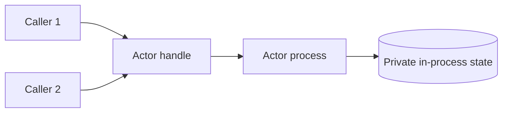
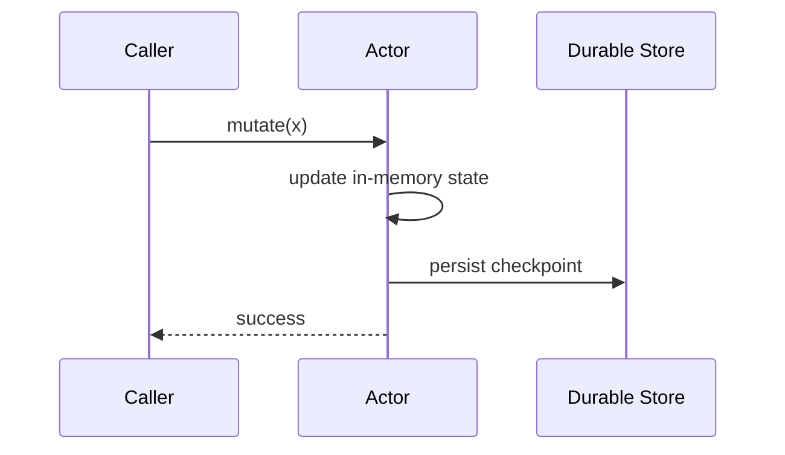
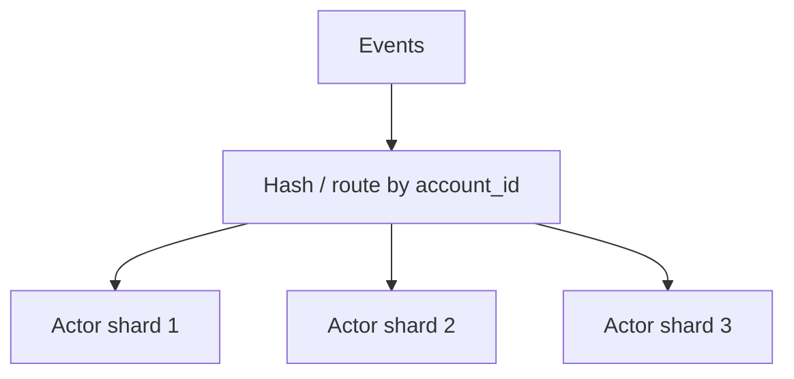
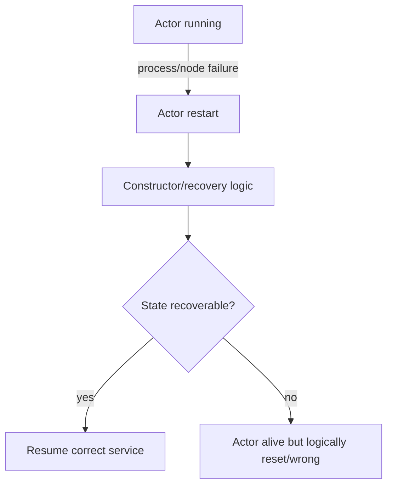
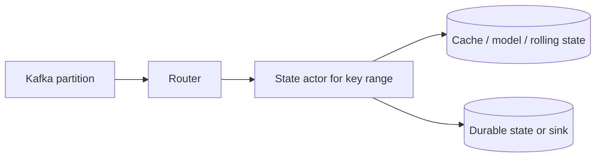

# Ray Actors, State, and Concurrency

## 1. Why actors exist

Tasks are best when work is stateless. Actors exist because many useful distributed systems need **state with identity**.

A Ray actor is a stateful worker process created from a Python class. The useful abstraction is not “remote class.” It is:

> **A single owner of private mutable state that other components interact with through messages/method calls.**



The actor handle is local. The actor object and `self` live in the actor process.

---

## 2. Actor model essentials

The second book connects Ray actors to the classic actor model. The engineering value is state isolation.

| Actor property | Engineering consequence |
|---|---|
| Private state | No external component mutates actor memory directly |
| Message/method interface | State changes happen through explicit operations |
| Identity | Calls can target a specific state owner |
| Long-lived process | Expensive setup can be reused |
| Independent lifecycle | Restart and recovery must be designed |

Good actor candidates:

- model loaded once into GPU/CPU memory;
- database/client connection pool;
- shard-local cache;
- simulation environment;
- parameter server;
- rate limiter;
- stateful router;
- aggregation shard.

Bad actor candidate:

- pure function with no reusable setup or state.

---

## 3. Actor state is not durable state

This distinction is fundamental.

```text
Actor RAM
    = process-local, mutable, convenient
    ≠ durable truth
```

If the actor dies, memory can disappear. A restarted actor runs constructor/recovery logic, not magic state restoration.

For authoritative state, prefer:

- database;
- durable log;
- object storage checkpoint;
- event stream;
- external key-value store;
- reconstructable source of truth.

A useful production rule:

> Treat actor state as cache/reconstructable working state unless you can name the recovery protocol.

---

## 4. Persistence patterns

The second book’s persistence examples are useful not because filesystem pickling is a recommended production architecture, but because they expose the recovery problem.

### Pattern A — checkpoint state



Trade-off: checkpoint on every mutation can be expensive.

### Pattern B — event sourcing

```text
mutation command
    ↓
append durable event
    ↓
apply to actor state
```

Recovery replays events.

### Pattern C — external authority

Actor stores only a cache. On restart, it reloads from DB/object storage.

This is often the cleanest design for Data Engineering systems.

---

## 5. Actor scaling

Adding actors does not merge state.

```text
Actor A state ≠ Actor B state
```

To scale, choose an explicit state model.

| Strategy | Use case | Main risk |
|---|---|---|
| Sharding | key-based mutable state | hot partitions |
| Replication | read-heavy immutable state | consistency/update propagation |
| Pool | expensive stateless/readonly initialized workers | no shared mutable state |
| Externalized state | scalable shared authority | network/storage latency |
| Hierarchy | large distributed coordination | complexity and cascading failure |

### Sharding example



The routing function is part of correctness. If all events for one key must be ordered, they must consistently reach the same state owner or another ordering mechanism must exist.

---

## 6. Actor pools

The second book demonstrates actor pools. The reusable lesson is:

> Pooling scales a set of independent actors; it does not create one shared state machine.

Pools are useful when each actor has equivalent initialized state, for example:

- N copies of the same inference model;
- N parser workers with expensive library initialization;
- N connection-wrapper workers.

They are not a solution for strongly shared mutable state unless state is externalized or partitioned.

---

## 7. Default serialization of actor methods

A synchronous actor is easiest to reason about as one state owner processing method calls serially.

This provides a valuable invariant:

```text
one state transition at a time
```

But do not generalize that invariant to every actor configuration. Ray supports async and threaded actors.

---

## 8. Async actors

Async actors use Python `asyncio` to overlap I/O-bound work inside one actor process.

```python
@ray.remote
class Fetcher:
    async def fetch(self, url):
        return await client.get(url)
```

Use for:

- slow network I/O;
- many concurrent service requests;
- async-native libraries.

Do not use blocking operations such as blocking `ray.get` inside an event-loop path.

### Mental model

```text
one process
one event loop
many cooperative coroutines
```

Async concurrency is not CPU parallelism.

---

## 9. Threaded actors

Threaded actors allow multiple method invocations to execute using threads.

Useful when:

- libraries block and are not async-aware;
- native code releases the GIL;
- operations are mostly I/O/native computation.

Risks:

- shared-memory races;
- lock contention;
- harder reasoning;
- library thread-safety assumptions.

The second book’s actor-concurrency lesson is strong: actor concurrency works best when shared mutable state is minimal or carefully protected.

---

## 10. Actor failure semantics

An actor introduces two separate questions:

1. Can the **process** restart?
2. Can the **logical state** recover correctly?

These are not the same.



Restart configuration cannot compensate for missing state recovery.

---

## 11. Ordering and retries

Stateful calls are harder to retry than stateless tasks.

Suppose:

```text
deposit(100)
```

is processed, then the worker fails before the caller knows the result.

Retrying may produce:

```text
+100 twice
```

Therefore actor operations with external/business side effects may require:

- request IDs;
- deduplication;
- transactional state update;
- idempotent commands;
- monotonic sequence numbers.

---

## 12. Actor design for Data Engineering

### Stateful enrichment shard



Questions:

- Is per-key ordering required?
- Where is durable truth?
- How is shard ownership reassigned?
- How is hot-key skew handled?
- What happens during actor restart?
- Can events be replayed safely?

This is distributed state management, not simply “use an actor.”

---

## 13. Common mistakes

| Mistake | Why it fails |
|---|---|
| Use actor as database | actor RAM is not durable |
| Scale by creating replicas | mutable state diverges |
| Assume restart restores state | only process lifecycle is restored automatically |
| Use one global actor for everything | throughput bottleneck / single hot shard |
| Add threading without state analysis | races and lock contention |
| Make actor own too many DB connections | external service becomes bottleneck |
| Hide all logic inside actors | loses stateless retry/reconstruction advantages |

---

## 14. Senior design heuristics

Use an actor only if at least one is true:

- work needs persistent in-process state;
- initialization is expensive enough to reuse;
- a resource must have identity/ownership;
- calls must be routed consistently to a stateful shard;
- actor concurrency is intentionally part of the design.

Prefer tasks when:

- work is pure/stateless;
- outputs are recomputable;
- no identity is required.

---

## 15. Exercises

### Medium — state ownership

Implement a counter with:

1. module global + tasks;
2. one actor;
3. 8 sharded actors.

Explain correctness and throughput differences.

### Hard — recoverable state actor

Build an actor that owns per-customer rolling aggregates. Persist authoritative events externally. Kill the actor and reconstruct state by replay.

### Hard — hot-key experiment

Route 1 million events through 16 actors with one key receiving 50% of traffic. Measure skew. Design two mitigation strategies without violating per-key ordering.

### Failure drill — ambiguous completion

Create an actor command with an external side effect and simulate process failure after commit but before response. Add idempotency IDs and prove duplicate execution is contained.

---

## Source extraction

**Primary book material:**
- _Scaling Python with Ray_, Ch. 4.
- _Learning Ray_, Ch. 2–3 and selected AIR execution discussion.

**Current Ray update:** exact actor retry/restart defaults and concurrency APIs are version-sensitive. The durable course content is the state/lifecycle/ordering model; production defaults must be checked against the installed Ray version.
