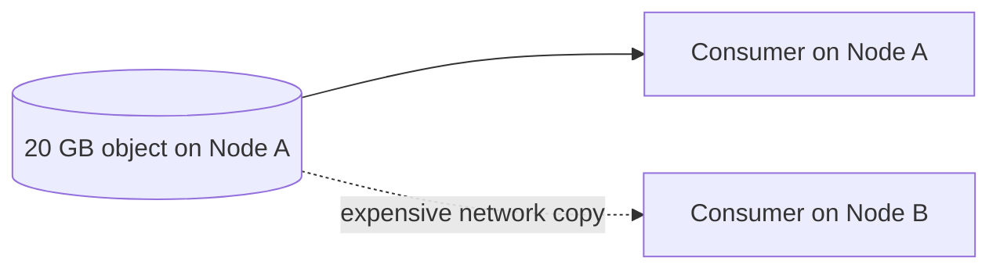
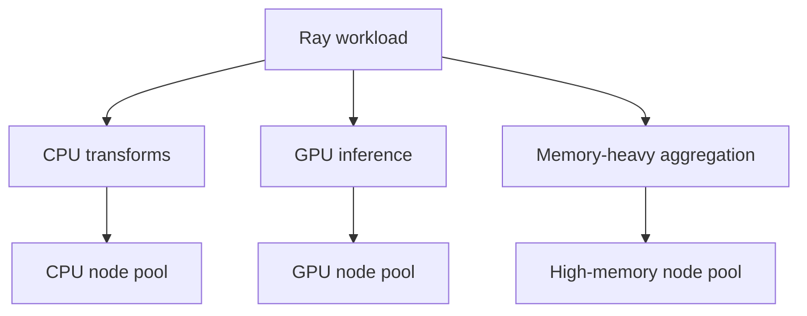

# Ray Scheduling, Resources, Placement, and Autoscaling

## 1. Scheduling is the bridge between logical work and physical hardware

Ray applications express work as tasks and actors. The scheduler must map that work onto finite machines.

The durable scheduling model is:

```text
work request
    + dependencies ready?
    + resource requirements?
    + locality?
    + placement constraints?
    + available cluster capacity?
        ↓
choose feasible node / wait / scale cluster
```

The books describe scheduler internals from the Ray 2.0 era. Some implementation details evolved. The engineering concepts below are the stable signal.

---

## 2. Logical resources

Ray resources are scheduler-visible accounting units.

Common resources:

- `CPU`
- `GPU`
- memory-related scheduling quantities
- custom resources
- modern label/node-affinity constraints

The critical distinction:

> **A Ray CPU request is a scheduling reservation, not a hard OS CPU quota.**

Likewise, asking for memory as a scheduler resource does not automatically prevent a process from consuming more physical memory.

### Why logical resources exist

They let Ray answer:

- Does this task fit on node A?
- Should this actor wait for a GPU node?
- How many replicas can execute simultaneously?
- Is more cluster capacity required?

---

## 3. Feasible versus available

A resource request may be:

| State | Meaning |
|---|---|
| Feasible and available | A node can run it now |
| Feasible but unavailable | A suitable node exists, but resources are busy |
| Infeasible on current cluster | No node shape can satisfy it |
| Potentially autoscalable | A configured node type could satisfy it if launched |

This distinction is essential when debugging pending tasks.

Example:

```text
Task requests 8 GPUs
Current nodes: max 4 GPUs each
```

No amount of waiting frees an 8-GPU node. The request is structurally infeasible unless the cluster configuration includes a larger node type or the design changes.

---

## 4. Explicit actor resources

The second book warns against relying on actor defaults. That advice remains useful.

Explicit declarations make system behavior easier to reason about:

```python
@ray.remote(num_cpus=2, num_gpus=1)
class ModelWorker:
    ...
```

Why explicit is better:

- capacity planning is visible;
- autoscaler demand is meaningful;
- accidental overpacking is reduced;
- production topology can be reviewed from code/config;
- resource contention becomes diagnosable.

---

## 5. Native-library oversubscription

A task requesting `num_cpus=1` may execute NumPy, BLAS, XGBoost, PyTorch, or another native library that starts multiple threads.

Potential result:

```text
Ray thinks: 8 one-CPU tasks fit
Native runtime: each starts 8 threads
Actual machine: ~64 runnable threads
```

Symptoms:

- context switching;
- throughput collapse;
- noisy latency;
- memory amplification.

Senior practice:

- understand native thread pools;
- configure `OMP_NUM_THREADS`, MKL settings, framework worker counts, etc.;
- benchmark physical behavior, not only Ray resource accounting.

---

## 6. Custom resources

Custom resources can represent scheduler constraints such as:

```text
accelerator:A100
architecture:arm64
license:foo
special_hardware:1
```

They are not application state. They are scheduling metadata.

Use them when a task cannot correctly execute without a capability.

Do not create thousands of high-cardinality custom resources for arbitrary IDs.

---

## 7. Data locality

The second book highlights a classic distributed-systems principle:

> Moving compute is often cheaper than moving large data.

If a 20 GB object already exists on node A, scheduling the consumer on node A can be preferable to transferring it across the network.



Locality is one scheduling input, not an absolute rule. A node may lack required GPU/CPU resources or be overloaded.

---

## 8. Placement groups

Placement groups reserve multiple resource bundles as one logical unit.

This solves a **gang scheduling** problem.

Example distributed training trial:

```text
bundle 0: 1 CPU coordinator
bundle 1: 4 CPU + 1 GPU worker
bundle 2: 4 CPU + 1 GPU worker
bundle 3: 4 CPU + 1 GPU worker
bundle 4: 4 CPU + 1 GPU worker
```

Ray should not start half the trial and leave it holding resources forever while the remaining workers can never be scheduled.

### Placement strategies

| Strategy idea | Goal | Trade-off |
|---|---|---|
| PACK | colocate bundles | locality, fewer nodes; larger failure blast radius |
| STRICT_PACK | require one node | very strong locality; easy to become infeasible |
| SPREAD | distribute bundles | resilience/load spread; more network traffic |
| STRICT_SPREAD | force separate nodes | failure isolation; expensive/infeasible on small clusters |

A bundle must fit on one node.

---

## 9. Deadlock-like resource situations

Distributed resource allocation can create waiting cycles.

Example:

```text
Parent task holds CPU
Parent launches child task requiring CPU
All CPUs occupied by waiting parent tasks
Children cannot start
Parents wait for children
```

This is why nested parallelism and worker resource accounting must be designed together.

Mitigations include:

- reserve fewer resources for parent coordination tasks;
- use placement groups appropriately;
- avoid blocking parent tasks while holding scarce resources;
- restructure orchestration onto driver/actors with deliberate resource usage.

---

## 10. Autoscaling

The books describe the autoscaler as reacting to workload demand by adding/removing nodes.

The durable model:


Autoscaling is not instantaneous. Node startup creates latency.

Therefore:

- bursty jobs may experience cold-start delay;
- placement groups can help communicate larger future demand;
- minimum worker counts can reduce latency at added cost;
- serving workloads may need warm capacity.

---

## 11. Horizontal versus vertical scaling

The second book distinguishes:

### Horizontal

Add more workers/nodes.

Good for independently parallel work.

### Vertical

Use a larger worker shape, more CPU/GPU/memory per process/node.

Required when one task/actor itself needs large resources.

Senior design question:

> Is the workload parallelizable into more small units, or does one unit fundamentally require a larger machine?

---

## 12. Heterogeneous clusters

Real Ray clusters may contain:

```text
CPU workers
GPU workers
memory-heavy workers
special accelerator workers
head/system node
```



This is one of Ray’s strongest architectural fits: a single application can coordinate heterogeneous compute stages.

---

## 13. Data Engineering connection

Imagine a document pipeline:

```text
S3 read → CPU parse → high-memory join → GPU embedding → write
```

A senior Ray design declares each stage’s resource shape explicitly and checks whether data movement between node pools dominates compute time.

Ray is beneficial only if the unified runtime simplifies the system more than the cross-pool transfers cost.

---

## 14. Common failures

| Symptom | Likely cause | Diagnostic question |
|---|---|---|
| Tasks pending forever | infeasible request | Can any configured node satisfy it? |
| Cluster scales but workload remains slow | data/network bottleneck | Are tasks placed far from large inputs? |
| CPU at 100%, throughput poor | native oversubscription | How many threads does each worker actually create? |
| Placement group never schedules | bundle too large / topology insufficient | Can each bundle fit on one node? |
| High cost / low utilization | poor node-type fit | Are resources overprovisioned? |
| Cold-start latency | autoscaler provisioning | Should capacity be kept warm? |
| Nested jobs stall | resources held by parent work | Are waiting parents consuming scarce resources? |

---

## 15. Mental models

### Resources = scheduling currency

A task “pays” logical resource units while it runs.

### Placement group = reservation contract

Reserve the whole topology before starting a tightly coupled distributed workload.

### Autoscaler = supply-side response

Scheduler demand says what is needed; autoscaler tries to create that capacity.

### Locality = network-cost awareness

Compute placement should consider where large objects already exist.

---

## 16. Exercises

### Medium — resource feasibility

Start a local Ray runtime with a constrained logical CPU count. Submit tasks requiring different CPU quantities. Predict which run, queue, or remain infeasible.

### Hard — oversubscription experiment

Run NumPy/BLAS-heavy tasks. Compare Ray logical CPU utilization with actual OS thread count and throughput. Configure native thread pools and measure the difference.

### Hard — placement strategy benchmark

Create a multi-actor workload exchanging large arrays. Compare packed and spread placement. Measure network bytes, latency, and failure blast radius.

### Failure drill — impossible bundle

Create a placement group whose bundle cannot fit on any node. Diagnose it from scheduler/state evidence without changing the code first.

---

## Source extraction

**Primary book material:**
- _Scaling Python with Ray_, Ch. 5 and Ch. 11.
- _Learning Ray_, Ch. 2, Ch. 9, and selected Train/Tune/Serve resource sections.

**Current Ray update:** exact scheduler algorithms and actor defaults have evolved. Modern Ray documentation should be authoritative for scheduler strategy details, labels, affinity, and current resource defaults. The logical-resource, feasibility, locality, placement-group, and autoscaling concepts above are the durable engineering model.
