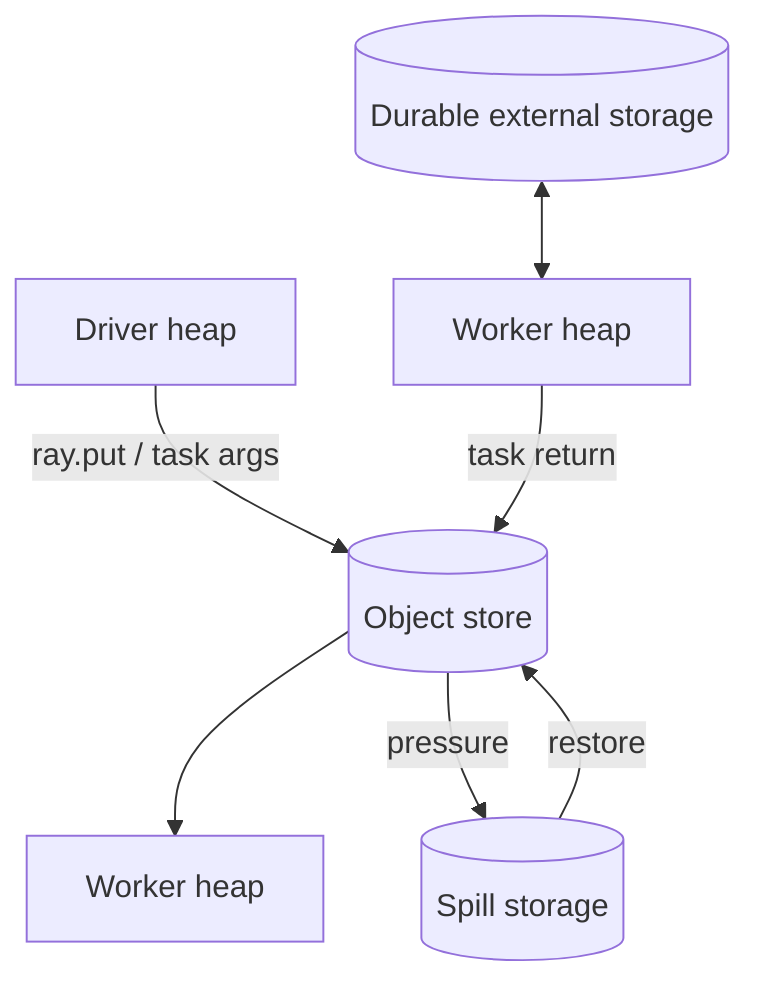
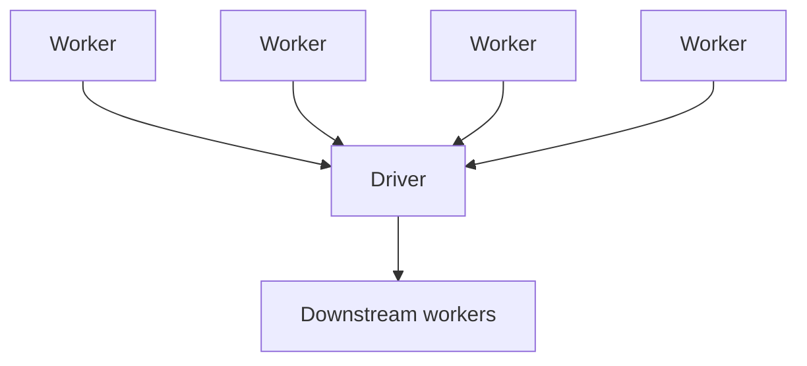
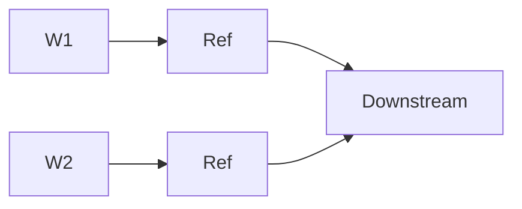
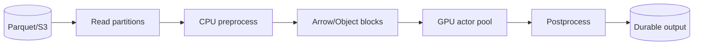

# Ray Object Store, Memory, Serialization, and Data Movement

## 1. Why this module matters

Most distributed-performance failures are not “CPU problems.” They are often data-movement or memory-lifecycle problems.

Ray makes distributed objects first-class because moving Python values between processes and nodes is expensive and complicated.

The books are especially useful here because they force you to distinguish worker heap memory, shared object-store memory, spilling, serialization, and network transfer.

---

## 2. Memory domains

Keep these separate:

| Memory domain | Contains | Typical failure |
|---|---|---|
| Driver heap | local Python objects in driver | driver OOM |
| Worker heap | task/actor Python state | worker OOM |
| Object store | Ray-managed shared objects | object-store pressure/spilling |
| Spill storage | evicted object data on disk | I/O bottleneck / disk exhaustion |
| Durable storage | S3/DB/lakehouse/etc. | external system failures |



Do not call all of these “Ray memory.” Diagnosis depends on the exact domain.

---

## 3. Why shared object memory exists

Without shared memory, multiple local workers consuming a large result might each receive separate serialized copies.

Ray’s object store allows supported values to be shared efficiently between workers on the same node.

For large NumPy/Arrow-style data, this can significantly reduce copying.

The durable insight:

> Ray separates compute processes from a shared distributed object data plane.

---

## 4. Object lifecycle

An object can be created by:

- task return;
- actor method return;
- `ray.put`.

The caller gets an ObjectRef.

The important lifecycle questions are:

```text
Who owns the reference?
Who still holds a reference?
Where is the object currently stored?
Does another node need it?
Can it be reconstructed?
Can it spill?
What happens if the owner dies?
```

These questions are more important than memorizing storage implementation details.

---

## 5. Reference counting and liveness

The second book describes Ray tracking references so unused objects can be reclaimed.

The engineering lesson is that **reference lifetime controls object lifetime**.

Common accidental leak:

```python
all_refs = []
for item in endless_stream:
    all_refs.append(process.remote(item))
```

Even after tasks finish, retaining references can keep results alive and prevent reclamation.

Backpressure and memory lifetime are therefore connected.

---

## 6. Spilling

When object-store memory becomes pressured, Ray can spill objects to disk and later restore them.

```text
object store full-ish
    ↓
reclaim unreachable objects
    ↓
spill reachable cold objects
    ↓
restore if needed again
```

Spilling prevents immediate failure but is not free.

Potential costs:

- serialization/copy overhead;
- disk write/read;
- lower throughput;
- tail latency spikes;
- disk exhaustion.

A workload that “works because it spills constantly” may still be poorly designed.

---

## 7. Serialization

Ray must serialize Python functions and data to move them between process boundaries.

The second book discusses `cloudpickle`, Arrow, and gRPC as important pieces of this ecosystem.

### Simplified mental model

| Kind of data | Typical mechanism idea |
|---|---|
| Python function/class/complex object | cloudpickle-like Python serialization |
| tabular/columnar data | Arrow where possible |
| control-plane/RPC metadata | compact RPC/protobuf-style communication |

Do not memorize exact implementation routing as an API guarantee. Learn the trade-offs.

---

## 8. Serialization failure modes

Some objects do not serialize naturally:

- open network sockets;
- thread locks;
- active thread pools;
- native handles;
- local file handles;
- objects with hidden C state.

### Better designs

Instead of sending an active DB connection:

```text
BAD: driver creates connection → serialize connection to worker
GOOD: worker/actor receives config → creates its own connection locally
```

That pattern generalizes to many external clients.

---

## 9. Closure capture

A remote function may capture surrounding Python state.

```python
huge_model = load_model()

@ray.remote
def f(x):
    return huge_model(x)
```

This can silently create expensive serialization/distribution behavior.

Better questions:

- Should the model live in an actor?
- Should it be placed once and reused?
- Should workers initialize it from durable storage?

Distributed Python makes closure size an architecture concern.

---

## 10. `ray.put` as shared immutable input

A good `ray.put` use case:

```text
one large immutable lookup table
    ↓ put once
ObjectRef
    ↓ ↓ ↓
many tasks reuse it
```

This avoids repeatedly serializing the same large input from the driver.

Do not use `ray.put` as if it were durable persistence.

---

## 11. Network transfer

A consumer on another node may require the object to move over the network.

A simple performance equation:

```text
end-to-end time
≈ scheduling
+ serialization
+ transfer
+ queueing
+ compute
+ result movement
```

For large objects, transfer can dominate everything else.

Example:

```text
100 ms compute
10 GB cross-node transfer
```

The workload is a networking problem, not a compute problem.

---

## 12. Data locality

If multiple consumers need the same large object, placement matters.

Potential designs:

### Co-locate compute

Place consumers near data.

### Replicate readonly state

Load one copy per actor/node when repeated remote transfers would cost more.

### Partition data

Process each shard near its existing location.

### Reduce early

Aggregate locally before sending data across nodes.

This is the same principle behind map-side aggregation and data-local execution in classic DE systems.

---

## 13. Worker heap versus object-store OOM

Suppose an actor loads a 20 GB Python dictionary into `self.cache`.

That is actor/worker heap memory, not object-store memory.

Suppose a task returns a 20 GB Arrow table.

That may primarily stress Ray-managed object memory.

The remediation is different.

### Debugging rule

> First identify which memory domain is growing. Never tune object-store configuration to solve a worker-heap leak without evidence.

---

## 14. Driver concentration anti-pattern



This creates:

- network concentration;
- driver memory pressure;
- extra serialization;
- synchronization bottleneck.

Prefer direct distributed dependencies:



---

## 15. Data Engineering example — batch inference



Senior questions:

- Are batches large enough to amortize overhead?
- Are blocks too large for GPU worker memory?
- Are CPU/GPU stages placed on separate nodes, causing network movement?
- Should model weights be replicated once per GPU actor?
- Is output pulled through the driver unnecessarily?

---

## 16. Common mistakes

| Mistake | Consequence |
|---|---|
| Keep every ObjectRef forever | object retention / memory growth |
| `ray.get` giant result sets | driver OOM |
| repeatedly pass same huge value | repeated serialization/copy cost |
| send live clients/connections | serialization failures / broken semantics |
| ignore spill rate | hidden disk bottleneck |
| assume object store is durable | unrecoverable data loss assumptions |
| move huge data to scarce GPUs unnecessarily | network bottleneck |

---

## 17. Mental models

### ObjectRef = distributed identity, not bytes

The reference names data; it does not mean the bytes are local.

### Object store = runtime exchange layer

It is a data plane for computation, not authoritative storage.

### Spilling = pressure relief, not free capacity

If spill is constant, investigate working-set size and pipeline structure.

### Data movement is work

Network and serialization cost must be budgeted like CPU/GPU time.

---

## 18. Exercises

### Medium — same-node sharing

Create a large NumPy array once, reuse it across tasks, and compare memory/copy behavior against repeatedly constructing/passing copies.

### Hard — driver OOM versus object-store pressure

Build two workloads that fail differently:

1. accumulate concrete results in driver memory;
2. retain thousands of large ObjectRefs without materialization.

Diagnose the distinct failure mechanisms.

### Hard — locality experiment

On a multinode cluster, produce large objects on one node and force consumers onto another node. Compare against colocated execution.

### Failure drill — spill storm

Deliberately shrink object-store capacity and process a working set larger than memory. Observe spill/restore behavior and identify the point where throughput collapses.

---

## Source extraction

**Primary book material:**
- _Scaling Python with Ray_, Ch. 5.
- _Learning Ray_, Ch. 2, Ch. 6, and selected AIR memory discussion.

**Current Ray update:** modern Ray still uses a shared-memory object-store architecture and automatic spilling. Exact thresholds, ownership behavior, object reconstruction semantics, and internal component names should be verified against the current installed version when production correctness depends on them.
