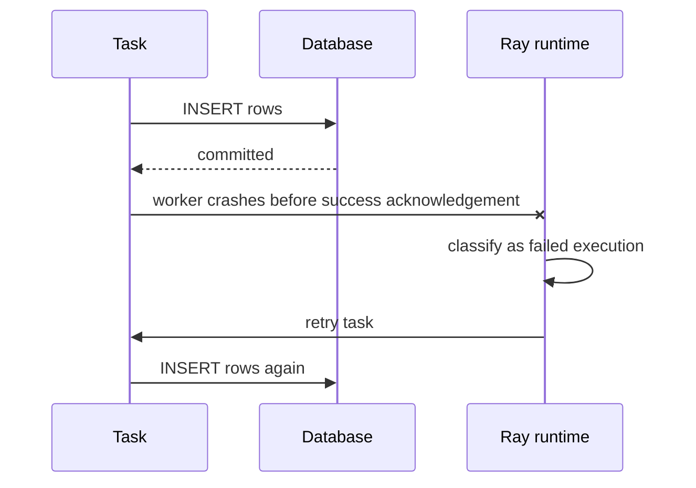
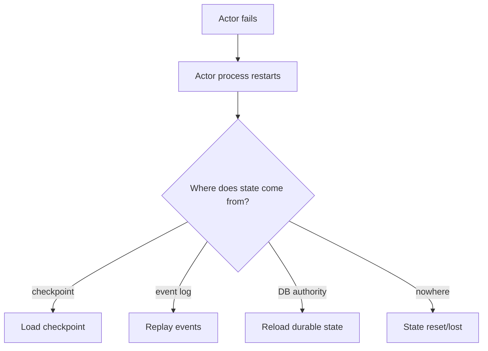
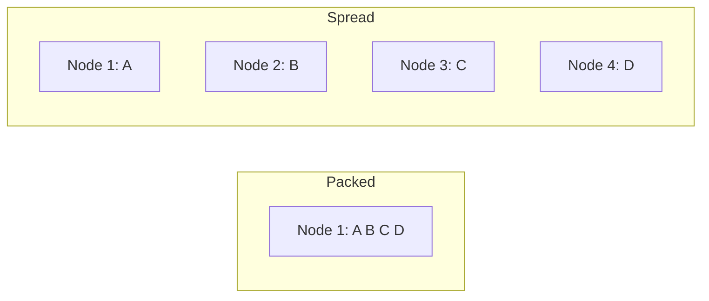

# Ray Fault Tolerance, Recovery, and Idempotency

## 1. Distributed systems fail partially

The books repeatedly emphasize the right starting assumption:

> In a distributed system, failures are normal operating conditions.

A machine can disappear while the rest of the cluster remains healthy. A worker can crash while its node remains healthy. Python code can throw an exception while the process remains healthy. An object can become unavailable even though its producing task previously succeeded.

Treat these as different failure classes.

---

## 2. Failure taxonomy

| Failure | Example | Key question |
|---|---|---|
| Application error | `ValueError`, bad input | Should this be retried? |
| Worker failure | segfault, OOM, kill | Can task rerun safely? |
| Actor failure | actor process/node dies | Can state be reconstructed? |
| Node failure | VM lost | Where were objects/state? |
| Object loss | object-store data unavailable | Is lineage/reconstruction possible? |
| Driver failure | application coordinator exits | Does the job survive? |
| Control-plane failure | GCS/head-related failure | What HA configuration exists? |
| External-system failure | DB/S3/Kafka unavailable | What retry/commit semantics exist? |

Never use one generic “retry” policy for all categories.

---

## 3. Stateless tasks are naturally recoverable

If a task is close to a pure function:

```text
output = f(input)
```

then losing the worker usually means the runtime can execute the computation again.

This is why functional task design is a reliability strategy, not only a programming style.

### Recovery-friendly task

```text
read immutable input → deterministic transform → return output
```

### Recovery-hostile task

```text
charge customer → mutate remote database → send email → crash
```

The second task has ambiguous partial side effects.

---

## 4. Application errors versus infrastructure failures

If code deliberately raises an exception because input is invalid, retrying the same input may be useless.

If the worker disappears because the machine fails, rerunning the same deterministic computation may be exactly correct.

Therefore distinguish:

```text
bad computation/input
vs
lost execution environment
```

This distinction is one of the most important distributed-systems habits to internalize.

---

## 5. Retries create duplicate-execution risk

Suppose a task writes a partition to a database:



The distributed runtime cannot infer whether the external commit happened.

This creates an **ambiguous outcome**.

---

## 6. Idempotency

An operation is idempotent when repeating it produces the same intended final state.

Useful patterns:

| Pattern | Example |
|---|---|
| Deterministic overwrite | write partition `date=2026-09-01` atomically |
| UPSERT by stable key | merge on transaction ID |
| Idempotency token | API rejects duplicate request ID |
| Deduplication table | record processed event IDs |
| Transactional commit | data + processed marker committed together |
| Write temp + rename | publish output only after full success |

For Ray tasks with external effects, idempotency is part of correctness.

---

## 7. At-most-once, at-least-once, exactly-once-like outcomes

Do not casually say “exactly once.” Break the guarantee down.

### At-most-once

Operation executes zero or one observed times. Failure may lose work.

### At-least-once

Retry ensures work eventually happens, but duplicates are possible.

### Exactly-once-like effect

Execution may occur more than once, but transactional/deduplication design ensures the externally visible effect appears once.

In real distributed data systems, the third is commonly achieved through idempotent sinks and commit protocols rather than magical single execution.

---

## 8. Actor recovery is state recovery

Restarting an actor process is not enough.



A production actor design must answer the state-source question explicitly.

---

## 9. Actor command ambiguity

Stateful mutation makes retries especially difficult.

Example:

```text
increment balance
```

If the caller times out, did the actor process the command?

Solutions can include:

- command IDs;
- actor-side dedupe table;
- sequence numbers;
- durable command log;
- transactionally updating state + processed ID.

This is the same class of problem encountered in payment APIs and stream processors.

---

## 10. Object reconstruction and lineage

The books introduce lineage as the ability to recreate some lost results by rerunning the computation that produced them.

Mental model:

```text
input object(s)
    ↓
task specification
    ↓
output object
```

If output is lost but input and task lineage remain valid, recomputation may restore it.

But not all objects are equally reconstructable. Objects inserted manually, actor-produced state, external side effects, and ownership lifetime complicate the story.

Therefore:

> Never treat lineage reconstruction as a substitute for durable storage.

---

## 11. Ownership

Object ownership matters because metadata about an object and its lifetime must belong somewhere in the runtime.

The senior lesson is not to memorize every ownership edge. It is to recognize that:

- distributed references have owners;
- owner lifetime can affect object recoverability;
- returning normal task results is generally easier for Ray to reason about than inventing complicated nested reference ownership patterns.

When designing long-lived distributed objects, verify current ownership guarantees against the current Ray documentation.

---

## 12. Control-plane resilience

Older book passages simplify head-node failure as catastrophic. That was a useful warning for the period but is not a complete modern production model.

### Current Ray update

Modern Ray provides GCS fault-tolerance options. Production design must distinguish:

```text
worker/node failure
control-plane metadata failure
whole-cluster loss
```

No Ray HA feature protects against loss of the entire infrastructure or external durable state.

---

## 13. Backoff and retry storms

Retries can make outages worse.

If 50,000 tasks simultaneously fail against a downstream service and all retry immediately:

```text
downstream outage
    ↓
50k failures
    ↓
50k immediate retries
    ↓
downstream remains overloaded
    ↓
more failures
```

Production policies should consider:

- exponential backoff;
- jitter;
- concurrency limits;
- circuit breaking;
- retry budgets;
- dead-letter/manual handling for poison inputs.

Ray’s runtime retry capability is only one layer of the reliability architecture.

---

## 14. Failure domains

Different placement choices change blast radius.

Packing four replicas onto one node improves locality but one node failure may remove all four.

Spreading replicas increases network cost but can improve resilience.



Reliability and locality frequently trade against each other.

---

## 15. Data Engineering patterns

### Retry-safe partition writer

```text
partition ID derived from input
    ↓
compute output
    ↓
write to temporary location
    ↓
validate
    ↓
atomic publish/overwrite target partition
```

### Stream-event processing

```text
event ID
    ↓
stateful processing
    ↓
transactionally persist result + processed ID
    ↓
ack/advance source position
```

These patterns are broader than Ray but are necessary when Ray executes the work.

---

## 16. Common mistakes

| Mistake | Consequence |
|---|---|
| Retry every exception | poison input loops forever |
| Assume worker crash means no side effect | duplicate external effects |
| Store authoritative state only in actor RAM | unrecoverable actor restart |
| Treat object store as durable | data loss assumptions |
| Infinite retries without backoff | retry storm |
| Pack all replicas for speed | correlated failure |
| Claim exactly-once from task retries | false guarantee |

---

## 17. Mental models

### Retry = possibility of duplicate execution

Whenever retries exist, immediately ask about idempotency.

### Restart ≠ recovery

A process can restart successfully while logical state remains wrong.

### Fault tolerance is end-to-end

Ray runtime resilience + sink semantics + state persistence + orchestration + observability together determine correctness.

### Partial failure is the normal case

Design for components failing independently.

---

## 18. Exercises

### Medium — worker crash

Build a task that randomly terminates its worker. Observe retry behavior and distinguish it from a task that raises `ValueError`.

### Hard — duplicate-write experiment

Have a task commit to SQLite/Postgres, then deliberately terminate before return. Show duplicate effects under retry. Repair with an idempotency key.

### Hard — actor reconstruction

Create a stateful actor whose authority is an append-only event file/table. Kill it repeatedly and prove its reconstructed state matches the durable log.

### Chaos drill

Run 1,000 tasks across multiple nodes. Randomly kill workers/nodes while tracking completed logical work. Produce a failure matrix describing what recovered automatically and what required application logic.

---

## Source extraction

**Primary book material:**
- _Scaling Python with Ray_, Ch. 4–5.
- _Learning Ray_, Ch. 2 and selected AIR failure-model material.

**Current Ray update:** exact task retry counts, actor restart defaults, object reconstruction behavior, and GCS HA configuration are version-sensitive. Verify current values from installed-version docs before relying on them for correctness.
