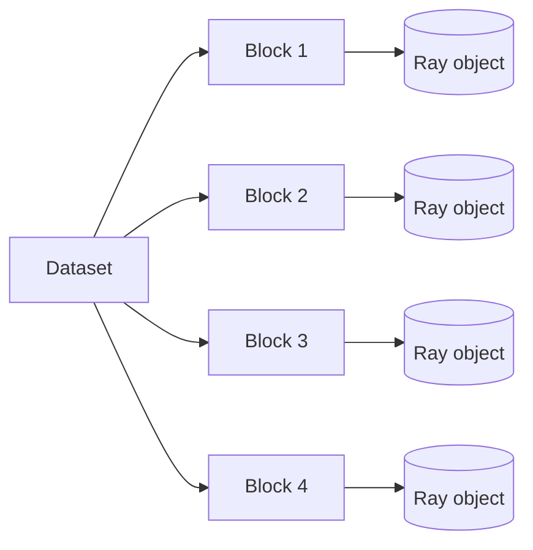
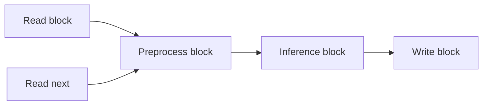
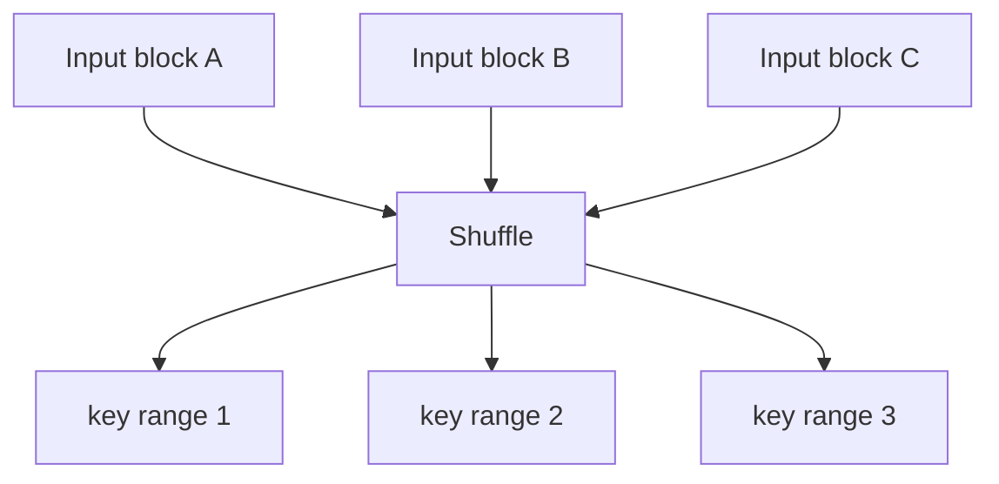
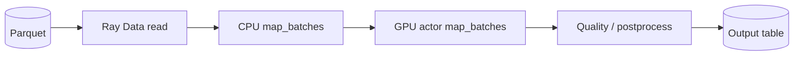

# Ray Data for Data Engineering

## 1. What Ray Data is actually for

The first book is explicit that Ray Datasets are not intended to replace every full-featured relational data-processing system. Their strength is data loading, transformation, featurization, batch inference, and moving data efficiently into downstream Ray workloads such as training and serving.

That is the right production mental model:

> **Ray Data is Ray-native distributed data processing for Python/AI pipelines, not a universal replacement for Spark, warehouse SQL, or lakehouse engines.**

---

## 2. Dataset ontology

A Dataset is logically a distributed collection divided into **blocks/partitions**.



The books emphasize Arrow-backed columnar representations where possible and Ray’s object system underneath.

Important distinctions:

| Concept | Meaning |
|---|---|
| Dataset | logical distributed data abstraction |
| Block | unit of physical partitioned data/execution |
| Batch | subset passed into vectorized user processing |
| Partitioning | how data is divided across blocks |
| Shuffle | redistribution of records across workers |
| Streaming execution | operators process blocks incrementally rather than materializing every stage |

---

## 3. Transformations

Useful Ray Data operations conceptually fall into:

```text
map-style operations
filtering
flat mapping
batch transforms
grouping/aggregation
repartitioning/shuffle
read/write
```

For production ML/data workloads, `map_batches` is especially important because vectorized processing amortizes Python overhead and lets native libraries operate efficiently.

### Row-at-a-time vs batch

```text
BAD for expensive Python overhead:
record → Python function
record → Python function
record → Python function

BETTER:
1,000 records → NumPy/Pandas/Arrow batch → vectorized transform
```

---

## 4. Parallelism and partition size

The second book correctly points out that more partitions are not automatically better.

Too few partitions:

- idle workers;
- poor parallelism;
- giant memory blocks.

Too many partitions:

- scheduling overhead;
- metadata growth;
- tiny I/O operations;
- excessive object creation.

The engineering goal is a partition size that balances:

```text
parallelism
memory fit
I/O efficiency
operator overhead
shuffle cost
```

Do not memorize a universal number. Benchmark representative data.

---

## 5. Streaming execution versus historical DatasetPipeline

The first book uses `DatasetPipeline` and `.repeat()` extensively.

### Current Ray update

That abstraction is historical. Modern Ray Data uses streaming execution as part of Dataset execution rather than requiring the old DatasetPipeline abstraction.

The durable concept is still essential:

> Do not materialize an entire multi-stage dataset when blocks can flow incrementally through operators.



Benefits:

- lower peak memory;
- operator pipelining;
- overlap I/O and compute;
- earlier downstream progress.

---

## 6. Stateless versus stateful transforms

The first book notes that tasks are natural for stateless transforms, while actors are useful when setup/state must be reused.

### Task-style transform

```text
block → pure transform → output block
```

Good for cheap/stateless logic.

### Actor-style transform

```text
actor starts
    ↓
loads 8 GB model once
    ↓
process block 1
process block 2
process block 3
```

Good for:

- model inference;
- expensive parser initialization;
- reusable connections/clients;
- stateful native libraries.

---

## 7. Shuffle

A shuffle redistributes data across workers according to keys or partition rules.



Shuffles are expensive because they combine:

- serialization;
- network transfer;
- intermediate storage;
- synchronization;
- skew risk.

This is where Spark’s decades of relational/shuffle optimization may make it the better tool for SQL-heavy workloads.

---

## 8. Data skew

A group-by or repartition keyed by a highly skewed dimension can create hot partitions.

Example:

```text
customer_id = "GLOBAL" owns 60% of rows
```

One reducer becomes the bottleneck.

Mitigation patterns:

- pre-aggregate locally;
- salt hot keys then recombine;
- choose alternative partition keys;
- split oversized groups;
- redesign the computation.

Ray does not remove fundamental distributed data-skew problems.

---

## 9. Read paths and storage

Ray Data works best when reading from storage accessible to every worker, such as object storage or distributed filesystems.

The second book correctly warns that local paths on one machine are not automatically visible on remote workers.

### Rule

> A path valid on the driver is not necessarily a path valid on every worker.

Use:

- S3/GCS/Azure Blob;
- distributed filesystems;
- shared volumes when deliberately configured.

Avoid designs depending on laptop-local paths once moving to a cluster.

---

## 10. Ray Data versus Spark

The books provide a useful distinction that remains important.

| Ray Data | Spark |
|---|---|
| Python/AI pipeline integration | SQL/DataFrame/lakehouse ecosystem |
| batch inference / featurization | mature relational ETL |
| heterogeneous CPU/GPU flow | highly optimized shuffle/query planning |
| Ray-native object sharing | extensive connectors/table formats |
| dynamic application integration | declarative relational execution |

### Choose Ray Data when

- downstream work is Ray Train/Serve/Core;
- transforms are Python/model heavy;
- heterogeneous resources matter;
- you need batch inference tightly coupled with data loading;
- avoiding transfer between separate execution engines simplifies architecture.

### Choose Spark when

- workload is mostly SQL;
- joins/windows/aggregations dominate;
- lakehouse integration is primary;
- sophisticated optimizer behavior matters;
- large shuffle-heavy transformations are central.

A hybrid design is often strongest:

```text
Spark/warehouse → curated training data → Ray Data → Train/Inference
```

This mirrors the first book’s “external ETL + Ray last-mile preprocessing” guidance.

---

## 11. Batch inference pattern



Senior design choices:

- block size;
- inference batch size;
- number of GPU actors;
- prefetch depth;
- output commit strategy;
- failure/retry idempotency;
- object-store working set.

---

## 12. Memory-aware pipeline design

Avoid:

```text
read entire dataset
→ materialize all transformed output
→ materialize all inference output
→ write
```

Prefer incremental flow where possible.

Backpressure is critical when a CPU reader can produce data faster than GPU inference consumes it.

A healthy pipeline matches stage throughput or bounds queues between stages.

---

## 13. Common mistakes

| Mistake | Consequence |
|---|---|
| Treat Ray Data as pandas distributed magically | poor expectations / unsupported patterns |
| Too many tiny blocks | scheduler overhead |
| Too few huge blocks | poor parallelism/OOM |
| Ignore key skew | single hot worker |
| Convert full dataset to pandas | driver OOM |
| Use local-only paths | worker read failure |
| Replace Spark without workload analysis | slower, less mature relational processing |
| Repeatedly load model in task | setup dominates inference |

---

## 14. Mental models

### Dataset = distributed stream of blocks

Think block flow, not giant remote DataFrame.

### `map_batches` = vectorized work boundary

Choose batch size to balance throughput, memory, and native-library efficiency.

### Shuffle = network tax

Any operation requiring global redistribution deserves explicit cost analysis.

### Ray Data = last-mile AI data plane

Especially strong between durable analytical storage and model training/inference.

---

## 15. Exercises

### Medium — partition-size benchmark

Process a 10–50 GB synthetic dataset using three partition granularities. Measure throughput, peak memory, task count, and scheduler overhead.

### Hard — skewed group aggregation

Generate a Zipf-distributed key set. Measure group-by skew, then implement salting/local preaggregation and compare.

### Hard — CPU → GPU pipeline

Build preprocessing on CPU and simulated or real model inference on GPU actors. Tune block size, batch size, and actor count.

### Architecture exercise — Ray or Spark?

Given five workloads, write a design decision record selecting Ray Data, Spark, SQL warehouse, or hybrid architecture. Defend based on execution model and data movement.

---

## Source extraction

**Primary book material:**
- _Learning Ray_, Ch. 6 and selected Ch. 10–11 integration material.
- _Scaling Python with Ray_, Ch. 9.

**Current Ray update:** historical `DatasetPipeline` material is not a modern API target. Current Ray Data uses streaming execution and physical/logical execution planning. The partitioning, batching, shuffle, memory, and tool-selection lessons remain durable.
