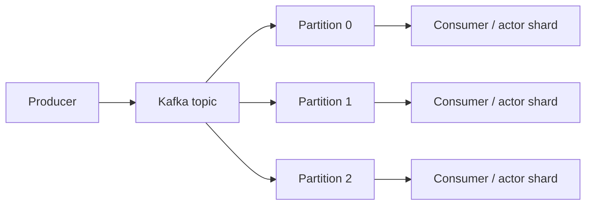
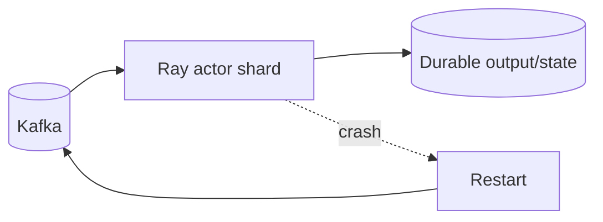
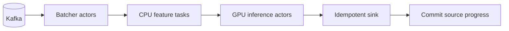

# Ray Streaming and Event-Driven Patterns

## 1. Why this module is intentionally cautious

The second book includes a substantial chapter on streaming with Kafka and Ray actors. The durable engineering lessons are valuable: partitioning, ordering, state ownership, backpressure, and replay. But Ray should not automatically be treated as a replacement for a mature stream processor.

This module keeps the distributed-systems signal and separates it from book-era streaming implementation details.

---

## 2. Event stream fundamentals

A streaming system continuously processes records over time.

Key dimensions:

| Dimension | Question |
|---|---|
| Partitioning | Which worker owns which records? |
| Ordering | Which records must stay ordered? |
| State | Where are rolling/windowed values stored? |
| Replay | Can failed work be reproduced from the source log? |
| Backpressure | What happens when consumers are slower than producers? |
| Delivery semantics | Can records be duplicated or lost? |
| Time semantics | Does event time or processing time matter? |

The books’ Kafka discussion reinforces a crucial fact: ordering is typically guaranteed **within a partition**, not globally.

---

## 3. Kafka partitioning as state-routing infrastructure



If key ordering matters, use a stable partition key.

Example:

```text
account_id → Kafka partition → same stateful actor/shard
```

This is a common architecture for per-entity rolling state.

---

## 4. Actors as stateful stream processors

Actors can hold rolling state:

```text
Actor(account shard)
├── recent events
├── rolling counters
├── feature windows
└── model/cache
```

Benefits:

- explicit state ownership;
- low-latency in-memory updates;
- easy reuse of expensive models/clients.

But the same warnings from the actor module apply:

- actor RAM is not durable;
- actor failure requires reconstruction;
- retries can duplicate side effects;
- hot partitions can overload one actor.

---

## 5. Replay-oriented design

A strong event-driven Ray architecture treats Kafka or another durable log as the authoritative replay source.



Recovery strategy:

1. restart actor;
2. restore checkpoint if available;
3. replay source events from known offset;
4. deduplicate/commit output safely.

This is much stronger than trying to make actor RAM itself durable.

---

## 6. Backpressure

If producers generate 100k events/s but processing capacity is 50k/s, queues grow.

```text
arrival rate λ > service rate μ
        ↓
backlog grows without bound
```

Backpressure design options:

- limit consumer fetch size;
- bound actor queues;
- pause/slow source consumption;
- increase parallelism;
- batch events;
- shed noncritical work;
- persist backlog in the broker rather than in Ray memory.

The broker is usually a better place for durable backlog than unbounded ObjectRefs or actor mailboxes.

---

## 7. Micro-batching

Per-record remote calls can be too expensive.

Prefer batches:

```text
Kafka records 1..1000
    ↓
one batch transform
    ↓
one model call / vectorized operation
```

Batching improves:

- serialization efficiency;
- model/GPU utilization;
- scheduler overhead;
- storage commit efficiency.

Trade-off: larger batches increase latency.

---

## 8. Stateful windowing

Rolling windows are not merely dictionaries with timestamps. Production windowing involves:

- event-time ordering;
- late events;
- watermarking;
- state cleanup;
- replay consistency;
- checkpointing.

This is where systems like Flink are often stronger than hand-built Ray actor solutions.

### Decision rule

If strict event-time semantics and sophisticated stateful stream processing are central to the product, evaluate Flink/Kafka Streams first.

Use Ray when stream ingestion mainly feeds:

- Python-heavy inference;
- simulations;
- heterogeneous AI computation;
- stateful services where full streaming semantics are not required.

---

## 9. Delivery and commit semantics

Suppose a consumer:

1. reads Kafka event;
2. writes database output;
3. crashes before committing source offset.

On restart, the event is read again.

Therefore the sink must be idempotent or source-offset commit and sink update must participate in a stronger transaction protocol.

Ray does not eliminate this problem.

---

## 10. Hot-key failure

A Kafka key with extremely high traffic maps to one partition and one actor.

Symptoms:

- growing partition lag;
- one actor at 100% CPU;
- other workers mostly idle.

Mitigations depend on whether ordering/state can be split.

If state is decomposable:

```text
hot key → subshard salt → partial aggregates → final merge
```

If strict ordering is required, scale-up or redesign may be necessary.

---

## 11. Event-driven inference architecture



Senior questions:

- where does durable backlog live?
- what is the maximum in-flight working set?
- which stage owns ordering?
- how are duplicate outputs prevented?
- what happens when GPUs autoscale slowly?
- can source consumption pause?

---

## 12. Ray versus Flink/Kafka Streams

| Ray | Flink/Kafka Streams |
|---|---|
| arbitrary Python/AI compute | stream-first programming model |
| actors for custom state | mature managed state |
| heterogeneous CPU/GPU | strong event-time/windowing semantics |
| flexible dynamic execution | checkpoints/watermarks are core concepts |
| serving/training integration | stream-processing correctness focus |

Do not ask “Can Ray consume Kafka?” Ask which runtime owns the most difficult correctness problem.

---

## 13. Common mistakes

| Mistake | Why it fails |
|---|---|
| one Ray task per tiny event | task overhead dominates |
| store durable backlog in ObjectRefs | memory explosion / loss risk |
| assume global Kafka ordering | only partition ordering exists |
| actor state without replay | unrecoverable failure |
| commit source before sink | possible data loss |
| sink before source commit without idempotency | duplicates |
| use Ray for complex event-time windows by default | reinvents mature stream-engine semantics |

---

## 14. Exercises

### Medium — partition routing

Generate keyed events and route them to actor shards. Verify per-key ordering while processing keys concurrently.

### Hard — backpressure controller

Create a producer faster than consumers. Implement bounded batching and source throttling. Plot backlog and throughput.

### Hard — replay after actor death

Persist source events and processed IDs. Kill actors randomly and prove final output remains correct after replay.

### Architecture challenge

Design the same fraud-feature pipeline in Ray actors and Flink. Identify where each system has lower conceptual complexity.

---

## Source extraction

**Primary book material:**
- _Scaling Python with Ray_, Ch. 6 plus actor/fault-tolerance chapters.

**Current Ray update:** the course does not treat historical Ray streaming libraries as the recommended modern stream-processing API. Durable lessons retained are Kafka partitioning, actor state, batching, replay, ordering, and backpressure. Mature stream processors should be preferred when event-time/state semantics dominate.
