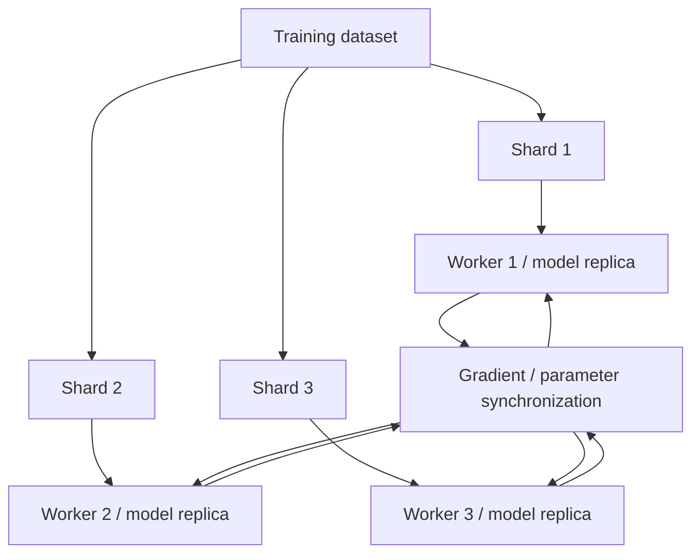
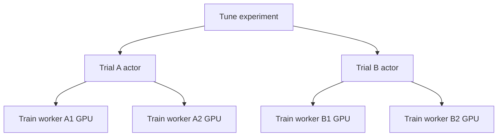

# Ray Train, Tune, and Accelerators

## 1. The real problem these libraries solve

Ray Train and Ray Tune are not interesting because they wrap model-training APIs. They are interesting because distributed ML creates a nested scheduling problem:

```text
experiment
    ↓
trial configuration
    ↓
distributed training job
    ↓
multiple workers
    ↓
CPU/GPU resources
    ↓
checkpoints + metrics + failure recovery
```

The books expose this composition well. The durable lesson is how Ray maps ML parallelism onto Core primitives.

---

## 2. Data parallel training

The first book introduces distributed training by splitting data across workers while keeping model replicas synchronized.



Scaling works only if useful compute dominates synchronization and input-pipeline cost.

---

## 3. Scaling efficiency

Adding GPUs does not guarantee linear speedup.

Approximate training time:

```text
input pipeline
+ forward/backward compute
+ synchronization
+ checkpointing
+ straggler time
```

Potential bottlenecks:

- slow storage;
- CPU preprocessing;
- network bandwidth;
- collective communication;
- undersized batches;
- one slow worker;
- checkpoint I/O.

A Senior Engineer measures before scaling further.

---

## 4. Train worker model

The book’s durable model is:

- a trainer coordinates a distributed run;
- workers execute the framework-specific training loop;
- datasets are sharded to workers;
- metrics/checkpoints leave the worker loop through Ray Train APIs;
- resource configuration determines worker topology.

The exact class names and APIs can evolve. Do not memorize book-era wrappers as architecture.

---

## 5. Checkpoints

A checkpoint is not just a model file.

Potential contents:

```text
model weights
optimizer state
training step / epoch
scheduler state
preprocessor metadata
random state
other recovery artifacts
```

A useful checkpoint answers:

> What minimum state is required to resume the logical training computation correctly?

Checkpoint interval trades:

```text
frequent checkpoint
= more I/O + less lost work

infrequent checkpoint
= less I/O + more recomputation after failure
```

---

## 6. Tune ontology

The books describe the key HPO concepts clearly.

| Concept | Meaning |
|---|---|
| Trainable | computation evaluated for one configuration |
| Search space | candidate hyperparameter domain |
| Trial | one concrete configuration/run |
| Search algorithm | chooses what to try next |
| Scheduler | decides resource/time allocation across running trials |
| Metric | optimization signal |
| Checkpoint | resumable trial state |

Do not confuse **search algorithm** and **trial scheduler**.

A search algorithm proposes configurations. A scheduler decides which active trials continue, pause, or stop.

---

## 7. Grid, random, Bayesian, early stopping

### Grid search

Exhaustive combinations. Explodes combinatorially.

### Random search

Often stronger than naïve grid search when only a subset of dimensions strongly influence performance.

### Bayesian/sequential search

Uses prior observations to propose more promising configurations. Less embarrassingly parallel because future proposals depend on prior results.

### ASHA-style early stopping

Allocate small budgets broadly, terminate weak trials early, and devote resources to promising trials.

The production insight:

> HPO is resource allocation under uncertainty.

---

## 8. Nested resource scheduling

Tune may launch a trial that itself launches multiple Train workers.



This is why placement groups/gang scheduling matter.

If two 2-GPU trials start partially on a 3-GPU cluster, naïve scheduling could deadlock resource acquisition. Ray uses grouped resource reservations to avoid this class of problem.

---

## 9. Concurrency versus throughput in tuning

Running more trials simultaneously can hurt total throughput if each trial becomes starved.

Example:

```text
8 GPUs
Option A: 8 trials × 1 GPU
Option B: 2 trials × 4 GPUs
```

The better configuration depends on:

- scaling efficiency of one trial;
- search algorithm;
- model size;
- time to useful intermediate metrics;
- memory constraints.

This is an optimization problem over the **experiment**, not one model.

---

## 10. GPU scheduling

Ray’s role is resource scheduling. The deep-learning framework performs the GPU computation.

Important distinctions:

```text
Ray allocates GPU visibility/placement
PyTorch/TensorFlow/JAX executes kernels
NCCL/collective layer may synchronize workers
```

Ray does not magically accelerate code merely because `num_gpus=1` is declared.

---

## 11. GPU memory and actor reuse

For inference, long-lived actors often make sense because model loading is expensive.

For training, worker lifetime and checkpoint architecture matter more.

Avoid accidental GPU resource leakage:

- zombie actors;
- detached workers;
- native framework caches;
- model copies retained longer than expected.

GPU memory is scarce and expensive; observe it directly.

---

## 12. CPU fallback pattern

The second book discusses CPU fallback as an architectural pattern.

Use carefully.

A fallback can improve availability when GPU capacity is unavailable, but may create:

- wildly different latency;
- different numerical behavior;
- SLA violations;
- hidden cost increases.

Treat fallback as an explicit service tier, not an invisible convenience.

---

## 13. Training-serving skew

The first book highlights preprocessing as part of the training pipeline. The engineering takeaway:

> The transformation applied during training must match the transformation applied during inference.

Avoid separate ad hoc implementations.

Prefer reusable, versioned preprocessing logic and schemas.

---

## 14. Current Ray update

The books span the transition from older Tune/Train APIs to `Tuner`/`ResultGrid` and newer Train architecture.

Modern study should focus on:

- `Tuner` as the primary Tune entry point;
- current `ResultGrid` result handling;
- current Ray Train APIs rather than old restore/preprocessor APIs that have been deprecated;
- current checkpoint/fault-tolerance documentation for the installed Ray version.

The architectural concepts above remain valid.

---

## 15. Common mistakes

| Mistake | Consequence |
|---|---|
| Add GPUs without measuring synchronization | poor scaling efficiency |
| Starve training input pipeline | GPUs idle |
| Run too many Tune trials | resource fragmentation |
| Confuse search algorithm and scheduler | poor experiment design |
| Checkpoint only model weights | cannot correctly resume optimizer/training state |
| Load/preprocess differently in serving | training-serving skew |
| Assume GPU allocation accelerates Python | no benefit if code is CPU-bound |

---

## 16. Exercises

### Medium — scaling curve

Train the same model on 1, 2, and 4 workers. Plot samples/sec and scaling efficiency. Explain where efficiency is lost.

### Hard — nested Tune + Train

Tune a model where each trial uses multiple workers. Deliberately choose an infeasible concurrency configuration, diagnose placement/resource behavior, then repair it.

### Hard — checkpoint recovery

Kill a training worker mid-run. Resume from checkpoint and verify optimizer step, epoch, and metrics continue correctly.

### Architecture challenge

Given an 8-GPU cluster and 100 candidate hyperparameter configurations, design the experiment resource strategy. Compare many small trials versus fewer multi-GPU trials.

---

## Source extraction

**Primary book material:**
- _Learning Ray_, Ch. 5 and Ch. 7 plus selected AIR integration discussion.
- _Scaling Python with Ray_, Ch. 10–11.

**Current Ray update:** use current Train/Tune documentation for API names, restoration APIs, and defaults. Book-era `tune.run`-first guidance and older Train restore APIs are not the course’s implementation target.
