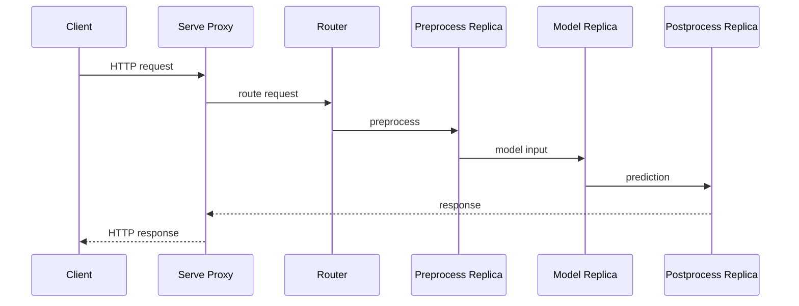
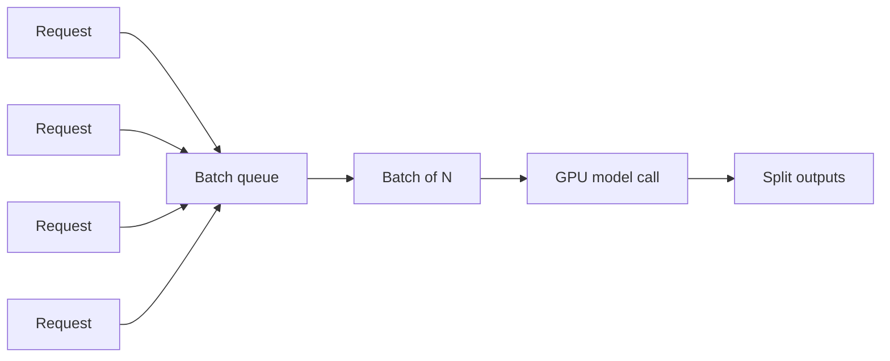
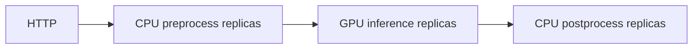
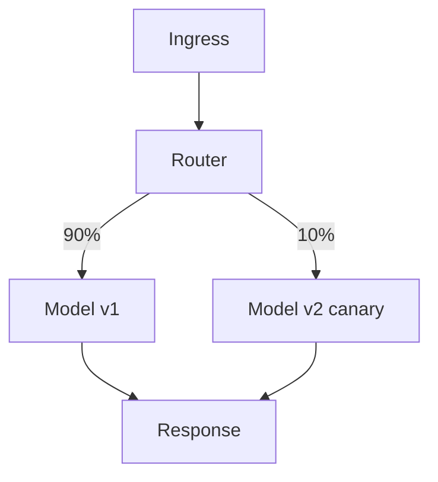
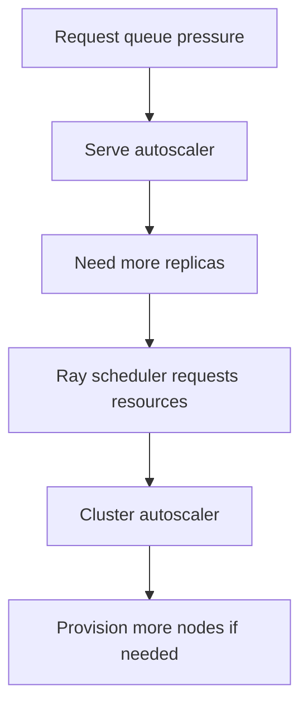
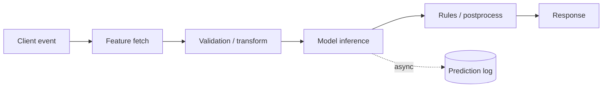

# Ray Serve and Online Inference

## 1. What serving changes

Training and batch inference are finite jobs. Online inference is a continuously available system with latency, throughput, availability, rollout, and capacity constraints.

The first book frames the key serving problem correctly: ML models are compute intensive, rarely useful in isolation, and usually require preprocessing, routing, batching, postprocessing, and scaling around them. The second book adds deployment composition and production rollout patterns.

The durable mental model is:

> **Ray Serve is a service layer built on Ray actors for long-lived, scalable online computation.**

---

## 2. Core Serve ontology

| Concept | Meaning | Mental model |
|---|---|---|
| Application | One deployed serving graph | Complete online service |
| Deployment | Named scalable service component | Logical service stage |
| Replica | One running copy of a deployment | Long-lived Ray actor process |
| Handle | Python-side reference for calling a deployment | Internal service client |
| Proxy / ingress | Receives external requests and routes them | Front door |
| Controller | Maintains desired Serve application state | Control-plane coordinator |

The exact API surface has changed since the books. Learn the architecture rather than old method names.

---

## 3. Request flow



This is not merely “put a model behind HTTP.” Each edge can introduce queueing, serialization, CPU/GPU transfer, retries, or backpressure.

---

## 4. Deployments and replicas

A deployment describes a scalable component. A replica is one concrete running process of that deployment.

Do not conflate:

```text
deployment = logical service definition
replica = one physical running copy
```

Replicas are useful when:

- the model or resource should stay loaded;
- initialization is expensive;
- requests need concurrency;
- capacity must scale horizontally.

---

## 5. Why actors fit serving

A model-serving worker often needs long-lived state:

```text
replica process
├── model weights
├── tokenizer
├── feature mappings
├── native runtime / CUDA context
├── connection/client pools
└── request methods
```

Reloading this state for every request would be wasteful. Serve builds naturally on actors because actors preserve process-local initialized state across calls.

The same actor warning still applies: replica RAM is not durable business state.

---

## 6. Latency versus throughput

Online inference is fundamentally a queueing problem.

Approximate request latency:

```text
network ingress
+ queue wait
+ preprocessing
+ model execution
+ inter-deployment communication
+ postprocessing
+ response serialization
```

Throughput can increase while individual latency worsens if queues become deep.

A senior serving design tracks both:

- requests/sec;
- p50/p95/p99 latency;
- queue depth;
- replica utilization;
- batch size;
- error rate;
- cold-start time.

---

## 7. Dynamic batching

Both books emphasize batching as one of Serve’s most important performance tools.

GPU and vectorized CPU inference often run more efficiently on batches.



### Trade-off

Larger batch:

- higher throughput;
- better GPU utilization;
- fewer kernel calls;

but also:

- more queueing delay;
- higher per-batch memory;
- worse latency under low traffic.

Therefore batch size and wait timeout are SLO parameters, not arbitrary tuning knobs.

---

## 8. Resource isolation

Different deployments can request different resources.

Example pipeline:



This is a strong Ray use case: one serving graph can contain heterogeneous CPU/GPU stages.

Questions:

- Is large data moving between CPU and GPU nodes?
- Should preprocessing be fused with the GPU replica?
- Does the GPU model need one full GPU or fractional allocation?
- Is postprocessing cheap enough to keep in the same replica?

The best logical decomposition is not always the best physical decomposition.

---

## 9. Service composition

The books demonstrate multi-deployment graphs and canary routing. The reusable pattern is composition:



Other useful compositions:

- preprocessing → model → postprocessing;
- ensemble fan-out → reducer;
- model cascade;
- fallback model;
- tenant-specific model routing;
- shadow traffic for validation.

---

## 10. Canary, blue-green, and shadow deployment

### Canary

Small percentage of live traffic reaches new model/version.

Use to evaluate:

- errors;
- latency;
- business metrics;
- drift in outputs.

### Blue-green

Two complete versions exist; routing switches when validation passes.

### Shadow

New version receives copied traffic but does not determine user-visible responses.

Good for comparing model outputs without production decision risk.

Do not confuse deployment rollout safety with model-quality evaluation. Both are required.

---

## 11. Autoscaling has two layers

A Serve application may autoscale replicas while the underlying Ray cluster autoscaler changes node count.



This creates a time-scale mismatch:

- adding a replica on existing hardware may be relatively quick;
- provisioning a new GPU node may take much longer;
- loading a large model adds another cold-start delay.

Production capacity planning must consider the whole chain.

---

## 12. Cold starts and warm capacity

Cold start may include:

```text
node provisioning
+ container/image startup
+ Python import
+ model download
+ model deserialization
+ GPU initialization
+ cache warmup
```

For latency-critical systems, scale-to-zero may be unacceptable.

Options:

- minimum replicas;
- warm spare capacity;
- prebuilt images;
- local model cache;
- smaller model artifacts;
- staged rollout before routing traffic.

---

## 13. Backpressure and overload

A serving system should degrade intentionally instead of accepting infinite queued work.

When arrival rate exceeds service capacity:

```text
queue grows
→ latency explodes
→ memory grows
→ timeouts accumulate
→ retries add more load
```

Possible controls:

- bounded queues;
- request timeouts;
- admission control;
- rate limiting;
- load shedding;
- autoscaling;
- graceful fallback.

Retries from clients must not create a retry storm.

---

## 14. Failure behavior

Replica failure and request failure are not identical.

A replica can die because of:

- OOM;
- GPU error;
- native crash;
- node failure;
- application exception.

Serve can replace replicas, but application-level correctness still depends on:

- whether requests are safe to retry;
- whether external side effects occurred;
- whether model state is reconstructable;
- whether routing shifts to healthy replicas.

Stateless inference is usually much easier to recover than mutable service operations.

---

## 15. Training-serving skew

The same feature/preprocessing contract must be used in training and serving.

Common failure:

```text
training: normalize x with version A
serving: normalize x with version B
```

The model may be perfectly healthy while predictions are wrong.

Production designs should version:

- model artifact;
- feature schema;
- tokenizer/preprocessor;
- calibration/threshold logic;
- serving code.

---

## 16. Data Engineering connection

An online scoring service may look like:



A Senior Data Engineer must reason about the boundary between:

- online feature retrieval;
- offline training features;
- model serving;
- prediction logging;
- downstream analytical storage.

Serve should not become the authoritative feature store or warehouse.

---

## 17. When Ray Serve is a strong fit

Use Serve when the service benefits from:

- Python-native model logic;
- heterogeneous CPU/GPU stages;
- long-lived model actors;
- dynamic composition;
- Ray-native batch/training integration;
- scalable replicas and request batching.

Question it when:

- the endpoint is a simple lightweight CRUD API;
- inference is an external managed API call;
- Kubernetes-native microservices already solve the problem simply;
- strict ultra-low-latency requirements conflict with runtime/network overhead.

---

## 18. Common mistakes

| Mistake | Consequence |
|---|---|
| one deployment per trivial function | unnecessary hops and serialization |
| ignore queue depth | latency collapse under overload |
| scale replicas without cluster capacity | replicas remain pending |
| huge batches | throughput improves but SLO fails |
| no warm-capacity plan | cold-start outage during traffic spike |
| mutable authoritative state in replica | restart loses truth |
| inconsistent preprocessing versions | training-serving skew |
| route canary traffic without business metrics | rollout appears healthy but model quality regresses |

---

## 19. Mental models

### Replica = long-lived actor for requests

The model stays with the process; requests move to the model.

### Batching = latency-throughput exchange

You spend queueing latency to improve compute efficiency.

### Serve autoscaling ≠ cluster autoscaling

One adds application replicas; the other adds machines.

### Deployment graph = distributed call graph

Every service boundary can become a network and failure boundary.

---

## 20. Exercises

### Medium — latency/throughput curve

Serve a compute-heavy function with one replica. Generate load and record p50/p95/p99 latency and throughput. Add replicas and explain where scaling stops helping.

### Hard — dynamic batching

Implement model-like vectorized inference. Sweep batch size and wait timeout. Plot throughput versus p99 latency and choose a configuration for a stated SLO.

### Hard — heterogeneous serving graph

Build CPU preprocessing → GPU/simulated-GPU inference → CPU postprocessing. Compare separate deployments against a fused deployment and measure data-transfer overhead.

### Failure drill — replica death under load

Kill replicas while continuous load is running. Measure errors, recovery time, queue behavior, and whether client retries worsen load.

### Rollout exercise

Implement shadow or canary routing between two model versions and define technical and model-quality rollback criteria.

---

## Source extraction

**Primary book material:**
- _Learning Ray_, Ch. 8 and selected Ch. 10–11 material.
- _Scaling Python with Ray_, Ch. 7.

**Current Ray update:** the book-era `deploy()`/older handle and route APIs are not implementation targets. Modern Serve uses the current application/deployment APIs and current controller/proxy architecture. Verify exact autoscaling fields and deployment syntax against the installed Ray version.
