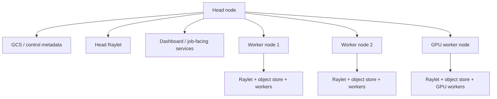
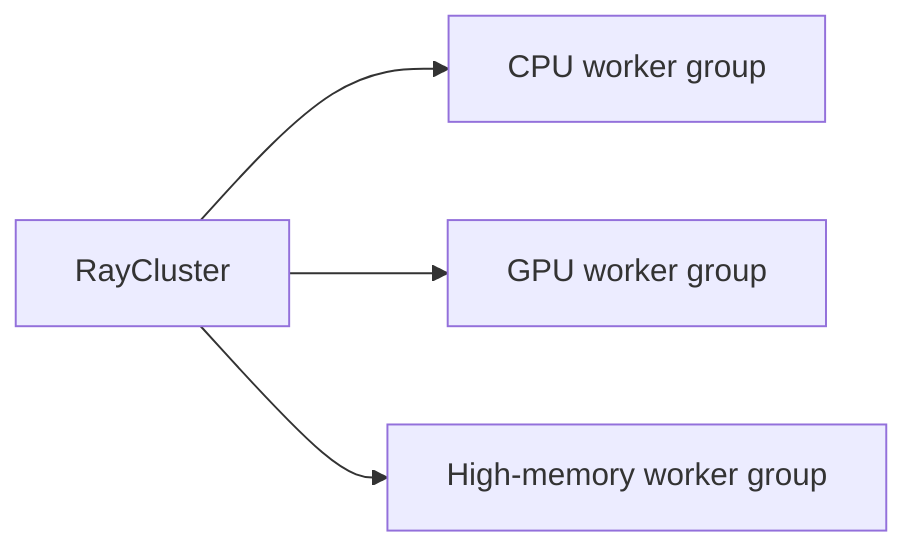
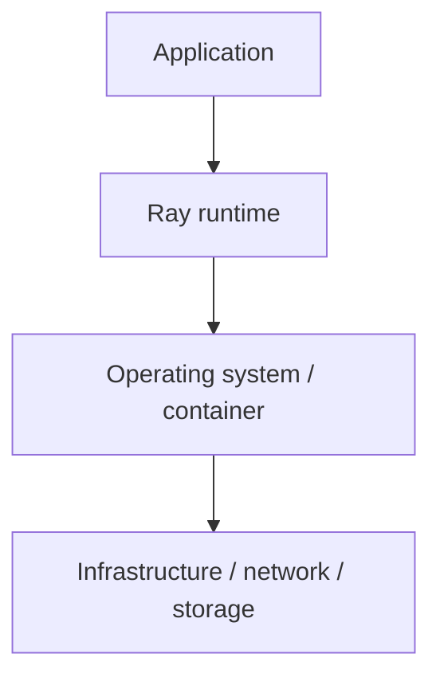
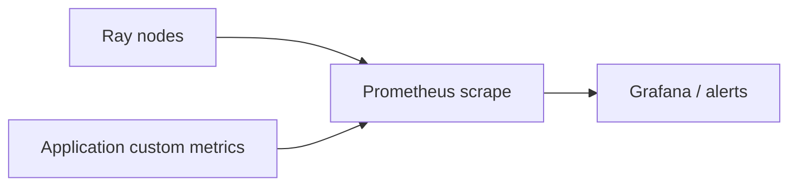
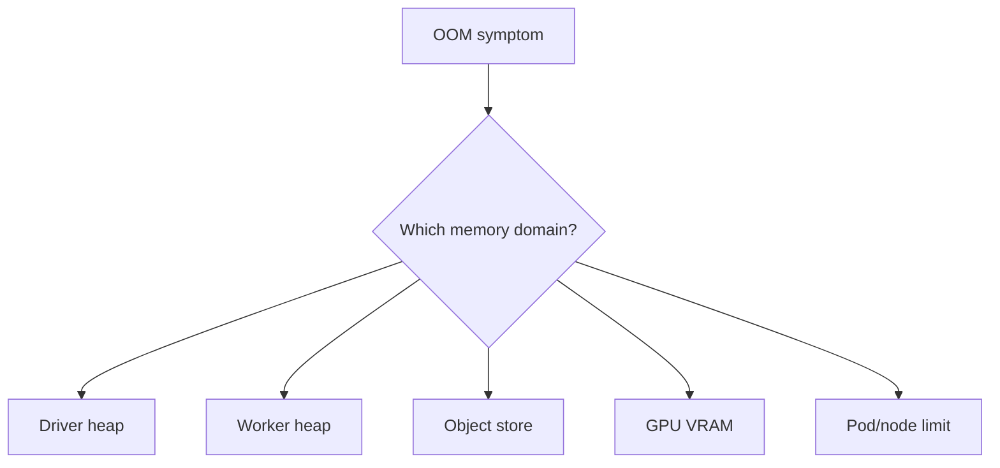

# Ray Clusters, KubeRay, Jobs, Observability, and Debugging

## 1. Production changes the problem

A local Ray program proves that code can execute. A production Ray system must also answer:

- how the cluster is created and upgraded;
- how jobs enter the cluster;
- how dependencies reach every worker;
- how capacity scales;
- how failures are observed;
- how operators distinguish application bugs from runtime/infrastructure failures;
- how logs, metrics, and state survive long enough to diagnose incidents.

The first book’s cluster chapter and the second book’s enterprise/debugging chapters provide the useful foundation. Exact deployment commands from 2022–2023 are not memorization targets.

---

## 2. Cluster topology

A Ray cluster contains a head node and worker nodes.



The head node is a coordination role, not “the server that should run all user computation.”

Production clusters should reserve enough head capacity for control-plane work and avoid accidental saturation with ordinary tasks.

---

## 3. Cluster infrastructure versus application execution

Do not conflate Kubernetes scheduling with Ray scheduling.

```text
Kubernetes
    schedules pods / manages infrastructure
        ↓
Ray cluster
    schedules tasks and actors inside those pods
```

This two-level scheduler architecture is central to KubeRay.

Kubernetes decides where a Ray worker pod exists. Ray then decides which task/actor executes inside the available Ray nodes.

---

## 4. KubeRay

The first book already treated the KubeRay operator as the standard Kubernetes path. Modern Ray makes that production role even clearer.

### Current Ray update

The principal KubeRay custom resources are:

| CRD | Purpose |
|---|---|
| `RayCluster` | Manage a Ray cluster lifecycle |
| `RayJob` | Submit/manage a job together with Ray cluster execution |
| `RayService` | Operate a Ray Serve application with cluster lifecycle and upgrade support |

The durable abstraction is declarative cluster/application management rather than hand-starting Ray processes on hosts.

---

## 5. Heterogeneous worker groups

KubeRay allows multiple worker groups representing different node shapes.



Use resource requests/limits and Ray resource declarations coherently. If Kubernetes believes a pod has one capacity while Ray advertises another, scheduling/capacity reasoning becomes misleading.

---

## 6. Ephemeral versus long-lived clusters

The second book discusses permanent and ephemeral clusters. The trade-off remains useful.

| Ephemeral cluster | Long-lived cluster |
|---|---|
| isolation per workload | lower startup overhead |
| clean dependency/version boundary | shared warm capacity |
| easier teardown/cost attribution | useful for interactive teams/services |
| less cross-job contamination | harder multitenancy/resource governance |
| cluster startup overhead | hanging actors/resources can block scale-down |

A batch training job often fits an ephemeral model. A production Serve service naturally needs a long-lived service topology.

---

## 7. Job submission

A production cluster needs a deliberate submission mechanism.

### Current Ray update

Use **Ray Jobs** for long-running/non-interactive application submission. Treat **Ray Client** primarily as an interactive development mechanism rather than the default production job transport.

Why this distinction matters:

- interactive client connectivity is a fragile lifecycle dependency;
- jobs should continue independently of a developer laptop/network session;
- job metadata/status should belong to the cluster execution environment.

Mental model:

```text
CI / operator / scheduler
    ↓ submit
Ray Job
    ↓
Driver runs in cluster context
    ↓
Tasks + actors
```

---

## 8. Runtime environments versus images

Distributed dependencies must exist on every worker that executes the code.

There are two broad strategies.

### Build dependencies into container/VM image

Best for:

- large native dependencies;
- CUDA/framework stacks;
- repeatable production builds;
- fast startup.

### Use Ray runtime environments

Useful for:

- Python packages;
- environment variables;
- working directory/code packaging;
- job-specific lightweight dependencies.

Do not download enormous native frameworks independently onto every new worker during a latency-sensitive autoscale event if they can be baked into an image.

---

## 9. Version consistency

The second book calls out Python serialization compatibility. The broader production rule is:

> Every participating worker should run a compatible Python/Ray/application environment.

Version drift can produce:

- serialization errors;
- dependency mismatches;
- model incompatibility;
- inconsistent task behavior.

Pin and reproduce environments. Do not treat a cluster as a collection of manually maintained servers.

---

# 10. Observability model

A useful incident workflow separates four layers:



You need evidence at all four layers.

### Application evidence

- business counters;
- task-level metrics;
- model/data-quality metrics;
- structured logs.

### Ray evidence

- task/actor states;
- scheduler resource demand;
- object/memory behavior;
- worker/node status.

### OS/container evidence

- CPU;
- RSS;
- disk;
- GPU;
- OOM kill;
- process exit code.

### Infrastructure evidence

- pod/node status;
- network reachability;
- object-store latency;
- cloud instance events.

---

## 11. Dashboard

Ray’s Dashboard is a high-value starting point for interactive diagnosis.

Use it to answer questions such as:

- Which jobs are running?
- Which tasks are slow/failing?
- Which actors exist and where?
- What resources are saturated?
- Are worker nodes healthy?

The second book correctly notes that a dashboard is not an alerting system. Production monitoring needs external metrics/alert infrastructure.

---

## 12. State APIs and CLI state

### Current Ray update

Modern Ray exposes State APIs/CLI functionality for listing/summarizing runtime entities.

Useful entities include:

- tasks;
- actors;
- nodes;
- workers;
- objects;
- placement groups;
- jobs.

This supports scriptable diagnosis rather than relying only on visual inspection.

`ray status` is particularly useful for understanding cluster resources and autoscaler demand.

---

## 13. Metrics and Prometheus

The second book covers Ray metrics and Prometheus integration. The durable production architecture is:



Track both runtime and workload metrics.

Runtime-only metrics can tell you a GPU is busy. They cannot tell you whether useful records are being processed correctly.

Suggested categories:

| Category | Examples |
|---|---|
| Throughput | records/s, tasks/s, requests/s |
| Latency | task duration, queue wait, p95 Serve latency |
| Capacity | CPU/GPU utilization, available resources |
| Memory | worker heap, object store, spill rate |
| Reliability | retries, actor restarts, failed tasks |
| Backpressure | pending tasks, queue depth, Kafka lag |
| Quality | bad records, model drift, validation failures |

---

## 14. Logs

Distributed logs are fragmented across processes and nodes.

A useful log event should include correlation fields such as:

```text
job_id
request_id / batch_id
actor/task identity if available
node/worker identity
input partition/key
action/outcome
duration
```

Do not depend on manually SSHing into individual nodes as the primary production log strategy.

Centralize logs.

---

## 15. Debugging workflow

The second book’s debugging appendix is most valuable as a diagnostic sequence.

### Step 1 — classify the symptom

Is this:

- wrong result;
- exception;
- hang;
- slow execution;
- OOM;
- worker crash;
- node failure;
- serialization failure;
- pending scheduling;
- container/image problem?

### Step 2 — reproduce at the smallest faithful scale

A local reproduction can simplify Python debugging, but do not use “local mode” if doing so removes the actual failure mechanism, such as cross-node data movement or Kubernetes memory limits.

### Step 3 — inspect Ray state

Find the relevant job/task/actor/node and its lifecycle.

### Step 4 — inspect worker logs and OS/container evidence

A `RayTaskError` may be the top-level symptom while the real cause is a pod OOMKill or native segfault.

### Step 5 — profile only after correctness/lifecycle is understood

CPU and memory profilers add overhead. Use them deliberately.

---

## 16. Serialization debugging

A common class of failures occurs before meaningful user computation begins.

Symptoms:

- object cannot be pickled;
- worker cannot import package;
- closure captures local nonserializable state.

Useful approach:

1. reduce the remote function argument/captured state;
2. test serializability;
3. instantiate native clients inside worker/actor;
4. verify dependency availability in runtime environment.

The second book references Ray’s serializability inspection tooling. Use current-version equivalents rather than memorizing old output formats.

---

## 17. OOM diagnosis

“OOM” is not enough information.

Determine whether pressure occurred in:

- driver heap;
- worker heap;
- object store;
- GPU memory;
- Kubernetes pod memory limit;
- node-level memory/disk spill.



Only then choose a remediation.

---

## 18. Native crashes

NumPy, PyTorch, Arrow, CUDA, and other native dependencies can fail below Python.

Possible evidence:

- worker exited unexpectedly;
- segmentation fault;
- core dump;
- GPU driver error;
- container exits with little Python traceback.

A Python debugger cannot diagnose every native failure. Use process/container logs, core dumps, native profilers, and library isolation/bisection when required.

---

## 19. Network and cluster connectivity

The first book demonstrates basic port connectivity diagnostics when manually building clusters. The specific historical ports are not the durable lesson.

The durable lesson is:

> Before debugging Ray protocol behavior, prove the nodes can actually reach the required addresses/services.

In Kubernetes, also inspect:

- Services;
- NetworkPolicies;
- DNS;
- pod readiness;
- ingress/load balancers;
- security groups/firewalls outside the cluster.

---

## 20. Production security boundary

The second book’s enterprise chapter reflects older Ray security assumptions. The reusable rule is conservative:

- do not expose Ray administrative/dashboard/job interfaces directly to the public internet;
- place authentication/network controls around cluster access;
- use least-privilege credentials for data sources;
- separate tenants/workloads when trust boundaries require it;
- scan/pin dependencies and container images;
- do not distribute secrets through source code or logs.

Treat Ray as an internal compute runtime that must sit inside an appropriately secured platform boundary.

---

## 21. Operational failure modes

| Symptom | First evidence to inspect | Likely classes |
|---|---|---|
| Task pending | scheduler/state + `ray status` | infeasible/busy resources, placement group |
| Actor keeps restarting | actor state + worker logs | constructor bug, OOM, node failure |
| Cluster won't scale down | actors/placement groups/jobs | detached resources, pending demand |
| Huge latency spikes | queue + spill + autoscaler metrics | overload, cold node, spill storm |
| Worker exits silently | pod/process status | OOMKill/native crash |
| Import error only on workers | runtime environment/image | dependency drift |
| Data path works locally only | storage/network mounts | local path assumption |
| Dashboard healthy but users fail | application metrics | business/data correctness issue |

---

## 22. Exercises

### Medium — runtime inspection

Run a job with tasks and actors. Locate them in Dashboard and State APIs. Record node placement, PIDs, resources, and task durations.

### Hard — diagnose an infeasible workload

Submit an actor/placement group the cluster cannot satisfy. Diagnose the exact resource mismatch using only operational evidence before changing the workload.

### Hard — OOM triage lab

Create separate driver-heap, worker-heap, and object-store pressure scenarios. Produce an incident note showing the evidence that distinguishes them.

### Hard — KubeRay lifecycle

Deploy a small `RayJob` or `RayCluster`, scale a worker group, kill a worker pod, and explain which layer reconstructed what.

### Chaos drill — production incident

Inject one unknown failure from this set: worker OOM, missing dependency, network-access failure, actor constructor crash, spill storm, or infeasible GPU request. Diagnose without being told the injected fault.

---

## 23. Mental models

### Kubernetes manages machines for Ray; Ray manages work on those machines.

### Dashboard tells you what is happening now; metrics/alerts tell you something changed before a human looks.

### A Ray error may be only the messenger. Always inspect the lower process/container layer.

### Reproduction must preserve the failure mechanism.

### Production observability joins runtime evidence with business/data-quality evidence.

---

## Source extraction

**Primary book material:**
- _Learning Ray_, Ch. 9 plus selected ecosystem/cluster material.
- _Scaling Python with Ray_, Ch. 12, Appendix B, and Appendix C.

**Current Ray update:** KubeRay (`RayCluster`, `RayJob`, `RayService`), Ray Jobs, Dashboard/State APIs, and current cluster observability guidance should be learned from the installed-version docs. Ray Client should be treated as an interactive tool rather than the default long-running production submission path.
