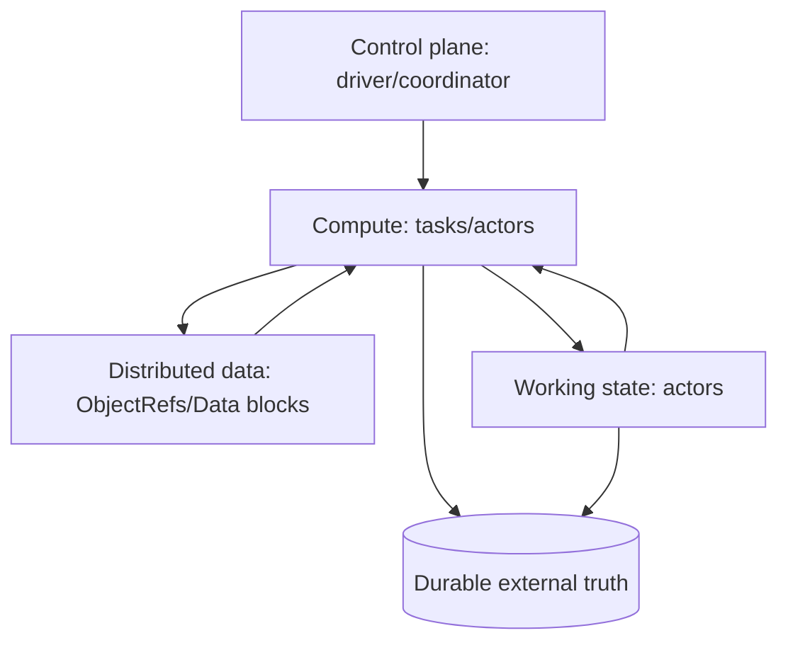
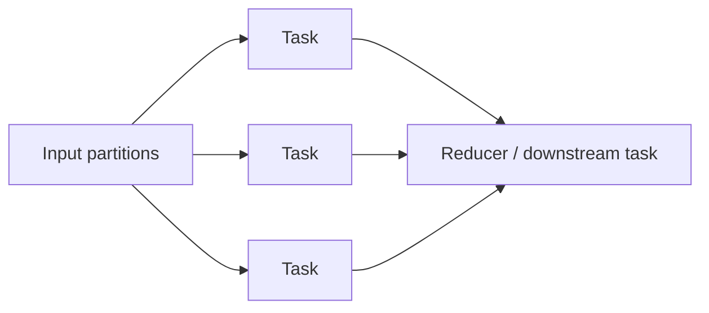
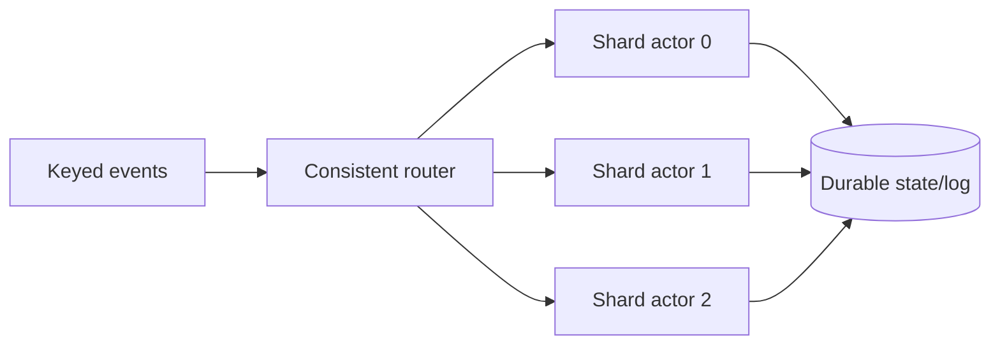
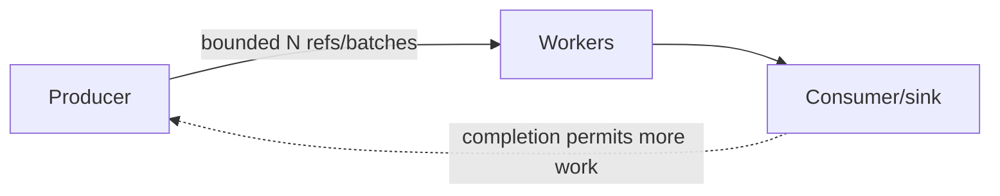
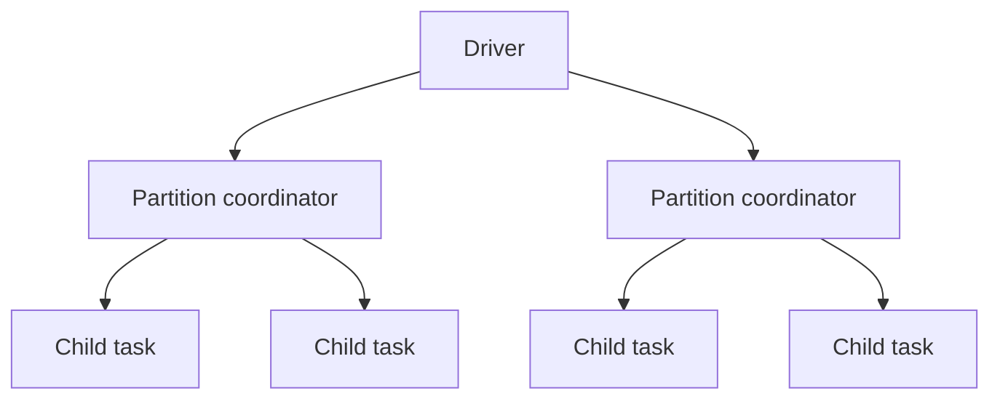
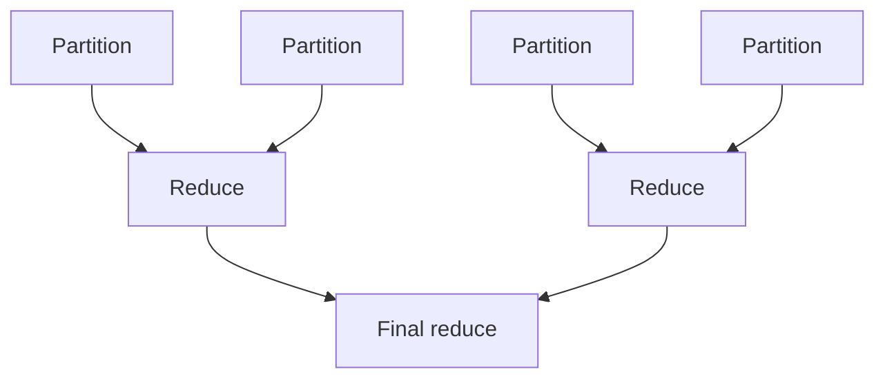
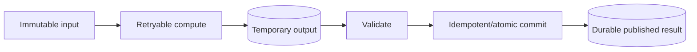
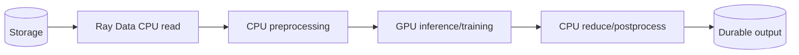

# Ray Production Patterns, Anti-Patterns, and System Design

## 1. Why this module matters

The two books teach many individual mechanisms. Senior engineering requires one additional skill: composing those mechanisms into systems while rejecting unnecessary complexity.

The recurring design question is:

> **Where should computation, mutable state, distributed data, control flow, and durable truth live?**

If those five responsibilities are not explicit, Ray applications tend to become collections of actors and tasks without a coherent failure model.

---

## 2. The five-plane design model

Use this model before writing code.

| Plane | Question | Typical Ray/system home |
|---|---|---|
| Compute | Where does work execute? | tasks, actors, Data operators, Serve replicas |
| State | Who owns mutable working state? | actor, stream processor, external DB |
| Data | How do large intermediate values move? | ObjectRefs/object store/Ray Data |
| Control | Who decides what happens next? | driver, coordinator actor, scheduler/orchestrator |
| Durability | What survives process/cluster loss? | DB, object storage, Kafka/log, lakehouse, checkpoints |



Ray is strongest in compute, working state, and distributed intermediate data. Do not force it to become your durable database or business workflow engine.

---

# 3. Pattern: stateless task fan-out / fan-in



Use when:

- work is independent;
- outputs are recomputable;
- state is unnecessary;
- retry is safe.

Good examples:

- parse independent files;
- feature extraction;
- API fan-out with bounded concurrency;
- independent simulation runs.

Failure risk: excessive fan-out, tiny tasks, or collecting every result in the driver.

---

# 4. Pattern: actor as initialized worker

```text
actor startup
    ↓
load expensive model/client once
    ↓
serve many independent calls
```

This is often the best actor use case because the state is mostly immutable initialization rather than complicated mutable business truth.

Examples:

- GPU inference model;
- tokenizer/parser;
- expensive native library;
- reusable connection/client.

Scaling is simple: create replicas/pool because each copy can own equivalent initialized state.

---

# 5. Pattern: sharded state actors



Use when:

- state naturally partitions by key;
- state access must remain low latency;
- each key has a clear owner;
- recovery from durable state/replay is designed.

Watch for hot keys, rebalancing complexity, actor restart, and per-key ordering.

---

# 6. Pattern: bounded producer-consumer pipeline



Use `ray.wait`, batch queues, or Data streaming execution to avoid unbounded in-flight work.

The invariant is:

```text
maximum queued work is known
```

This is more important than maximizing instantaneous parallelism.

---

# 7. Pattern: hierarchical fan-out

Instead of one driver submitting millions of tasks, intermediate tasks/actors can distribute work hierarchically.



Benefits:

- reduces one-client submission bottleneck;
- naturally maps recursive/dynamic workloads.

Risks:

- harder global backpressure;
- resource deadlocks if parent tasks wait while holding resources;
- explosive nested fan-out.

---

# 8. Pattern: tree aggregation

For large fan-in, avoid sending all intermediates to one driver.



This reduces network concentration and driver memory.

Useful for:

- distributed statistics;
- model aggregation;
- large result reduction;
- custom MapReduce-style workloads.

---

# 9. Pattern: durable compute/commit separation

A retryable computation should not casually own irreversible side effects.



This pattern is central to production Data Engineering.

Ray executes computation; storage commit protocols protect correctness.

---

# 10. Pattern: external durable state + actor cache

```text
DB/log = authority
actor memory = acceleration
```

On actor restart:

```text
load/replay → rebuild cache → resume
```

This is usually safer than treating actors as primary stores.

---

# 11. Pattern: heterogeneous AI/data pipeline

Ray is particularly compelling when one application contains stages with very different resource shapes.



Ray’s value is not that every stage is impossible elsewhere. Its value is one coherent execution/runtime model across these stages.

Always measure the cost of moving data between resource pools.

---

# 12. Anti-pattern: immediate `ray.get`

```python
for x in xs:
    y = ray.get(f.remote(x))
```

Effect: asynchronous distributed execution becomes serial synchronization.

Fix: submit broadly within a bounded window and materialize later/in completion order.

---

# 13. Anti-pattern: worker-side blocking `ray.get` everywhere

Tasks that spawn children and immediately block on them can waste worker resources and produce resource cycles.

Prefer direct ObjectRef dependencies or coordinator patterns when possible.

Do not hide scheduler-visible dependencies inside arbitrary imperative waits.

---

# 14. Anti-pattern: tiny tasks

Remote execution is not free.

If:

```text
compute << scheduling + serialization + transfer
```

batch the work.

This is one of the most universal Ray performance lessons in both books.

---

# 15. Anti-pattern: unbounded task submission

Submitting millions of tasks without flow control creates:

- pending-task metadata;
- retained ObjectRefs;
- result memory;
- downstream overload.

Use bounded concurrency and make queue capacity explicit.

---

# 16. Anti-pattern: repeated giant arguments

Sending the same large object to thousands of tasks repeatedly creates unnecessary serialization/copy pressure.

Use:

- shared ObjectRef;
- actor-local initialized state;
- per-node replicated state when appropriate.

Choose based on reuse and locality.

---

# 17. Anti-pattern: driver as data bus

```text
workers → driver → workers
```

The driver becomes:

- network bottleneck;
- memory bottleneck;
- synchronization point.

Pass ObjectRefs directly through distributed computation graphs or use Ray Data.

---

# 18. Anti-pattern: one global actor

A single actor used for all shared state becomes a serialized bottleneck.

Symptoms:

- one CPU hot;
- actor mailbox grows;
- cluster mostly idle.

Fix by:

- sharding;
- separating independent state;
- using durable external stores;
- using read replicas for immutable state.

---

# 19. Anti-pattern: actor as database

If correctness depends on state surviving actor/node/cluster death, actor RAM is not enough.

A restart policy does not create durability.

---

# 20. Anti-pattern: declaring resources without understanding physical behavior

`num_cpus=1` does not stop native libraries from launching multiple threads.

`num_gpus=1` does not make CPU Python run on a GPU.

Logical resources communicate scheduling requirements; they do not replace profiling.

---

# 21. Anti-pattern: over-distributed architecture

Ray’s flexibility makes it easy to distribute code that should remain local.

Do not create remote boundaries unless they buy one or more of:

- parallelism;
- resource specialization;
- state ownership;
- isolation;
- independent scaling;
- data locality.

Every remote boundary introduces overhead and failure complexity.

---

# 22. Tool-selection matrix

| Primary problem | Usually stronger default | Where Ray fits |
|---|---|---|
| local CPU parallelism | multiprocessing/concurrent tools | when future cluster scaling/runtime features matter |
| durable async job queue | Celery/queue system | compute behind the queued job |
| SQL/lakehouse ETL | Spark/warehouse engine | downstream Python/AI processing |
| event-time streaming | Flink/Kafka Streams | model-heavy/stateful AI stage |
| durable business workflow | Temporal/Airflow/Dagster depending semantics | execute distributed compute steps |
| container infrastructure | Kubernetes | Ray runs as application runtime on it |
| distributed training/HPO | Ray Train/Tune or framework-native systems | strong integrated option |
| Python model serving | Ray Serve | strong when heterogeneous/model-heavy |
| dynamic distributed Python | Ray Core | primary fit |

The question is never “Can Ray do this?” Ray is general enough that the answer is often yes. The question is whether it reduces total system complexity.

---

# 23. Architecture review template

Before approving a Ray design, answer:

| Domain | Required answer |
|---|---|
| Work decomposition | Why tasks vs actors vs Data? |
| State | What mutable state exists and who owns it? |
| Durability | What survives cluster loss? |
| Data movement | What are the largest objects and where do they cross nodes? |
| Resource model | CPU/GPU/memory/custom requirements per stage? |
| Backpressure | Maximum in-flight work? |
| Failure | What retries automatically and what cannot? |
| Side effects | How are duplicates prevented? |
| Placement | Locality vs failure-domain decision? |
| Scaling | Replica/task scaling and node autoscaling behavior? |
| Observability | Which evidence proves health/correctness? |
| Alternative | Why not Spark/Flink/etc.? |

If a design cannot answer these, it is not production-ready.

---

# 24. Cost model

Distributed performance is not free performance.

Approximate total cost includes:

```text
compute time
+ idle reserved resources
+ node cold start
+ network transfer
+ object spill/storage
+ retries/recomputation
+ checkpoint I/O
+ engineering/operational complexity
```

A 2× faster workload that requires 5× the infrastructure cost may be a bad production optimization.

Tune for useful throughput per dollar, not only wall-clock speed.

---

# 25. Exercises

### Medium — anti-pattern hunt

Given a deliberately bad Ray program containing immediate gets, tiny tasks, duplicate large arguments, and a global actor, identify each issue before running it. Then benchmark repairs.

### Hard — blank-page architecture

Design a 10 TB/day document embedding pipeline using CPUs and GPUs. Specify task/Data decomposition, block sizes, model actors, resources, storage commits, retries, and observability.

### Hard — alternative challenge

Redesign the same workload in Spark + a separate inference service. Compare operational complexity and data movement with the Ray design.

### Failure design review

For a proposed stateful actor system, enumerate every failure boundary and determine which data/state is lost, reconstructed, duplicated, or externally durable.

---

# 26. Mental models

### Use tasks for recomputable work; actors for identity/state; external systems for durable truth.

### Every ObjectRef retained is potentially a memory-lifetime decision.

### Every remote boundary is a network/failure boundary, even when the API looks like Python.

### Backpressure is architecture, not a performance patch.

### Prefer the simplest system that owns the hard correctness problem naturally.

---

## Source extraction

**Primary book material:** patterns synthesized from _Learning Ray_ Ch. 2–3, 6–11 and _Scaling Python with Ray_ Ch. 3–7, 9–12 plus the Space Beaver case study/debug appendix.

**Current Ray update:** current official anti-pattern guidance reinforces delayed `ray.get`, adequate task granularity, bounded pending work, and careful object passing. Tool-selection guidance here is an engineering synthesis, not a claim that the books prescribe one universal architecture.
