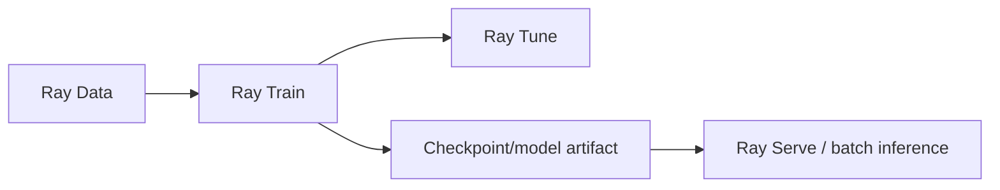

# Ray Book-Era Material and Current Replacements

## Why this notebook exists

The two primary books were written during a fast-moving period around Ray 2.0–2.2. They remain valuable because the distributed-systems mechanisms are durable, but some APIs, product groupings, and production recommendations have changed.

The correct study method is:

> **Keep the architectural lesson. Revalidate the implementation surface.**

Do not throw away a chapter because an API changed. Do not memorize an obsolete API because it appears in a good book.

---

## 1. Reconciliation table

| Book-era material | Durable lesson to keep | Current study treatment |
|---|---|---|
| Ray AIR as the unifying ML umbrella | Data, training, tuning, checkpointing, inference are one connected workload | Learn Ray Data, Train, Tune, and Serve directly; treat AIR terminology as historical architecture context |
| `DatasetPipeline` | streaming/pipelined block execution lowers memory and overlaps stages | Old abstraction is historical; learn modern Ray Data streaming execution |
| `tune.run()` as mature/default path | HPO consists of trainables, trials, search algorithms, schedulers, metrics, resources | Prefer current `Tuner`/`ResultGrid` APIs; understand `tune.run` when reading old examples |
| Older Ray Train restore/preprocessor APIs | distributed training needs checkpoints, restart state, consistent preprocessing | Use current Ray Train APIs and current fault-tolerance guidance |
| Ray Workflows | durable orchestration is distinct from normal task execution | Historical only; do not design a new durable workflow system around Ray Workflows |
| Ray Client as common cluster interaction | interactive remote connection can submit Ray code | Use primarily for interactive development; use Ray Jobs for long-running production submission |
| Head node described as unconditional SPOF | cluster control state requires a resilience design | Modern GCS HA makes this more nuanced; verify current production architecture |
| Old bottom-up/global-local scheduler descriptions | scheduling is distributed, resource-aware, dependency/locality-sensitive | Learn current scheduler semantics from modern docs; do not memorize old component algorithms |
| Old Serve `deploy()` / handle examples | deployments, replicas, batching, composition, resource allocation | Use current Serve application/deployment syntax |
| Historical KubeRay versions/config | Kubernetes can manage Ray cluster lifecycle declaratively | Learn current `RayCluster`, `RayJob`, `RayService` CRDs |
| Old enterprise security examples | Ray cluster interfaces need a protected platform boundary | Apply current network/auth/security guidance; do not copy old ingress snippets blindly |

---

# 2. Ray AIR

## What the book teaches

_Learning Ray_ uses AIR as an umbrella tying together:

```text
Data
→ preprocessing
→ Trainer
→ Tuner/checkpoints
→ batch prediction / deployment
```

That architectural integration is still useful.

### Keep

- end-to-end workload thinking;
- compatible data/training/tuning/serving layers;
- checkpoints as exchange/recovery artifacts;
- one distributed runtime beneath higher-level libraries.

### Do not memorize

- AIR branding as the required modern entry point;
- every AIR-specific wrapper/config from the book.

### Mental replacement



The architecture survives even if the umbrella name fades from current tutorials.

---

# 3. DatasetPipeline

## Book-era concept

The first book explicitly creates Dataset pipelines to stream pieces of data through transformations and reduce memory pressure.

That is an excellent distributed-data lesson.

## Current treatment

The old `DatasetPipeline` abstraction was deprecated as Ray Data moved streaming execution into normal Dataset processing.

### Keep

```text
incremental block execution
bounded working set
pipeline overlap
avoid materializing all intermediates
```

### Replace

Do not write new study exercises around the old `DatasetPipeline` class. Use current Ray Data APIs and inspect current logical/physical/streaming execution.

---

# 4. Tune: `tune.run` to `Tuner`

The first book itself captures the transition: it teaches `tune.run` while noting the newer Tuner API added around Ray 2.0.

### Durable ontology

```text
search space
+ trainable
+ trial
+ search algorithm
+ scheduler
+ metric
+ checkpoint
```

That ontology matters far more than function names.

### Current study target

Prefer:

```text
Tuner
→ fit()
→ ResultGrid
```

Use old `tune.run` examples to understand HPO logic, not as the canonical implementation pattern.

---

# 5. Ray Train API evolution

Distributed-training concepts are durable:

- worker groups;
- data sharding;
- collective synchronization;
- resource topology;
- checkpoints;
- recovery;
- Tune integration.

But Train APIs have evolved significantly.

### Current Ray update

Some restore APIs described in older material were deprecated as Train moved forward. When implementing exercises, use current documentation for:

- trainer construction;
- reporting/checkpoint APIs;
- restore/resume behavior;
- current Train V2 semantics where applicable.

### Rule

Never base production recovery correctness on an API remembered from a 2023 example.

---

# 6. Ray Workflows

The second book gives Ray Workflows an entire chapter and presents it as a durable workflow engine with resumable steps and virtual actors.

That chapter is useful historically because it highlights an important distinction:

```text
ordinary distributed execution
≠
durable workflow orchestration
```

## Current Ray update

Ray Workflows has been deprecated. The Ray team has indicated there is no direct modern Ray replacement planned for that feature set; durable workflow engines such as Temporal or orchestration tools such as Airflow may be more appropriate depending on requirements.

### Keep from the chapter

- durable execution requires persisted workflow state;
- step completion and resumption semantics are different from task retry;
- orchestration is a separate system responsibility.

### Do not do

Do not start a new architecture using book-era `workflow.step` or virtual actors.

---

# 7. Ray Client versus Ray Jobs

The first book uses Ray Client as a convenient way to interact with remote clusters.

That remains useful for interactive development.

## Current distinction

| Ray Client | Ray Jobs |
|---|---|
| interactive session | submitted application/job |
| connectivity to client matters | driver executes with cluster job lifecycle |
| exploration/debugging | long-running production execution |
| developer workflow | CI/orchestrator/automation workflow |

Current Ray guidance favors Ray Jobs for long-running ML or production workloads.

### Mental model

```text
Ray Client = remote interactive Python experience
Ray Jobs = application submission boundary
```

---

# 8. Head node and GCS fault tolerance

The second book contains old warnings that head-node failure means the whole Ray cluster fails.

That reflected the architecture available at the time and was a valid operational warning.

## Current Ray update

Modern Ray supports GCS fault-tolerance configurations, so the production question is more precise:

```text
What happens when:
- a worker dies?
- a worker node dies?
- the GCS process fails?
- the head VM/pod disappears?
- the entire cluster disappears?
```

Do not compress these into one “head failure” category.

Ray HA does not replace durable external state or cross-cluster disaster recovery.

---

# 9. Scheduling architecture descriptions

Older Ray literature/books may describe global/local schedulers or a particular bottom-up scheduling implementation.

The stable model to keep is:

- every task/actor declares logical resource demand;
- dependency readiness matters;
- locality can influence placement;
- nodes have feasible/available resources;
- placement groups reserve bundles atomically;
- autoscaling responds to demand.

### Do not memorize

Internal message paths and scheduler subcomponents from one Ray release unless studying Ray internals specifically.

For production diagnosis, current state/scheduling docs are authoritative.

---

# 10. Actor resource defaults

The books document historical actor CPU scheduling behavior that is easy to misread and has changed in surrounding documentation over time.

### Durable best practice

> **Declare actor resources explicitly when capacity/correctness depends on them.**

This removes ambiguity and makes autoscaler/placement behavior reviewable.

---

# 11. Object-store implementation details

The books correctly teach:

- shared object memory;
- ObjectRefs;
- ref-count-based lifetime;
- serialization;
- spilling;
- distributed transfer.

These are core concepts worth keeping.

### Current-study caution

Specific thresholds, inline-object sizes, internal configuration keys, and spill-tuning examples from the books may change.

Do not copy private/internal `_system_config` examples into production because they appeared in a textbook. Start with current public configuration guidance and measurement.

---

# 12. Ray Data ecosystem integrations

The books list Dask-on-Ray, Spark-on-Ray/RayDP, Modin, Mars, and other integrations.

This is exactly the kind of material we should **not** preserve as a timeless catalog.

### Keep

Ray can serve as a shared execution/runtime layer that interoperates with other Python/data ecosystems.

### Revalidate

Before adopting a specific integration, check:

- current maintenance status;
- supported Ray/Python version;
- production maturity;
- whether the integration still represents recommended architecture.

A list of integrations from 2023 is not a 2026 technology recommendation.

---

# 13. Ray Serve API evolution

The books demonstrate old patterns such as direct deployment `.deploy()` calls and earlier handle APIs.

### Keep

- deployment vs replica;
- model stays loaded in actor process;
- resource declarations;
- request batching;
- scaling;
- deployment composition;
- canary/rollout thinking.

### Replace

Use current Serve application/deployment construction, current handles, and current autoscaling configuration.

The service architecture is more durable than decorator call syntax.

---

# 14. KubeRay evolution

The first book’s choice to emphasize KubeRay was directionally strong.

### Current study target

Understand:

```text
RayCluster
RayJob
RayService
```

and how Kubernetes and Ray autoscaling/scheduling interact.

Do not memorize old CRD API versions or YAML schemas. Kubernetes operators evolve.

---

# 15. Observability evolution

The second book’s enterprise/debugging material predates much of the current State API/Dashboard maturity.

### Keep

- inspect logs from the actual worker;
- distinguish Python/native/container failures;
- use profiling deliberately;
- centralize metrics;
- dashboard is not a replacement for alerts.

### Add from current Ray

- modern State APIs;
- task timelines;
- `ray status` resource demand;
- current Dashboard job/task/actor views;
- Prometheus-based long-term monitoring.

---

# 16. Security and multitenancy

Do not copy the second book’s specific ingress/authentication examples as a modern security architecture.

The durable security principle is:

> Treat a Ray cluster as privileged compute infrastructure and protect its control/admin interfaces accordingly.

Current security architecture should be derived from current Ray/Kubernetes/cloud guidance and the organization’s identity/network platform.

---

# 17. What remains timeless in both books

The most valuable material has aged well because it is about distributed systems rather than product syntax:

| Durable lesson | Why it remains valuable |
|---|---|
| tasks vs actors | stateless vs stateful distributed computation |
| ObjectRefs | futures + dependency/data-flow abstraction |
| delayed `ray.get` | asynchronous composition and parallelism |
| task granularity | coordination overhead exists |
| actor state recovery | process restart is not data durability |
| serialization | process/node boundaries require representation transfer |
| object store | shared distributed intermediate data plane |
| logical resources | scheduler accounting differs from physical enforcement |
| placement groups | gang scheduling/resource topology |
| backpressure | unbounded concurrency is unstable |
| idempotency | retries can duplicate effects |
| data locality | network movement is a first-class cost |
| Spark/Ray distinction | data-centric vs general Python/AI runtime trade-offs |
| observability | failures must be diagnosed across layers |

---

# 18. Version-sensitive study rule

For every code exercise:

```text
Book explains WHY / architecture
        +
Current Ray docs define HOW today
        ↓
Our exercise proves behavior empirically
```

If book and modern docs disagree on an API/default:

1. retain the book’s conceptual lesson if still valid;
2. mark the book implementation as historical;
3. implement using current docs;
4. verify behavior in the runtime rather than assuming documentation alone.

---

# 19. Exercises

### Reconciliation exercise

Take one code sample each from book-era Tune, Train, Data pipeline, Serve, and Workflows. Classify every API as:

- current;
- current but not preferred;
- deprecated;
- removed/historical.

Then rewrite only the examples whose concepts remain relevant.

### Architecture-history exercise

Explain why Ray Workflows being deprecated does **not** invalidate what its chapter teaches about durability and orchestration.

### Production review exercise

Given an old KubeRay/Serve deployment guide, identify every assumption that must be revalidated before use today: CRD version, image, Ray version, ports, security, resources, autoscaling, APIs, metrics.

---

## Source extraction

**Primary book material:**
- _Learning Ray_ across Ch. 5–11, especially the book’s own transition-era notes around Tuner/AIR.
- _Scaling Python with Ray_ Ch. 5, 7–12 and deployment/debug appendices.

**Current Ray update:** this notebook intentionally adds current authoritative reconciliation. It is not a claim that the books contained these later deprecations. Current Ray documentation and Ray project maintainer guidance are authoritative for API status.
