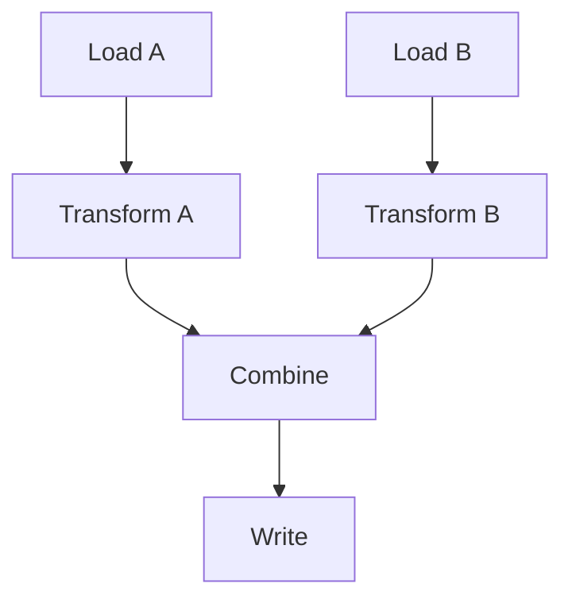
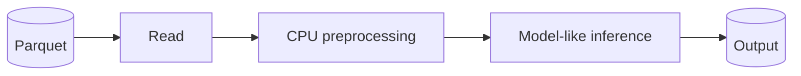
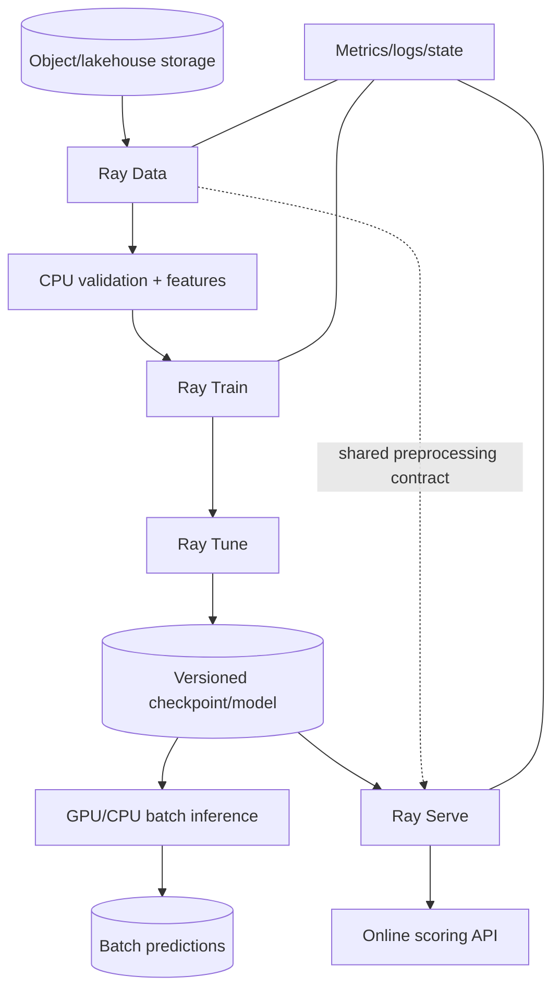
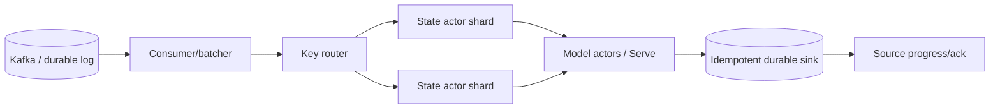

# Ray Engineering Exercise Bank and Capstone

## Purpose

This exercise bank turns the two books’ concepts into engineering practice. It deliberately avoids beginner copy-along tutorials.

Every exercise follows:

```text
predict → implement → measure → break → observe → diagnose → fix → explain
```

The goal is not to memorize Ray syntax. The goal is to build the reflexes required to reason about process boundaries, scheduling, data movement, state, failure, backpressure, and production operations.

The official Ray tutorial repository is useful raw material because it contains exercises on task dependencies, nested remote functions, actors, actor handles, `ray.wait`, serialization, GPUs, custom resources, and tree reductions. We reuse those **concepts**, but raise the difficulty and add measurement/failure requirements.

---

# 1. Exercise standard

A submission is complete only if it contains:

| Evidence | Required |
|---|---|
| Working implementation | yes |
| Prediction made before running | yes |
| Timing/resource measurements | yes |
| Architecture/execution diagram | for multi-stage exercises |
| Failure injection | where specified |
| Runtime evidence | logs/state/dashboard/metrics as applicable |
| Explanation of process/data location | yes |
| Production trade-off discussion | yes |
| Cleanup/reproducibility | yes |

Do not look at a finished solution before attempting the exercise.

---

# 2. Phase A — Python and execution foundations

## A1 — Process identity map

**Difficulty:** Medium

Write ordinary Python, multiprocessing, threaded, and Ray implementations of the same CPU/IO diagnostic function.

Each execution must return:

```text
PID
thread ID
hostname
start/end timestamp
input ID
```

### Questions

- Which executions share memory?
- Which share process identity?
- Which actually overlap CPU work?
- What changes when the workload is sleep/I/O versus pure Python CPU work versus NumPy/native work?

### Required output

Create a Mermaid execution diagram from observed evidence, not assumptions.

---

## A2 — Serialization boundary lab

**Difficulty:** Medium

Construct inputs containing:

- primitives;
- nested dictionaries;
- NumPy arrays;
- a closure capturing a large object;
- an open file/socket-like nonserializable resource.

Predict which objects transfer correctly and which fail. Use Ray’s current serializability inspection tools when useful.

Then redesign the failed case by creating the resource inside the worker/actor.

---

## A3 — GIL and native-library experiment

**Difficulty:** Hard

Compare:

```text
pure Python CPU loop
NumPy matrix operation
sleep/network-like operation
```

under:

- sequential execution;
- threads;
- processes;
- Ray tasks.

Explain the results through GIL/process/native-code behavior rather than just reporting elapsed time.

---

# 3. Phase B — Tasks, ObjectRefs, and dependencies

## B1 — Premature `ray.get`

**Difficulty:** Medium

Implement the same 64-task workload three ways:

1. immediate `ray.get` after each submit;
2. submit-all then `ray.get`;
3. bounded completion-order processing using `ray.wait`.

Measure:

- elapsed time;
- max in-flight tasks;
- driver memory;
- result latency distribution.

Explain why the fastest architecture changes when each result is 1 KB versus 100 MB.

---

## B2 — Dependency DAG without driver materialization

**Difficulty:** Medium

Build:



Constraint: the driver may only `ray.get` the final status. Intermediate data must stay distributed.

Instrument each task with hostname and timing to infer execution order.

---

## B3 — Dynamic nested parallelism

**Difficulty:** Hard

Implement a workload where each parent discovers a variable number of child partitions at runtime.

Test fan-out factors that produce roughly:

```text
100
10,000
100,000+
```

tasks.

Find the point where scheduler/metadata overhead becomes visible. Introduce batching/hierarchy and compare.

---

## B4 — Tree reduction

**Difficulty:** Hard

Implement:

- flat fan-in to driver;
- flat remote reducer;
- binary tree reducer.

Use large partition summaries and measure network/driver memory behavior.

Explain why tree reduction can be preferable even when arithmetic complexity is identical.

---

# 4. Phase C — Actors and distributed state

## C1 — Counter correctness

**Difficulty:** Medium

Implement a counter using:

1. module-level global mutated by tasks;
2. one actor;
3. N sharded actors.

Drive high concurrency and explain why only some architectures provide meaningful global/state-shard semantics.

---

## C2 — Expensive initialization

**Difficulty:** Medium

Simulate a 3-second model load and 100-ms inference.

Compare:

- task loads model every invocation;
- `ray.put` model shared when serialization permits;
- model actor loads once;
- actor pool.

Measure time-to-first-result, steady-state throughput, and memory.

---

## C3 — Recoverable state actor

**Difficulty:** Hard

Build per-customer rolling aggregates in actors with a durable append-only event source.

Randomly kill actors. They must reconstruct their state and produce the same final aggregate as a deterministic reference implementation.

### Required reasoning

- checkpoint versus replay trade-off;
- actor restart versus logical state recovery;
- how duplicate replay is handled.

---

## C4 — Hot-key skew

**Difficulty:** Hard

Route Zipf-distributed events across 16 actors by key.

Observe one or more hot shards. Design two mitigations:

- one preserving strict per-key ordering;
- one relaxing ordering and allowing subsharding/aggregation.

Compare throughput and correctness complexity.

---

# 5. Phase D — Scheduling and resources

## D1 — Feasible, busy, infeasible

**Difficulty:** Medium

Create a deliberately constrained local cluster and submit tasks with varying CPU/custom-resource requests.

Before running, classify every task as:

```text
runnable now
runnable later
infeasible
```

Verify using current state/scheduler evidence.

---

## D2 — Native oversubscription

**Difficulty:** Hard

Run multiple Ray tasks that invoke a native numerical library with internal threading.

Measure:

- logical Ray CPU allocation;
- actual process/thread count;
- CPU utilization;
- throughput.

Then constrain native thread pools and compare.

---

## D3 — Placement groups

**Difficulty:** Hard

Model a distributed trial requiring a coordinator and four workers. Create resource bundles and test pack/spread strategies.

Explain:

- atomic reservation;
- locality;
- failure blast radius;
- infeasibility.

---

## D4 — Locality versus capacity

**Difficulty:** Hard

Produce a multi-GB object on one node. Compare consumer execution:

- colocated with data;
- forced remote;
- remote but with faster/more compute.

Find the break-even point between data movement and compute availability.

---

# 6. Phase E — Object store and memory

## E1 — Driver heap vs object-store pressure

**Difficulty:** Hard

Build two workloads:

### Workload A

Materialize all large results into a driver list.

### Workload B

Retain many large ObjectRefs without fetching them.

Observe the different memory growth and failure modes.

Produce an incident diagnosis for each.

---

## E2 — Spill storm

**Difficulty:** Hard

Use a working set larger than configured object-store memory.

Measure:

- spill bytes;
- restore bytes;
- disk throughput;
- task latency;
- end-to-end throughput.

Increase working-set size until spilling becomes the dominant bottleneck.

---

## E3 — Large shared input

**Difficulty:** Medium/Hard

Send a large immutable lookup object to 100 tasks using three designs:

- ordinary argument repeatedly;
- one ObjectRef;
- actor-local/node-local initialized copy.

Compare serialization, transfer, and memory behavior.

---

# 7. Phase F — Fault tolerance and idempotency

## F1 — Application exception vs worker death

**Difficulty:** Medium

Create two tasks:

- one raises a Python exception;
- one kills its worker process.

Observe current retry behavior and record exactly what differs.

Do not rely on book-era retry counts: inspect the installed Ray version.

---

## F2 — Ambiguous database commit

**Difficulty:** Hard

Task flow:

```text
insert output row
→ commit
→ deliberately crash worker
```

Allow task retry and demonstrate duplicate side effects.

Repair using a stable idempotency key or transactional UPSERT.

---

## F3 — Chaos failure matrix

**Difficulty:** Hard

For a multi-node workload, independently inject:

- task worker death;
- actor death;
- worker node death;
- driver termination;
- lost/restarted service dependency.

Create a table:

| Failure | Automatic recovery? | Lost state/data? | Duplicate risk? | Required app logic |
|---|---|---|---|---|

The table must be based on observed behavior.

---

# 8. Phase G — Ray Data

## G1 — Block-size sweep

**Difficulty:** Medium

Generate a realistically sized synthetic dataset and execute the same transform under multiple block granularities.

Measure:

- block/task count;
- throughput;
- worker utilization;
- peak memory;
- spill.

Find the bad extremes.

---

## G2 — Skewed aggregation

**Difficulty:** Hard

Generate a Zipf key distribution and perform keyed aggregation/repartitioning.

Identify hot partitions and repair using local preaggregation/salting when mathematically valid.

---

## G3 — Streaming block pipeline

**Difficulty:** Hard

Construct:



Measure whether operators overlap and whether the full intermediate dataset materializes.

Tune pipeline working set to avoid memory pressure.

---

## G4 — Ray Data versus Spark design review

**Difficulty:** Architecture

Evaluate three workloads:

1. 20 TB SQL-heavy join/aggregate pipeline;
2. image preprocessing + GPU embedding;
3. lakehouse ETL followed by model training.

Choose Ray Data, Spark, or hybrid. Include a data-flow diagram and justify engine boundaries.

---

# 9. Phase H — Event-driven processing

## H1 — Kafka-style keyed ordering simulator

**Difficulty:** Medium

Simulate partitioned keyed input and route records to actor shards. Verify ordering per key while different keys execute concurrently.

---

## H2 — Backpressure system

**Difficulty:** Hard

Producer rate must exceed consumer rate for part of the run.

Implement:

- bounded queues/batches;
- source throttling;
- lag metric.

Show what happens when backpressure is removed.

---

## H3 — Replay correctness

**Difficulty:** Hard

Persist input events and sink dedupe state. Kill consumers/actors randomly and replay from an earlier offset.

Final output must equal an exactly computed reference dataset despite duplicate processing attempts.

---

# 10. Phase I — Train, Tune, accelerators

## I1 — Distributed-training scaling curve

**Difficulty:** Hard

Train a model with 1, 2, and 4 workers where resources allow.

Measure:

```text
samples/sec
step time
input wait
synchronization time where observable
GPU/CPU utilization
```

Calculate scaling efficiency rather than merely wall-clock improvement.

---

## I2 — Tune resource allocation

**Difficulty:** Hard

Given fixed cluster resources, compare:

- many single-worker trials;
- fewer multi-worker trials;
- early-stopping scheduler.

Optimize total experiment time to a good result, not one trial’s training speed.

---

## I3 — Checkpoint failure recovery

**Difficulty:** Hard

Kill a training worker mid-run. Resume from a current Ray Train checkpoint mechanism.

Verify that model, optimizer, epoch/step, and relevant preprocessing/training state resume correctly.

---

# 11. Phase J — Ray Serve

## J1 — Load curve

**Difficulty:** Medium/Hard

Serve a CPU-heavy endpoint. Increase offered load until saturation.

Plot:

- throughput;
- p50/p95/p99 latency;
- queue depth;
- replica count/utilization.

Identify the knee of the curve.

---

## J2 — Batching frontier

**Difficulty:** Hard

For vectorized inference, sweep batch size and batch wait timeout.

Produce a Pareto-like view of throughput versus p99 latency. Select a configuration for a defined SLO.

---

## J3 — CPU/GPU serving graph

**Difficulty:** Hard

Compare:

1. separate CPU preprocess, GPU model, CPU postprocess deployments;
2. fused GPU/model deployment with preprocessing colocated.

Measure whether service decomposition creates excessive data movement.

---

## J4 — Replica chaos

**Difficulty:** Hard

Kill replicas during load. Measure availability, recovery, cold-start time, and client retry amplification.

---

# 12. Phase K — KubeRay and operations

## K1 — Ray Job lifecycle

Submit a noninteractive Ray Job. Disconnect the initiating shell/client and verify job lifecycle remains cluster-owned.

Contrast with an interactive-client workflow conceptually.

---

## K2 — Worker-pod failure

On KubeRay, kill a worker pod while tasks and actors are active.

Trace recovery across:

```text
Kubernetes
Ray node registration
Ray scheduler
user tasks/actors
application state
```

---

## K3 — Unknown incident

Instructor injects exactly one fault without disclosure:

- object-store pressure;
- missing package on workers;
- impossible placement group;
- actor constructor crash;
- pod OOMKill;
- inaccessible storage path;
- slow downstream API.

Learner must diagnose from state, logs, metrics, and system evidence.

---

# 13. Production capstone A — Heterogeneous Data + AI Platform

## Scenario

Build a production-style data/ML pipeline that processes a large durable dataset, trains/tunes a model, performs batch inference, and serves an online version of the same model.

### Architecture target



### Required design decisions

You must document:

- why Ray is used;
- why Spark/warehouse engine is or is not used upstream;
- Dataset block/batch strategy;
- CPU/GPU resource topology;
- Train/Tune placement/resource strategy;
- model/checkpoint durability;
- shared preprocessing/version contract;
- retry/idempotent output design;
- Serve batching/autoscaling SLO;
- KubeRay/RayJob/RayService deployment strategy;
- observability and incident runbook;
- chaos/failure test plan;
- cost model.

### Mandatory failure tests

At least:

```text
worker death
actor/replica death
node/pod loss
object-store pressure
training recovery from checkpoint
batch-write duplicate attempt
Serve overload
```

---

# 14. Production capstone B — Event-Driven AI Enrichment System

## Scenario

Process high-rate keyed events, maintain rolling per-entity features, call model inference, and publish durable enriched output.



### Hard requirement

You must also produce an alternative Flink/Kafka Streams design and answer:

> At what point do event-time semantics, state management, or replay make the stream-native engine a better owner of the problem than Ray?

This comparison is part of the capstone, not an optional essay.

---

# 15. Capstone grading rubric

| Area | 1–2 | 3 | 4–5 |
|---|---|---|---|
| Correctness | happy path only | common failures handled | failure semantics and side effects rigorously designed |
| Ray mental model | API-level | explains tasks/actors/objects | predicts process/data/scheduler behavior |
| Performance | guesses | measures obvious bottlenecks | systematic resource/data-movement tuning |
| Reliability | retries | checkpoints/basic recovery | end-to-end idempotency, recovery, chaos evidence |
| Data engineering | simple pipeline | partitioning/storage considered | engine boundaries, schemas, commits, skew, backpressure mastered |
| Observability | prints/logs | dashboard + metrics | incident-ready evidence and alerts/runbook |
| Production design | local runnable | deployable cluster design | secure, scalable, cost-aware operational architecture |
| Tool judgment | “Ray can do it” | alternatives mentioned | clear evidence-based Ray vs Spark/Flink/etc. decisions |
| Explanation | can describe code | explains mechanisms | can defend architecture under changed constraints |

Mastery requires repeated 4–5 performance on implementation **and** design/debug tasks.

---

# 16. Recommended execution order

```text
A Python foundations
→ B tasks/ObjectRefs
→ C actors
→ D scheduling
→ E memory/object store
→ F fault tolerance
→ G Ray Data
→ H event patterns
→ I Train/Tune
→ J Serve
→ K production operations
→ Capstone A
→ Capstone B / architecture comparison
```

Do not execute every exercise simply to check a box. If one exercise exposes a weakness, stop and deepen that mechanism before moving forward.

---

# 17. Final mastery questions

Before declaring the Ray course complete, you must be able to answer from a blank architecture diagram:

1. Where does every important piece of state live?
2. Which data is durable and which is reconstructable only?
3. Where are the largest network transfers?
4. What can execute twice?
5. Which side effects are idempotent?
6. What bounds in-flight work?
7. Which resource requests are logical versus physically enforced?
8. What happens if one worker, actor, node, head/control service, or whole cluster fails?
9. Why is Ray the correct runtime for this workload?
10. What evidence would you inspect first when throughput collapses?

If the answer to any of these is “Ray handles it,” the course is not finished.

---

## Source basis and external exercise research

**Primary book concepts:** all major chapters of both supplied Ray books, compressed into the course notebooks.

**Exercise inspiration:** the official `ray-project/tutorial` exercise set includes task dependencies, nested remote functions, actors/actor handles, wait/ordered wait, serialization, GPU/custom-resource work, tree reduction and related distributed exercises. This course deliberately removes tutorial scaffolding and adds measurement, failure injection, and architecture reasoning.

**Current Ray update:** exercises involving APIs that changed since the books must use current installed-version Ray documentation. The expected behavior should be verified empirically rather than copied from old output screenshots or defaults.
