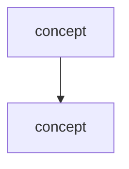

# Chapter N — <Chapter Title>

> **Book:** Grokking Machine Learning · pages X–Y
> **Date studied:** YYYY-MM-DD
> **Companion books used:** (e.g., Grokking Bayes pp. …)
> **Capstone component added:** <one line>

---

## 0. Learning objective

> In one sentence: by the end of this chapter I can ______, and I can apply it to ______.

---

## 1. Core concepts — in my own practical context

Plain-language summary of what this chapter actually teaches and *why an engineer cares*.
(Not a rewrite of the book — my working understanding.)

- Concept A — what it is, why it matters.
- Concept B — …

---

## 2. Simple explanation → deeper technical explanation

For each key concept:

### <Concept>
- **Intuition (simple):**
- **Technical / mathematical foundation:**
- **When & why it's used:**
- **How it shows up in real AI/DE systems:**

---

## 3. Important definitions

| Term | Definition (my words) |
|------|------------------------|
|  |  |

---

## 4. Key formulas / algorithms / workflows

```
(formula or pseudocode)
```
- What each symbol means:
- Worked numeric example:

---

## 5. Mental models & diagrams



---

## 6. Q&A / discussion notes

> Questions I asked, answers, and the "aha" moments.

- **Q:**
  **A:**

---

## 7. My misunderstandings → corrected

| What I thought | What's actually true | Why I was off |
|----------------|----------------------|----------------|
|  |  |  |

---

## 8. Flashcards (spaced review)

> Also copied to `curriculum/flashcards/chNN_cards.md`.

1. **Q:** … **A:** …
2. **Q:** … **A:** …

---

## 9. Review questions (with my answers)

- **Conceptual:**
- **Short-answer:**
- **Scenario-based:**

---

## 10. Interview corner

**Concept:** <name>

- **Simple explanation (to a hiring manager):**
- **Technical explanation (to a senior engineer):**
- **Real-world example:**
- **Common follow-up questions:**
  - Q: … → strong answer:
- **Answer structure to use:** (claim → mechanism → trade-off → example)
- **Mistakes to avoid:**

---

## 11. Coding exercises

### Exercise 1 — <title>
- **Goal:**
- **Requirements:**
- **My solution:** `src/chNN_*.py`
- **Review notes (correctness, better approach, performance, testing, production-readiness):**

---

## 12. Common mistakes & how to avoid them

- Mistake → fix.

---

## 13. Real-world AI / Data Engineering applications

- Where this concept appears in production systems.

### 13a. Mellions / PFM product application
- Which Mellions surface this touches (categorization, ingestion, insights, assistant, privacy, scale…):
- How I'd use it to build/improve/scale that surface:
- Design tension it creates (e.g., precision vs trust, personalization vs privacy):

---

## 14. Capstone progress this chapter

- **Component added:**
- **File(s):**
- **How it connects to the final architecture:**
- **Open questions / TODO:**

---

## 15. Chapter summary

> 3–5 sentences: the melody of this chapter.

---

## 16. Personal review checklist

- [ ] I can explain every concept in plain language.
- [ ] I can derive/use the key formula by hand.
- [ ] I implemented the coding exercise without copying.
- [ ] I can give the interview answer out loud in 60 seconds.
- [ ] I connected it to the capstone.
- [ ] Flashcards added to the deck.

---

## 17. Evaluation (filled by instructor)

| Area | Score /10 | Notes |
|------|-----------|-------|
| Conceptual understanding |  |  |
| Practical coding ability |  |  |
| Ability to explain |  |  |
| Interview readiness |  |  |
| Connect to real AI/DE systems |  |  |
| Capstone progress |  |  |
| Notebook quality |  |  |

**To improve before next chapter:**
