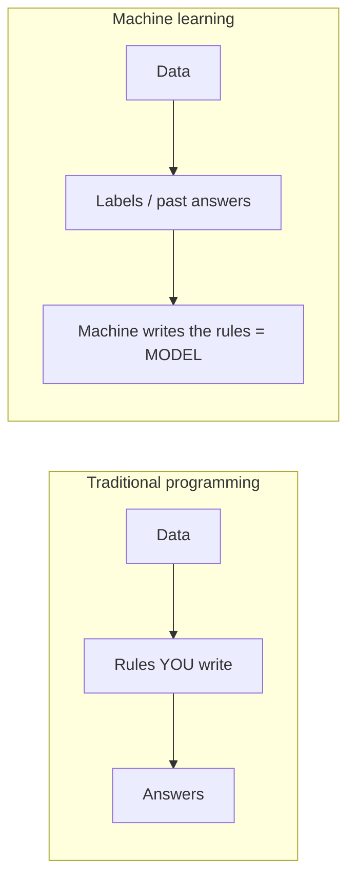

# Chapter 1 — What is Machine Learning? (It is common sense, done by a computer)

> **Book:** Grokking Machine Learning · pages 1–14
> **Date studied:** 2026-06-13
> **Companion books used:** none yet
> **Capstone component added:** Problem framing + transaction **data contract** + framework demo script

---

## 0. Learning objective

> By the end of this chapter I can explain what machine learning is, how it **inverts** traditional
> programming (data + answers → rules, instead of data + rules → answers), and map the
> remember–formulate–predict framework to the real industry lifecycle (train → model → inference).
> I can apply this framing to fraud detection and to Mellions transaction categorization.

---

## 1. Core concepts — in my own practical context

- **Machine learning = the computer derives the rules from data, instead of a human writing them.** You show it past examples *with answers*; it produces a reusable formula (a model).
- **Remember → Formulate → Predict** is the whole loop: gather labeled experience, find the pattern, apply it to new cases.
- The output of "learning" is a **model** — the deliverable, the thing you ship.
- The point of the whole exercise is **generalization**: doing well on data never seen before.

---

## 2. Simple → deeper

### ML vs traditional programming (the inversion)
- **Intuition:** Traditional programming = you write the rules, computer gives answers. ML = you give data + past answers, computer writes the rules.
- **Technical:** A model is a function f(features) → label, whose parameters are *fit* from a labeled dataset rather than hand-coded.
- **When/why:** Use ML when the rule space is too large, messy, or changing for humans to hand-write (e.g., categorizing 50,000+ merchants, detecting evolving fraud).
- **Real systems:** Spam filters, fraud scoring, transaction categorization, recommendations.

### Remember–Formulate–Predict = Train–Model–Infer
| Serrano | Industry | Happening |
|---|---|---|
| Remember | Training | Learn from labeled past data |
| Formulate | Model | The learned formula produced |
| Predict | Inference | Apply model to new, unseen data |

### Generalization (the real goal)
- **Intuition:** A student who memorizes the practice test but fails the real one didn't learn.
- **Technical:** Good performance on *unseen* data, not training data. Failure to generalize = **overfitting** (Ch 4).
- **Product:** Generalization failure = a new merchant gets mis-categorized → visible user trust hit.

---

## 3. Important definitions

| Term | Definition (my words) |
|------|------------------------|
| Machine learning | Computer learns the rules (a model) from labeled data instead of being given the rules. |
| Feature | An input clue (amount, merchant, location, time). |
| Label | The answer to learn/predict (fraud/not-fraud; or a category). |
| Model | The learned formula mapping features → label; the output of training. |
| Training | Showing the machine labeled past examples so it can learn. |
| Inference / prediction | Applying the trained model to new, unseen data. |
| Generalization | Performing well on data not seen during training. |
| Binary vs multi-class | Two possible labels (fraud) vs many (transaction categories). |

---

## 4. Key workflow

```
1. Collect labeled data        (features + correct answers)
2. Train                       (machine finds the pattern)
3. Get a MODEL                 (reusable formula)
4. Predict on new data         (inference)
5. Check generalization        (did it learn or memorize?)
```

---

## 5. Mental model



---

## 6. Q&A / discussion notes

- **Q:** How is ML different from normal programming?
  **A:** In normal programming the human writes the rules; in ML the machine derives the rules from data + labels.
- **Q (my Q4 mistake):** "deposit > 1M → fraud" — is that ML?
  **A:** No. That threshold is a *human-written rule* = traditional programming. ML would *learn* such a pattern from labeled history.
- **Insight:** Generalizing from one past event (Trump trade-war example) = intuitive preview of overfitting.

---

## 7. My misunderstandings → corrected

| What I thought | What's actually true | Why I was off |
|----------------|----------------------|----------------|
| Formulate = me stating a rule like "deposit > 1M" | Formulate = machine *learns* the rule from labeled data; output is a model | Confused human-written rules with machine-learned ones |
| "predict any feature (label)" | Features (inputs) ≠ labels (answers); model maps features → label | Mixed the two terms |
| Remember = "we see abnormal behavior" | Remember = store past transactions *with their true labels* | Missed that learning needs labels |

---

## 8. Flashcards

1. **Q:** How does ML invert traditional programming? **A:** Traditional: data+rules→answers. ML: data+answers→rules (a model).
2. **Q:** What are remember/formulate/predict in industry terms? **A:** Training / the model / inference.
3. **Q:** What does training output? **A:** A model (reusable formula features→label).
4. **Q:** Feature vs label? **A:** Feature = input clue; label = answer to predict.
5. **Q:** What is generalization and its failure mode? **A:** Doing well on unseen data; failure = overfitting (memorizing).
6. **Q:** Fraud vs categorization — what's the difference in label shape? **A:** Binary vs multi-class.

---

## 9. Review questions (with my answers)

- **Conceptual:** What is ML? → Computer learns rules (a model) from labeled data.
- **Scenario:** Is "if amount>1M flag fraud" ML? → No, hand-written rule.
- **Short-answer:** What's the goal of training? → A model that generalizes to unseen data.

---

## 10. Interview corner

**Concept:** What is machine learning?

- **To a hiring manager:** "Instead of me writing rules, I show the computer lots of past examples with the right answers, and it figures out the rules itself — then applies them to new cases."
- **To a senior engineer:** "We fit a model f(features)→label from a labeled training set, then run inference on unseen data; success is measured by generalization, not training fit."
- **Real-world example:** Transaction categorization — learn merchant→category from millions of labeled transactions instead of hand-coding merchant rules.
- **Follow-ups:**
  - "How do you know it learned vs memorized?" → train/test split, evaluate on held-out data (Ch 4, 7).
  - "When would you NOT use ML?" → when simple deterministic rules suffice and are stable.
- **Answer structure:** claim → mechanism → trade-off → example.
- **Mistakes to avoid:** calling a hand-written threshold "ML"; conflating features and labels; ignoring generalization.

---

## 13. Real-world AI / Data Engineering applications

- Spam detection, fraud scoring, recommendations, demand forecasting — all "learn rules from labeled history."
- DE angle: before any model, you need a **labeled dataset** → so data pipelines, schema, and label quality come *first*.

### 13a. Mellions / PFM product application
- **Surface:** Transaction categorization (and spending-anomaly insights).
- **Use:** Learn merchant/location/counterparty → category from past user-confirmed categorizations; generalize to unseen merchants.
- **Tension:** Label noise (Walmart = grocery? electronics?) caps accuracy; mis-categorization is a visible trust hit. Precision matters more than raw accuracy.

---

## 14. Capstone progress this chapter

- **Component added:** Problem framing + transaction **data contract** (`capstone/data_contract.md`) + framework demo (`code/ch01_framework.py`).
- **Connects to architecture:** Defines the schema flowing through ingestion → features → model. Everything downstream depends on this contract.
- **Open questions:** What exactly counts as a "fraud" label? (Chapter 2.)

---

## 15. Chapter summary

Machine learning is common sense done by a computer: instead of writing rules, we give the
machine labeled past data and it writes the rules itself, producing a **model**. The lifecycle —
remember/formulate/predict — is really train/model/infer, and the whole point is
**generalization** to unseen data. For Mellions, this is exactly why categorization is an ML
problem and not a giant if/else.

---

## 16. Personal review checklist

- [x] I can explain ML vs traditional programming.
- [x] I can map remember/formulate/predict → train/model/infer.
- [x] I can state what training outputs (a model) and the goal (generalization).
- [ ] I can give the 60-second interview answer out loud.
- [x] I connected it to Mellions + capstone.
- [x] Flashcards added.

---

## 17. Evaluation (instructor) — to finalize after Test 1 & 2

| Area | Score /10 | Notes |
|------|-----------|-------|
| Conceptual understanding | 8 | Strong; grasped the inversion + model-as-output after one correction. |
| Practical coding ability | TBD | Pending ch01 framework exercise. |
| Ability to explain | 7 | Clear ideas; tighten precision (feature vs label). |
| Interview readiness | 7 | Has the vocab now; needs to say it out loud. |
| Connect to real AI/DE systems | 8 | Plaid/categorization example was spot-on. |
| Capstone progress | TBD | Data contract this chapter. |
| Notebook quality | 8 | This file. |
