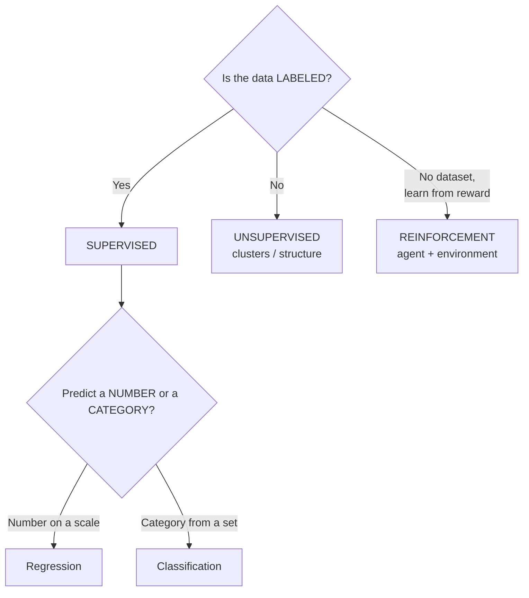

# Chapter 2 — Types of Machine Learning

> **Book:** Grokking Machine Learning · pp. 15–34
> **Date studied:** 2026-06-15
> **Capstone component added:** Fraud **label strategy** + class-imbalance named (`capstone/label_strategy.md`)

---

## 0. Learning objective

> Given any problem, I can name which *type* of ML it is — supervised (regression vs classification),
> unsupervised, or reinforcement — and explain why that choice drives everything downstream.

---

## 1. Core concepts (my practical understanding)

- **Labeled vs unlabeled data.** Labeled = features **plus** the answer (`is_fraud`). Unlabeled = features only. The label is the *expensive* part — a human/process must produce it.
- **Supervised learning** = learn from labeled data. Two sub-types:
  - **Regression** → predict a *number on a scale* (next-month spend, credit score).
  - **Classification** → predict a *category from a finite set* (fraud/not-fraud, subscription/not).
- **Unsupervised learning** = find structure in *unlabeled* data (clustering, dimensionality reduction, anomaly detection).
- **Reinforcement learning** = an **agent** acts in an **environment**, learns a **policy** by trial-and-error guided by **reward** (cumulative). No fixed labeled dataset.

---

## 2. Simple → deeper

### The "label is expensive" insight
- Labeled data needs a human/process to tag each example; unlabeled data is abundant.
- That asymmetry is *why* unsupervised + RL exist: a robot can't get a labeled dataset of "correct walking," so it learns from **reward** instead.

### Regression vs classification — the line is blurry
- Test: answer is a quantity on a scale → regression; one of fixed buckets → classification.
- **But** most classifiers predict a **continuous score first, then threshold it** into a category — exactly the Ch 1 fraud threshold. → bridge to **logistic regression (Ch 6)**: called "regression" (outputs a probability 0–1) but *used* for classification by thresholding.

### Reinforcement learning — vocabulary
- **Agent** (robot) · **Environment** (the courtyard) · **Policy** (state → action map it learns) · **Reward** (signal it maximizes, cumulative) · **Exploration** (trial-and-error).
- **Reward hacking (pitfall):** reward a *proxy* ("lift a leg while standing") and the agent farms points without the real goal. Reward the **true goal** ("forward distance without falling").

---

## 3. Definitions

| Term | My words |
|------|----------|
| Labeled data | features + the correct answer |
| Unlabeled data | features only (no answer) |
| Supervised | learn a feature→label map from labeled data |
| Regression | supervised; output is a continuous number |
| Classification | supervised; output is a category (binary or multi-class) |
| Unsupervised | find structure in unlabeled data (clusters, patterns) |
| Reinforcement | agent learns a policy from reward via trial-and-error |
| Policy | the learned mapping from state to action |
| Reward (RL) | the signal the agent maximizes over time |

---

## 5. Mental model

---

## 6. Q&A / discussion notes
- **Reward design (my example):** +1 upright, −1 fall, start 50 → correct *shape*; refined to maximize **cumulative** reward and beware **reward hacking**.
- **EVA (floating robot):** removes bipedal balance; RL problem becomes hover/navigation control. Good scoping.
- **Privacy:** unlabeled TD transactions still contain heavy **PII** — the *features* are the private data, not the label.

---

## 7. My misunderstandings → corrected
| What I thought | What's true | Why |
|---|---|---|
| "No labels" ⇒ privacy-safe | The features themselves are PII; labels were never the privacy issue | Privacy is about *whose data / whose benefit / protection*, not labels |
| Reward "lift a leg" trains walking | Reward a proxy → reward hacking; reward the true goal (forward distance, no fall) | Agents optimize exactly what you measure |

---

## 8. Flashcards
1. **Q:** Three types of ML? **A:** Supervised, unsupervised, reinforcement.
2. **Q:** Regression vs classification? **A:** Number on a scale vs category from a finite set.
3. **Q:** What makes a classifier's score "regression-like"? **A:** It predicts a continuous score, then thresholds it (→ logistic regression, Ch 6).
4. **Q:** RL pieces? **A:** Agent, environment, policy, reward (cumulative), exploration.
5. **Q:** Why can't a robot learn to walk from labeled data? **A:** No one can label every correct joint angle; it learns from reward instead.
6. **Q:** Does "unlabeled" mean "private/safe"? **A:** No — features carry PII regardless of labels.
7. **Q:** What is reward hacking? **A:** Optimizing a proxy reward instead of the true goal.

---

## 10. Interview corner (brief)
- **Q: How do you decide if a problem is regression or classification?** → Is the target a continuous quantity (regression) or a discrete category (classification)? Note many classifiers output a continuous score thresholded into a class.
- **Q: When would you use unsupervised over supervised?** → When labels are unavailable/expensive and you want to discover structure (segments, anomalies).
- **Q: What's RL good for that supervised isn't?** → Sequential decision-making where the "right action" isn't labeled but success is measurable via reward (control, games, robotics).

---

## 12. Common mistakes
- Calling a thresholded probability "not classification" (it is — Ch 6).
- Assuming unlabeled = anonymous/safe.
- Rewarding a proxy instead of the true goal (reward hacking).

---

## 13. Real-world applications

### 13a. Mellions
- **Supervised classification:** transaction categorization (our live use case).
- **Supervised regression:** predict next-month spend / income.
- **Unsupervised (privacy-respecting):** per-user spending clusters ("your 3 spending modes"), personal anomaly detection ("unusual *for you*"). Cross-user insights only via aggregation / differential privacy / federated learning.

### 13b. Physical AI bridge — your companion robot's 3 subsystems
- **Perception** (recognize grandma, detect a fall) → **supervised classification**.
- **Understanding** (learn her routine, notice an "off" day) → **unsupervised**.
- **Action** (hover/walk beside her, play) → **reinforcement learning** (mind reward hacking!).

---

## 14. Capstone progress
- **Added:** `capstone/label_strategy.md` — defines the fraud label, its sources, timing (known at training, unknown at inference), and names the **class-imbalance** problem (fraud ≈ 0.1–2%).
- **Why it matters:** this is the supervised-classification framing of the whole capstone.

---

## 15. Summary
ML splits by the *kind of decision* and the *kind of data*: supervised (labeled → regression for numbers, classification for categories), unsupervised (unlabeled → structure), reinforcement (reward-driven trial-and-error). Labels are expensive, which is why unsupervised and RL matter. For the capstone, fraud detection is **supervised binary classification** on a severely **imbalanced** label — the seed of Chapter 7.

---

## 16. Review checklist
- [x] Can name the type of any given problem.
- [x] Regression vs classification + the threshold blur.
- [x] RL vocabulary (agent/env/policy/reward) + reward hacking.
- [x] Unlabeled ≠ private-safe.
- [x] Mapped the 3 types onto the companion robot.
- [ ] Test 2 (imbalance) done.
