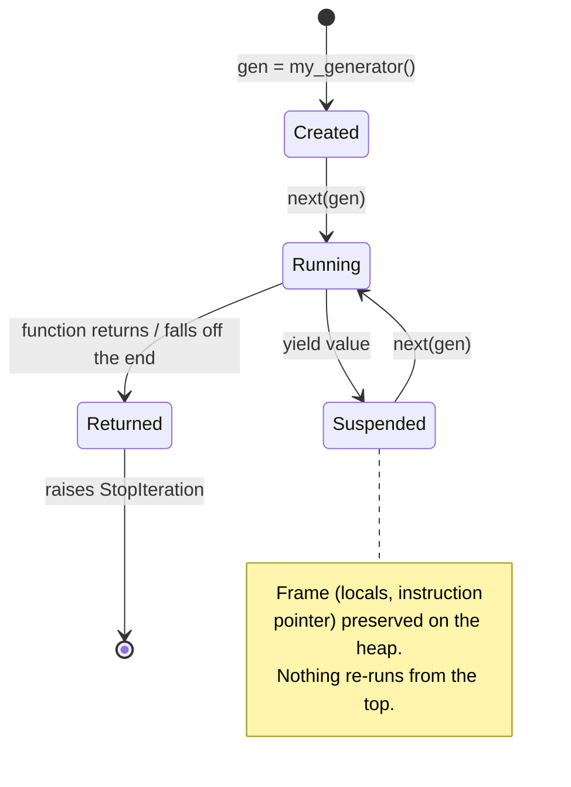

# Day 01 — Python Execution Model for Data Engineering

**Sources:** official Python docs, verified 2026-09 — [glossary](https://docs.python.org/3/glossary.html) (iterator/generator/context-manager terms), [`io`](https://docs.python.org/3/library/io.html) module docs, [`contextlib`](https://docs.python.org/3/library/contextlib.html), [`dataclasses`](https://docs.python.org/3/library/dataclasses.html), [`typing`](https://docs.python.org/3/library/typing.html), [errors/exceptions tutorial](https://docs.python.org/3/tutorial/errors.html). No book is assigned for this day (per `ray-learning/references/reading-map.md`) — these are stable, long-established language features, not fast-moving API surface. **Interpreter note:** this machine's bare `python3` is 3.14.6; `ray-learning`'s pinned project interpreter is 3.12 (`pyproject.toml`: `>=3.12,<3.14`). Every claim below is 3.12-accurate; anywhere current docs describe 3.13/3.14-only behavior, it's called out explicitly rather than blurred in.

**Cross-links:** parallelism/serialization → [Day 02](day02_python_parallelism_serialization.md). Ray's task/actor serialization builds directly on the picklability concepts here → [Day 09](day09_ray_core_tasks_actors.md). Ray Data's streaming execution model is this same discipline at cluster scale → [Day 13](day13_ray_data_spark_vs_ray.md). Spark's lazy `DataFrame` evaluation is the same discipline again, at SQL-engine scale → Day 03.

---

## 1. Definitions and terminology

| Term | Definition |
|---|---|
| **Iterable** | Any object with an `__iter__` method — something you can call `iter()` on to get an iterator. A `list` is iterable but is *not itself* an iterator. |
| **Iterator** | An object with both `__iter__` (returning itself) and `__next__` (returning the next value or raising `StopIteration`). Iterators are **stateful and single-use** — once exhausted, they stay exhausted. |
| **Generator function** | A function containing `yield`. Calling it does not run the body — it returns a **generator object** (an iterator) immediately, with the body paused before its first line. |
| **Generator expression** | `(x*x for x in range(n))` — a generator built inline, same suspend/resume semantics as a generator function, no intermediate list ever built. |
| **`StopIteration`** | The signal an iterator raises internally when exhausted. A `for` loop catches this for you; manual `next()` calls do not. |
| **Context manager** | An object implementing `__enter__`/`__exit__`, used with `with`. Guarantees `__exit__` runs — cleanup happens even if the block raises. |
| **View** (e.g. `dict.keys()`, `dict.items()`, `memoryview`) | A live window onto the *same* underlying data — later mutations to the source are visible through the view. Not a copy. |
| **Shallow copy** (`list(x)`, `x.copy()`, `copy.copy`) | A new outer container, but nested mutable objects inside it are still shared with the original. |
| **Deep copy** (`copy.deepcopy`) | A new outer container *and* recursively new copies of everything nested inside it. Slower, fully independent. |
| **`@dataclass`** | A class decorator that auto-generates `__init__`, `__repr__`, `__eq__` from type-annotated fields. A typed, boilerplate-free record type. |
| **Type hint** (`typing`) | Static annotation (`x: int`, `def f(x: int) -> str`). **Not enforced at runtime** by the interpreter itself — it's a contract for humans and external tools (mypy, pyright), not a guard. |
| **Exception chaining** (`raise NewErr(...) from original`) | Preserves the original traceback as `__cause__` on the new exception, instead of silently replacing it. |

---

## 2. Architecture and internal behavior

**A generator's frame lives on the heap, not the call stack.** A normal function call pushes a stack frame and discards it on return. A generator function, on first call, allocates a frame object that *persists between calls* — each `next()` resumes CPython's bytecode interpreter loop exactly where the last `yield` left off, with every local variable still intact. This is why a generator "remembers where it was" and a plain function doesn't.



**File objects are lazy, buffered iterators over an OS file descriptor.** `open(path)` does not read the file. Iterating the returned object (`for line in f:`) pulls one buffered chunk at a time from the OS, decodes it, and yields lines one by one — memory use stays bounded regardless of file size, *as long as you don't materialize it yourself* (§7).

**Context managers are `try`/`finally` with a name.** `with open(path) as f: ...` is mechanically: acquire (`__enter__`), run the block, and *unconditionally* run `__exit__` — including when the block raises. This is what makes `with` the correct default for any resource (file handle, lock, connection) instead of manual `try/finally` you might forget to write correctly.

---

## 3. How the concepts relate to each other

- **Generators + file I/O + bounded memory are one idea, not three.** A generator pipeline over a lazily-iterated file is how you process a file larger than RAM: nothing forces the whole file into memory at once, because nothing *asks* for it all at once (§6).
- **Dataclasses + typing give the generator's output a shape.** A generator that yields `dict`s is untyped and typo-prone; a generator that yields `@dataclass` instances gives you a named, typed record per row — the "typed" half of this day's "typed line-oriented transaction normalizer" implementation target.
- **Exceptions are the third leg.** A streaming pipeline over real-world data *will* meet malformed rows. Deterministic error handling (specific exception types, not a bare `except:`) is what lets code decide "skip and log this one row" versus "stop, the format itself is broken" — a real production distinction, not pedantry.
- **This same discipline reappears at every larger scale you'll study.** Ray Data's streaming execution engine ([Day 13](day13_ray_data_spark_vs_ray.md) §2) overlaps read→transform→write stages instead of materializing each fully — literally the cluster-scale version of "don't call `list()` on the whole thing." Spark's lazy `DataFrame` evaluation (Day 03) is the same idea again, planned rather than executed eagerly.
- **Generators do NOT cross a process boundary.** A generator object cannot be pickled — this is the direct link forward to [Day 02](day02_python_parallelism_serialization.md) and [Day 09](day09_ray_core_tasks_actors.md): if a downstream stage is a process pool or a Ray task, you must materialize a generator's *output* into plain picklable values (a list, a dataclass, a dict) before crossing that boundary. Streaming and distribution solve different problems and the boundary between them is exactly this picklability line.

---

## 4. What needs to be understood deeply

**A generator is exhausted exactly once.** Unlike a list, you cannot re-iterate it. `for x in gen: ...` followed by a second `for x in gen: ...` silently does nothing the second time — no error, just zero iterations. This is a common, quiet bug source, not a corner case.

**Views are live, not snapshots.** `d.items()` reflects the dict `d` *as it is when you read from the view*, not as it was when you called `.items()`. Mutating `d` while iterating `d.items()` (or `d.keys()`, `d.values()`) raises `RuntimeError: dictionary changed size during iteration` — the view is telling you the truth about what you asked for.

**Type hints are documentation and tooling input, not a runtime contract.** `def parse(row: str) -> Transaction:` does not stop you from passing an `int` at runtime — nothing checks. Runtime validation at a trust boundary (parsing external file rows, for instance) needs an explicit check or a validation library; typing alone gives you static-analysis and IDE value, not safety.

**Bare `except Exception:` (or worse, bare `except:`) is a debugging liability, not a safety net.** It catches bugs you didn't anticipate right alongside the malformed-row case you meant to handle, and by default discards the distinction between them. Catch the *specific* exception type you expect from a specific failure mode; let unexpected exceptions propagate with their real traceback.

---

## 5. Concepts that are easy to confuse

| A | B | The distinction |
|---|---|---|
| **Iterable** | **Iterator** | Every iterator is iterable (its `__iter__` returns itself), but not every iterable is an iterator. `iter(some_list)` gives you a *fresh* iterator each call; calling `iter()` on a generator gives you the *same* object back — it's already an iterator. |
| **Shallow copy** | **Deep copy** | `copy.copy(nested)` shares inner mutable objects with the original — mutate a nested list through the copy and the original changes too. `copy.deepcopy(nested)` doesn't share anything. Slicing a flat list (`lst[:]`) is a shallow copy of that one level. |
| **View** | **Copy** | `d.items()` is live — reflects later changes to `d`. `list(d.items())` is a copy — a frozen snapshot, safe to mutate `d` while iterating it. |
| **`@dataclass`** | **`NamedTuple`** | **`TypedDict`** | `@dataclass` — mutable by default, real class, methods allowed. `NamedTuple` — immutable, tuple-like, cheap. `TypedDict` — not a real class at runtime at all, just a typing-time shape for a plain `dict`; zero runtime behavior, zero runtime cost. |
| **`raise NewErr(...)`** | **`raise NewErr(...) from original`** | The first discards the original traceback context (though Python still shows it as "During handling of the above exception" unless you `raise ... from None`). The second explicitly links them as `__cause__` — the honest way to say "this failure is *because of* that one." |

---

## 6. Practical engineering patterns

**Pattern: streaming line-oriented parsing (this day's core implementation target).**

```python
from dataclasses import dataclass
from typing import Iterator


@dataclass
class Transaction:
    txn_id: str
    amount: float
    is_fraud: bool


class MalformedRow(Exception):
    pass


def parse_line(line: str) -> Transaction:
    fields = line.rstrip("\n").split(",")
    if len(fields) != 3:
        raise MalformedRow(f"expected 3 fields, got {len(fields)}: {line!r}")
    txn_id, amount, is_fraud = fields
    try:
        return Transaction(txn_id, float(amount), is_fraud == "1")
    except ValueError as e:
        raise MalformedRow(f"bad numeric field in {line!r}") from e


def stream_transactions(path: str) -> Iterator[Transaction]:
    with open(path) as f:
        for line in f:
            yield parse_line(line)
```

Nothing here loads the file. `stream_transactions` returns a generator that pulls one line at a time, for as long as something downstream keeps calling `next()` on it. Memory use is bounded by one row, not by file size.

**Pattern: generator pipeline (multi-stage, still bounded memory).**

```python
def valid_only(rows: Iterator[Transaction]) -> Iterator[Transaction]:
    for r in rows:
        try:
            yield r
        except MalformedRow:
            continue

def only_fraud(rows: Iterator[Transaction]) -> Iterator[Transaction]:
    return (r for r in rows if r.is_fraud)

pipeline = only_fraud(stream_transactions("transactions.csv"))
for txn in pipeline:
    handle(txn)
```

Each stage processes one record at a time and hands it forward — nothing materializes between stages. This *is* Ray Data's streaming execution model (Day 13), just single-process and unparallelized.

**Pattern: deterministic error handling that distinguishes "skip this row" from "the format is broken."**

```python
skipped = 0
for line in f:
    try:
        txn = parse_line(line)
    except MalformedRow as e:
        skipped += 1
        log.warning("skipping malformed row: %s", e)
        continue
    process(txn)
if skipped > len(all_lines) * 0.05:
    raise RuntimeError(f"{skipped} malformed rows — investigate schema drift, not row-level noise")
```

A *threshold*, not silent infinite tolerance — a handful of bad rows is noise; a sudden spike is schema drift, a different failure class entirely.

---

## 7. Common mistakes and misconceptions

1. **Materializing the whole input to "make it easier to work with."** `lines = list(open(path))` before processing defeats the entire point of streaming — peak memory becomes O(file size) instead of O(1). This is precisely what this day's experiment (list materialization vs. generator pipeline) is designed to make you *measure*, not just believe.
2. **Assuming a generator can be iterated twice.** Passing the same generator object to two separate `for` loops (or to `list()` twice) — the second one silently yields nothing. If you need to iterate twice, materialize once (`rows = list(gen)`) and accept the memory cost, or rebuild the generator from its source.
3. **Mutating a dict while iterating a view of it.** `for k in d: if cond: del d[k]` raises `RuntimeError`. Fix: iterate `list(d.keys())` (a copy) if you need to mutate during the loop.
4. **Bare `except:` or `except Exception:` around a whole parsing loop.** Silently swallows real bugs (a typo in your own code) alongside the malformed-row case you meant to catch. Catch the specific exception type your own code raises for the case you're actually handling.
5. **Forgetting a generator can't be pickled.** `ProcessPoolExecutor.submit(f, my_generator)` or handing a generator into a Ray task fails — generators (and open file handles) are not picklable. Materialize into a list/dataclass/dict first if the value needs to cross a process boundary (Day 02, Day 09).

---

## 8. Production considerations (DE/ML platform context)

- **Bounded-memory ingestion is a hard requirement, not a nicety, the moment files exceed available RAM** — routine in real pipelines (a day's transaction log, a full table export). The streaming pattern in §6 is the actual production shape, not a simplified teaching example.
- **Deterministic error handling is what makes a pipeline operable.** "3 malformed rows out of 500k, logged and skipped" and "the upstream schema changed, stop the job" need to be *distinguishable* outcomes with different on-call urgency — a bare `except: continue` collapses that distinction and hides real incidents as background noise.
- **Type hints + a type checker in CI catch a real class of pipeline bugs before they touch production data** — passing the wrong shape between pipeline stages, a renamed field nobody updated downstream — cheaply, at review time, in exchange for near-zero runtime cost (annotations don't execute).
- **This day's discipline is the floor everything else stands on.** Spark's lazy `DataFrame`s (Day 03) and Ray Data's streaming blocks (Day 13) are the same "don't materialize what you don't have to" idea, engineered for a cluster instead of one process. If this doesn't feel natural yet, it will resurface immediately and it's worth getting solid here first.

---

## 9. Debugging and performance reasoning

**Measuring peak memory** — `tracemalloc` (stdlib, no dependency):

```python
import tracemalloc

tracemalloc.start()
# ... run the streaming version, or the list-materializing version ...
current, peak = tracemalloc.get_traced_memory()
print(f"peak: {peak / 1024 / 1024:.2f} MB")
tracemalloc.stop()
```

This is the actual tool for this day's verification requirement ("peak memory is measured") — not a guess, not a `sys.getsizeof()` estimate on one object, the real traced peak across the whole run.

**Measuring where time goes** — `cProfile`:

```bash
python -m cProfile -s cumulative your_script.py
```

Shows cumulative time per function call — separates "this is slow because of I/O wait" from "this is slow because of actual computation," which matters before you reach for any concurrency tool in Day 02.

**Symptom → likely cause:**

| Symptom | Likely cause |
|---|---|
| Memory grows linearly with input size despite "using a generator" | A `list(...)` or `.read()` call somewhere still materializes the full input — grep for it |
| Second loop over the same object yields nothing, no error | The generator was already exhausted by the first loop |
| `RuntimeError: dictionary changed size during iteration` | Mutating a dict while iterating a view of it — iterate `list(d.keys())` instead |
| `TypeError: cannot pickle 'generator' object` | Passing a generator across a process/Ray boundary — materialize its output first |

---

## 10. Examples and exercises

### Worked example — measuring the memory gap directly

```python
import tracemalloc

def peak_of(fn):
    tracemalloc.start()
    fn()
    _, peak = tracemalloc.get_traced_memory()
    tracemalloc.stop()
    return peak

def materialize():
    return len(list(open("big_file.csv")))

def stream():
    return sum(1 for _ in open("big_file.csv"))

print("materialized:", peak_of(materialize) / 1024, "KB")
print("streamed:    ", peak_of(stream) / 1024, "KB")
```

On a large file, `materialize()`'s peak scales with file size; `stream()`'s peak stays roughly flat (bounded by one line + the generator's own small frame) regardless of how large the file gets. This is the actual mechanism behind this day's assigned experiment — run it on the real dataset, don't take the claim on faith.

### Exercises (unsolved — this day's primary assignment, plus reinforcement)

**Primary assignment** (per `ray-learning/syllabus/20-day-intensive.md`, Day 01 — do this first): build the typed, line-oriented transaction normalizer over `ray-learning/datasets/generated`, streaming rather than loading the full file; handle malformed rows and schema drift with deterministic error handling; keep output memory-bounded; measure peak memory with `tracemalloc` and be ready to explain *why* the streaming version behaves differently than a materializing one.

**Additional reinforcement (do after the primary assignment):**

1. Build a 3-stage generator pipeline (parse → validate → filter) over the same dataset. Prove with `tracemalloc` that peak memory does not grow as you increase how much of the file you process — vary the row count and show the peak stays flat.
2. Deliberately write code that iterates the same generator object twice. Run it, observe the silent empty second pass, then explain in writing exactly why no exception was raised.
3. Take your normalizer's output rows (as `Transaction` dataclass instances) and confirm they pickle successfully (`pickle.dumps(txn)`) while a generator object does not (`pickle.dumps(stream_transactions(...))` should raise `TypeError`). This is the exact boundary Day 02 and Day 09 build on next.
