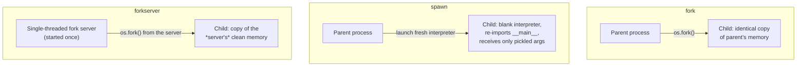

# Day 02 — Python Parallelism, Serialization, Profiling

**Sources:** official Python docs, verified 2026-09 — [GIL glossary entry](https://docs.python.org/3/glossary.html#term-global-interpreter-lock), [What's New in 3.13 — free-threaded CPython](https://docs.python.org/3/whatsnew/3.13.html), [`multiprocessing` start methods](https://docs.python.org/3/library/multiprocessing.html#contexts-and-start-methods), [`pickle`](https://docs.python.org/3/library/pickle.html), [`concurrent.futures`](https://docs.python.org/3/library/concurrent.futures.html). No book assigned (per `reading-map.md`) — official docs are the authority here, and this area moves faster than it looks (see §4's version-specific defaults). **Interpreter note:** same caveat as Day 01 — claims are 3.12-accurate (`ray-learning`'s pinned version) unless explicitly marked 3.13/3.14-only. All code in this file was actually run on this machine's `ray-learning` environment (Python 3.12.12) to get real numbers, not estimated ones.

**Cross-links:** builds directly on [Day 01](day01_python_execution_model.md)'s picklability boundary. Ray's tasks/actors ([Day 09](day09_ray_core_tasks_actors.md)) are this exact process model, with Ray's scheduler managing lifecycle instead of you calling `multiprocessing` yourself — the `uv run`/venv-rebuild mistake documented in Day 09 §7.6 is a *process-launch* cost, the same category of problem this file studies at the single-machine level.

---

## 1. Definitions and terminology

| Term | Definition |
|---|---|
| **GIL (Global Interpreter Lock)** | CPython's mechanism ensuring only one thread executes Python bytecode at a time, per process. Quoting the glossary directly: "Locking the entire interpreter makes it easier for the interpreter to be multi-threaded, at the expense of much of the parallelism afforded by multi-processor machines." |
| **CPU-bound** | Work whose wall-clock time is dominated by computation (a tight numeric loop). The GIL directly limits how much of this you can parallelize with threads. |
| **I/O-bound** | Work whose wall-clock time is dominated by waiting (network, disk, a slow API). The GIL is released during I/O — this is exactly why threads *do* help here despite the GIL. |
| **Thread** | A unit of execution *within* one process, sharing that process's memory. Cheap to start; still subject to the one GIL of its process. |
| **Process** | A fully separate OS-level program with its own memory space and its own GIL. Expensive to start; achieves real parallelism because each process's GIL is independent. |
| **Start method** (`fork` / `spawn` / `forkserver`) | *How* `multiprocessing` creates a new worker process. Platform default differs and has changed across Python versions — see §4, this is not trivia. |
| **Pickling** | Python's built-in object serialization (`pickle` module) — how a value crosses a process boundary (or gets written to disk) as bytes, then reconstructed (`unpickle`) on the other side. |
| **`cloudpickle`** | A third-party, more-capable pickler (not stdlib) that *can* serialize lambdas, closures, and interactively-defined functions — things stdlib `pickle` cannot. Ray uses this internally, which is why Ray can ship code raw `multiprocessing` often can't. |
| **Vectorization** | Expressing a computation as whole-array operations (NumPy/pandas) so the actual loop runs in C, releasing the GIL for the duration — parallelism without threads or processes at all. |
| **`ThreadPoolExecutor` / `ProcessPoolExecutor`** | `concurrent.futures`'s two executor classes — the modern, preferred interface over lower-level `threading`/`multiprocessing` for most fan-out work. |
| **`InterpreterPoolExecutor`** (new, 3.14) | A third executor: runs callables in separate *sub-interpreters* within one process, each with its own GIL (PEP 734-adjacent). Lighter than a full OS process; still requires serializable-ish data crossing between interpreters. New enough to flag as emerging, not yet the default choice. |

---

## 2. Architecture and internal behavior

**The GIL is per-process, not per-machine.** One Python process = one GIL = one thread running bytecode at any instant, no matter how many threads you start. This is *the* fact that decides everything else in this file: threads inside one process cannot get more CPU-bound throughput than one core provides, because they're all serialized through the same lock.

**The GIL is released around I/O and around some C-extension compute.** Quoting the docs: "the GIL is always released when doing I/O," and "some extension modules... are designed so as to release the GIL when doing computationally intensive tasks." NumPy is exactly such an extension — a vectorized NumPy operation runs its inner loop in C with the GIL released, which is *why* vectorization can outperform both a GIL-bound Python thread loop and even a process pool, without any explicit parallelism at all.

**`fork`, `spawn`, and `forkserver` create a worker process by fundamentally different mechanisms:**



- **`fork`** (POSIX only): `os.fork()` duplicates the parent's entire memory image. Fast. Documented as unsafe if the parent has already started threads — a forked child can inherit a *half-acquired* lock from a thread that existed in the parent but not in the child, causing hangs or crashes.
- **`spawn`** (POSIX + Windows): starts a genuinely fresh interpreter process, which then **re-imports `__main__`** and receives only what you explicitly pickle to it. Slower to start. Immune to the fork-after-threads hazard, at the cost of requiring everything crossing the boundary to be picklable *and importable by name* (§7 — this is not a minor footnote, it causes a real, reproducible failure below).
- **`forkserver`** (POSIX): a dedicated, single-threaded server process is started once; every subsequent worker is forked *from that clean single-threaded server*, not from your (possibly multithreaded) main process — keeping fork's speed while sidestepping fork's thread-safety hazard.

---

## 3. How the concepts relate to each other

- **The GIL explains threads-vs-processes; `fork`/`spawn`/`forkserver` explain *how* a process actually gets created; pickling explains what can cross that boundary.** These aren't three separate topics — they're one causal chain: you need a new process (because the GIL blocks threads from parallelizing CPU work) → that process has to be created somehow (fork/spawn/forkserver) → whatever crosses into it has to survive serialization (pickle) → [Day 01](day01_python_execution_model.md)'s generators and open file handles fail exactly at this last step.
- **Vectorization is the alternative path that skips all three.** No new process, no pickling, no GIL contention — because the hot loop never runs Python bytecode in the first place.
- **This is precisely the process model Ray builds on ([Day 09](day09_ray_core_tasks_actors.md)).** A Ray task *is* a worker process; `ray.put`/task arguments *are* pickled (via `cloudpickle`, which is why Ray tolerates closures that stdlib `pickle` rejects); Ray's scheduler is doing, at cluster scale and with fault tolerance, what `ProcessPoolExecutor` does on one machine. Day 09 §7.6's `uv run`-per-worker-rebuild mistake is a process-*launch*-cost problem — the same category studied here, just multiplied by a slow launch mechanism instead of a slow serialization.

---

## 4. What needs to be understood deeply

**Diagnose CPU-bound vs. I/O-bound *before* picking a tool — this single judgment call determines everything else.** Threads help I/O-bound work because the GIL releases during the wait. Threads do essentially nothing for CPU-bound work — confirmed empirically below (§6), not just asserted.

**Platform defaults for the start method have changed recently, and getting this wrong changes actual behavior, not just performance:**

| Platform | Default start method | Changed in |
|---|---|---|
| macOS | `spawn` | 3.8 (was `fork`; docs: "The `fork` start method should be considered unsafe as it can lead to crashes... as macOS system libraries may start threads.") |
| Linux / other POSIX | `forkserver` | **3.14** (was `fork` before this) |
| Windows | `spawn` | always (no `fork` on Windows) |

On `ray-learning`'s pinned 3.12, POSIX default is still `fork` (the 3.14 change to `forkserver` hasn't landed at 3.12) — but macOS has been `spawn`-by-default since 3.8, so **this machine is already on `spawn`** regardless of the 3.12/3.14 distinction. That single fact is why the mistake in §7 below happened on the very first attempt to write this file.

**GIL removal is real, official, and not what's running by default, even on this machine's 3.14 system Python.** As of 3.13+, CPython has *experimental* support for a free-threaded build (PEP 703) — but it requires a separate binary (`python3.13t`/`python3.14t`), is explicitly documented as experimental with "a substantial single-threaded performance hit," and is opt-in (`PYTHON_GIL=0` on that special build). Nothing here changes by default; treat the GIL as real and load-bearing for any Python you write today, while knowing the frontier exists.

**Pickling untrusted data is a security boundary, not just a serialization detail.** Direct from the docs: "The `pickle` module is not secure. Only unpickle data you trust... it is possible to construct malicious pickle data which will execute arbitrary code during unpickling." This matters the moment a pipeline pickles/unpickles anything crossing a trust boundary (a queue fed by external input, not just your own process pool).

---

## 5. Concepts that are easy to confuse

| A | B | The distinction |
|---|---|---|
| **Concurrency** | **Parallelism** | Concurrency = multiple things *make progress* over the same period (can be one core, time-sliced). Parallelism = multiple things run *at the literal same instant* (needs multiple cores). Threads under the GIL give you concurrency for I/O-bound work, not parallelism for CPU-bound work. |
| **`pickle`** | **`cloudpickle`** | stdlib `pickle` can only serialize functions/classes reachable by name from a module's top level — not lambdas, not closures, not anything defined in a REPL/`-c` string. `cloudpickle` (used internally by Ray) serializes the actual code object, so closures and lambdas work. Don't assume raw `multiprocessing` can do what a Ray example does. |
| **`fork`** | **`spawn`** | **`forkserver`** | `fork` copies everything (fast, thread-unsafe). `spawn` starts clean and re-imports `__main__` (slow, safe, requires top-level-importable + picklable objects). `forkserver` forks from a clean dedicated server (fast-ish, safe). |
| **`ProcessPoolExecutor`** | **`multiprocessing.Pool`** | Both exist; `concurrent.futures.ProcessPoolExecutor` is the newer, simpler, `Future`-based interface and is the one to reach for in new code. `multiprocessing.Pool` is the older, still-supported, slightly lower-level API. |
| **Vectorization** | **Multiprocessing** | Both can speed up CPU-bound numeric work, but vectorization has no process-startup or pickling cost at all — it's not "parallelism," it's "the loop never ran in Python." Check whether a vectorized form exists before reaching for processes. |

---

## 6. Practical engineering patterns — with real, measured numbers

**Diagnosing before choosing (the §4 judgment call, made concrete):** profile first (§9), then pick from this shape —

| Workload shape | Reach for |
|---|---|
| I/O-bound (network calls, disk waits) | `ThreadPoolExecutor` |
| CPU-bound, vectorizable (numeric, array-shaped) | NumPy/pandas vectorized ops — no concurrency tool needed |
| CPU-bound, not vectorizable (arbitrary Python logic) | `ProcessPoolExecutor` |
| CPU-bound, needs to scale beyond one machine | Ray (Day 09) or Spark (Day 03) |

**The actual measurement, run on this machine** (8 workers, a pure-Python `sum of squares` loop — deliberately not vectorizable, to isolate the GIL effect):

```python
def cpu_bound(n):
    x = 0
    for i in range(n):
        x += i * i
    return x
```

| Strategy | Wall time | vs. sequential |
|---|---|---|
| Sequential (no concurrency) | 1.670s | 1.00x |
| `ThreadPoolExecutor(max_workers=8)` | 1.814s | **1.09x — slower** |
| `ProcessPoolExecutor(max_workers=8)` | 0.367s | **0.22x — ~4.5x faster** |

This is not a hypothetical: threads made CPU-bound work *slightly slower* (GIL contention overhead, no parallel gain), processes gave real ~4.5x speedup on 8 workers. Diagnose the workload shape first; the wrong tool doesn't just fail to help, it can actively cost you.

**Pattern: I/O-bound fan-out.**

```python
from concurrent.futures import ThreadPoolExecutor, as_completed

with ThreadPoolExecutor(max_workers=20) as ex:
    futures = {ex.submit(fetch_url, url): url for url in urls}
    for fut in as_completed(futures):
        result = fut.result()
```

Twenty threads for twenty slow network calls is exactly the right shape — each thread spends nearly all its time with the GIL released, waiting on I/O.

**Pattern: `max_workers` default changed in 3.13** — `min(32, (os.process_cpu_count() or 1) + 4)`. If you don't pass `max_workers` explicitly, you're getting a CPU-count-derived default, not "unlimited" or a fixed number — worth knowing when a run behaves differently on a different machine.

---

## 7. Common mistakes and misconceptions — including one that actually happened writing this file

1. **Assuming `ThreadPoolExecutor` speeds up CPU-bound work.** It does not — measured above: 1.09x, i.e. *slower*. This is the single most common first-timer mistake in this area, and it needs to be measured once to stop being tempting.

2. **This day's syllabus exercise, reproduced live and unintentionally while researching this file** — a real, verbatim failure, not a hypothetical:

   ```
   AttributeError: Can't get attribute 'cpu_bound' on <module '__main__' (<class '_frozen_importlib.BuiltinImporter'>)>
   ...
   concurrent.futures.process.BrokenProcessPool: A process in the process pool was
   terminated abruptly while the future was running or pending.
   ```

   **What happened:** the benchmark was first run via `python3 -c "...def cpu_bound(n): ..."`. On this Mac, the default start method is `spawn` (§4) — every worker process re-imports `__main__` fresh rather than inheriting the parent's memory. But a `-c` string isn't a real, importable module: there is no `__main__.py` a child process can re-import to find `cpu_bound`. Every worker crashed on startup, and the pool reported it as `BrokenProcessPool`. **The fix:** put the function in an actual `.py` file with a proper `if __name__ == "__main__":` guard and run *that* — then `__main__` re-import actually finds `cpu_bound`, and the same code produces the real numbers in §6. This is exactly the mechanism the next bullet describes — seeing it fail first is the point.

3. **Missing the `if __name__ == "__main__":` guard on `spawn`.** Without it, re-importing `__main__` in the child re-*executes* every top-level statement in your script — including the code that starts the pool — recursively spawning processes. This is why the guard exists and why it matters far more on `spawn`/`forkserver` platforms (macOS, Windows, and 3.14+ Linux) than it used to on old fork-default Linux.

4. **Two futures waiting on each other inside a fixed-size `ThreadPoolExecutor` — a documented deadlock, not a hypothetical one.** Straight from the docs: submitting a callable that itself calls `.result()` on another future from the *same* limited-size pool can deadlock if there aren't enough free workers to ever complete the one being waited on.

5. **Passing a non-picklable closure/resource into `ProcessPoolExecutor.submit()`.** A lambda, a locally-defined function, an open file handle, a database connection, a lock — none of these survive `spawn`'s pickling step. The failure surfaces as a `PicklingError`/`TypeError` at submission or inside the worker; read the exception's actual message (it names the unpicklable object) rather than guessing.

---

## 8. Production considerations

**The decision table is this day's own verification deliverable — build it, don't just read one.** The dimensions that actually matter: is the workload CPU-bound or I/O-bound (§4)? Is it vectorizable? Does it need to scale past one machine? Fill in the "reach for X" column yourself, honestly, against workloads you understand — the table in §6 is a starting *shape*, not the finished answer this day asks you to produce.

- **`fork`-after-threads is a real production incident category**, not a textbook warning — a long-running service (a web server, a daemon) that starts background threads early and later calls `multiprocessing.Process()` or a `fork`-context pool can hang or crash intermittently, in a way that's hard to reproduce because it depends on exact timing of thread creation. This is precisely why the ecosystem has been moving defaults away from plain `fork` (§4).
- **Process pool worker memory growth is a real operational concern** — `ProcessPoolExecutor(..., max_tasks_per_child=N)` recycles a worker after N tasks, bounding the damage from a slow memory leak in long-running worker code, the same instinct as restarting a leaky service periodically.
- **Serialization cost is a real line item in pipeline latency**, not free — every value crossing a process (or Ray) boundary pays a pickle/unpickle cost proportional to its size. Passing a reference (Day 09's `ray.put`) instead of the raw value repeatedly is the exact same optimization this file's process-boundary discussion sets up.
- **This is the actual ground floor under Ray's overhead.** Day 09 §7.6's finding — that launching the driver via `uv run` makes every worker re-invoke a full venv rebuild — is a process-*launch*-cost problem, in the same family as this file's fork/spawn/forkserver cost discussion, just one layer up the stack (environment setup instead of interpreter/pickling setup).

---

## 9. Debugging and performance reasoning

**Profile before choosing a concurrency strategy:**

```bash
python -m cProfile -s cumulative your_script.py
```

Distinguishes real CPU time from time spent blocked on I/O — the exact diagnosis §4 says must come first.

**Reasoning about worker count:** `os.process_cpu_count()` (what `ThreadPoolExecutor`'s own 3.13+ default formula uses) — a sane starting point for `max_workers` on CPU-bound work is close to your actual core count; going far beyond it for CPU-bound work adds contention, not throughput.

**Symptom → likely cause:**

| Symptom | Likely cause |
|---|---|
| `ThreadPoolExecutor` gave no speedup (or a slowdown) on a "parallel" workload | The workload is CPU-bound — threads can't parallelize past the GIL. Measure with `cProfile` first, switch to processes or vectorize. |
| `AttributeError: Can't get attribute '<fn>' on <module '__main__'>` from a process pool | `spawn`/`forkserver` re-imports `__main__` and can't find a function that isn't top-level-importable (defined in a REPL, a `-c` string, or nested inside another function) — put it in a real module. |
| Script run under `multiprocessing`/`ProcessPoolExecutor` spawns runaway processes or re-runs top-level code | Missing `if __name__ == "__main__":` guard on a `spawn`/`forkserver` platform. |
| `PicklingError` / `TypeError: cannot pickle ...` submitting to a process pool | A lambda, closure, open resource, or lock in the submitted callable's arguments or captured scope. |
| Intermittent hangs/crashes only under load, only sometimes | Possible `fork`-after-threads hazard if using the `fork` start method in a multithreaded process — consider `forkserver` or `spawn`. |

---

## 10. Examples and exercises

### Worked example — the full corrected benchmark (real numbers, this machine)

```python
# bench_cpu_bound.py — must be a real file: spawn needs `cpu_bound` importable from __main__
import time
from concurrent.futures import ThreadPoolExecutor, ProcessPoolExecutor

def cpu_bound(n):
    x = 0
    for i in range(n):
        x += i * i
    return x

def main():
    N, WORK = 8, 8_000_000
    t0 = time.perf_counter()
    [cpu_bound(WORK) for _ in range(N)]
    print("sequential:", time.perf_counter() - t0)

    t0 = time.perf_counter()
    with ThreadPoolExecutor(max_workers=N) as ex:
        list(ex.map(cpu_bound, [WORK] * N))
    print("threads:   ", time.perf_counter() - t0)

    t0 = time.perf_counter()
    with ProcessPoolExecutor(max_workers=N) as ex:
        list(ex.map(cpu_bound, [WORK] * N))
    print("processes: ", time.perf_counter() - t0)

if __name__ == "__main__":
    main()
```

Run it (`python bench_cpu_bound.py`, activated venv, not `uv run` — Day 09's lesson applies here too) and you should see roughly the §6 shape: threads flat-or-worse, processes several times faster.

### Exercises (unsolved — this day's primary assignment, plus reinforcement)

**Primary assignment** (per `ray-learning/syllabus/20-day-intensive.md`, Day 02 — do this first): build a parallel feature-extraction pipeline over Day 01's transaction data using both threads and processes; benchmark sequential vs. `ThreadPoolExecutor` vs. `ProcessPoolExecutor` across a CPU-heavy variant and an I/O-heavy variant (simulate I/O with `time.sleep` if no real I/O is available); intentionally pass a non-picklable closure/resource into the process-pool version and diagnose the resulting failure yourself — read the actual exception, don't guess; produce your own decision table for threads/processes/vectorization/distribution (§8 gives you the dimensions, not the filled-in answer).

**Additional reinforcement (do after the primary assignment):**

1. Reproduce this file's exact `-c`-string mistake (§7.2) on purpose: define a function inline via `python3 -c` and submit it to a `ProcessPoolExecutor`. Confirm you get the same `AttributeError`/`BrokenProcessPool` shown above, then fix it by moving the function into a real file.
2. Take a CPU-bound numeric workload and solve it three ways: a plain Python loop, a `ProcessPoolExecutor`, and a vectorized NumPy equivalent. Benchmark all three. Where does vectorization land relative to the process-pool number, and why does it not pay any pickling/process-startup cost at all?
3. Remove the `if __name__ == "__main__":` guard from a `multiprocessing`/`ProcessPoolExecutor` script on this machine (spawn by default) and run it. Document exactly what goes wrong and connect it back to "spawn re-imports `__main__`" from §2.
