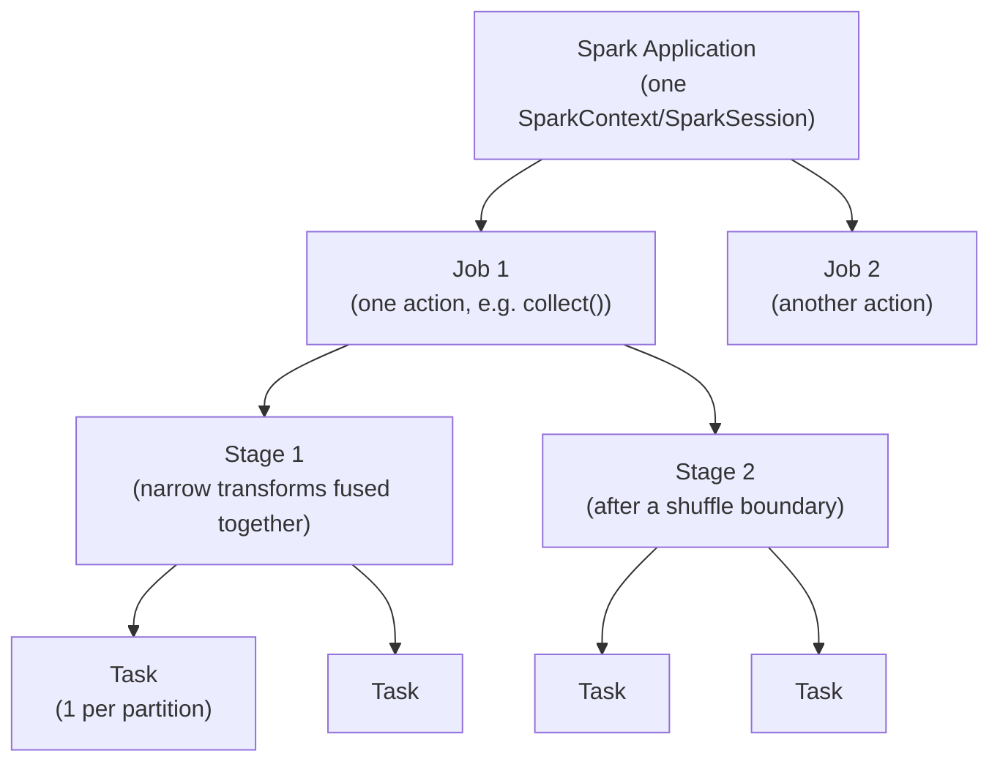
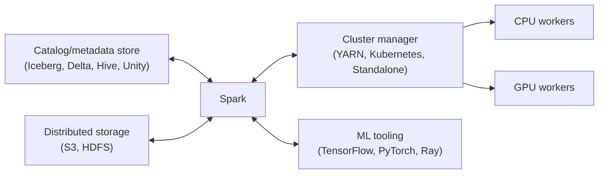

# Day 03 — Spark Mental Model and DataFrame Foundations

**Sources:** *High Performance Spark, 2nd Ed.* (Karau, Polak, Warren — O'Reilly, June 2026) Ch.2 "How Spark Works" (pp.7-32, full: ecosystem/cluster managers/catalogs, RDD model, lazy evaluation, fault tolerance via lineage, in-memory persistence, RDD's 5 core properties, transformations vs actions, wide vs narrow dependencies, anatomy of a Spark job, Spark Connect), Ch.5 pp.78-82 (Tungsten, Datasets). *Data Analysis with Python and PySpark* (Rioux, Manning 2022) Ch.11 pp.244-251 (Spark UI: Jobs/Environment/Executors tabs, RAM/CPU/disk resource model). Installed version here: PySpark 4.2.0 — both books' Spark 4.x content is current; no material API drift found for this chapter's concepts.

**Cross-links:** shuffle mechanics/join execution → [Day 04](day04_spark_partitions_shuffles_joins.md). Caching/AQE/code-gen → [Day 05](day05_spark_performance_engineering.md). Streaming's different execution model → [Day 06](day06_spark_streaming.md). Ray's contrasting execution model (imperative tasks vs declarative+optimizer) → [Day 09](day09_ray_core_tasks_actors.md), and the Spark-vs-Ray judgment call → [Day 13](day13_ray_data_spark_vs_ray.md).

---

## 1. Definitions and terminology

| Term | Definition |
|---|---|
| **Driver** | The process running your Spark application's `main()`/top-level script. Hosts the `SparkContext`/`SparkSession`, builds the DAG, and coordinates executors. Not fault-tolerant to its own loss in regular (non-streaming) Spark. |
| **Executor** | A JVM process on a worker node that runs tasks and holds cached partitions. One node can host multiple executors; one executor cannot span multiple nodes; one partition cannot span multiple executors. |
| **Cluster manager** | The system that launches and allocates executors for a Spark application: Standalone, Kubernetes, or Hadoop YARN (the three HPS Ch.2 names as currently active), or a vendor's own (Databricks, Snowflake). |
| **`SparkContext` / `SparkSession`** | The API's gateway to a running Spark application. `SparkSession` is the Spark SQL-era entry point; `SparkContext` is the lower-level RDD-era one (still underneath). One `SparkContext` per application; RDDs from different `SparkContext`s cannot be combined (e.g. via `join`). |
| **RDD (Resilient Distributed Dataset)** | Spark's core abstraction: an immutable, lazily-evaluated, statically-typed, distributed collection, made of **partitions**. Defined by 5 internal properties (see §2). |
| **DataFrame** | A `Dataset[Row]` — Spark SQL's typed-at-runtime, schema-aware tabular abstraction, built on top of RDD mechanics but with a logical plan the Catalyst optimizer can rewrite. |
| **Partition** | The unit of physical data an RDD/DataFrame is split into. May (but need not) be computed on a different node than its neighbors. |
| **Transformation** | A function that returns a **new RDD/DataFrame** — lazy, not executed until an action forces it. |
| **Action** | A function that returns something that is **not** an RDD/DataFrame (a value, or a side effect like a write) — forces evaluation of everything upstream. Examples: `collect`, `count`, `take`, `saveAsTextFile`, `foreach`. |
| **DAG (Directed Acyclic Graph)** | The graph of RDD/DataFrame dependencies the scheduler builds from an action backward, used to compute which partitions need to be materialized and in what order. |
| **Job** | The unit of work corresponding to **one action**. One application can run many jobs. |
| **Stage** | A job is split into stages at **shuffle boundaries** (wide transformations). All tasks in a stage run without cross-executor communication. |
| **Task** | The smallest unit of work: one stage's computation applied to **one partition**. One task cannot run on more than one executor. |
| **Narrow dependency** | A child partition depends on a small, statically-known set of parent partitions (e.g. `map`, `filter`, `coalesce`). Requires no shuffle. |
| **Wide dependency** | A child partition's data cannot be determined without looking at values across many/all parent partitions (e.g. `groupByKey`, `sort`, `join` on unpartitioned data). Requires a shuffle; creates a new stage. |
| **Tungsten** | Spark SQL's off-heap-capable, byte-level in-memory representation and code-generation engine — makes DataFrames/Datasets more space- and CPU-efficient than raw JVM object RDDs. |

---

## 2. Architecture and internal behavior

An RDD is defined by exactly **5 internal properties** (HPS Ch.2, "Immutability and the RDD Interface", p.18) — knowing these turns "the RDD API" from a list of methods into a mental model:

1. `partitions()` — the list of partition objects.
2. `iterator(p, parentIters)` — how to *compute* partition `p` from its parents' iterators.
3. `dependencies()` — narrow or wide, per parent RDD.
4. `partitioner()` — optional; a function from key → partition index, if the RDD is key/value-shaped.
5. `preferredLocations(p)` — data-locality hints for the scheduler.

Everything else (`map`, `join`, `collect`, ...) is built from these five.

**Lazy evaluation, precisely:** a transformation records *what* to do; nothing runs until an action. Spark then works *backward* from the action to build the DAG, and only computes the partitions actually needed (p.13-14). This is what lets Spark fuse a `map` and a following `filter` into one pass over the data instead of two (p.14) — the classic performance argument for laziness over eager, MapReduce-style execution.

**The application → job → stage → task hierarchy** (HPS Figure 2-6, p.26):



A **job** = one action. A **stage** = a run of narrow transformations that can execute without talking to the driver or other executors; a new stage begins at every wide transformation (shuffle). A **task** = one stage's logic applied to one partition; the number of tasks in a stage equals the number of partitions in that stage's output RDD (p.27-29).

**Fault tolerance is lineage, not logging or replication** (p.15-16) — this is Spark's actual departure from systems like Postgres (write-ahead logs) or Cassandra/OpenSearch (replication + translogs). If a partition is lost, Spark recomputes it from the RDD's recorded dependency graph; the tradeoff is that **the driver itself is a single point of failure** for the DAG (don't schedule it on a preemptible/spot node).

**In-memory persistence has three storage modes** (p.17), each a real space/time tradeoff:
- deserialized JVM objects (fastest access, least memory-efficient),
- serialized bytes (slower to read, more memory-efficient; Kryo beats Java serialization),
- disk (for partitions too large for RAM; needed when using iterator-to-iterator transformations).

DataFrames go further: **Tungsten** stores data in a specialized off-heap-capable byte format instead of JVM objects at all, which is both smaller and faster to (de)serialize than even Kryo (HPS Ch.5 p.78) — this is *why* DataFrames usually outperform hand-written RDD code doing the same logical work.

---

## 3. How the concepts relate to each other

- **RDD vs DataFrame:** a DataFrame *is* built on RDD mechanics (partitions, dependencies, lineage) underneath, but adds a **logical plan** the Catalyst optimizer can rewrite before anything runs — see [Day 05](day05_spark_performance_engineering.md) for what that optimizer actually does.
- **Transformations vs the DAG:** every transformation you call just extends the DAG; nothing executes until you call an action, and the *shape* of that DAG (which edges are narrow vs wide) is exactly what determines stage boundaries.
- **Wide dependencies are why Day 04 exists:** a wide transformation is a shuffle, and shuffles are the single most expensive, most tunable thing in Spark performance work — partition count, join strategy, and skew (Day 04) are all consequences of this one fact.
- **Caching interacts with laziness:** `persist()`/`cache()` doesn't force evaluation either — it's still lazy until an action, it just tells Spark to keep the resulting partitions in memory/disk once they *are* computed, rather than recomputing them from lineage on the next action. Full depth on this in [Day 05](day05_spark_performance_engineering.md).
- **Contrast with Ray (Day 09):** Spark's DataFrame API is *declarative* — you describe the transformation, Catalyst decides the physical execution. Ray's task/actor API is *imperative* — you write the actual control flow, and there is no query optimizer sitting between your code and execution. Neither is strictly better; which one fits depends on whether the workload is relational/structured (Spark's strength) or bespoke Python control flow (Ray's strength) — the full judgment call is [Day 13](day13_ray_data_spark_vs_ray.md).

---

## 4. What needs to be understood deeply

**Laziness is what makes Spark's fault-tolerance and its performance model the same mechanism.** Because Spark never mutates state in place and always knows how to recompute any partition from its parents, "recover from a lost node" and "avoid redundant computation via fusion" are two views of one fact: the DAG is the complete, replayable history of how every partition was derived. This is *not* how most databases achieve durability, and conflating the two models (expecting Spark to behave like a WAL-backed store) is a common early misconception.

**A stage boundary is a synchronization point with the driver, not just "a shuffle happened."** Stages associated with one job generally execute in sequence, not in parallel, *unless* they're independently feeding a downstream transformation like a join (HPS p.28) — so minimizing the number of shuffles isn't just about shuffle cost itself, it's about how much of your DAG is forced to serialize on stage boundaries.

**`sortByKey` is not 100% lazy** — it needs to sample the RDD to determine range boundaries before it can even build a `RangePartitioner`, so calling it is *both* a transformation and (partially) an action (HPS p.14 sidebar). This is a specific, real exception to "nothing runs until an action" worth holding onto exactly, not as a vague caveat.

**An executor is a JVM; a partition cannot span executors, and a task cannot span partitions.** This 1:1:1 relationship (task↔partition, bounded by executor) is what makes "how many partitions do I have" the single most load-bearing performance question in Spark — too few and you can't use your whole cluster; too many and per-task scheduling overhead dominates (the exact same tradeoff you already met for Ray task granularity on Day 09, and for Ray Data block count on Day 13 — same distributed-systems fact, three different systems exposing the same knob).

---

## 5. Concepts that are easy to confuse

| A | B | The distinction |
|---|---|---|
| Transformation | Action | A transformation returns another RDD/DataFrame and is lazy. An action returns a non-RDD value or a side effect and forces the whole upstream DAG to execute. |
| Job | Stage | A job = one action's worth of work. A stage = a shuffle-free segment within that job's DAG. One job can contain many stages. |
| Stage | Task | A stage is the *plan* for one shuffle-free segment. A task is that plan applied to *one specific partition* — one task per partition in the stage's output. |
| Narrow dependency | Wide dependency | Narrow: each child partition depends on a small, statically-determinable set of parent partitions (`map`, `filter`, `coalesce`). Wide: child partitions depend on data spread across parent partitions in a way that can't be known until the data is evaluated (`groupByKey`, `sort`, `join` without matching partitioners) — requires a shuffle. |
| RDD | DataFrame | RDD: untyped-at-the-framework-level (typed only in your host language), no query optimizer, full manual control over partitioning. DataFrame: schema-aware, Catalyst-optimized, Tungsten-encoded — usually faster, less manual control. |
| `SparkContext` | `SparkSession` | `SparkContext` is the original RDD-era entry point. `SparkSession` (Spark SQL era) wraps it and is what you actually construct today; RDDs are still reachable underneath via `.sparkContext`. |
| Static allocation | Dynamic allocation | Static: an application reserves a fixed resource ceiling for its whole lifetime. Dynamic: the application's executor count grows/shrinks with load. HPS: "dynamic allocation is the way to go for almost all jobs" (p.23). |

---

## 6. Practical engineering patterns

**Explicit schema on read, always at scale** (this is Day 03's own named exercise — see §10):
```python
from pyspark.sql.types import StructType, StructField, StringType, DoubleType, TimestampType, BooleanType

schema = StructType([
    StructField("transaction_id", StringType(), nullable=False),
    StructField("amount", DoubleType(), nullable=False),
    StructField("timestamp", TimestampType(), nullable=False),
    StructField("is_fraud", BooleanType(), nullable=False),
])

df = spark.read.schema(schema).csv("ray-learning/datasets/generated")
```
Schema inference requires Spark to *read* a sample of the data before it can even build a plan — a real, avoidable cost at scale, and a real correctness risk (inferred types can be wrong).

**Prefer built-ins over Python UDFs** — a UDF is an opaque function to Catalyst: no pushdown, no code-gen fusion, and (in Python specifically) a JVM↔Python serialization tax on every row. Rewriting `df.rdd.map(pyfunc)`-style logic as `select`/`when`/built-in functions is usually both faster and more optimizable.

**Read the plan before and after a change** — `df.explain()` (or `df.explain(True)` for all four plan stages) turns "I think this is faster" into a checked claim. Full depth on reading physical plans in [Day 05](day05_spark_performance_engineering.md).

**Project and filter early** — even though Catalyst does predicate/column pushdown automatically in many cases, writing `select(...).where(...)` before a join or aggregate keeps the *logical* plan smaller and easier to reason about, and doesn't rely on the optimizer catching everything (it doesn't always — see Day 05 §7 on static-optimizer limits).

---

## 7. Common mistakes and misconceptions

1. **Treating an inferred schema as free.** `spark.read.csv(path)` without a schema makes Spark sample the data before it can build any plan — cost and correctness risk both, avoidable with an explicit `StructType`.
2. **Calling an action (often accidentally) mid-pipeline.** `.show()` while debugging, or an implicit action from schema inference on CSV, silently adds jobs you didn't intend — "the number of jobs should equal the number of actions; if you see more than expected, something triggered an implicit one" (Appendix F, p.366).
3. **Assuming DAG construction failures are your logic's fault.** Errors about connecting to the cluster, configuration, or job launch surface as *DAG Scheduler* errors specifically because the DAG scheduler handles all job execution (p.26) — don't go hunting through your transformation logic for a cluster-connectivity problem.
4. **Expecting the driver to survive a crash in regular batch Spark.** Regular Spark's fault tolerance is lineage-based and lives in the driver's DAG; losing the driver loses the application. (Streaming has partial extra machinery for this — see [Day 06](day06_spark_streaming.md).)
5. **Debugging from a stack trace that "points to" the wrong line.** Because of laziness, a failure caused by a transformation early in the chain will surface as an exception at the *action* (e.g. `collect`), not at the line that logically caused it — "stack traces...will often appear to fail consistently at the point of the action, even if the problem in the logic occurs in a transformation much earlier" (p.16). Introducing a deliberate checkpoint/count to force earlier evaluation is a real debugging technique, not just an optimization one.

---

## 8. Production considerations (DE/ML platform context)



- **Cluster manager choice is a real operational tradeoff, not a formality.** HPS Table 2-1: YARN's biggest concern is managing system-level dependencies (especially Python); Kubernetes is newest, offers the highest workload isolation but possibly higher overhead and needs an external shuffle service for terminate-and-stay-resident recomputation; Standalone gives zero multitenancy beyond what you build yourself.
- **A catalog (Iceberg, Delta, Hive, Unity) is what lets Spark skip unneeded files/columns** and matters for GDPR-style data-location tracking as much as for speed (p.10) — this is the metadata layer Day 04/05's predicate pushdown and partition pruning actually rely on.
- **Spark Connect decouples the client from the driver's JVM/Scala version**, at the cost of a restricted API surface (no RDDs, no full UDF support in every language) — pick it when client/server independence matters more than full API access (HPS Appendix B, p.339-341).
- **This is the layer Day 13's Ray-Data-vs-Spark judgment is actually about:** Spark's DataFrame/Catalyst stack is what gives it a mature cost-based optimizer for relational transforms — the thing Ray Data explicitly does not have (see Day 13 §4).

---

## 9. Debugging and performance reasoning

The Spark UI (default `http://localhost:4040`, or 4041/4042 for additional concurrent applications) is the primary tool — full walkthrough of every tab in [Day 05](day05_spark_performance_engineering.md) via Appendix F's real debugging example. The essentials for Day 03:

- **Jobs tab:** one row per action. Job count should match your action count — extra jobs usually mean an implicit action you didn't intend (schema inference, a stray `.show()`).
- **Environment tab:** JVM/Scala versions, all `spark.*` config values in effect, and any jars/packages loaded — first stop for "why is this behaving differently than I expect" or a missing-dependency error.
- **Executors tab:** cores and memory actually available to your application (Data Analysis w/PySpark Figure 11.3-11.4) — confirms what you *think* you configured is what you *actually* got.
- `df.explain()` / `rdd.toDebugString()` — the plan/lineage as Spark actually built it, not as you imagine it.

| Symptom | Likely cause |
|---|---|
| More jobs in the UI than actions you wrote | An implicit action fired (schema inference, `.show()` while debugging) |
| Exception appears to originate at `collect()`/`show()` regardless of where the real bug is | Laziness — the actual faulty transformation ran earlier; introduce a `count()`/checkpoint upstream to isolate it |
| "DAG Scheduler" error with no obvious logic bug | Cluster connectivity/config/launch problem, not your transformation code |
| Job runs but seems to do nothing for a while, then bursts | Normal — the DAG doesn't start computing partitions until the action needs them |

---

## 10. Examples and exercises

### Worked example — explicit schema, project/filter/aggregate, explain() before/after

```python
from pyspark.sql import SparkSession
from pyspark.sql.types import StructType, StructField, StringType, DoubleType, TimestampType, BooleanType
import pyspark.sql.functions as F

spark = SparkSession.builder.appName("day03-mental-model").getOrCreate()

schema = StructType([
    StructField("transaction_id", StringType(), False),
    StructField("amount", DoubleType(), False),
    StructField("timestamp", TimestampType(), False),
    StructField("is_fraud", BooleanType(), False),
])

df = spark.read.schema(schema).csv("ray-learning/datasets/generated")

# Narrow transformations only — one stage, no shuffle
projected = df.select("amount", "is_fraud").where(F.col("amount") > 0)
projected.explain()   # inspect BEFORE any aggregation

daily = projected.groupBy("is_fraud").agg(F.sum("amount").alias("total_amount"))
daily.explain()       # inspect AFTER — a shuffle (Exchange) now appears

daily.write.mode("overwrite").parquet("/tmp/day03_output")
```

### Exercises (unsolved — write these yourself, get reviewed)

1. **Schema inference vs explicit schema, measured.** Load `ray-learning/datasets/generated` two ways — with `inferSchema=true` and with an explicit `StructType` — and time both. Confirm with `explain()` that inference added an extra pass, not just intuition.
2. **Narrow vs wide, from the plan, not from memory.** Write a pipeline with at least one `select`/`filter` (narrow) and one `groupBy`/`join` (wide). Call `explain()` and identify exactly which line in the physical plan is the `Exchange` node — that's your stage boundary.
3. **Remove unnecessary UDFs.** Take a transformation written as a Python UDF and rewrite it using built-in `pyspark.sql.functions` only. Compare the physical plans (`explain()`) and, if you can measure it, the wall time.
4. **Explain driver/executor/partition relationships from an observed plan** (this is the syllabus's own Day 03 verification criterion) — using the Spark UI's Executors tab, state how many cores/executors you actually have, and connect that number to the task-parallelism you observe for one stage.
5. **Break the "nothing runs until an action" model on purpose.** Call `.sortByKey()` (or PySpark's `.orderBy()`) on a DataFrame and, using the Jobs tab, find evidence that a job ran *before* your explicit action — this is the sampling-for-range-partitioning exception from §4. Explain why it has to work this way.
