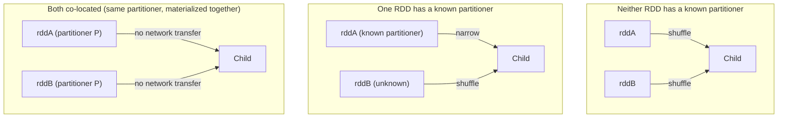

# Day 04 — Spark Partitions, Shuffles, Joins, Skew

**Sources:** *High Performance Spark, 2nd Ed.* (Karau, Polak, Warren — O'Reilly, June 2026) Ch.2 pp.21-22 (wide vs narrow dependency figures), Ch.6 "Joins (SQL and Core)" full (pp.111-124: RDD joins, partitioner-based join speedups, co-location, manual broadcast hash join, Spark SQL join types, concrete join execution operators), Ch.8 "Working with Key/Value Data" pp.186-196 (Partitioner object, Hash/Range/Custom partitioning, preserving partitioning across transforms, co-located/co-partitioned RDDs) and pp.208-217 (Straggler Detection and Unbalanced Data — full Goldilocks skew case study). Installed version here: PySpark 4.2.0.

**Cross-links:** stage boundaries from wide dependencies → [Day 03](day03_spark_mental_model_dataframes.md) §2. Caching a DataFrame to avoid recomputing a pre-join reduction → [Day 05](day05_spark_performance_engineering.md). Reading the Spark UI for shuffle read/write sizes and skew → [Day 05](day05_spark_performance_engineering.md) §9 (Appendix F walkthrough). Ray Data's own shuffle (`groupby`) is the same underlying cost, less mature tooling → [Day 13](day13_ray_data_spark_vs_ray.md) §5.

---

## 1. Definitions and terminology

| Term | Definition |
|---|---|
| **Shuffle** | The all-to-all network/disk redistribution of data required whenever a transformation's output partitioning can't be determined from a single parent partition alone. The mechanical cause of every wide dependency. |
| **Partitioner** | An object with two methods — `numPartitions` and `getPartition(key)` — that defines how key/value data is distributed across partitions. Built-in: `HashPartitioner`, `RangePartitioner`; custom partitioners implement the same interface. |
| **Co-partitioned** | Two RDDs are co-partitioned if they share the same partitioner object (by its `equals`) — Spark can then avoid re-shuffling one of them during a join/cogroup. |
| **Co-located** | Two RDDs (or partitions) are co-located if they are co-partitioned *and* physically materialized in memory on the same executors — a stronger, physical condition than co-partitioning alone. Co-location avoids network transfer entirely, not just the shuffle step. |
| **Broadcast hash join** | Collects the entirety of the smaller side to the driver, then pushes a copy to every executor holding the larger side — a map-side combine with **zero shuffle**. Requires one side to fit in memory. |
| **Shuffle hash join** | Partitions both sides by the join key using a hash partitioner, so matching keys land on the same partition; one side must fit a hash map for the actual join. |
| **Shuffle sort-merge join** | Like shuffle hash, but sorts each partition by key instead of hashing; requires a sortable key type. |
| **Broadcast nested loop join** | Similar to broadcast hash but without an equi-join requirement — iterates rather than hashes; the slowest join, used only when nothing else applies. |
| **Shuffle-and-replicate (cartesian) join** | Every partition of one side is joined against every partition of the other. Used for non-equi cross joins; the most explosive in output size. |
| **Skew** | An uneven distribution of keys such that some partitions hold far more data/duplicate keys than others, producing **straggler tasks** that dominate a stage's wall time. |
| **Straggler** | A task within a stage that takes disproportionately longer than its siblings in the same stage — the visible symptom of skew (or of uneven resource allocation). |
| **Salting** | Appending noise (e.g. a random suffix) to an overly-common key so it hashes to multiple partitions instead of one, trading exact grouping for balanced load. |

---

## 2. Architecture and internal behavior

**Every RDD join is implemented via `cogroup`** (HPS p.113) — understanding cogroup is understanding every join. The cost and network traffic of a join is governed entirely by whether the two sides already share a partitioner:


(HPS Figures 6-1/6-2/6-3, p.112-113.) The general rule: **the cost of a join scales with the number of keys and the distance records must travel to reach their correct partition** (p.112) — shrinking data *before* a join (filtering, or reducing to one row per key) is worth more than almost any join-level tuning, because it shrinks exactly that cost. HPS's own example: reducing to best-score-per-panda *before* joining with address data cut shuffle size by 1000x versus joining first and reducing after (p.114).

**Manual broadcast hash join** (RDD API has no built-in one, HPS Example 6-5, p.117):
```python
# collect the small side to the driver, broadcast it, map-side combine
small_local = small_rdd.collectAsMap()
small_bcast = sc.broadcast(small_local)
result = big_rdd.mapPartitions(
    lambda part: ((k, (v1, small_bcast.value.get(k))) for k, v1 in part
                  if k in small_bcast.value)
)
```
Spark SQL's DataFrame/Dataset API *does* have a first-class broadcast join built in — `spark.sql.autoBroadcastJoinThreshold` (default ~10MB) decides automatically when to use it (HPS p.124).

**Concrete Spark SQL join execution operators**, and how Spark picks between them (HPS Table 6-9, p.123):

| Join name | Supported join types | Narrow or wide | Performance |
|---|---|---|---|
| Broadcast hash | All except full outer | Narrow (non-broadcast side) | Fast when one DataFrame is small |
| Broadcast nested loop | All (equi + non-equi) | Narrow (non-broadcast side) | Depends on being able to do minimal passes |
| Shuffle and replicate (cartesian) | Inner and cartesian | Wide | High chance of data explosion |
| Shuffle hash | All (equi only) | Wide | Requires high cardinality; no skew: clustered |
| Shuffle sort-merge | All (equi, sortable keys) | Wide | Requires high cardinality, less likely to OOM than shuffle hash |

**Straggler tasks are how skew actually shows up** (HPS p.208): a new stage begins after every wide transformation, so if the data isn't evenly partitioned, some of that stage's tasks (holding the overrepresented keys) take far longer than their siblings — and because stages generally execute in sequence, one straggler can hold up an entire job. The Goldilocks case study (HPS pp.208-216) is the canonical real example: a dataset where ~25% of *every column's* values were zero caused catastrophic clustering onto a handful of partitions regardless of partition count, until the algorithm was rewritten to deduplicate ((value, column) pairs) on each partition *before* the shuffle — cutting a 300-million-row, multi-thousand-group job's duplicate-key problem enough to get a real production run to complete at all, and a measured 4x speedup over the next-best version once it did.

---

## 3. How the concepts relate to each other

- **Partitioning is what turns a wide dependency narrow.** If both sides of a join already share a partitioner (co-partitioned), Spark can skip the shuffle for that RDD entirely — this is *why* choosing a partitioner deliberately before an expensive operation (§6) pays off on every subsequent operation that reuses it, not just the one you tuned.
- **Skew (this file) and caching (Day 05) compound.** A straggler task caused by skew is *also* the task most likely to spill to disk under memory pressure — the two problems share a root cause (an unbalanced partition) but Day 05's caching/spill material explains the memory-pressure side of the same symptom.
- **AQE (Day 05) exists largely to fix problems this file describes without a rewrite.** Adaptive Query Execution's skew join optimization and dynamic partition coalescing are runtime answers to exactly the static-partitioning problems in §7 — but AQE optimizations aren't visible via `explain()` (Day 05 §2), so you still need this file's diagnostic instincts to know *when* to check whether AQE actually helped.
- **Ray Data's `groupby` is the same shuffle, a less mature engine** (Day 13 §5) — the cost model here (network + disk I/O to redistribute by key) is a general distributed-systems fact, not Spark-specific; Spark's fifteen years of shuffle optimization is exactly what Day 13 cites as the reason Ray Data isn't (yet) a substitute for Spark on skewed, relational-shaped joins.

---

## 4. What needs to be understood deeply

**Shrinking data before a join is worth more than choosing the "right" join strategy.** The 1000x shuffle-size difference from reducing-then-joining vs joining-then-reducing (HPS Example 6-1 vs 6-2) is *not* a join-execution-operator question at all — it's a query-shape question that dominates any operator-level tuning you could do afterward. Optimize the shape first.

**A shared partitioner is a property that survives across operations, and losing it silently costs you later.** `mapValues`/`mapPartitions(preservesPartitioning=True)` preserve a known partitioner; plain `map`/`flatMap` do not, *even if your function doesn't touch the key* (HPS p.188) — because Spark can't statically prove that from the function signature. This is exactly the kind of invisible-until-it's-slow mistake that separates "I got the join to run" from "I understand what I built."

**Co-partitioned is necessary but not sufficient for co-located.** Two RDDs can be co-partitioned (same partitioner) yet still cause network traffic during a join if they were never *materialized together* by the same action — being loaded into memory by separate prior actions doesn't guarantee physical co-location, only equal partitioning (HPS p.188-189). Whether this matters in practice depends on your program's actual lineage, which is a real thing to check, not assume.

**Skew is a property of the keys, not of "the cluster being slow."** The Goldilocks postmortem's most senior-level insight: performance depended on three measurable characteristics of the *data* (record count, group count, duplicate-key percentage), not on hardware, and "the most performant code is not always the cleanest" (HPS p.216-217) — sometimes the correct fix is a genuinely uglier algorithm (Goldilocks v3/v4) because it changes the actual shuffle cost, not the code's readability.

---

## 5. Concepts that are easy to confuse

| A | B | The distinction |
|---|---|---|
| **Co-partitioned** | **Co-located** | Co-partitioned = same partitioner object (logical). Co-located = also physically materialized together on the same executors (physical). Co-partitioned does not imply co-located. |
| **Shuffle hash join** | **Shuffle sort-merge join** | Hash: requires a hash map of one side's keys per partition, works for any equi-joinable type. Sort-merge: requires a *sortable* key, sorts instead of hashing — most primitive types qualify, complex types (maps) often don't. |
| **Broadcast hash join** | **Broadcast nested loop join** | Both avoid a shuffle by broadcasting the small side. Hash requires an equi-join and builds a hash map (fast). Nested loop supports non-equi conditions but iterates — much slower, a last resort. |
| **`repartition`** | **`coalesce`** | `repartition` always triggers a full shuffle (can increase or decrease partition count, rebalances). `coalesce` avoids a shuffle by only ever *merging* existing partitions — cannot increase partition count, and can leave data unevenly distributed if the input already was. |
| **A straggler from skew** | **A straggler from resource contention** | Both look identical in the UI (one task much slower than its siblings) — skew means that task's *partition holds more/duplicate data*; contention means the *executor* is slow (noisy neighbor, disk issue) regardless of data size. Check partition input size before blaming the cluster. |
| **`groupByKey`** | **`reduceByKey`/`aggregateByKey`** | `groupByKey` shuffles *all* values for a key with no partial combination first — the single most common way to trigger an out-of-memory error on skewed data. `reduceByKey`/`aggregateByKey` combine values map-side before the shuffle, dramatically shrinking what actually moves across the network. |

---

## 6. Practical engineering patterns

**Shrink before you join** (the single highest-leverage pattern in this file):
```python
# WRONG shape — join full data, then reduce
joined = score_rdd.join(address_rdd)
best = joined.reduceByKey(lambda a, b: a if a[0] > b[0] else b)

# RIGHT shape — reduce first, join the (much smaller) result
best_scores = score_rdd.reduceByKey(lambda a, b: a if a > b else b)
best = best_scores.join(address_rdd)
```

**Assign a known partitioner before an operation you'll reuse** (HPS Example 6-4, p.116):
```python
from pyspark import HashPartitioner

address_partitioner = address_rdd.partitioner or HashPartitioner(address_rdd.getNumPartitions())
best_scores = score_rdd.reduceByKey(address_partitioner, lambda a, b: max(a, b))
result = best_scores.join(address_rdd)   # no shuffle on address_rdd's side
```

**Mitigate skew with salting** (HPS p.208-209 — add noise to overrepresented keys):
```python
import random

def salt_key(key, is_hot, buckets=10):
    return (key, random.randint(0, buckets - 1)) if is_hot else (key, 0)

salted = rdd.map(lambda kv: (salt_key(kv[0], kv[0] in hot_keys), kv[1]))
```

**Explicitly manage broadcast thresholds** for known-small dimension tables:
```python
from pyspark.sql.functions import broadcast

result = large_df.join(broadcast(small_dim_df), "key")
```

**Map-side reduce before sort, when sorting on a skewed value** (the Goldilocks v4 move) — deduplicate `(value, column)` pairs *within a partition* first via `mapPartitions`, so the subsequent sort/shuffle moves far fewer, non-duplicated records.

---

## 7. Common mistakes and misconceptions

1. **Reaching for `groupByKey` out of habit.** It shuffles every value for every key with zero pre-combination — reliably the fastest way to an out-of-memory error on any dataset with real key duplication. Prefer `reduceByKey`/`aggregateByKey`/`combineByKey`.
2. **Tuning join execution hints before shrinking the query shape.** As in §4/§6 — a 1000x shuffle-size reduction from reordering reduce-then-join beats any join-strategy hint you could add afterward.
3. **Assuming `mapValues` and `map` are interchangeable for performance.** They can be functionally equivalent, but only `mapValues` (and `mapPartitions` with `preservesPartitioning=True`) keep the RDD's known partitioner — plain `map` silently loses it even when your function never touches the key.
4. **Blaming "the cluster" for a straggler without checking input size per task.** Check the Stages tab's per-task Input Size/Records distribution (Day 05 §9) before assuming a hardware or scheduling problem — skewed data produces the identical symptom.
5. **Increasing partition count as a reflex fix for skew.** More partitions doesn't help if the skew is concentrated in a small number of keys — those keys still land on however many partitions your partitioner sends them to; salting or a custom partitioner addresses the actual cause, more partitions alone often doesn't.
6. **Forgetting that `sortByKey`/range-partitioned joins are more memory-fragile than hash-based ones under skew.** HPS's explicit warning: "While `sortByKey` is less likely to cause memory errors at scale than `groupByKey`, it is still quite possible" (p.208) — range partitioning samples the data to build boundaries, and can still tip over on the same skewed keys.

---

## 8. Production considerations

- **Shuffle cost is a direct line item on your cloud bill** — it's network transfer plus disk I/O for spill files, not an abstract "slowness." Every pattern in §6 that avoids or shrinks a shuffle is a cost optimization, not just a latency one.
- **A production incident from skew looks like "this job that always finishes in 10 minutes is now hanging"** — the underlying data's key distribution changed (a new hot customer ID, a batch of malformed rows all mapping to one key), not the code. Diagnosing this requires the Stages tab's per-task metrics (Day 05 §9), not re-reading the transformation logic.
- **Broadcast joins have a real failure mode at scale: `spark.sql.autoBroadcastJoinThreshold` being wrong for your actual data.** If the "small" side grows past what fits in executor memory, a broadcast join becomes an out-of-memory error instead of a slow job — a genuinely different failure signature than a shuffle-based join running out of memory, worth being able to tell apart on-call.
- **Salting trades exact grouping correctness (in the naive sense) for balanced load** — a salted key produces multiple output groups for what was logically one key, requiring an extra reduce-after-salt step to recombine. This is a real complexity/reliability tradeoff to weigh, not a free fix.
- **This is the concrete mechanism behind Day 13's "Spark has fifteen years of shuffle optimization, Ray Data does not"** — AQE's skew-join handling, broadcast threshold tuning, and the whole join-operator selection table in §2 are exactly the maturity gap Day 13 points at when it says don't expect Ray Data's `groupby` to handle a skewed key distribution as gracefully.

---

## 9. Debugging and performance reasoning

| Symptom | Likely cause | Where to look |
|---|---|---|
| One task in a stage takes far longer than its siblings | Skew — that task's partition holds disproportionate/duplicate keys | Stages tab: per-task Input Size/Records distribution (min/median/max) |
| Job that normally finishes quickly now hangs or times out | Data's key distribution shifted (new hot key), producing new skew | Same as above — compare today's distribution to a known-good run |
| `OutOfMemoryError` during a `groupByKey`-based job | All values for a key shuffled with no pre-combination, and that key is large | Switch to `reduceByKey`/`aggregateByKey`; check key cardinality first |
| Broadcast join throws an OOM instead of running fast | The "small" side isn't actually small enough for `autoBroadcastJoinThreshold`/executor memory | Check the actual size of the broadcast side; adjust the threshold or force a shuffle join instead |
| Shuffle read/write sizes wildly uneven across executors in the UI | Confirms skew is real and where (which executor/partition) it lands | Executors tab, "Shuffle Read"/"Shuffle Write" columns |
| Explain plan shows `SortMergeJoin` when you expected `BroadcastHashJoin` | Broadcast threshold not met, or a hint/config prevented it | `df.explain()`; check `spark.sql.autoBroadcastJoinThreshold` and whether the DataFrame's actual size exceeds it |

---

## 10. Examples and exercises

### Worked example — creating a hot-key skew dataset, then mitigating it

```python
import random
from pyspark.sql import SparkSession
import pyspark.sql.functions as F

spark = SparkSession.builder.appName("day04-skew").getOrCreate()

# Deliberately skewed: 90% of rows share one customer_id
def make_row(i):
    is_hot = random.random() < 0.9
    return (0 if is_hot else i, random.random() * 100)

skewed = spark.createDataFrame(
    [make_row(i) for i in range(200_000)], ["customer_id", "amount"]
)

before = skewed.groupBy("customer_id").agg(F.sum("amount"))
before.explain()   # note the shuffle; time this job in the Stages tab

# Mitigation: salt the hot key, aggregate in two passes
salted = skewed.withColumn(
    "salt", (F.rand() * 10).cast("int")
).withColumn(
    "salted_key", F.concat_ws("_", "customer_id", "salt")
)
partial = salted.groupBy("salted_key", "customer_id").agg(F.sum("amount").alias("partial_sum"))
final = partial.groupBy("customer_id").agg(F.sum("partial_sum").alias("total"))
final.explain()
```

### Exercises (unsolved — write these yourself, get reviewed)

1. **Customer/account/transaction joins and daily aggregates** (this day's own syllabus implementation task) — using `ray-learning/datasets/generated`, build a join between transactions and a small synthetic accounts dimension table, then aggregate daily totals. Confirm via `explain()` which join operator Spark chose.
2. **Vary `spark.sql.shuffle.partitions` and compare.** Run the same wide aggregation at several values (e.g. 4, 50, 200, 2000) and record wall time plus the Stages tab's task count/duration distribution. Where's the sweet spot for your data size, and does it match the reasoning in Day 03 §4 about too-few vs too-many partitions?
3. **Broadcast vs non-broadcast, measured.** Force a broadcast join with `broadcast()`, then disable it (set `spark.sql.autoBroadcastJoinThreshold` to `-1`) and compare plans and runtime for the same join.
4. **Create a hot-key dataset and mitigate skew** using at least two of: filtering the hot key out and handling it separately, salting, repartitioning, or relying on AQE's skew-join handling — and produce before/after plans and runtime evidence (this is the syllabus's own stated Day 04 exercise and verification criterion).
5. **Reproduce the Goldilocks lesson at small scale.** Build a dataset where ~25% of values in every "column" (group) are identical (like the real case study), attempt a `groupByKey`-based solution, and watch it struggle or fail. Then rewrite it to deduplicate `(value, group)` pairs per-partition before the shuffle, as Goldilocks v4 does, and measure the improvement.
