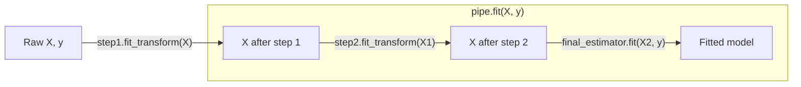
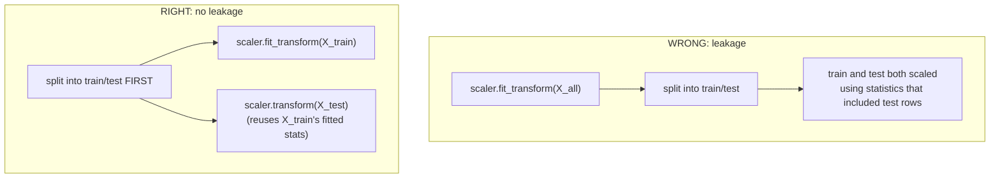

# Day 07 — Practical ML Foundations for Data Engineers

**Sources:** scikit-learn official documentation (current, 2026-09 verification): [Pipelines and composite estimators](https://scikit-learn.org/stable/modules/compose.html), [Cross-validation](https://scikit-learn.org/stable/modules/cross_validation.html), [Model evaluation](https://scikit-learn.org/stable/modules/model_evaluation.html). Not sourced from a book — `ray-learning/references/reading-map.md` specifies official docs only for this day, and deliberately not the Grokking ML book (that's Track A, a separate parallel track in this repo — this file's angle is ML-for-data-engineers pipeline literacy, not algorithm theory).

**Cross-links:** distributed version of everything here → [Day 08](day08_spark_ml_pipelines.md). The same train/serve-consistency problem, solved at Ray-cluster scale → [Day 14](day14_ray_train.md) §4/§5 (Preprocessors, training-serving skew).

---

## 1. Definitions and terminology

| Term | Definition |
|---|---|
| **Train/validation/test split** | Three disjoint data slices: train (fit the model), validation (tune hyperparameters / pick a model), test (final, only-once estimate of real-world performance). A single train/test split is the minimum viable version; validation is what keeps you from tuning against your test set. |
| **Leakage** | Information from outside the training data (often the test/validation set, or the future) illegitimately influencing training — producing metrics that look good but don't reflect real generalization. |
| **Baseline** | The simplest possible model (predict the majority class, predict the mean, a single-rule heuristic) — establishes the floor every real model must beat to be worth its complexity. |
| **Feature pipeline** | The ordered sequence of transformations (imputation, scaling, encoding) applied to raw columns to produce the numeric feature matrix a model consumes. |
| **`Estimator` (sklearn sense)** | Any object with a `.fit(X, y)` method — includes both preprocessors (`StandardScaler`) and models (`LogisticRegression`). |
| **`Transformer` (sklearn sense)** | Any object with `.transform(X)` (and usually `.fit_transform(X)`) — a preprocessor that maps raw features to processed ones. |
| **`Pipeline`** | A composite estimator chaining transformers (all steps but the last) and a final estimator, exposing one `.fit()`/`.predict()` surface over the whole chain. |
| **Cross-validation (k-fold)** | Split training data into *k* folds; train on *k−1*, validate on the held-out fold; repeat *k* times, rotating which fold is held out; average the *k* scores. Uses more of the data for validation than one static split, at *k*× the compute cost. |
| **Imbalance** | The positive class (fraud, churn, defect) is a small minority of rows — often <1-5%. Changes which metrics are meaningful and how a "baseline" should be framed. |
| **Reproducibility (ML sense)** | A fixed random seed (`random_state=`) for splits, shuffles, and any stochastic algorithm, so re-running the same code on the same data produces the same numbers. |

---

## 2. Architecture and internal behavior

A `Pipeline`'s `.fit(X, y)` is a straight-line composition, not magic:



Calling `pipe.fit(X, y)` calls `.fit_transform()` on every step except the last, threading the output of one into the input of the next, then calls `.fit()` on the final estimator with the fully-transformed matrix. Calling `pipe.predict(X_new)` instead calls `.transform()` (never `.fit_transform()`) on every preprocessing step — using the statistics already learned during `.fit()` — then `.predict()` on the final estimator.

**This asymmetry is the entire leakage-prevention mechanism.** `fit_transform` on train computes statistics (mean, std, vocabulary) *from* the training data. Plain `transform` on test/production data *applies* those same already-learned statistics without recomputing them. If you instead call `fit_transform` on your full dataset before splitting, the "training" statistics have already seen the test rows — the model is evaluated on data that quietly leaked information about itself.



Cross-validation composes with this correctly *only* when the whole pipeline (preprocessing + model) is what gets cross-validated — `cross_val_score(pipe, X, y, cv=5)` refits the scaler fresh inside each fold on that fold's training portion, never touching that fold's held-out rows during fitting.

---

## 3. How the concepts relate to each other

- **Day 08 is this file at Spark scale.** Everything below — the fit/transform split, the leakage mechanism, the baseline discipline, imbalance-aware metrics — applies unchanged when the "estimator" is a `pyspark.ml.Pipeline` instead of a `sklearn.pipeline.Pipeline`. The APIs differ; the discipline doesn't.
- **[Day 14](day14_ray_train.md)'s Preprocessor** is the same fit/transform-separation contract again, at a third scale (a Ray cluster), because it's solving the identical problem: training-serving skew is leakage's mirror image (leakage = test statistics contaminate training; skew = *different* statistics are used at serving time than were used at training time). Both are "the transform used to prepare data isn't the same across the train/evaluate boundary."
- **Baseline → metric → leakage form a diagnostic loop:** a model that beats a weak baseline by an implausibly large margin is the first sign to check for leakage before celebrating.
- **Cross-validation and a single train/test split answer different questions.** A split gives you one number with unknown variance. k-fold gives you a distribution (mean ± std across folds) — necessary before trusting a small difference between two models as real rather than noise.

---

## 4. What needs to be understood deeply

**Leakage is the single most dangerous silent failure mode in this entire day.** It doesn't crash, doesn't warn, doesn't look wrong — it produces a *better-looking* number than the honest one, which is precisely why it's dangerous: nothing about a leaked 97% validation accuracy looks like a bug. The only defense is procedural discipline (always split before fitting anything, always use a `Pipeline` rather than manual preprocessing steps you might apply in the wrong order) — not a runtime check that could catch it after the fact.

**"Accuracy" is not one thing — it depends entirely on the label distribution.** On a 99.25%-negative fraud dataset (this repo's actual generated data, `fraud_rate_observed ≈ 0.0075`), a model that predicts "not fraud" unconditionally scores 99.25% accuracy while catching zero fraud. The number is correct and worthless simultaneously — the fix isn't a better model, it's a better *metric* (§8).

**A baseline isn't a formality, it's the thing that makes every later number interpretable.** "This model gets 0.62 PR-AUC" means nothing on its own. "This model gets 0.62 PR-AUC, and the do-nothing baseline gets 0.0075" is a real claim about lift.

**Cross-validation trades compute for a distribution instead of a point estimate.** A single split answering "did model A beat model B" with a 0.3-point difference on one split is close to meaningless — CV's std-dev across folds is what tells you whether that 0.3 points is signal or fold-to-fold noise.

---

## 5. Concepts that are easy to confuse

| A | B | The distinction |
|---|---|---|
| `fit_transform(X_train)` | `transform(X_test)` | The first *learns and applies* statistics. The second *only applies* statistics already learned. Calling `fit_transform` on test data is a leakage bug even if it "runs fine." |
| A validation set | A test set | Validation is used repeatedly, during development, to pick hyperparameters/models — you're allowed to look at it many times. A test set is touched once, at the very end, precisely because repeated peeking turns it into a second validation set (and reintroduces the overfitting-to-evaluation problem cross-validation exists to avoid). |
| Accuracy | Balanced accuracy | Accuracy = fraction correct overall — dominated by the majority class on imbalanced data. Balanced accuracy = average of per-class recall — treats the minority class's performance as equally important regardless of how rare it is. |
| ROC-AUC | PR-AUC (average precision) | ROC plots TPR vs. FPR — on severe imbalance, FPR stays numerically small even with many false positives (they're a small fraction of a huge negative class), so ROC-AUC can look deceptively good. PR-AUC plots precision vs. recall directly, and a random classifier's PR-AUC equals the positive rate itself (≈0.0075 here) — a much harsher, more honest floor. |
| A `Transformer` | An `Estimator` (sklearn sense) | Every `Estimator` implements `.fit()`. A `Transformer` *additionally* implements `.transform()`. `StandardScaler` is both (fit learns mean/std, transform applies them). `LogisticRegression` is an Estimator but not a Transformer — it has `.fit()`/`.predict()`, not `.transform()`. This is exactly why only the *last* pipeline step is allowed to be a non-Transformer. |
| Precision | Recall | Precision: of everything I flagged as fraud, what fraction actually was? (cost of false alarms). Recall: of everything that actually was fraud, what fraction did I catch? (cost of missed fraud). They trade off against each other via the decision threshold — improving one by moving the threshold generally costs the other. |

---

## 6. Practical engineering patterns

**Pattern: baseline before model, always.**
```python
from sklearn.dummy import DummyClassifier
from sklearn.metrics import average_precision_score

baseline = DummyClassifier(strategy="most_frequent").fit(X_train, y_train)
baseline_ap = average_precision_score(y_test, baseline.predict_proba(X_test)[:, 1])
# Every real model's PR-AUC is judged against this number, not against zero.
```

**Pattern: preprocessing and model as one `Pipeline` object, never as separate manual steps.**
```python
from sklearn.pipeline import Pipeline
from sklearn.preprocessing import StandardScaler
from sklearn.linear_model import LogisticRegression
from sklearn.compose import ColumnTransformer
from sklearn.preprocessing import OneHotEncoder

preprocess = ColumnTransformer([
    ("num", StandardScaler(), ["amount"]),
    ("cat", OneHotEncoder(handle_unknown="ignore"), ["category", "channel"]),
])
pipe = Pipeline([
    ("preprocess", preprocess),
    ("clf", LogisticRegression(class_weight="balanced", max_iter=1000)),
])
pipe.fit(X_train, y_train)          # fit_transform internally, train data only
pipe.predict_proba(X_test)          # transform only, reusing train-fitted stats
```
This is the pattern that makes "did I leak" structurally hard to get wrong — there is no manual `scaler.fit(everything)` line to accidentally place before the split.

**Pattern: cross-validate the whole pipeline, not just the model.**
```python
from sklearn.model_selection import cross_validate

scores = cross_validate(
    pipe, X_train, y_train, cv=5,
    scoring=["average_precision", "roc_auc", "f1"],
)
print({k: (v.mean(), v.std()) for k, v in scores.items() if k.startswith("test_")})
```

**Pattern: `class_weight="balanced"` (or resampling) as a first-line response to imbalance**, before reaching for anything more exotic (SMOTE, custom loss functions) — it's a one-argument change that reweights the loss function to stop the model from trivially predicting the majority class.

---

## 7. Common mistakes and misconceptions

1. **Fitting a scaler/encoder on the full dataset, then splitting.** The single most common leakage bug — looks completely reasonable in a notebook cell, invisible until validation numbers are suspiciously high.
2. **Reporting accuracy on an imbalanced target and calling it good.** 99.25% accuracy on this repo's fraud data is what you get by predicting "not fraud" every time — it is not evidence of a working model.
3. **Tuning hyperparameters against the test set** (running many configurations, checking test performance each time, keeping the best) — this is leakage through repeated peeking, even though no single `fit_transform` call is at fault. This is exactly why a validation set (or CV) exists separately from the final test set.
4. **Treating `fit_transform` as always safe because "it's just how you call preprocessing."** It is safe on training data and a bug on anything else — the method name doesn't protect you, only knowing *which* data you're calling it on does.
5. **Not persisting the fitted preprocessing alongside the model.** If a `StandardScaler`'s learned mean/std lives only in a notebook variable that gets thrown away, there is no way to correctly transform new data at serving time later — the model artifact must include the *fitted* pipeline, not just the final estimator (see [Day 14](day14_ray_train.md)'s training-serving-skew material — same failure, different day).
6. **Choosing ROC-AUC as the headline metric for a rare-event problem** because it's the most commonly cited metric, without checking whether PR-AUC tells a very different (harsher, more honest) story on the same predictions.

---

## 8. Production considerations

- **Reproducibility is a production requirement, not a nicety.** A fixed seed on every split/shuffle/model means "retrain on the same data" produces the same model — without it, a retraining pipeline silently produces a slightly different model every run, and "did the new model actually get worse, or is this just seed noise" becomes unanswerable.
- **The feature pipeline is a production artifact with its own lifecycle**, not scratch code — it needs to be versioned and persisted alongside the model weights (`joblib.dump(pipe, ...)` on the *whole* `Pipeline`, not just the final estimator), or the serving path will reimplement preprocessing by hand and drift from the training path (training-serving skew again).
- **Data versioning matters as much as code versioning.** "Retrain the model" implicitly means "on what data, as of when" — an unversioned, mutable training table makes "reproduce last month's model" impossible even with a fixed seed.
- **Choice of metric is a product decision, not just a modeling one.** For fraud specifically: missing real fraud (false negative) and blocking a legitimate transaction (false positive) usually have very different real-world costs — the metric (and the decision threshold) should reflect that asymmetry, not default to whichever metric is most familiar.
- **Where Day 07 stops and Day 08 starts:** this file's patterns work as long as `X_train` fits in one process's memory (pandas/NumPy, scikit-learn). The moment feature engineering has to run over more data than one machine can hold, the *same* fit/transform/leakage discipline needs a distributed engine — that's Day 08, not a different discipline.

---

## 9. Debugging and performance reasoning

**How to actually detect leakage, concretely (not just "be careful"):**

| Symptom | Likely cause | What to check |
|---|---|---|
| Validation/test score is implausibly high relative to the baseline and problem difficulty | Leakage via preprocessing fit before split, or via features that encode the label | Check every `fit`/`fit_transform` call — was it ever called on anything but the training fold? |
| One feature has suspiciously high importance/coefficient | That feature may be a proxy for the label (e.g. a column only populated *after* the fraud decision was made) | Check the feature's actual data-generation timing relative to the label — could it only exist *because* the label is already known? |
| Cross-validation fold scores have huge variance | Too few samples in the minority class per fold, or folds aren't stratified | Use `StratifiedKFold` so each fold preserves the overall class ratio |
| Model looks great in offline eval, unremarkable in production | Training-serving skew (Day 14) or leakage inflating the offline number | Diff the *exact* transform code path used at train time vs. serve time |

**Symptom-first note on this repo's fraud dataset:** `fraud_rate_observed ≈ 0.0075`. Any classifier producing >99% accuracy tells you nothing — go straight to PR-AUC and a confusion matrix instead of trusting the headline number.

---

## 10. Examples and exercises

### Worked example — baseline vs. real pipeline on this repo's fraud data

```python
import pandas as pd
from sklearn.model_selection import train_test_split
from sklearn.compose import ColumnTransformer
from sklearn.preprocessing import StandardScaler, OneHotEncoder
from sklearn.pipeline import Pipeline
from sklearn.linear_model import LogisticRegression
from sklearn.dummy import DummyClassifier
from sklearn.metrics import average_precision_score, roc_auc_score, classification_report

transactions = pd.read_parquet("ray-learning/datasets/generated/transactions.parquet")
X = transactions[["amount", "category", "channel"]]
y = transactions["is_fraud"]

X_train, X_test, y_train, y_test = train_test_split(
    X, y, test_size=0.2, random_state=42, stratify=y
)

baseline = DummyClassifier(strategy="most_frequent", random_state=42).fit(X_train, y_train)
print("baseline PR-AUC:", average_precision_score(y_test, baseline.predict_proba(X_test)[:, 1]))

preprocess = ColumnTransformer([
    ("num", StandardScaler(), ["amount"]),
    ("cat", OneHotEncoder(handle_unknown="ignore"), ["category", "channel"]),
])
pipe = Pipeline([
    ("preprocess", preprocess),
    ("clf", LogisticRegression(class_weight="balanced", max_iter=1000)),
])
pipe.fit(X_train, y_train)
proba = pipe.predict_proba(X_test)[:, 1]

print("model PR-AUC:", average_precision_score(y_test, proba))
print("model ROC-AUC:", roc_auc_score(y_test, proba))
print(classification_report(y_test, pipe.predict(X_test)))
```
Notice: `preprocess` is fit *inside* `pipe.fit(X_train, ...)` — only on training rows. `pipe.predict_proba(X_test)` calls `.transform()`, not `.fit_transform()`, on the same `ColumnTransformer` — the test set never influences a single learned statistic.

### Exercises (unsolved — write these yourself, get reviewed)

1. **Reproduce the leakage bug on purpose.** Using the same fraud data, deliberately fit a `StandardScaler`/`ColumnTransformer` on the *full* dataset before splitting, then train the same `LogisticRegression`. Compare its PR-AUC/ROC-AUC against the correctly-built pipeline above. Quantify the inflation.
2. **Baseline-relative reporting.** Compute the `DummyClassifier` baseline's accuracy, PR-AUC, and ROC-AUC on this data. Explain, in your own words, why the accuracy number is nearly meaningless here but the PR-AUC number is not.
3. **Metric comparison table.** For the correctly-built pipeline above, compute precision, recall, F1, ROC-AUC, and PR-AUC at the default 0.5 threshold. Then sweep the decision threshold from 0.1 to 0.9 and show how precision and recall trade off. At what threshold would you actually deploy this, and why (state the cost tradeoff you're assuming between a missed fraud and a blocked legitimate transaction)?
4. **Cross-validate it properly.** Replace the single train/test split with 5-fold stratified cross-validation over the whole pipeline. Report mean ± std of PR-AUC across folds. Is the variance small enough to trust a comparison against a second model, or is it large relative to the differences you'd expect to see?
5. **One-page model/data contract.** Write (in Markdown, not code) a one-page contract for this model: what the input features are and where they come from, what the label means and how it's defined, how the split is performed and with what seed, which metric is the deployment decision metric and why, and what the known leakage risks are for this specific pipeline.
