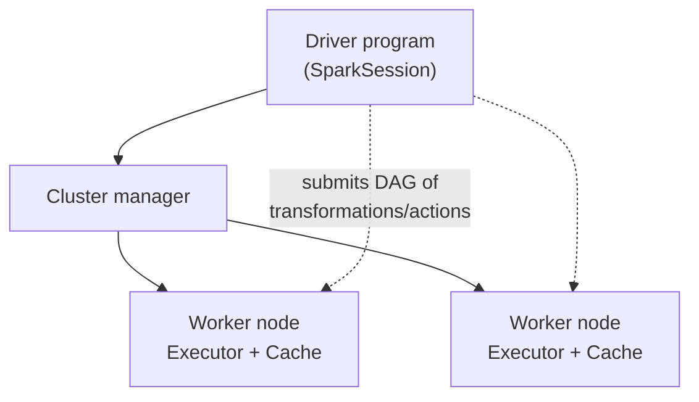
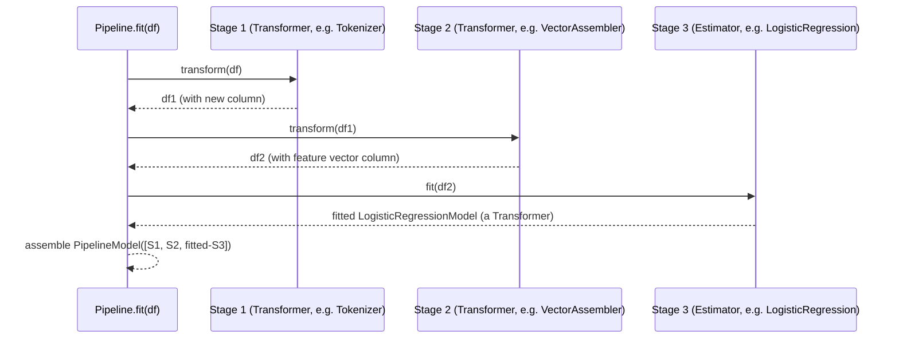
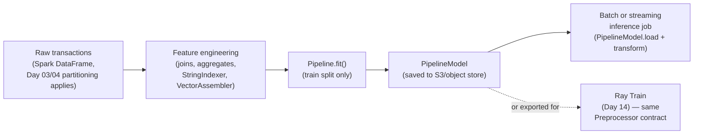

# Day 08 — Spark ML Workloads and Feature Pipelines

**Sources:** *Advanced Analytics with PySpark* (Tandon, Ryza, Laserson, Owen, Wills — O'Reilly 2022) Ch.2 "Introduction to Data Analysis with PySpark" (pp.11-30: Spark architecture, DataFrame API, schema inference, `describe`/summary statistics, join-based feature scoring — read directly, this edition targets Spark 3.1 DataFrames, not the newer `pyspark.ml.Pipeline` API in depth). Official Spark ML Pipelines guide, [spark.apache.org/docs/latest/ml-pipeline.html](https://spark.apache.org/docs/latest/ml-pipeline.html) (current, verified 2026-09) for the `Transformer`/`Estimator`/`Pipeline`/persistence API itself — the book's own worked examples predate `pyspark.ml.Pipeline`'s current form, so the Pipeline-specific material here is doc-sourced, cross-checked against PySpark 4.2.0 (installed here).

**Cross-links:** single-machine version of every concept here → [Day 07](day07_practical_ml_foundations.md). Spark DataFrame fundamentals this day assumes → [Day 03](day03_spark_mental_model_dataframes.md). The same fit/transform separation at Ray-cluster scale → [Day 14](day14_ray_train.md).

> **Verify before running.** This file's code samples are concept-accurate against the official Spark ML Pipelines guide and PySpark 4.2.0's documented API, but were not executed against a live Spark session in this repo (no local session was started while writing this file). Run them yourself against `ray-learning`'s actual `pyspark` before trusting output shapes/column names exactly as written — same discipline as Day 14's API-freshness flag, different reason (untested here, not book/current drift).

---

## 1. Definitions and terminology

| Term | Definition |
|---|---|
| **`DataFrame` (ML sense)** | The same Spark SQL `DataFrame` used everywhere else in Spark, now expected to hold ML-specific column types too — most importantly a `Vector` column (dense or sparse numeric feature vector) alongside ordinary columns. |
| **`Transformer`** | An algorithm implementing `.transform(df)`: maps one `DataFrame` to another by appending column(s). Covers both stateless feature transformers (`Tokenizer`) and *fitted* models (a `LogisticRegressionModel` is a `Transformer` — it transforms features into predictions). |
| **`Estimator`** | An algorithm implementing `.fit(df)`, which *produces* a `Model` (a `Transformer`). `LogisticRegression` (the unfit configuration) is an `Estimator`; calling `.fit()` on it produces `LogisticRegressionModel` (a `Transformer`). |
| **`Pipeline`** | An ordered list of `PipelineStage`s (`Transformer`s and `Estimator`s). A `Pipeline` is itself an `Estimator` — calling `.fit()` on it runs every stage in order and returns a `PipelineModel`. |
| **`PipelineModel`** | The *fitted* output of `Pipeline.fit()` — itself a `Transformer`. Calling `.transform()` on it runs every stage's `.transform()` in order (every stage is now a `Transformer`, including what used to be `Estimator`s, because they've been fit). |
| **`VectorAssembler`** | A `Transformer` (`pyspark.ml.feature.VectorAssembler`) that combines several numeric columns into one `Vector` column — almost always the last feature-prep stage before a classifier/regressor in a Spark ML pipeline. |
| **`StringIndexer`** | A `Transformer`-producing `Estimator` that maps a string/categorical column to numeric category indices, learned from the data (index 0 = most frequent category, etc.) — the Spark ML analogue of `LabelEncoder`/`OneHotEncoder`'s indexing half. |
| **Model artifact / persistence** | `model.write().overwrite().save(path)` / `PipelineModel.load(path)` — a fitted `PipelineModel` serialized to disk (or object storage), the durable unit that gets deployed for inference later. |
| **`Param` / `ParamMap`** | Spark ML's typed, named, documented hyperparameter mechanism — set via `estimator.setMaxIter(10)`-style setters or an explicit `ParamMap`. |

---

## 2. Architecture and internal behavior

Two architectural facts underlie everything else in this file. First, Spark's own execution model (from Day 03, reused here):


Every DataFrame operation — including every `Transformer.transform()` call in a pipeline — is lazy: it builds a logical plan, and nothing actually runs across the cluster until an action (`.count()`, `.collect()`, `.write()`, or the *training* step inside `Estimator.fit()`) forces execution.

Second, `Pipeline.fit()`'s own mechanics:


`Pipeline.fit()` walks its stages in order: it calls `.transform()` on each `Transformer` stage and `.fit()` (immediately followed by `.transform()` to produce the next stage's input) on each `Estimator` stage. The returned `PipelineModel` bundles every stage — with `Estimator`s now replaced by their fitted `Transformer` output — so that a *later* call to `PipelineModel.transform(new_df)` re-runs the identical sequence of transforms (including the *already-fitted* model's prediction step) with zero re-fitting. This is structurally the same fit/transform separation as [Day 07](day07_practical_ml_foundations.md) §2 — Spark just names the fitted-and-bundled result `PipelineModel` instead of leaving it as an in-memory Python object.

**Persistence makes this durable, not just in-memory:**
```python
model.write().overwrite().save("s3://bucket/models/fraud-v3")
loaded = PipelineModel.load("s3://bucket/models/fraud-v3")
```
Everything the `PipelineModel` learned (`StringIndexer`'s category-to-index mapping, a scaler's fitted mean/std, the classifier's coefficients) round-trips through this save/load — this is the mechanism, not a side note, by which train-time feature preparation and serve-time feature preparation stay identical.

---

## 3. How the concepts relate to each other

- **[Day 07](day07_practical_ml_foundations.md) is this file's single-machine mirror.** `sklearn.pipeline.Pipeline` ↔ `pyspark.ml.Pipeline`, `Transformer`/`Estimator` ↔ the same names (Spark ML's vocabulary is deliberately parallel to scikit-learn's), `fit_transform` train / `transform`-only test ↔ the identical asymmetry here. The leakage mechanism from Day 07 §2 applies unchanged: a `StringIndexer` or scaler fit on your *full* dataset before a train/test split leaks exactly the way `StandardScaler.fit_transform(X_all)` does.
- **[Day 03](day03_spark_mental_model_dataframes.md)'s DataFrame/lazy-evaluation model is what a `Transformer.transform()` call actually is** — it appends columns to a lazy logical plan; nothing computes until an action forces it. A slow-looking pipeline stage is a Day-04/05 partitioning/shuffle/caching problem wearing an ML-pipeline costume, not a new category of problem.
- **[Day 14](day14_ray_train.md)'s Preprocessor is the third instance of the same contract**, at Ray-cluster scale, solving training-serving skew — Spark ML's `PipelineModel` persistence, scikit-learn's pickled `Pipeline`, and Ray Train's `Preprocessor` checkpoint are three different mechanisms enforcing one invariant: *the fitted transform used at train time is the exact one used at serve time.*
- **`VectorAssembler` is the hinge between "many named DataFrame columns" and "one `Vector` column a classifier can consume"** — everything upstream of it (indexing, scaling, encoding) works in named-column space; everything downstream (the actual `Estimator`) works in vector space.

---

## 4. What needs to be understood deeply

**A `PipelineModel` is a single, self-contained, re-runnable transform — that's the entire point of the abstraction.** The alternative (calling each stage's `.fit()`/`.transform()` by hand, in the right order, remembering to skip re-fitting at serve time) is exactly how training-serving skew enters a codebase: two hand-written call sequences drift apart the moment someone edits one and not the other. `Pipeline`/`PipelineModel` exists specifically so there is only one sequence, written once.

**`.fit()` on a `Pipeline` is lazy-triggering, not lazy itself.** The `Pipeline` object's `.fit()` call *forces* Spark to actually execute the DAG built by every upstream `Transformer.transform()` — this is a genuine action, not a transformation, and its cost is real, cluster-wide compute (Day 04/05 material applies directly: how the input DataFrame is partitioned before this point determines how the whole pipeline parallelizes).

**Deciding what belongs in Spark vs. what belongs in a Day-07-style local pipeline is a real architectural decision, not a default.** Spark ML pipelines pay real overhead (distributed scheduling, JVM↔Python serialization at every stage boundary for Python UDFs) that a plain pandas/scikit-learn pipeline doesn't. The syllabus's own framing for this day is exactly this judgment call: which stage of feature engineering needs Spark's scale, and which is better done locally after Spark has done the heavy narrowing/aggregation.

**`StringIndexer`'s learned mapping is data-dependent, not fixed.** "Category 0" means whatever the most frequent category happened to be *in the data it was fit on* — if a category present in production data was never seen during fit, indexing fails or falls back to a configured `handleInvalid` policy. This is a real production risk category, not a hypothetical edge case, whenever the categorical vocabulary can grow over time (new merchant categories, new device types, etc.).

---

## 5. Concepts that are easy to confuse

| A | B | The distinction |
|---|---|---|
| An `Estimator` | A `Transformer` | Every `Estimator` produces a `Transformer` via `.fit()`. A `Transformer` may or may not have come from fitting something (`Tokenizer` needs no fitting at all; `LogisticRegressionModel` came from fitting `LogisticRegression`). The `Pipeline` itself is an `Estimator`; the `PipelineModel` it produces is a `Transformer`. |
| `Pipeline` | `PipelineModel` | `Pipeline` is the *unfit configuration* (a recipe). `PipelineModel` is what you get after `.fit()` — a concrete, reusable, savable artifact. Only `PipelineModel` should ever reach production serving. |
| `VectorAssembler` | A `Pipeline` stage in general | `VectorAssembler` is one specific `Transformer`. Not every pipeline needs exactly one, but almost every Spark ML classifier/regressor pipeline has exactly one, immediately before the final `Estimator`, because Spark ML's learning algorithms expect a single `Vector` features column by convention. |
| Spark's `DataFrame.cache()` | A fitted preprocessing step's learned statistics | `cache()` is a Spark execution optimization (keep this DataFrame's computed partitions in memory to avoid recomputation) — it has nothing to do with what a `StringIndexer` or scaler *learned*. Confusing the two leads to assuming re-running a cached DataFrame re-applies "fresh" statistics, when actually the already-fitted `Transformer`'s learned state is what's being reapplied, cache or no cache. |
| Spark SQL / DataFrame API choice | Feature-engineering choice | The book's Ch.2 material (join-based scoring, `describe()`/summary statistics, SQL vs. DataFrame API) is about *how* you express a computation over a DataFrame — orthogonal to *whether* that computation belongs in a `Pipeline` stage. You can build features with SQL or the DataFrame API equally well; the `Pipeline` wraps the result either way. |

---

## 6. Practical engineering patterns

**Pattern: the canonical Spark ML pipeline shape — index, assemble, model.**
```python
from pyspark.ml import Pipeline
from pyspark.ml.feature import StringIndexer, VectorAssembler
from pyspark.ml.classification import LogisticRegression

category_indexer = StringIndexer(inputCol="category", outputCol="category_idx", handleInvalid="keep")
channel_indexer = StringIndexer(inputCol="channel", outputCol="channel_idx", handleInvalid="keep")
assembler = VectorAssembler(
    inputCols=["amount", "category_idx", "channel_idx"],
    outputCol="features",
)
lr = LogisticRegression(featuresCol="features", labelCol="is_fraud", maxIter=20)

pipeline = Pipeline(stages=[category_indexer, channel_indexer, assembler, lr])
model = pipeline.fit(train_df)          # one action, runs the whole DAG
predictions = model.transform(test_df)  # transform only — no re-fitting
```

**Pattern: split before any stage that fits, exactly as in Day 07.**
```python
train_df, test_df = transactions_df.randomSplit([0.8, 0.2], seed=42)
model = pipeline.fit(train_df)   # StringIndexer's vocabulary, LR's coefficients — train-only
predictions = model.transform(test_df)
```

**Pattern: persist the whole `PipelineModel`, never just the final classifier.**
```python
model.write().overwrite().save("ray-learning/datasets/models/fraud-pipeline-v1")
# later, anywhere:
from pyspark.ml import PipelineModel
loaded = PipelineModel.load("ray-learning/datasets/models/fraud-pipeline-v1")
loaded.transform(new_transactions_df)   # indexing + assembly + prediction, identical to training
```

**Pattern: decide the Spark/local boundary explicitly, in writing.** For a workload like this repo's fraud data: Spark is the right place for anything touching the full 500k-row (or larger, in production, billions-row) table — joins against `customers`/`accounts`, aggregation-based features (rolling spend per account), and the `StringIndexer`/`VectorAssembler` stages that must see the whole vocabulary. A local scikit-learn pass (Day 07) is the right place once the feature matrix has already been narrowed to something that fits in one process's memory (a sampled or aggregated table) — e.g. rapid experimentation with metric thresholds or model types, where Spark's per-stage scheduling overhead buys nothing.

---

## 7. Common mistakes and misconceptions

1. **Fitting a `StringIndexer`/scaler-equivalent on the full dataset before splitting** — identical leakage bug to Day 07 §7.1, just in Spark's vocabulary. `pipeline.fit(full_df)` before any split is exactly as wrong as `scaler.fit_transform(X_all)`.
2. **Treating `Pipeline.fit()` as a transformation instead of an action.** It's lazy right up until the moment you call it — then it's the single most expensive line in the script, because it forces the entire upstream DAG to execute. Placing it inside a loop (e.g. accidentally re-fitting per micro-batch) is a real performance bug, not a style nitpick.
3. **Saving only the final model, not the whole `PipelineModel`.** If `StringIndexer`'s learned category-to-index mapping isn't persisted alongside the classifier, the serving path has no correct way to reproduce the same indices for the same categories — this is training-serving skew, entered through a missing artifact rather than a code bug.
4. **Assuming `handleInvalid` defaults are safe for production.** `StringIndexer`'s default behavior on an unseen category at inference time is to throw — `handleInvalid="keep"` (map unseen categories to an extra index) is often what production actually needs, and it's an explicit choice, not a default you can ignore.
5. **Running everything in Spark ML because "the data's already in Spark," even after it's been aggregated down to something tiny.** Not every stage of a pipeline benefits from staying in Spark — see §6's boundary pattern. Keeping a small, already-narrowed DataFrame in Spark ML incurs real per-stage scheduling and JVM↔Python overhead for no corresponding benefit.
6. **Confusing the book's Ch.2 join/`describe()`-based scoring approach with a "real" ML pipeline.** The book's own first worked example (record-linkage scoring) predates and doesn't use `pyspark.ml.Pipeline` at all — it's a legitimate simpler technique (a hand-built additive rule) for a specific problem shape, not the general pattern this day's syllabus scope (`Estimator`/`Transformer`/`Pipeline`) is asking for.

---

## 8. Production considerations



- **Model artifacts are storage-architecture decisions.** Where a `PipelineModel` is saved (durable object storage vs. ephemeral local disk on a cluster that gets torn down) determines whether a cluster teardown loses the ability to reproduce train-time feature preparation — the exact same durability concern as [Day 14](day14_ray_train.md) §8's checkpoint-storage material.
- **Reproducing feature engineering at serving time is the actual production goal**, not "getting the model to train." A `PipelineModel` that trains beautifully but was never actually saved and reloaded end-to-end (only ever kept in the same notebook session) has not proven it solves this.
- **Scale boundary is a documented architecture decision, not folklore.** This day's own verification criterion (per the syllabus) is an explicit note on which stage belongs in Spark vs. local ML and why — that note is itself a production artifact (an onboarding engineer should be able to read it and know where to add the next feature).
- **Vocabulary drift (§4's `StringIndexer` risk) is an operational monitoring concern**, not just a one-time modeling concern — a categorical column's real-world vocabulary can grow after a `PipelineModel` is deployed, and `handleInvalid` policy is the only thing standing between that and a hard failure or silently wrong predictions.

---

## 9. Debugging and performance reasoning

| Symptom | Likely cause | Where to look |
|---|---|---|
| `pipeline.fit()` is extremely slow | It's the action that finally executes the whole DAG — check the *upstream* DataFrame's partitioning/shuffle behavior (Day 04/05), not the ML stages themselves | Spark UI's SQL/DataFrame tab, `explain()` on the DataFrame going into `.fit()` |
| Prediction fails at serving time with an indexing/category error | An unseen category hit a `StringIndexer` with the default `handleInvalid` (error) policy | Set `handleInvalid="keep"` deliberately, and confirm the *saved* `PipelineModel` (not a freshly-refit one) is what's being used to serve |
| Model quality good offline, different online | Feature preparation at serving time doesn't match training — often a hand-rolled reimplementation instead of loading the actual `PipelineModel` | Confirm the serving code path calls `PipelineModel.load(...).transform(...)`, not a manually rewritten feature function |
| Same pipeline code, wildly different runtime at larger scale | A stage (often a Python UDF between DataFrame steps) that doesn't parallelize the way native DataFrame operations do | Check for Python UDFs in the pipeline's feature-engineering stages; prefer built-in `pyspark.ml.feature` transformers, which run in the JVM without per-row Python round-trips |
| Two runs of "the same" pipeline produce different indices/results | No fixed seed on the split, or the input DataFrame's row order/partitioning isn't deterministic across runs | Set `seed=` on `randomSplit`; check whether the source data itself is stable between runs |

---

## 10. Examples and exercises

### Worked example — full pipeline on this repo's fraud data (current PySpark 4.2.0 API)

```python
from pyspark.sql import SparkSession
from pyspark.ml import Pipeline, PipelineModel
from pyspark.ml.feature import StringIndexer, VectorAssembler
from pyspark.ml.classification import LogisticRegression
from pyspark.ml.evaluation import BinaryClassificationEvaluator

spark = SparkSession.builder.appName("day08-fraud-pipeline").getOrCreate()

transactions = spark.read.parquet("ray-learning/datasets/generated/transactions.parquet")

train_df, test_df = transactions.randomSplit([0.8, 0.2], seed=42)

category_idx = StringIndexer(inputCol="category", outputCol="category_idx", handleInvalid="keep")
channel_idx = StringIndexer(inputCol="channel", outputCol="channel_idx", handleInvalid="keep")
assembler = VectorAssembler(inputCols=["amount", "category_idx", "channel_idx"], outputCol="features")
lr = LogisticRegression(featuresCol="features", labelCol="is_fraud", maxIter=20, weightCol=None)

pipeline = Pipeline(stages=[category_idx, channel_idx, assembler, lr])
model = pipeline.fit(train_df)

predictions = model.transform(test_df)
evaluator = BinaryClassificationEvaluator(labelCol="is_fraud", metricName="areaUnderPR")
print("PR-AUC:", evaluator.evaluate(predictions))

model.write().overwrite().save("ray-learning/datasets/models/day08-fraud-pipeline")
reloaded = PipelineModel.load("ray-learning/datasets/models/day08-fraud-pipeline")
reloaded.transform(test_df).select("transaction_id", "probability", "prediction").show(5)
```

### Exercises (unsolved — write these yourself, get reviewed)

1. **Reproduce Day 07's exercise 1 (baseline vs. real pipeline) in Spark ML**, on the same `transactions.parquet`. Compare the Spark ML `BinaryClassificationEvaluator`'s `areaUnderPR` against Day 07's scikit-learn `average_precision_score` on an equivalent split. Are the numbers close? Should they be, given the two implementations use different algorithms under the hood?
2. **Break the leakage rule on purpose, in Spark.** Fit the `StringIndexer`/`Pipeline` on the *full* `transactions` DataFrame before splitting, then evaluate on a held-out slice of that same full set. Compare against the correctly-split version above. Quantify the difference.
3. **`handleInvalid` in practice.** Construct a small `test_df` that includes a `category` value never seen in `train_df` (filter it out of train, keep it in test). Run the pipeline once with `handleInvalid="error"` and once with `handleInvalid="keep"`. Document exactly what happens in each case.
4. **Local vs. Spark scale comparison.** Take the same feature-engineering logic (index two categoricals, assemble a vector, fit a logistic regression) and time it in both Spark ML (on the full 500k-row dataset) and scikit-learn/pandas (Day 07's pattern, same dataset loaded fully into memory). At what row count does Spark's overhead stop being worth it — measure, don't guess.
5. **Architecture note (this is the syllabus's own verification criterion for this day).** Write one page: which specific stages of a real fraud-detection feature pipeline belong in Spark, which belong in local scikit-learn/pandas, and exactly where the boundary is and why — referencing the actual timing evidence from exercise 4, not general principles alone.
