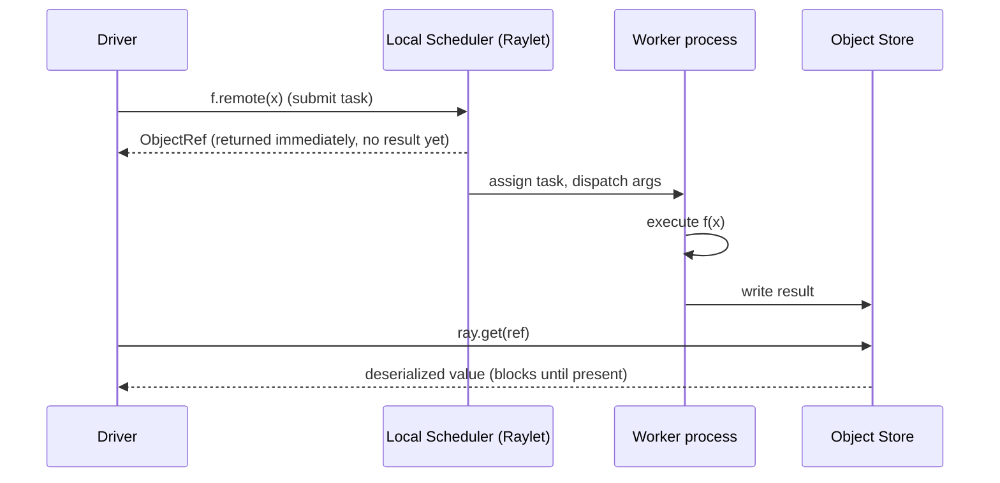
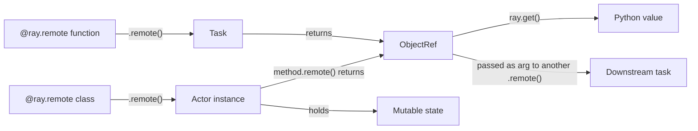

# Day 09 — Ray Core: Tasks, Actors, ObjectRefs

**Sources:** *Learning Ray* (Pumperla, Oakes, Liaw — O'Reilly 2023) Ch.1 "An Overview of Ray", Ch.2 "Getting Started with Ray Core" (full worked example, pp.23-47: first task, object store, `wait`, task dependencies, actors, MapReduce). *Scaling Python with Ray* (Karau, Lublinsky — O'Reilly 2023) Ch.1-2 (Hello Worlds: remote task, actor). Cross-checked against `docs.ray.io` (current). Installed version here: Ray 2.58.0.

**Cross-links:** architecture/scheduling internals → [Day 10](day10_architecture_scheduling.md). Object store depth → [Day 11](day11_object_store_data_movement.md). Failure behavior of tasks/actors → [Day 12](day12_fault_tolerance.md).

---

## 1. Definitions and terminology

| Term | Definition |
|---|---|
| **Driver** | The process running your top-level script. Calls `ray.init()`, submits tasks/actors, usually calls `ray.get()` to collect results. |
| **Job** | One run of a driver program and everything it submits to the cluster. |
| **Task** | A single asynchronous invocation of a `@ray.remote`-decorated **function**. Stateless — each call is independent. |
| **Actor** | An instance of a `@ray.remote`-decorated **class**. A dedicated, long-lived worker process that holds state between method calls. |
| **Remote function / remote method** | The decorated function or actor method itself — the *definition*, not a specific call. |
| **`.remote(...)`** | The call syntax that submits a task or actor method invocation to the cluster instead of running it in the current process. Always non-blocking, always returns immediately. |
| **`ObjectRef`** | A future: a lightweight reference to a value that may not be computed yet, living somewhere in the cluster's object store. Returned by every `.remote()` call and by `ray.put()`. |
| **`ray.get(ref)`** | Blocks the calling process until the referenced object exists, then returns the actual Python value. The only point where async collapses back to sync. |
| **`ray.put(value)`** | Explicitly stores a Python value in the object store up front, returning an `ObjectRef` you can pass into many tasks without re-serializing the value each time. |
| **`ray.wait(refs, ...)`** | Non-blocking poll: returns two lists — refs that are ready, refs that aren't — instead of blocking on all of them like `ray.get`. |
| **Actor handle** | The object returned by `SomeActor.remote(...)` (instantiation). You call `.remote()` on *this handle* to invoke actor methods; it is not the actor instance itself, it's a reference you can pass around and share. |

---

## 2. Architecture and internal behavior (first pass — full depth in Day 10/11)

Calling `f.remote(x)` on a `@ray.remote` function does **not** run `f` here and now. It:

1. Packages the call (function reference + serialized args, or `ObjectRef`s for existing objects) and hands it to the local scheduler.
2. Returns an `ObjectRef` immediately — before the function has even started running anywhere.
3. Somewhere (same machine or a remote node), a worker process picks up the task, runs it, and writes the result into that node's object store.
4. When you call `ray.get(ref)`, the driver's local machinery fetches the value from wherever it landed (possibly across the network) and deserializes it back into a Python object.



Actors differ in one crucial way: instantiating `Actor.remote()` starts a **dedicated worker process that stays alive**. Every subsequent `.remote()` call on that actor handle is routed to *that same process*, and instance state (`self.x`) persists across calls — because it's the same live Python object, not a fresh one per call.

Full component picture (Raylet, GCS, scheduler internals, resource management): [Day 10](day10_architecture_scheduling.md). Where the object actually lives, ownership, spilling: [Day 11](day11_object_store_data_movement.md).

---

## 3. How the concepts relate



- **Tasks** are the distributed analogue of calling a function — no state carries over between calls.
- **Actors** are the distributed analogue of an object instance — state *does* carry over, because it's a real, single, persistent process.
- **ObjectRefs** are the glue: both tasks and actor methods return them, and — critically — you can pass an `ObjectRef` returned by one task directly as the argument to another `.remote()` call without ever calling `ray.get()` yourself. Ray builds a dependency graph from this and resolves it for you (see the two-task chaining example in §10).
- Objects (`ray.put`, task/actor return values) are first-class citizens too, not just plumbing — see [Day 11](day11_object_store_data_movement.md).

---

## 4. What needs to be understood deeply

- **`.remote()` is *always* async, with no exceptions.** There is no "small enough to just run inline" special case. Every call has real overhead (scheduling + serialization + IPC), which is why task *granularity* is a first-class design decision, not an afterthought (§7).
- **Ray infers the dependency graph from the arguments you pass, not from any explicit DAG API.** If you pass task A's `ObjectRef` into task B, Ray already knows B depends on A and will not schedule B until A's result exists — you never write orchestration code for this.
- **An actor is a single process.** Calling the same actor's methods from multiple places does not parallelize automatically — by default, an actor processes one method call at a time, in submission order (unless you explicitly use `async def` methods or `max_concurrency`). If you need N-way parallelism, you need N actor instances (an *actor pool*), not one actor called N times.
- **Tasks and actors are Ray's only two units of remote execution.** Everything else in Ray's ecosystem (Data, Train, Tune, Serve) is built as a layer on top of these two primitives plus the object store — understanding tasks/actors well is what makes the higher-level libraries legible instead of magic.

---

## 5. Easy to confuse

| A | B | The distinction |
|---|---|---|
| Calling `f(x)` | Calling `f.remote(x)` | The first runs now, in-process, blocking, returning a value. The second schedules async execution elsewhere and returns an `ObjectRef` immediately. |
| `ray.get(ref)` | `ray.wait([ref, ...])` | `get` blocks until (all) results are ready and returns values. `wait` returns immediately with a partition of *(ready refs, not-ready refs)` — you decide what to do next. Use `wait` when you want to process results as they land rather than stall on the slowest one. |
| A task | An actor method call | A task has no memory of previous calls. An actor method call runs against the *same* persistent object — `self` state from call N is visible in call N+1. |
| An actor **class** | An actor **handle** | `@ray.remote class Foo` is a definition. `Foo.remote()` instantiates it and gives you a *handle* — the thing you actually call `.remote()` on for methods, and the thing you pass to other tasks/actors if they need to talk to this actor. |
| `ObjectRef` | The value it points to | A `ref` is a small, cheap-to-copy handle (like a pointer). The actual data lives in the object store and is only materialized in your process when you `ray.get()` it. Passing refs around is cheap; passing large raw values around is not. |

---

## 6. Practical engineering patterns

**Fan-out / fan-in (embarrassingly parallel map):**
```python
results = ray.get([process.remote(item) for item in items])
```
Submit all tasks first (they run concurrently), *then* collect. Never call `.remote()` and `ray.get()` inside the same loop iteration — that serializes everything (see §7).

**Pipelining without an intermediate `.get()`:**
```python
retrieved = [retrieve_task.remote(i, db_ref) for i in range(8)]
followed_up = [follow_up_task.remote(r) for r in retrieved]   # takes ObjectRefs directly
result = ray.get(followed_up)
```
`follow_up_task` receives the *ObjectRef* from the first stage; Ray resolves it internally before running. This is the core building block of any multi-stage Ray pipeline — you almost never `ray.get()` between stages, only at the very end (or not even then, if the next stage is Ray Data/Train).

**Stateful accumulation via an actor:**
```python
@ray.remote
class Counter:
    def __init__(self): self._n = 0
    def increment(self): self._n += 1
    def value(self): return self._n

tracker = Counter.remote()
ray.get([process_and_track.remote(item, tracker) for item in items])
print(ray.get(tracker.value.remote()))
```
This is how you get a shared counter, cache, connection pool, or rate limiter across many distributed tasks — something plain `multiprocessing` makes painful and Ray makes native.

**MapReduce as tasks + object-ref shuffling** (full worked version in §10): map tasks each return *N* partitioned results (`num_returns=N`), and you route the *j*-th output of every mapper into the *j*-th reducer — all by passing `ObjectRef`s around, no data ever touches the driver.

---

## 7. Common mistakes and misconceptions

1. **Calling `ray.get()` immediately after every `.remote()`, inside a loop.** This is the single most common way to accidentally write *sequential* code that looks parallel:
   ```python
   # WRONG — fully sequential, defeats the entire point of Ray
   for item in items:
       result = ray.get(process.remote(item))
   ```
   Each iteration blocks before submitting the next task. Fix: submit all `.remote()` calls first into a list, `ray.get()` the list once, at the end.

2. **Task granularity too fine.** Ray's per-task overhead is real (scheduling + IPC + serialization, typically low milliseconds but non-zero). Submitting 500,000 tasks for 500,000 tiny rows will spend more time scheduling than computing. Batch rows into chunks and submit one task per chunk — the "how many chunks" question is an empirical granularity/overhead tradeoff, not a fixed rule (this is exactly what Day 09's granularity experiment measures).

3. **Passing large Python objects by value into many tasks instead of `ray.put()`-ing once.**
   ```python
   # WRONG — re-serializes and re-copies `big_df` into every single task
   [f.remote(big_df, i) for i in range(1000)]

   # RIGHT — serialize once, share the reference
   ref = ray.put(big_df)
   [f.remote(ref, i) for i in range(1000)]
   ```

4. **Assuming an actor parallelizes its own method calls.** One actor = one process = (by default) one method executing at a time. If you need concurrent handling, either use multiple actor instances or `async def` methods with `max_concurrency`.

5. **Sharing mutable global state across tasks via closures/globals.** Each task may run in a different process (even on a different machine) — a global variable mutated by one task is invisible to another. Use `ray.put`/actor state to share data, not Python globals.

6. **First-run confusion: a slow "parallel" run that's actually dominated by environment/dependency packaging, not your code.** If a `ray.init()` call has to build/ship a `runtime_env` (e.g. a project's virtualenv) to every worker, that setup cost happens once per worker *before* your function ever runs, and can dwarf trivial workloads on a first run. This is a real, distinct failure mode from task-granularity overhead — see [Day 11](day11_object_store_data_movement.md) and [Day 17](../syllabus/20-day-intensive.md) debugging material for how to tell them apart from the logs.

---

## 8. Production considerations (DE/ML platform context)

- **Ingestion/transformation:** tasks are a natural fit for embarrassingly parallel row/file-level transforms (parsing, validation, feature extraction) where each unit of work is independent — the same shape of problem Spark solves with DataFrame transformations, but expressed as plain Python instead of a declarative query plan. Choose tasks when the transform logic is bespoke Python that doesn't map cleanly onto relational operators; choose Spark when it's fundamentally a join/aggregate/filter over huge structured data (see the Spark-vs-Ray framing revisited in Day 13).
- **Stateful services:** actors are the right primitive for anything that needs to hold state across many calls in a running pipeline — an in-memory feature cache in front of a slower store, a rate-limited client to an external API during ingestion, a running aggregator collecting stats across a streaming batch, or (later) a deployed model replica in Ray Serve.
- **Orchestration boundary:** a Ray job (driver + its tasks/actors) is typically *one node* in a larger orchestrated pipeline (Airflow/Dagster/etc. still schedules *when* the Ray job runs); Ray itself is not a cron/DAG scheduler for business workflows, it's the compute engine for one stage of that workflow.
- **Training pipelines:** the same task/actor primitives underpin Ray Train (worker-group actors) and Ray Tune (many trial tasks) — understanding plain tasks/actors here is what makes those libraries' behavior predictable rather than a black box (Day 14-15).

---

## 9. Debugging and performance reasoning

- **Ray Dashboard** (`http://127.0.0.1:8265` by default) — the "Jobs" and "Actors" tabs show task/actor state, timing, and current process assignment. Start here for "why is this slow / why is this stuck."
- **State API (CLI):** `ray summary tasks`, `ray list tasks --filter "state=PENDING_NODE_ASSIGNMENT"`, `ray list actors` — useful when you don't have dashboard access (e.g. a remote cluster you're SSH'd into).
- **Symptom → likely cause table:**

| Symptom | Likely cause |
|---|---|
| "Parallel" run takes about as long as sequential | You're calling `ray.get()` inside the submission loop (§7.1) |
| Huge wall-clock overhead relative to actual work, especially on first run | `runtime_env` / dependency packaging cost per worker, not your task logic (§7.6) |
| Task stuck in `PENDING_NODE_ASSIGNMENT` forever | Resource request infeasible on any node — see [Day 10](day10_architecture_scheduling.md) §9 |
| `ObjectRef` argument seems to silently block everything until an unrelated task finishes | You've created an accidental dependency by passing a ref you didn't need yet — check what's actually feeding into that call |
| Actor method calls appear to queue up / serialize | Expected default behavior — one actor, one call at a time (§4) |

---

## 10. Examples and exercises

### Worked example 1 — task dependency chaining (adapted from *Learning Ray* Ch.2)

```python
import ray, time
ray.init()

database = ["Learning", "Ray", "Flexible", "Distributed", "Python", "for", "Machine", "Learning"]

@ray.remote
def retrieve_task(item, db_ref):
    time.sleep(item / 10.)
    return item, db_ref[item]

@ray.remote
def follow_up_task(retrieve_result):
    original_item, _ = retrieve_result
    follow_up_result = retrieve(original_item + 1)   # look at the "next" entry
    return retrieve_result, follow_up_result

db_ref = ray.put(database)
retrieve_refs = [retrieve_task.remote(i, db_ref) for i in [0, 2, 4, 6]]
follow_up_refs = [follow_up_task.remote(ref) for ref in retrieve_refs]

for result in ray.get(follow_up_refs):
    print(result)
```
Note `follow_up_task` receives an `ObjectRef`, not a value — Ray resolves it before running the task, and infers that `follow_up_task` must wait for the matching `retrieve_task` to finish. No manual synchronization written anywhere.

### Worked example 2 — MapReduce word count (full, from *Learning Ray* Ch.2)

```python
import ray, subprocess

@ray.remote
def apply_map(corpus, num_partitions=3):
    map_results = [list() for _ in range(num_partitions)]
    for document in corpus:
        for word in document.lower().split():
            word_index = ord(word[0]) % num_partitions
            map_results[word_index].append((word, 1))
    return map_results

@ray.remote
def apply_reduce(*results):
    reduce_results = dict()
    for res in results:
        for key, value in res:
            reduce_results[key] = reduce_results.get(key, 0) + value
    return reduce_results

zen = subprocess.check_output(["python", "-c", "import this"]).decode().split("\n")
num_partitions = 3
chunk = len(zen) // num_partitions
partitions = [zen[i * chunk:(i + 1) * chunk] for i in range(num_partitions)]

map_results = [
    apply_map.options(num_returns=num_partitions).remote(partition, num_partitions)
    for partition in partitions
]
outputs = [
    apply_reduce.remote(*[partition[i] for partition in map_results])
    for i in range(num_partitions)
]
counts = {k: v for output in ray.get(outputs) for k, v in output.items()}
print(sorted(counts.items(), key=lambda kv: kv[1], reverse=True)[:5])
```
This is map → shuffle → reduce with zero explicit networking code: the "shuffle" is just which `ObjectRef` you route into which reducer call.

### Exercises (unsolved — write these yourself, get reviewed)

1. **Parallel aggregation over the real dataset.** Using `ray-learning/datasets/generated` (500k transaction rows, ~0.75% fraud rate), write a Ray program that computes per-chunk aggregate stats (row count, sum of amount, fraud count) in parallel over N chunks, then combines the per-chunk results into one final summary. Do not use `ray.get()` inside your submission loop.
2. **Granularity experiment.** Run your solution to (1) at several different chunk counts (e.g. 2, 10, 100, 1000, 10000). Record wall time at each. At what point does per-task overhead start to dominate? Explain *why*, referencing what you now know about what `.remote()` actually costs.
3. **Break the eager-`ray.get()` anti-pattern on purpose.** Write two versions of the same fan-out computation — one with `ray.get()` inside the loop, one without — and measure the wall-clock difference. Explain the gap in terms of what each version is actually asking Ray to do.
4. **Actor vs. task judgment call.** Design (in words first, then code) a small pipeline stage that needs a shared rate limiter in front of a simulated slow "external API" `time.sleep()` call, used by many parallel tasks. Why is an actor the right primitive here and not a plain task? What would break if you tried to implement the rate limiter as a task instead?
5. **Debug it.** Deliberately reintroduce the anti-pattern from mistake #1 (§7) into a small program, then use the Ray Dashboard (or `ray summary tasks`) to *observe* the sequential execution pattern before you fix it. What does the timeline actually look like when tasks run one-at-a-time vs. concurrently?
