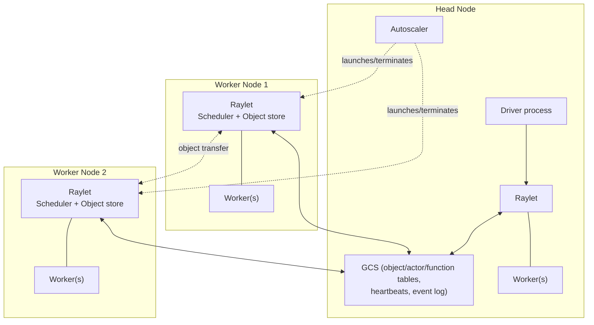
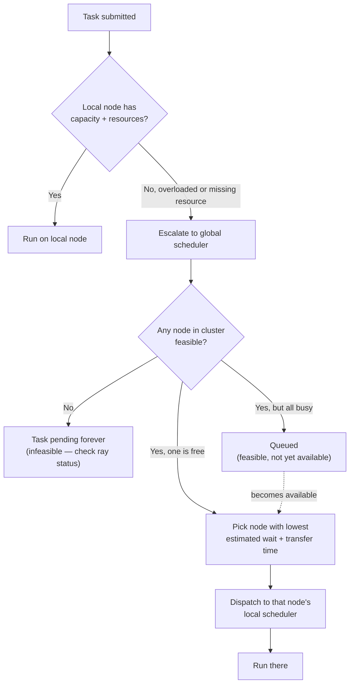

# Day 10 — Ray Architecture, Scheduling, Resources

**Sources:** *Learning Ray* Ch.1-2 (Ray Cluster diagram, "Understanding Ray System Components", the Raylet/GCS/head-node walkthrough). *Scaling Python with Ray* Ch.1 ("Where Can You Run Ray?", cluster architecture figure), Ch.5 "Ray Design Details" (Resources/Vertical Scaling, Autoscaler, Placement Groups — the "Ray Scheduler" sidebar on bottom-up distributed scheduling). Cross-checked against current `docs.ray.io` scheduling/placement-group docs. Installed version: Ray 2.58.0.

**Cross-links:** what actually gets scheduled → [Day 09](day09_ray_core_tasks_actors.md). Where scheduled work's data lives → [Day 11](day11_object_store_data_movement.md). What happens when a scheduled node dies → [Day 12](day12_fault_tolerance.md).

---

## 1. Definitions and terminology

| Term | Definition |
|---|---|
| **Ray Cluster** | A head node plus zero or more worker nodes, connected over the network, that together run one logical Ray deployment. Can be a single laptop (the head node *is* the only node) or hundreds of machines. |
| **Head node** | The one distinguished node running the driver's entry point plus cluster-management processes: the **GCS** and the **autoscaler**. A single point of failure (see [Day 12](day12_fault_tolerance.md)). |
| **Worker node** | Any node running worker processes that execute tasks/actors. |
| **Raylet** | The per-node system process. Every node (head or worker) runs exactly one. Contains two components: a **local scheduler** and an **object store**. |
| **GCS (Global Control Store)** | A key-value store with pub/sub, running on the head node, holding cluster-wide metadata: object locations, actor locations, function definitions, node heartbeats, event logs. Powers the dashboard and error diagnostics. |
| **Local scheduler** | Part of the Raylet. Decides task placement *on its own node first*; escalates to the global/distributed scheduler if it can't satisfy a request locally. |
| **Distributed/global scheduler** | The logical union of every node's local scheduler, coordinating via the GCS — there isn't a single separate "global scheduler process" in modern Ray; scheduling is bottom-up and decentralized. |
| **Resources (logical)** | Ray's abstraction for what a task/actor needs to run: CPU, GPU, memory, and arbitrary custom resources (e.g. a licensed-software tag). Requested via `@ray.remote(num_cpus=..., num_gpus=..., resources={...})`. |
| **Feasible vs. available** | *Feasible* = some node in the cluster could in principle satisfy this resource request (right hardware exists). *Available* = a node can satisfy it **right now** (resources aren't currently claimed by something else). A request can be feasible-but-unavailable (queues), or infeasible (never runs, ever). |
| **Placement group** | A resource-reservation + colocation mechanism: reserve a set of resource **bundles** across the cluster atomically, then explicitly schedule tasks/actors onto specific bundles. |
| **Bundle** | A collection of resources (e.g. `{"CPU": 2, "GPU": 1}`) that must fit on a single machine. A placement group is a list of bundles. |
| **Autoscaler** | The head-node process that launches new worker nodes when demand (tasks, actors, placement groups, or an explicit `request_resources()` call) exceeds current cluster capacity, and terminates idle ones. |

---

## 2. Architecture and internal behavior



**Bottom-up distributed scheduling** (the actual algorithm, per *Scaling Python with Ray* Ch.5's "Ray Scheduler" sidebar):

1. A task is always first submitted to **the local scheduler of the node that created it** (locality-first — cheap, no network round trip if it can just run here).
2. If the local node is overloaded (queue past a threshold) or can't satisfy the request (e.g. needs a GPU this node doesn't have), the local scheduler escalates to the **global scheduler**.
3. The global scheduler looks at every node's advertised resources and queue depth (via periodic heartbeats to the GCS) and picks the node with the lowest *estimated total wait* — queue time plus estimated time to transfer any remote input data.
4. It hands the task to that node's local scheduler, which actually places and runs it.



The head node's **GCS** is what makes this decentralized-but-coordinated: every Raylet sends heartbeats (resource availability, queue depth) to the GCS, and every scheduler consults the GCS to see the rest of the cluster's state — there's no single bottleneck process making every scheduling decision.

---

## 3. How the concepts relate

- **Tasks/actors** ([Day 09](day09_ray_core_tasks_actors.md)) are *what* gets scheduled; this page is about *where* and *how the decision gets made*.
- The **object store** lives inside the same Raylet as the scheduler — this is not a coincidence: co-locating them lets the scheduler factor "how much data would need to move" into its placement decision (data locality). Full depth: [Day 11](day11_object_store_data_movement.md).
- The GCS's statelessness-enabling design (it holds *all* the cluster metadata so individual components can be stateless and restartable) is the foundation of Ray's fault-tolerance story — see [Day 12](day12_fault_tolerance.md).
- **Placement groups** sit *above* plain resource requests: they're how you get multiple tasks/actors co-scheduled deliberately (e.g. for gang-scheduled distributed training, Day 14) rather than leaving each one to be placed independently.

---

## 4. What needs to be understood deeply

- **The head node (and GCS) is a single point of failure that Ray does not recover from on its own.** Lose the head node, lose the cluster — worker nodes become orphans needing manual cleanup. This is a hard architectural fact, not a configuration gap you can tune away (rolling your own HA, e.g. with an external coordination service, is on you). This has direct production consequences: your head node needs to be the most reliable machine in the fleet, or fronted by your own failover mechanism.
- **Resource requests are, by default, *soft* / advisory for scheduling admission — not hard runtime limits.** Requesting `num_cpus=4` reserves scheduling "credit," it does not sandbox the process to 4 cores; nothing stops your code from actually using more. Memory requests are similarly used for admission control, not enforcement.
- **Feasible vs. available is the single most important distinction for diagnosing "my task never runs."** A request that's feasible-but-unavailable will eventually run (once resources free up, or the autoscaler adds a node). A request that's infeasible (you asked for a GPU and no node type in your cluster config has one) will queue **forever**, silently, with no error.
- **Bottom-up scheduling means locality is the default bias**, not an opt-in feature — tasks prefer to run where they were submitted from unless there's a good reason (overload, missing resource) not to. This is why colocating dependent, chatty computation tends to "just work" reasonably well without you manually pinning anything.

---

## 5. Easy to confuse

| A | B | The distinction |
|---|---|---|
| Feasible | Available | Feasible = physically possible somewhere in the cluster, ever. Available = a node could run it *right now*. Infeasible tasks queue forever with no error; unavailable-but-feasible tasks just wait their turn. |
| Scheduler | Autoscaler | The scheduler decides *which existing node* runs a task. The autoscaler decides whether to *add or remove nodes* from the cluster in the first place. A scheduler with nowhere feasible to place a task can trigger the autoscaler to provision a new node that matches. |
| Resource *request* | Resource *guarantee/limit* | A request is what you ask for at scheduling time (soft, for CPU/memory by default). It is not a sandboxing/isolation guarantee once the task is running. |
| PACK | SPREAD | PACK tries to consolidate bundles onto as few nodes as possible (favors data locality, best-effort). SPREAD tries to place bundles on as many *different* nodes as possible (favors fault isolation/load balancing, best-effort). |
| PACK | STRICT_PACK | PACK falls back to other nodes if it can't fit everything on one; STRICT_PACK fails outright if it can't fit on a single node. Same PACK-vs-SPREAD distinction applies to STRICT_SPREAD vs SPREAD. |
| A **logical** node | A **physical** machine | Ray nodes map to logical entities (often containers); a single physical machine *can* run more than one logical Ray node, though the common case is 1:1. |

---

## 6. Practical engineering patterns

**Placement groups for gang scheduling** (all-or-nothing colocated resources — critical for distributed training where every worker must exist before training can start):
```python
from ray.util.placement_group import placement_group
from ray.util.scheduling_strategies import PlacementGroupSchedulingStrategy

pg = placement_group([{"CPU": 4, "GPU": 1}] * 4, strategy="SPREAD")
ray.get(pg.ready())   # blocks until the whole group is allocated, atomically

worker = TrainWorker.options(
    scheduling_strategy=PlacementGroupSchedulingStrategy(placement_group=pg, placement_group_bundle_index=0)
).remote()
```
> Current Ray favors `scheduling_strategy=PlacementGroupSchedulingStrategy(...)` in `.options()` over the older direct `placement_group=pg` kwarg style shown in the 2022/2023-era books — same underlying concept, newer spelling.

**SPREAD for high-availability services**: spreading actor replicas (e.g. a fleet of feature-serving actors) across distinct nodes so a single node failure doesn't take out every replica at once.

**PACK for data-locality-sensitive pipelines**: keep a chain of tasks that pass large intermediate objects on the same node, minimizing cross-node object transfer (see [Day 11](day11_object_store_data_movement.md)).

**Custom resources for heterogeneous or licensed hardware**: tag specific nodes (`--resources='{"has_gpu_driver_x": 1}'`) and request that tag from `@ray.remote(resources={"has_gpu_driver_x": 1})` — the same mechanism used for CPU/GPU, generalized to anything you want to model as a schedulable resource.

---

## 7. Common mistakes and misconceptions

1. **Treating a resource request as a runtime sandbox/limit.** Requesting `num_cpus=1` does not stop your task from spawning threads that use 8 cores — it only affects how many *other* 1-CPU tasks Ray will schedule alongside it. Over-subscription is a real, self-inflicted failure mode.
2. **Never noticing a task is infeasible.** An infeasible task produces no error, no exception — it just sits pending forever. If something never starts, checking feasibility (`ray status`, dashboard Resources view) has to be your first move, not your last.
3. **Forgetting placement-group cleanup.** Non-detached placement groups are cleaned up when their creating job ends, but a *detached* one (`lifetime="detached"`) survives the job and will keep the cluster from scaling those nodes down until you explicitly `remove_placement_group()` it.
4. **The zero-CPU actor trap.** If you don't specify `num_cpus` for an actor, Ray's default differs from tasks: an actor with no CPU resources specified still gets scheduled with 1 CPU accounted for scheduling, but can then run on a "0-CPU" node without contributing to that node's apparent load — surprising if you were expecting parity with task defaults. Always specify resource requirements explicitly rather than relying on defaults for actors.
5. **Over-fragmenting placement group bundles across too many nodes**, destroying the very data locality you wanted PACK for — SPREAD and PACK are a real tradeoff (fault isolation vs. transfer cost), not a "SPREAD is always safer" default.

---

## 8. Production considerations

- **Mapping to Kubernetes**: KubeRay maps Ray's head/worker node concept onto Kubernetes pods, and the autoscaler onto pod-level scale-up/down — the logical architecture here is exactly what you configure in a `RayCluster`/`RayJob` CRD.
- **Cost**: the autoscaler is the lever that turns "elastic compute" into an actual cost story — SPREAD-heavy placement strategies and low idle-timeout thresholds cost more (more nodes kept warm/spun up) in exchange for resilience/throughput; PACK-heavy strategies cost less but concentrate risk.
- **Multi-tenant clusters**: resource requests are your only real isolation mechanism between jobs sharing a cluster, and they're soft by default — noisy-neighbor problems are a real operational risk if you don't pair Ray's resource model with actual OS/container-level limits (cgroups) in a shared environment.
- **Contrast with Spark's driver/executor model**: conceptually parallel (driver ~ head node's driver process, executors ~ worker processes) but Ray's scheduling is bottom-up/decentralized with a lightweight GCS for coordination, vs. Spark's more centralized driver-orchestrated DAG scheduling. Revisited with real measurements in Day 13.

---

## 9. Debugging and performance reasoning

- **`ray status`** — cluster-level view: nodes, resource totals/usage, pending/infeasible resource demands. First command to run when something "isn't starting."
- **Dashboard → Cluster / Resources tab** — visual version of the same, plus per-node breakdown.
- **Symptom → cause:**

| Symptom | Likely cause | Where to look |
|---|---|---|
| Task pending forever, no error | Infeasible resource request (no node type can ever satisfy it) | `ray status` "Demands" section — flags infeasible separately from pending |
| Task pending, but eventually more nodes appear and it runs | Feasible but unavailable; autoscaler is provisioning | Dashboard autoscaler events / node count over time |
| Placement group `ready()` never resolves | Bundle too large for any single node in the cluster (STRICT_PACK) or not enough distinct nodes (STRICT_SPREAD) | `placement_group_table()`, `ray status` |
| Everything schedules onto one node even though you expected spread | Default strategy is `PACK`; you didn't request `SPREAD` explicitly | Check the `strategy=` argument at placement-group creation |
| Cluster "randomly" becomes unusable, nothing recovers | Head node / GCS failure | This is a known unrecoverable-by-Ray scenario — see [Day 12](day12_fault_tolerance.md) |

---

## 10. Examples and exercises

### Worked example — mixed CPU/GPU placement group (adapted from *Scaling Python with Ray* Ch.5)
```python
from ray.util.placement_group import placement_group, placement_group_table

cpu_bundle = {"CPU": 1}
gpu_bundle = {"GPU": 1}
pg = placement_group([cpu_bundle, gpu_bundle])
ray.get(pg.ready())
print(placement_group_table(pg))
print(ray.available_resources())
```

### Exercises (unsolved)

1. **Create an unschedulable task on purpose.** Request a resource combination your machine cannot satisfy (e.g. `num_gpus=1` on a GPU-less laptop, or a custom resource tag nothing advertises). Confirm via `ray status` that it's reported as infeasible, not just slow. What's the exact wording Ray uses to tell you this?
2. **Design a gang-scheduled placement group** for a hypothetical 4-worker distributed training job needing 2 CPUs + access to a shared "fast_disk" custom resource each. Write the bundle list and pick a strategy — justify PACK vs. SPREAD for this specific case.
3. **Locality experiment.** Build a small pipeline of two chained tasks that pass a moderately large object between them (a few tens of MB). Force them onto different nodes if you can (or reason about it if running single-node), and separately force them to prefer the same node. What would you expect to measure, and why?
4. **Read the architecture whitepaper cross-check.** Skim Ray's own architecture documentation (`docs.ray.io`) for one claim in this file (e.g. "scheduling is bottom-up") and note whether current docs still describe it exactly this way, or whether something has shifted since the 2022/2023 books this file is grounded in.
