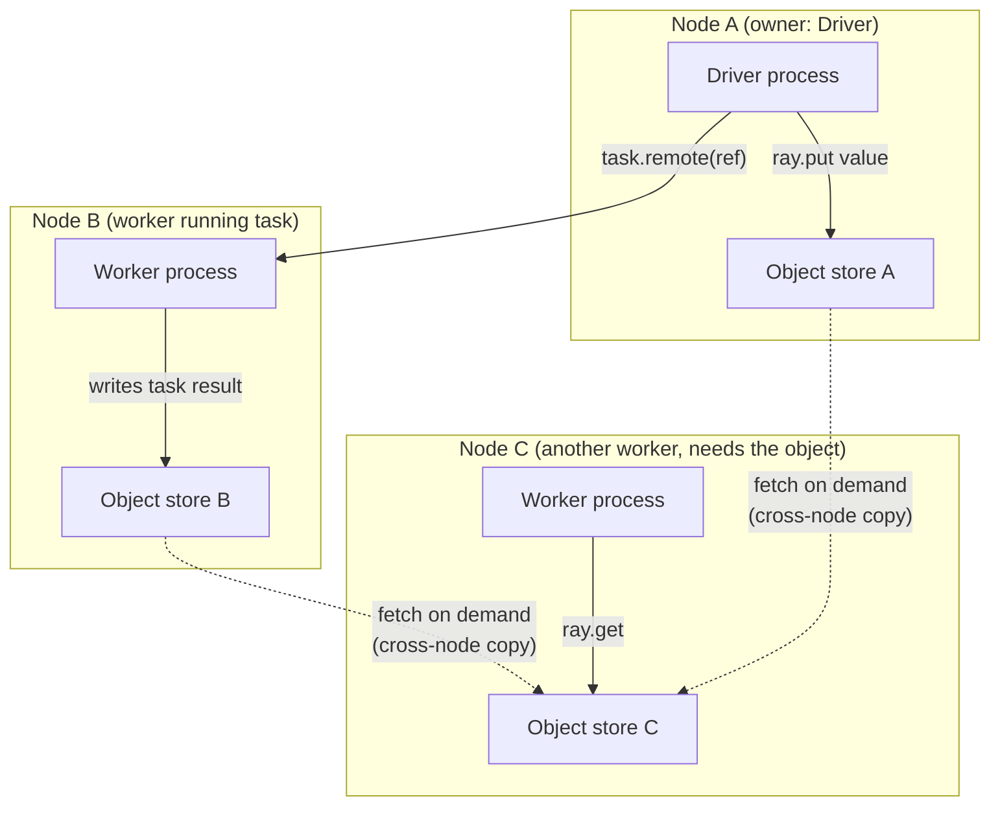

# Day 11 — Ray Object Store, Data Movement, Memory

**Sources:** *Scaling Python with Ray* Ch.5 "Ray Design Details" — "Ray Objects" (ownership, immutability, reference counting, spilling), "Serialization/Pickling" (cloudpickle, Apache Arrow, gRPC). *Learning Ray* Ch.2 (object store `put`/`get` walkthrough, dependency resolution). Cross-checked against current `docs.ray.io` objects guide (ownership as "distributed reference counting," zero-copy `numpy` behavior, top-level vs. nested argument dereferencing). Installed version: Ray 2.58.0.

**Cross-links:** what produces/consumes objects → [Day 09](day09_ray_core_tasks_actors.md). Where the object store physically lives (inside the Raylet) and how it factors into scheduling → [Day 10](day10_architecture_scheduling.md). What happens when an object is lost → [Day 12](day12_fault_tolerance.md).

---

## 1. Definitions and terminology

| Term | Definition |
|---|---|
| **Object store** | A per-node, shared-memory store (implemented via **Plasma**, now part of Apache Arrow) holding the actual bytes of every Ray object. Every Raylet runs one. Collectively, all object stores form the cluster's distributed object store. |
| **`ObjectRef`** | A unique ID referring to a remote object — conceptually a future. Created by `ray.put()`, or automatically for every task/actor-method return value. |
| **Ownership** | The worker process that *created* an `ObjectRef` (by calling `ray.put()` or by submitting the task that produced it) is that object's **owner**. The owner tracks the object's reference count and metadata for its whole lifetime — this is decentralized (each worker owns its own objects), not centralized in the GCS. |
| **Distributed reference counting** | How Ray knows when it's safe to free an object: it counts every live reference to an `ObjectRef` across the whole cluster (in Python variables, in pending task arguments, in closures), and garbage-collects the object once that count hits zero. |
| **Immutability** | Once written, an object's bytes in the store never change. `ray.get()` gives you a Python copy (or a zero-copy view, for supported types) — mutating what you got back does not affect the stored object or any other holder of the same ref. |
| **cloudpickle** | Ray's default serializer for most Python objects, functions, and actor definitions — an enhanced fork of `pickle` capable of serializing things standard `pickle` can't (e.g. locally-defined functions, lambdas, closures). |
| **Apache Arrow** | A columnar, cross-language, strongly-typed in-memory format. Ray uses Arrow for datasets/typed data where possible — enables zero-copy reads and interop with pandas, Spark, TensorFlow, etc. Falls back to cloudpickle when a type isn't Arrow-representable. |
| **gRPC** | The RPC framework underlying most inter-process communication in Ray (task dispatch, metadata exchange); uses Protocol Buffers. Large objects/datasets bypass gRPC's serialization in favor of Arrow/cloudpickle + the shared-memory object store. |
| **Spilling** | When an object store fills up (after garbage collection has already run), Ray writes objects out to local disk to free memory — "spilling to disk," analogous to Spark's shuffle-spill. |
| **`ObjectLostError`** | Raised when `ray.get()` can't find any live copy of an object and reconstruction (if enabled) fails or isn't possible. |
| **`OwnerDiedError`** | Raised specifically when the *owning* process (not just a copy-holding node) has died — this is unrecoverable, because reference-count/metadata tracking for that object died with it. |

---

## 2. Architecture and internal behavior



Key mechanics:

- **Small objects** are, in general, initially kept in the owner's **in-process** store (fast, no shared-memory overhead); **large objects** are stored in the *generating worker's* shared-memory object store. This balances per-object memory footprint against resolution speed — you don't need to think about this split explicitly, but it explains why tiny `ray.put()` calls are essentially free.
- **A remote object can live on one or many nodes**, independent of who holds the `ObjectRef`s. Ray does not proactively replicate objects to every node — if node C needs an object that only exists on node B, it asks the *owner* who has copies, then fetches and caches a local copy.
- **Argument-passing semantics matter**: a *top-level* argument to a `.remote()` call (`f.remote(some_ref)`) is automatically dereferenced by Ray before your function body runs — you receive the actual value, not the ref. A *nested* reference (e.g. inside a list or dict: `f.remote([ref1, ref2])`) is **not** auto-dereferenced — your function receives the `ObjectRef` objects themselves and must call `ray.get()` on them explicitly if it needs the values. This distinction is easy to miss and produces confusing bugs (function receives an `ObjectRef` where it expected a value).
- **Serialization pipeline**: gRPC/Protocol Buffers move small control-plane metadata; Arrow handles typed/tabular data with zero-copy reads where possible (e.g. numpy arrays backed directly by shared memory — no deserialization copy at all); cloudpickle handles arbitrary Python objects, functions, and anything Arrow can't represent, falling back automatically.

Full detail on where the *scheduler* factors object location into task placement: [Day 10](day10_architecture_scheduling.md).

---

## 3. How the concepts relate

- Every `.remote()` call from [Day 09](day09_ray_core_tasks_actors.md) either **consumes** objects (as arguments) or **produces** one (its return value) — tasks and actors are the verbs, objects are the nouns they operate on.
- The object store physically lives inside the same Raylet process as the local scheduler ([Day 10](day10_architecture_scheduling.md)) — this co-location is what lets the scheduler reason about data locality when deciding where to run a task.
- Ownership is the seed of Ray's fault-tolerance model for data: whether an object can be recovered after a failure depends entirely on whether its *owner* is still alive, not just whether some *copy* still exists — see [Day 12](day12_fault_tolerance.md) for the full `ObjectLostError` vs `OwnerDiedError` distinction.

---

## 4. What needs to be understood deeply

- **Objects are immutable — always.** `v = ray.get(ref); v.append(x)` mutates your local Python copy only. The object in the store, and every other holder's copy, is unaffected. If you need the "updated" version to be visible elsewhere, you must explicitly `ray.put()` the new value and distribute the new ref.
- **Ownership, not "existence of a copy," determines recoverability.** An object with zero live copies but a live owner can potentially be lazily reconstructed (see [Day 12](day12_fault_tolerance.md)). An object whose *owner* process has died is unrecoverable — no amount of surviving copies elsewhere changes that, because the reference-counting/lineage bookkeeping needed to safely reconstruct or garbage-collect it died with the owner.
- **Passing `ObjectRef`s downstream instead of materializing values at the driver is the single highest-leverage pattern for pipeline performance.** Every unnecessary `ray.get()` at the driver forces a network hop *and* funnels all your pipeline's data through one process. Chain refs directly between tasks (§6 of [Day 09](day09_ray_core_tasks_actors.md)) whenever the driver doesn't actually need the intermediate value.
- **Top-level vs. nested dereferencing is not a stylistic detail — it changes your function's signature contract.** If you're not sure whether an argument arrives dereferenced, check where it sits in the call (top-level vs. nested in a container) rather than guessing.

---

## 5. Easy to confuse

| A | B | The distinction |
|---|---|---|
| Object store memory | Worker heap memory | Object store memory holds `ray.put()`'d/task-returned objects, managed by Plasma/Arrow, shared across processes on a node. Worker heap memory is ordinary per-process Python memory (RSS minus shared usage) — your own local variables, unrelated to what's in the store. |
| Object store memory | GCS/Redis memory | GCS memory holds cluster *metadata* (object/actor/function tables, heartbeats) — small, control-plane. Object store memory holds actual *data* bytes — can be huge. Conflating the two is a common source of "why is my small program using so much RAM" confusion. |
| Eviction (GC) | Spilling | Eviction removes objects with zero references — pure garbage collection, no data preserved. Spilling writes still-referenced objects to disk because memory is full — the data is preserved, just moved off RAM. Spilling only kicks in *after* GC has already run and memory pressure remains. |
| `ObjectLostError` | `OwnerDiedError` | Lost = no live copy exists anywhere right now; may be recoverable via lineage reconstruction if the owner is alive. Owner-died = the owning process itself is gone; unrecoverable, full stop. |
| Local copy | Owner | Any node that has fetched and cached an object's bytes holds a "copy." Only one process — the one that created the `ObjectRef` — is the "owner," responsible for its lifecycle bookkeeping. These are not the same thing and don't have to coincide. |

---

## 6. Practical engineering patterns

**`ray.put()` once, share the reference widely (broadcast-style):**
```python
big_lookup_table = ray.put(load_large_reference_data())
results = ray.get([enrich.remote(row, big_lookup_table) for row in rows])
```
Directly analogous to a Spark broadcast join/variable — avoid re-serializing and re-copying the same large object into every task's arguments.

**Chain refs through a pipeline, `ray.get()` only at the very end (or never, if handing off to Ray Data/Train):**
```python
stage1 = [extract.remote(f) for f in files]
stage2 = [transform.remote(ref) for ref in stage1]
stage3 = [load.remote(ref) for ref in stage2]
ray.get(stage3)   # only block once, at the true end of the pipeline
```

**Controlling spill location for performance:**
```python
ray.init(_system_config={
    "min_spilling_size": 1024 * 1024,
    "object_spilling_config": json.dumps({"type": "filesystem", "params": {"directory_path": "/fast/nvme/scratch"}}),
})
```
If your node has a mix of fast (NVMe/SSD) and slow storage, point spilling at the fast disk explicitly — the default may not pick it.

**Re-`put()` after mutation, don't fight immutability:**
```python
v = ray.get(ref)
v = v + [new_item]          # build a new value
new_ref = ray.put(v)        # explicitly publish the updated version
```

---

## 7. Common mistakes and misconceptions

1. **Expecting a mutation on a `ray.get()` result to propagate.** It never does — objects are immutable in the store; you're always mutating your own local deserialized copy. This is the exact case shown in *Scaling Python with Ray*'s "Immutable Ray objects" example: `v = ray.get(remote_array); v.append(2)` never changes what a second `ray.get(remote_array)` returns.
2. **Passing a large object by value repeatedly instead of `ray.put()`-ing once** — re-serializes and re-transmits the same bytes into every task's argument list (also flagged in [Day 09](day09_ray_core_tasks_actors.md) §7, from the task/actor side — same root cause, viewed from the object side here).
3. **Circular references defeating reference-counting garbage collection.** Ray's refcounting has the same cycle problem as Python's own GC — objects that reference each other in a cycle may never hit a zero count. `ray memory --group-by STACK_TRACE` is the tool for hunting these down when the object store mysteriously won't shrink.
4. **Confusing "object store is full" with "my program has a memory leak in the usual sense."** An `ObjectStoreFullError` is about the shared Plasma store specifically, not worker heap memory — check what's pinning objects (unreleased refs held in a long-lived list, an actor holding refs forever) rather than looking for a heap leak.
5. **Not distinguishing top-level from nested argument dereferencing** (§2, §4) — a function written assuming it always receives values will break the moment it's called with a ref buried inside a list/dict argument instead of passed directly.
6. **A slow first run mistaken for object-store or task-granularity cost when it's actually dependency/`runtime_env` packaging.** If Ray has to build or ship a project's environment to every worker before anything runs, that setup cost is separate from — and can dwarf — either the per-task scheduling overhead ([Day 09](day09_ray_core_tasks_actors.md) §7) or actual object transfer cost described on this page. The tell: look for environment-setup log lines (virtualenv creation, package installs) preceding your first task output, not object-store or spilling messages.

---

## 8. Production considerations

- **Object-store sizing vs. node RAM**: the object store claims a configurable fraction of node memory up front (`object_store_memory_mb` / `_system_config`); undersizing it causes premature spilling (disk I/O tax on your pipeline), oversizing it starves worker-heap memory for your actual Python code.
- **Spilling as Ray's analogue to Spark's shuffle-spill**: both are "graceful degradation under memory pressure by trading to disk I/O" — the tuning conversation (fast local disks, watching spill volume as a red flag, right-sizing memory before reaching for more nodes) transfers directly between the two systems.
- **Zero-copy numpy/Arrow reads**: for numerically heavy feature-engineering pipelines, preferring numpy/Arrow-backed structures over arbitrary Python objects (which fall back to cloudpickle) is a real, measurable performance lever — cross-reference this against Ray Data's block format in Day 13.
- **Broadcast-style `ray.put()` for reference/dimension data** mirrors exactly the same judgment call a Spark engineer makes with broadcast joins — same underlying tradeoff (network/serialization cost paid once vs. many times), different API.

---

## 9. Debugging and performance reasoning

- **`ray memory --group-by STACK_TRACE`** — dumps what's currently pinned in the object store and where the reference lives in your code; the primary tool for chasing down unexpected memory growth or `ObjectStoreFullError`.
- **Dashboard → memory/object views** — visual equivalent, useful for watching spill volume over time.
- **Symptom → cause:**

| Symptom | Likely cause |
|---|---|
| `ObjectStoreFullError` | Too many large objects pinned by live references (or a reference cycle) — not a worker-heap leak |
| Mutating a `ray.get()` result "doesn't stick" | Working as designed — objects are immutable; you must re-`ray.put()` |
| A function receives an `ObjectRef` object instead of the value it expected | Argument was nested (inside a list/dict) rather than top-level in the `.remote()` call — not auto-dereferenced |
| Pipeline slower than expected despite "parallel" tasks | Large values are round-tripping through the driver via unnecessary intermediate `ray.get()` calls instead of being chained as refs |
| Disk I/O spikes during a large job | Object store spilling — check if the store is undersized for the working set |
| First run of a trivial workload takes far longer than the workload itself | `runtime_env` / dependency packaging cost, not object-store behavior — see §7.6 |

---

## 10. Examples and exercises

### Worked example — immutability, made concrete (from *Scaling Python with Ray* Ch.5)
```python
remote_array = ray.put([1])
v = ray.get(remote_array)
v.append(2)
print(v)                          # [1, 2]  — your local copy
print(ray.get(remote_array))      # [1]     — the stored object, unchanged
```

### Exercises (unsolved)

1. **Reproduce the immutability example yourself** with a more realistic object (a small dict representing a transaction record). Confirm the stored version never changes no matter what you do to a `ray.get()`'d copy, then write the correct pattern for "publishing an updated version."
2. **Broadcast-vs-repeat experiment.** Take a moderately large lookup structure (a few MB) and write two versions of a fan-out computation over it: one passing the raw object into every task call, one `ray.put()`-ing it once first. Measure wall time at increasing task counts. At what count does the difference become significant, and why?
3. **Trigger and diagnose an `ObjectStoreFullError` on purpose** (small `object_store_memory_mb`, generate enough objects to exceed it without releasing references). Use `ray memory --group-by STACK_TRACE` to identify what's pinning memory before you fix it.
4. **Nested-vs-top-level argument bug, deliberately.** Write a task that expects a value but is called with a ref buried inside a list argument. Observe the resulting error/behavior, then fix it correctly (either restructure the call, or `ray.get()` inside the function).
5. **Connect this to Day 09's debugging puzzle.** If you haven't already resolved why a trivial 20-task parallel run took 10 seconds, use what you now know about `runtime_env` packaging vs. object-store cost to separate the two hypotheses — which log evidence would tell them apart?
