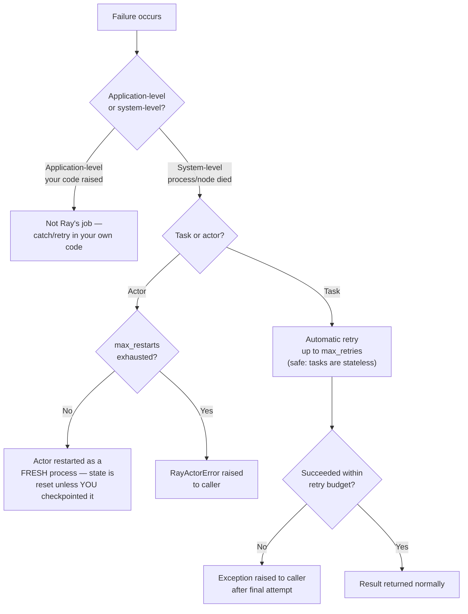

# Day 12 — Ray Fault Tolerance

**Sources:** *Scaling Python with Ray* Ch.5 "Ray Design Details" — "Fault Tolerance" section (task retry, actor restart, detached resources, object reconstruction), Ch.4 "Remote Actors" (actor persistence). *Learning Ray* Ch.2 (ownership table, worker failure recovery basics). Cross-checked against current `docs.ray.io` fault-tolerance docs (application-level vs. system-level failure classification, lineage reconstruction, `OwnerDiedError`, `NodeAffinitySchedulingStrategy(soft=True)` as current best practice). Installed version: Ray 2.58.0. General distributed-systems framing (replication vs. recomputation as recovery strategies, idempotence) draws on Kleppmann's *Designing Data-Intensive Applications*.

**Cross-links:** what kind of thing is failing (task vs. actor) → [Day 09](day09_ray_core_tasks_actors.md). Why the head node/GCS is a structural single point of failure → [Day 10](day10_architecture_scheduling.md). Object loss specifically (ownership-dependent recovery) → [Day 11](day11_object_store_data_movement.md).

---

## 1. Definitions and terminology

| Term | Definition |
|---|---|
| **Application-level failure** | A bug in *your* code, or a failure in an external system your code calls (e.g. an API timeout). Ray does not and cannot distinguish this from "working as intended" — it's on you to catch/retry/handle it. |
| **System-level failure** | A node crashing, a network partition, a Ray-internal bug, a process being OOM-killed. Ray has dedicated recovery machinery for this category. |
| **`max_retries`** | Task-level setting (default varies by Ray version, commonly 3): how many times Ray automatically re-runs a *task* that failed due to a system-level failure (e.g. the worker process died). |
| **`max_restarts`** | Actor-level setting: how many times Ray automatically restarts an *actor* (as a fresh process) if it dies. Does **not** by itself preserve any of the actor's prior in-memory state. |
| **`max_task_retries`** | Actor-level setting controlling whether an in-flight *method call* to a since-restarted actor is retried, separate from whether the actor itself restarts. |
| **`RayActorError`** | The exception you get back from `ray.get()` when an actor died and either won't be restarted, or has exhausted its restarts. |
| **`ObjectLostError`** | Raised when `ray.get()` can't find a live copy of an object and it can't be (or wasn't configured to be) reconstructed. |
| **`OwnerDiedError`** | Raised when the object's *owning process* — not just a copy-holding node — has died. Unrecoverable; see [Day 11](day11_object_store_data_movement.md). |
| **Lineage reconstruction** | Ray's mechanism for recovering a lost object owned by a still-alive, long-lived owner (e.g. the driver): it *re-runs the task that originally produced the object*, using recorded lineage, rather than restoring from a backup copy. Lazy — only triggered when the object is actually needed again. |
| **Detached actor / placement group** | An actor or placement group created with `lifetime="detached"`: it outlives the job that created it and is *not* automatically cleaned up or garbage-collected when that job ends. Ray will still restart it (per its own `max_restarts`) if the cluster itself survives. |

---

## 2. Architecture and internal behavior

The entire fault-tolerance story rests on one architectural choice from [Day 10](day10_architecture_scheduling.md): **the GCS holds all cluster-wide state, which lets every other component be effectively stateless and restartable.** A Raylet or worker that crashes and comes back can rehydrate what it needs from the GCS (and, for objects, from recorded lineage) rather than needing its own durable state.



**Object loss specifically** branches on ownership, not on where copies existed:

```mermaid
flowchart TD
    OL[ray.get() can't find object] --> Owner{Is the OWNER<br/>process still alive?}
    Owner -->|No| OD["OwnerDiedError — unrecoverable.<br/>Refcounting/lineage bookkeeping<br/>died with the owner."]
    Owner -->|Yes| Recon{enable_object_reconstruction<br/>and lineage available?}
    Recon -->|Yes| Rerun["Lazily RE-RUN the task<br/>that produced the object"]
    Recon -->|No| OLE[ObjectLostError raised]
```

**What is explicitly *not* recoverable by Ray itself**: loss of the **head node** or the **GCS**, or the connection between your application and the head node. This is stated plainly in the source material — if you need to survive that, you build your own HA (e.g. an external coordination service) on top; Ray does not do it for you.

---

## 3. How the concepts relate

- **Tasks vs. actors fail fundamentally differently** ([Day 09](day09_ray_core_tasks_actors.md)): because tasks are stateless, automatic retry is *always* safe from Ray's point of view (whether it's safe for *your* system depends on idempotence — §4). Because actors hold state, "recovery" only restarts the *process* — your state is gone unless you explicitly designed for that.
- **The GCS/head-node architecture** ([Day 10](day10_architecture_scheduling.md)) is *why* everything else can recover cheaply — and *why* the head node itself can't recover from its own loss (there's no higher authority to hold GCS's own lineage).
- **Object recovery is entirely gated on ownership** ([Day 11](day11_object_store_data_movement.md)) — the same "who owns this" concept that governs reference counting also governs whether lineage reconstruction is even possible.

---

## 4. What needs to be understood deeply

- **Automatic task retry is safe *for Ray*, not automatically safe *for your system*.** Ray will happily re-run a task that partially wrote to an external database before crashing. If that write wasn't idempotent, a retry can duplicate it. Retry-safety is a property you have to design into your task logic (idempotent writes, upserts instead of inserts, etc.) — Ray's retry mechanism doesn't know or care what your task's side effects are.
- **`max_restarts` alone does nothing for your data.** It's tempting to read "actor gets restarted automatically" as "actor recovers automatically" — it does not. Restart means a brand-new process is created and `__init__` runs again from scratch. If you need continuity, you must implement your own checkpoint/restore (write state somewhere durable periodically, reload it in `__init__`).
- **The owner-vs-copy asymmetry for objects is the crux of Day 11 and Day 12 meeting**: losing a *copy* of an object is often recoverable (fetch another copy, or reconstruct from lineage if the owner survives); losing the *owner* is not, regardless of how many copies exist elsewhere, because nothing else is tracking that object's lifecycle.
- **This is a recomputation-based recovery model, not a replication-based one** (DDIA framing): Ray's default answer to "how do we recover lost data" is *re-run the task that made it* (lineage reconstruction), not *keep redundant copies around proactively*. This has direct cost implications — recomputation is cheap in storage, expensive in re-execution time for costly tasks; replication is the opposite tradeoff. Ray leans toward the former by default.

---

## 5. Easy to confuse

| A | B | The distinction |
|---|---|---|
| Task retry | Actor restart | Retry re-runs a *stateless* function call from scratch, transparently. Restart spins up a *new process* for a *stateful* actor — the old state is gone unless you saved it yourself. |
| `max_restarts` | `max_task_retries` | `max_restarts` bounds how many times the actor *process itself* gets recreated. `max_task_retries` separately controls whether an individual in-flight *method call* against that actor is retried when it fails due to the restart. |
| `ObjectLostError` | `OwnerDiedError` | Lost = potentially recoverable (owner alive, lineage available). Owner-died = never recoverable — this specific object is gone for good. |
| Detached actor/placement group | Ordinary (non-detached) one | Detached survives the creating job ending — you must explicitly clean it up, and it will occupy cluster resources (blocking autoscale-down) until you do. Non-detached is garbage-collected automatically when its job ends. |
| System-level failure recovery | Head-node/GCS failure recovery | Ray has real, automatic machinery for the former (task retry, actor restart, object reconstruction). It has **none** for the latter — that's a "bring your own HA" problem. |

---

## 6. Practical engineering patterns

**Idempotent task design so automatic retries are actually safe:**
```python
@ray.remote(max_retries=3)
def upsert_feature_row(row_id, value):
    # UPSERT, not INSERT — safe to run twice with the same input
    db.execute("INSERT INTO features (id, value) VALUES (%s, %s) "
               "ON CONFLICT (id) DO UPDATE SET value = EXCLUDED.value", (row_id, value))
```

**Actor checkpoint-and-restore for genuine state continuity:**
```python
@ray.remote(max_restarts=5, max_task_retries=-1)   # -1 = retry method calls indefinitely
class StatefulAggregator:
    def __init__(self, checkpoint_store):
        self._store = checkpoint_store
        self._state = self._store.load() or {}   # rehydrate on (re)start

    def update(self, key, value):
        self._state[key] = value
        if should_checkpoint(self._state):
            self._store.save(self._state)         # periodic durable checkpoint
```

**Detached long-lived actors for a shared service** (e.g. a feature-store cache multiple jobs depend on):
```python
FeatureCache.options(name="feature_cache", lifetime="detached").remote()
# ... later, from a completely different job:
cache = ray.get_actor("feature_cache")
```
Remember: you now own its cleanup — nothing removes it automatically.

**Resilient placement instead of hard node-pinning** (current best practice per `docs.ray.io`):
```python
from ray.util.scheduling_strategies import NodeAffinitySchedulingStrategy

task.options(
    scheduling_strategy=NodeAffinitySchedulingStrategy(node_id=preferred_node, soft=True)
).remote()
```
`soft=True` means "prefer this node, but don't fail if it's gone" — pinning to a *specific* node with a hard resource requirement instead is a common way to accidentally make your own task permanently infeasible the moment that one node disappears.

---

## 7. Common mistakes and misconceptions

1. **Assuming actor state survives a restart by default.** It doesn't. `max_restarts` gets you a live process back, not your data back — checkpointing is entirely your responsibility.
2. **Setting `max_restarts` without implementing any recovery logic**, then being surprised the actor "loses its memory" after a transient failure — this is the restart mechanism working exactly as documented, just not as hoped.
3. **Retrying non-idempotent side effects.** A task that appends a row (rather than upserting) on every attempt will duplicate data on retry after a partial failure — the bug is in the task's side-effect design, not in Ray's retry mechanism.
4. **Believing Ray's fault tolerance covers head-node/GCS loss.** It explicitly does not. Treat head-node reliability as an infrastructure-level concern outside Ray's own guarantees (better hardware/instance class, your own monitoring and failover, or accepting the risk consciously).
5. **Leaving `ObjectRef`s alive past their owning task/actor's expected lifetime**, then being confused by an `OwnerDiedError` far away from where the actual problem is (the owner exiting) — the fix is usually architectural (don't let short-lived tasks own long-lived data; `ray.put()` it from somewhere longer-lived, or restructure ownership).
6. **Hard node-pinning instead of soft affinity** — makes your own placement brittle to exactly the kind of node loss fault tolerance is supposed to help you survive.

---

## 8. Production considerations

- **Node failure mid-batch**: a worker node dying partway through a Ray Data/Ray Train batch job triggers task retry (for the affected shard) or actor restart (for the affected worker-group member) — the job as a whole can usually continue, at the cost of redoing the lost portion of work. Contrast with a Spark executor dying mid-stage: conceptually the same "recompute the lost partition from lineage" strategy, different implementation.
- **Head-node failure**: for Ray, this is closer to "the whole job is gone" than "one partition needs recompute" — a materially different failure *class* than a single worker dying, and it should be modeled that way in any pipeline SLA / runbook, not treated as "just another retry."
- **At-least-once vs. exactly-once**: Ray's task-retry model gives you *at-least-once* execution semantics for the task itself (it might run more than once on retry) — *exactly-once effects* are something you build on top via idempotent writes, the same discipline required anywhere in distributed data systems (streaming sinks, message consumers, etc. — this is general DDIA-level distributed-systems doctrine, not Ray-specific).
- **Recomputation vs. replication as a cost model**: lineage reconstruction means Ray defaults to *paying in re-execution time* rather than *paying in redundant storage* when recovering lost data — worth naming explicitly when reasoning about the cost/risk of a pipeline stage that's expensive to recompute (e.g. an hour-long feature-engineering task) vs. one that's cheap (a quick filter).

---

## 9. Debugging and performance reasoning

- **Reading the error type tells you which failure category you're in**: `RayActorError` → actor problem (§1); `ObjectLostError`/`OwnerDiedError` → object/ownership problem ([Day 11](day11_object_store_data_movement.md)); a plain Python exception surfaced through `ray.get()` → application-level failure, not a Ray system failure at all.
- **State API**: `ray list actors` (shows restart counts, current state), `ray list tasks --filter "state=FAILED"` — first stop for "did this fail because of my code or because of the infrastructure."
- **Dashboard restart/failure counters** — track actor restart counts over time; a steadily climbing counter on one actor usually means a real, recurring underlying problem (e.g. memory pressure triggering repeated OOM kills), not bad luck.
- **Distinguishing "my code threw" from "the system killed the worker"**: your own exception traceback surfaces cleanly through `ray.get()` as the original exception type; a system-level kill surfaces as `RayActorError`/`WorkerCrashedError`-style messaging with no Python traceback pointing at your logic — the *shape* of the error is the first clue.

---

## 10. Examples and exercises

### Worked example — observing automatic task retry (from *Scaling Python with Ray* Ch.5)
```python
@ray.remote
def flaky_remote_fun(x):
    import random, sys
    if random.randint(0, 2) == 1:
        sys.exit(0)          # simulate the worker dying mid-task
    return x

r = flaky_remote_fun.remote(1)
print(ray.get(r))   # still returns 1 — Ray retried transparently after the simulated crash
```

### Exercises (unsolved — this is Day 12's own required deliverable per the syllabus: build a failure-semantics matrix)

1. **Build a failure-injection harness.** Deliberately: (a) kill a task mid-execution (`sys.exit`), (b) throw a plain Python exception inside a task, (c) crash an actor between method calls, (d) crash an actor *during* `__init__`. Predict the outcome of each *before* running it, then compare against what actually happens.
2. **Test persisted vs. unpersisted actor state.** Build one actor that checkpoints state externally and one that doesn't. Crash both (deliberately) mid-sequence-of-calls. Confirm which one "remembers" and which resets — in your own words, explain exactly why.
3. **Produce an `OwnerDiedError` on purpose.** Construct a scenario where a short-lived task `ray.put()`s an object and exits before anything else has fetched it, then try to `ray.get()` that ref afterward. What's the exact failure, and how would you restructure ownership to avoid it in a real pipeline?
4. **Write the failure-semantics matrix** required by the syllabus: rows = failure type (task exception, task system crash, actor crash mid-message, actor crash in `__init__`, object lost with owner alive, object lost with owner dead, node failure, head-node failure), columns = (does Ray recover automatically? what's the resulting exception if not? what would you have to build yourself to make it recoverable?).
5. **Idempotence audit.** Take one of your own exercises from [Day 09](day09_ray_core_tasks_actors.md) (the fraud-dataset aggregation) and identify: if `max_retries` caused any one chunk's task to run twice, would your final aggregate be wrong? If yes, redesign it so a retry is safe.
