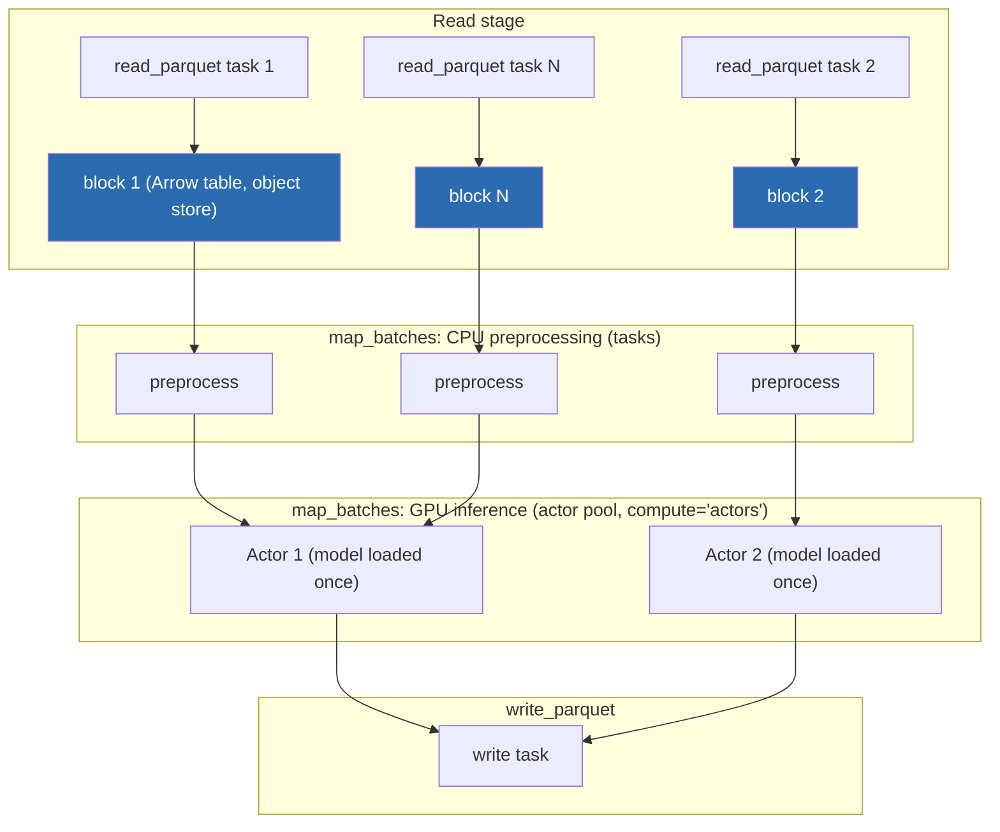
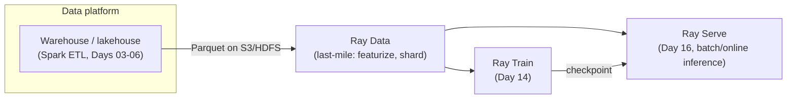

# Day 13 — Ray Data, and the Spark-vs-Ray Judgment Call
### Sources: *Learning Ray* Ch.6 (Data Processing with Ray), Ch.11 (Ecosystem & Other Systems); *Scaling Python with Ray* Ch.9 (Advanced Data with Ray); current Ray docs (docs.ray.io/en/latest/data/data.html, confirmed 2026-09)

> **API-freshness flag, read this before copying any code below.** Both books were written against Ray 2.2.0. Ray Data's execution model has changed materially since: `DatasetPipeline`, `.window()`, and `.repeat()` — the manual pipelining API the books use to overlap stages — are **legacy**. Current Ray Data (confirmed against the live docs, installed version here is 2.58.0) runs a **streaming execution engine by default**: you write plain `.map()` / `.map_batches()` chains, and Ray Data itself decides how to overlap and pipeline operators. The *concepts* below (blocks, why pipelining matters, actor pools for stateful compute) are still exactly right — only the "you must call `.window()` to get overlap" instruction is obsolete. Treat every code block below as **concept-accurate, API-approximate**: verify exact signatures against `docs.ray.io` before running anything in a real pipeline, exactly as `ray-learning/references/reading-map.md` already tells you to.

---

## 1. Definitions and terminology

| Term | Definition |
|---|---|
| **Dataset** | Ray Data's core abstraction: a distributed collection of data, represented internally as a list of references to **blocks** sitting in the Ray object store. Not a DataFrame — a partitioned, lazily-evaluated sequence. |
| **Block** | The unit of data Ray Data actually operates on. Either an Apache **Arrow table** or a plain Python list (for types Arrow can't represent). One Dataset = many blocks, each a separate object in the shared-memory object store (see Day 11). |
| **Apache Arrow** | A columnar, language-independent in-memory data format. Ray Data is built on top of it — this is *why* Datasets interoperate cheaply with NumPy, pandas, Parquet, and other Arrow-native tools. |
| **`map` / `flat_map` / `filter`** | Row-at-a-time transformations. Each becomes a Ray task operating on a block. |
| **`map_batches`** | The workhorse transform: applies a function to a *batch* of rows at once (a block, or a configurable batch size within it). Needed for vectorized operations (NumPy/pandas ops that are far faster batched than row-by-row). |
| **`compute="actors"`** | Tells `map_batches` to run on a pool of long-lived Ray **actors** instead of stateless tasks. The pattern for anything with expensive per-worker setup — most obviously loading a model onto a GPU once, then reusing it across many batches. |
| **Repartitioning** | Changing the number of blocks a Dataset is split into (`.repartition(n)`). Controls the parallelism/overhead tradeoff — see §4. |
| **Streaming execution** | Current Ray Data's default execution model: operators in a `.map().map_batches()...` chain run concurrently, with downstream operators consuming blocks as soon as upstream operators produce them, rather than materializing each stage fully before starting the next. This is what `DatasetPipeline`/`.window()` used to require you to opt into manually. |
| **Last-mile preprocessing** | Ray Data's actual design niche: the loading/cleaning/featurization step that sits *between* a full-scale ETL system (Spark, a warehouse) and a training/inference job — not a replacement for the ETL system itself. |
| **Dask-on-Ray / RayDP / Modin / MARS** | External DataFrame-style libraries that can run their execution *on top of* Ray's scheduler and object store, for when Ray Data's own functional API isn't expressive enough. |

---

## 2. Architecture and internal behavior

A Ray Dataset is not a big in-memory object. It is a list of `ObjectRef`s, each pointing at a block sitting in some node's object store — the exact mechanism from Day 11, reused. This is why Datasets can be passed between tasks and actors "for free": you're passing references, not copying data.



Under the *old* blocking model (books' `DatasetPipeline`), stage `Read` had to fully finish before `Prep` started, and `Prep` before `Infer` — starving the GPU actors while CPU preprocessing was still running on the first block. Under the **current streaming engine**, execution looks like the diagram above with all three stages running concurrently: as soon as block 1 is read, it starts preprocessing while block 2 is still being read; as soon as block 1 is preprocessed, actor 1 starts inference on it while block 2 is preprocessing. No `.window()` call needed — this is Ray Data's default now.

A few architectural facts worth holding precisely:
- Loading a Dataset **blocks on the first partition only**, to resolve schema; remaining blocks load eagerly but non-blockingly, same as any other Ray task.
- Datasets are **immutable**. Every transform (`map`, `filter`, `sort`, `repartition`) returns a *new* Dataset; nothing is mutated in place.
- `groupby` is the exception to Ray Data's usual laziness pattern — it requires a **shuffle** (records with the same key must land in the same place), which is the expensive, network-bound operation in any distributed data system. This is the same shuffle you'll study for Spark on Day 04 — same cost, same cause (data movement across nodes), different engine.
- Object recovery: per Day 12's fault-tolerance material, `enable_object_reconstruction=True` in `ray.init()` makes Ray Data resilient to losing a block's owning node — without it, Ray Data's failure behavior is *not* what you might assume from Datasets "just being references."

---

## 3. How the concepts relate to each other

- **Day 09 (tasks/actors):** `map`/`filter`/`flat_map` compile down to Ray **tasks**, one per block. `map_batches(..., compute="actors")` compiles down to an **actor pool** — this is the concrete, motivating use case for actors you were missing on Day 09: amortizing expensive constructor work (loading a model onto a GPU) across many calls.
- **Day 10 (scheduling):** block-to-worker assignment is the Ray Data instance of the scheduling problem — Ray's scheduler places the block-processing task near the block's data when it can (locality-aware scheduling), exactly the resource/placement reasoning from Day 10.
- **Day 11 (object store, data movement):** every block *is* an object-store entry. Repartitioning, shuffles, and spilling under memory pressure are Day 11's object-store mechanics, applied at data-processing scale. If you didn't fully internalize spilling on Day 11, block-heavy Ray Data pipelines are where it will bite you.
- **Day 12 (fault tolerance):** `enable_object_reconstruction` and Ray Data's default resilience story are a direct instance of Day 12's object-reconstruction-on-owner-failure mechanism.
- **Day 14 (Ray Train):** Ray Data is Train's ingestion layer. A `Dataset` (or a shard of one, from `.split()`) is what a Train worker iterates over via `get_dataset_shard(...).iter_torch_batches(...)`.
- **Day 15 (Ray Tune):** when Tune drives many trials of the same training function, sharing one in-memory, preprocessed Dataset across trials (rather than re-reading/re-preprocessing per trial) is a direct Ray Data benefit — see the "training copies of a classifier in parallel" example in §6.
- **Track A / B, Spark days (03–06):** everything below in §5 and §8 about *when Ray Data is not the right tool* points straight back at Spark, which is what those days build.

---

## 4. What needs to be understood deeply

**Block count is a real tuning knob, not an implementation detail.** Too many blocks → each block-processing task is tiny, and Ray's per-task scheduling overhead (real, on the order of ~1ms, see Day 10) starts to dominate total time. Too few blocks → you can't use all the CPUs/GPUs in your cluster, because there's nothing left to parallelize across once every worker has one block. *Scaling Python with Ray* names the practical sweet spot: **blocks sized 100MB–1GB**. This is the *same* reasoning you'll apply to Spark's `spark.sql.shuffle.partitions` on Day 04 — it's not a Ray-specific fact, it's a distributed-systems fact that Ray Data happens to expose as `.repartition(n)`.

**Ray Data is not, and is not trying to be, a relational/SQL engine.** It has no cost-based optimizer, no join-strategy planner (broadcast vs. sort-merge), no adaptive query execution. Table 11-5 from *Learning Ray* is blunt about this: for "structured data processing," Spark and Dask get "first-class support"; Ray gets "supported via Ray Datasets and integrations, but not first class." Internalizing *why* matters more than memorizing the table: Ray Data's functional, block-oriented API is deliberately minimal because its job is the last mile (load → featurize → hand to Train/Serve), not general ETL. Reaching for it to do a five-way join with skewed keys is reaching for the wrong tool, not "using Ray Data at an early stage."

**The "glue layer" claim is Ray Data's actual value proposition, and it's a data-movement argument, not a feature-list argument.** The alternative to Ray Data is: Spark writes intermediate Parquet to S3 → a training script reads it back → writes predictions to S3 again → a serving system reads *that*. Every arrow in that sentence is a serialization + network round trip. Ray Data replaces the arrows with **references to objects already sitting in shared memory on the cluster that's about to train on them**. That's the whole pitch, and it's why Ray Data matters architecturally even though its transform API is comparatively primitive.

---

## 5. Concepts that are easy to confuse

| Confusable pair | The distinction |
|---|---|
| **Ray Data `Dataset` vs. pandas/Spark `DataFrame`** | A DataFrame is a rich, schema-aware, SQL-like relational abstraction. A Ray `Dataset` is a **partitioned reference list** with a thin functional API (`map`, `filter`, `groupby`) layered on top. You *convert* a Dataset to a DataFrame (`.to_pandas()`, `.to_dask()`) to get relational expressiveness back — Ray Data itself doesn't provide it natively. |
| **`map` vs. `map_batches`** | `map` = one function call per *row*. `map_batches` = one function call per *block/batch*. Almost everything performance-sensitive should be `map_batches` — vectorized NumPy/pandas ops on a batch are dramatically faster than a Python-level function call per row. `map` is for row-local logic that can't be vectorized. |
| **`compute="tasks"` (default) vs. `compute="actors"`** | Tasks are stateless and cheap to schedule but pay setup cost (e.g., loading a model) on *every* invocation. Actors pay setup cost *once* per actor and reuse it — correct default for GPU model inference, wrong default (wasted long-lived process) for a one-line filter. |
| **Ray Data vs. Dask-on-Ray vs. RayDP (Spark-on-Ray) vs. Modin** | All four can run *on* Ray's scheduler/object store. The difference is API surface: Ray Data = Ray's own minimal functional API; Dask-on-Ray = full Dask DataFrame API (close to pandas) executed by Ray instead of Dask's own scheduler; RayDP = actual Apache Spark, with the JVM and all, orchestrated by Ray; Modin = a pandas drop-in that happens to run on Ray. You pick based on which API your team/codebase already speaks, not based on which is "more Ray." |
| **Block vs. partition** | Ray's own source and docs use these interchangeably for Ray Data. When talking to a Spark person, say "partition" — when reading Ray internals, expect "block." Same concept, different project's vocabulary. |
| **Ray Data shuffle vs. Spark shuffle** | Mechanically the same expensive operation (redistribute data across the network so same-key records co-locate) — but Ray Data's shuffle implementation is far less mature/tunable than Spark's (no AQE-style adaptive rebalancing, no broadcast-join equivalent as a first-class citizen). Don't assume Ray Data will handle a skewed `groupby` as gracefully as Spark would after Day 04's skew-mitigation lessons. |
| **`DatasetPipeline`/`.window()` (books) vs. streaming execution (current)** | The books manually opt into overlap. Current Ray Data does it by default. If you see `.window()` or `.repeat()` in any code you're reading (including these source books), treat it as historical evidence of *why* streaming execution matters, not as an API to reach for today. |

---

## 6. Practical engineering patterns

**Pattern: last-mile preprocessing → GPU batch inference, actor pool for the model.**

```python
import numpy as np
import ray

class MLModel:
    def __init__(self):
        # Runs once per actor — this is the whole point of compute="actors".
        self._model = load_model_onto_gpu()

    def __call__(self, batch):
        return {"pred": self._model(batch["features"])}

ds = (
    ray.data.read_parquet("s3://bucket/input_data")
    .map(cpu_intensive_preprocessing)
    .map_batches(MLModel, compute="actors", num_gpus=1, batch_format="numpy")
)
ds.write_parquet("s3://bucket/output_predictions")
```

No `.window()` — the current streaming engine overlaps the `read_parquet`, `map`, and `map_batches` stages on its own.

**Pattern: repartition before writing, to control output file count.**

```python
ds.repartition(1).write_parquet("s3://bucket/single_file_output")
```

**Pattern: sharing one preprocessed Dataset across many parallel training runs** (the concrete payoff of "Datasets pass by reference"):

```python
workers = [TrainingWorker.remote(alpha) for alpha in ALPHA_VALS]
shards = train_ds.split(len(workers), locality_hints=workers)
ray.get([w.train.remote(shard) for w, shard in zip(workers, shards)])
```

Load and preprocess **once**; every worker gets a shard by reference, not a copy. This is the pattern Day 15 (Tune) formalizes properly — this hand-rolled version is what Tune/Train do for you under the hood.

**Pattern: escaping to pandas/Arrow for local-only tools.**

```python
if ds.count() < LOCAL_MEMORY_BUDGET_ROWS:
    df = ds.to_pandas()          # whole dataset, one process
else:
    for batch in ds.iter_batches(batch_format="pyarrow"):  # one block at a time
        process(batch)
```

Guard `to_pandas()` behind a size check — it materializes the *entire* Dataset into the calling process's memory, defeating the entire point of a distributed Dataset.

---

## 7. Common mistakes and misconceptions

- **Reaching for Ray Data to replace a proper ETL/warehouse job.** No cost-based optimizer, no mature join strategies, no AQE. If the workload is "large relational transforms," that's Spark's job (Days 03–06), not Ray Data's — Table 11-5 above is not being modest, it's accurate.
- **Manually re-implementing `.window()`-style pipelining in current Ray Data.** The streaming engine already does this. Writing your own staged-materialization logic on top of a system that already streams is wasted complexity, and it's a strong signal of reading 2022-era Ray Data examples without checking current docs first.
- **Using `compute="tasks"` (the default) for GPU-model inference.** Every task reloads the model from scratch — you pay GPU-load latency on every single batch instead of once per actor. This is the single most common Ray Data performance bug in ML pipelines.
- **Ignoring block count until something is slow.** Default block counts (e.g., 200 from `ray.data.range`) are a starting guess, not a tuned value for your workload. If a job is either not using all your CPUs or drowning in scheduling overhead, block count is the first thing to check — before reaching for more hardware.
- **Treating `ds.to_pandas()` as safe by habit** (because it "worked in the tutorial" on a 10,000-row example). It scales exactly as badly as `collect()` does in Spark, for the same reason: it pulls the whole distributed dataset into one process's memory.
- **Assuming a `groupby` in Ray Data is as cheap as in Spark.** It's a shuffle either way; Spark just has fifteen more years of shuffle optimization behind it. Don't be surprised by relatively worse `groupby` performance/skew-handling compared to what Day 04–05 will teach you to expect from Spark.

---

## 8. Production considerations

Ray Data's actual production role, stated precisely: it is the **seam** between a data platform's ETL/warehouse layer and its ML training/serving layer.



Concretely, this is exactly the shape of the **Day 18 integration project** (Spark → curated features → Ray). What to actually weigh in production:

- **Where does Ray Data's write-up fit an orchestrated pipeline?** (Day 08's orchestration material.) Typically: an Airflow/orchestrator DAG runs the Spark ETL stage, then triggers a Ray job (via `ray job submit`, see Day 17) that runs the Ray Data → Train/Serve stage. Ray Data is not usually the *entry point* of a production pipeline — it's a stage inside one.
- **Dependency management for external integrations (Dask-on-Ray, RayDP).** *Scaling Python with Ray* Ch.9 flags this explicitly: Datasets don't use Ray's `runtime_env` for these tools — the tool (especially Spark/RayDP, which drags in a JVM) has to already be installed in the worker image. This is a deployment concern, not a code concern — get it wrong and you find out at cluster-launch time, not at `import` time.
- **Cost/throughput tradeoff of block size** is a direct line to cluster cost: too-small blocks waste scheduling overhead (paying for CPU-seconds that do coordination, not work); too-large blocks risk object-store spilling (Day 11) under memory pressure, which is far more expensive than the scheduling overhead you were trying to avoid.
- **Vectorized (`map_batches`) vs. row-wise (`map`) is a cost decision**, not just a style choice, especially on GPU-backed actor pools where you're paying for accelerator time per call.

---

## 9. Debugging and performance reasoning

| Symptom | Likely cause | Where to look |
|---|---|---|
| Job "hangs" with low CPU utilization | Too few blocks — not enough parallel units of work to fill the cluster | `ds.num_blocks()`; repartition upward |
| Job is slow with high scheduler overhead visible, many tiny tasks | Too many blocks — per-task overhead dominates | `ds.num_blocks()`; repartition downward, target the 100MB–1GB/block range |
| GPU actors sit idle waiting on CPU stage | Pre-streaming-engine mental model — check you're not accidentally forcing full materialization between stages (e.g., an unnecessary `.materialize()` or a stray `.to_pandas()` mid-pipeline) | Ray Dashboard timeline view; look for a stage that fully completes before the next starts |
| `groupby`/aggregation unexpectedly slow | Shuffle cost, possibly skewed keys | Same diagnostic instinct as Spark Day 04–05: check key cardinality/skew before blaming the cluster |
| Driver OOMs on a "small" job | Something pulled a full Dataset into driver memory — `to_pandas()`, `take(N)` with too-large N, or accidental `list(ds.iter_rows())` | Grep the pipeline for exactly those calls |
| Serialization error at pipeline start | A `map`/`map_batches` closure captured something non-picklable (an open connection, a lock, a pool) | `ray.util.inspect_serializability(fn)` — see Day 17's debugging material, same tool |

---

## 10. Examples and exercises

### Worked example — current-API version of the book's inference pipeline

```python
import ray

ray.init()

ds = (
    ray.data.read_parquet("s3://my-bucket/input_data")
    .map(cpu_intensive_preprocessing)
    .map_batches(
        GpuInferenceModel,
        compute="actors",
        num_gpus=1,
        batch_size=64,
    )
)
ds.repartition(10).write_parquet("s3://my-bucket/output_predictions")
```

Note what's *absent* compared to the book's version: no `.window(blocks_per_window=5)`. The streaming engine gives you the overlap the book had to ask for explicitly.

### Exercises (unsolved — write these yourself)

1. Load `ray-learning/datasets/generated` (the transaction dataset from Day 01) with `ray.data.read_parquet` or `read_csv` as appropriate. Report `ds.num_blocks()` and `ds.schema()`.
2. Compute the fraud rate (fraction of fraudulent transactions) using `.groupby()` + an aggregate, *and* separately using `.map_batches()` + a manual reduction. Compare wall time. Which approach triggers a shuffle, and does the timing confirm it?
3. Deliberately set `.repartition(N)` to three very different values (e.g., 4, 200, 5000) on the same transaction dataset and time an identical `map_batches` transform under each. Plot or tabulate block count vs. wall time. Where's your sweet spot, and does it land near the 100MB–1GB/block guidance?
4. Write a `map_batches(..., compute="actors")` stage that simulates an expensive per-worker setup cost (e.g., `time.sleep(2)` in `__init__`). Compare total wall time against the same transform with `compute="tasks"` (the default). Explain the gap in your own words, citing what you now know about tasks vs. actors from Day 09.
5. Design (in writing, no code required) the Spark/Ray boundary for a hypothetical pipeline: raw event logs (500GB/day, in a lake) need deduplication, a 3-way join against slowly-changing dimension tables, feature engineering, and then batch scoring with a PyTorch model on GPUs. State exactly where Spark's job ends and Ray Data's begins, and justify it against Table 11-5's workload-type comparison rather than against vibes.
