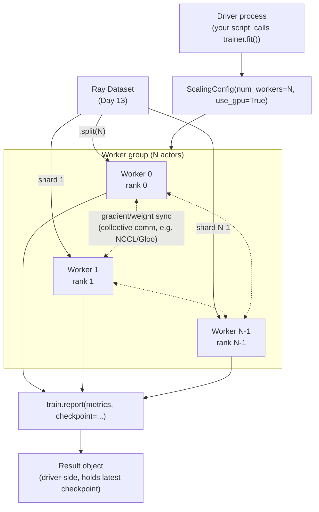
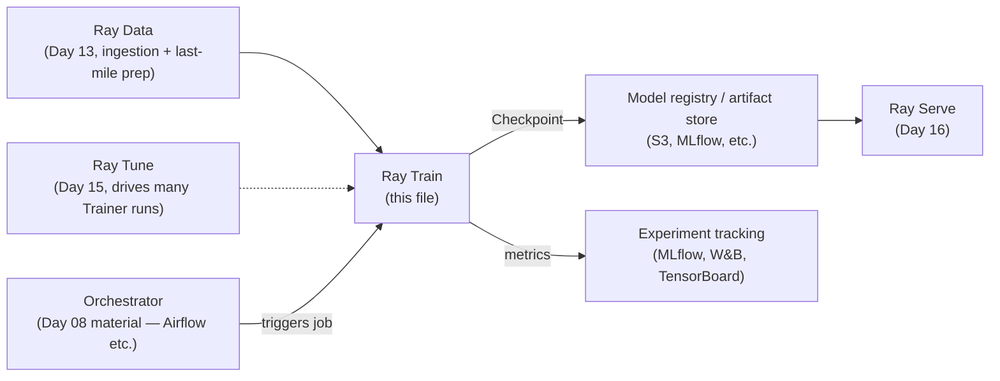

# Day 14 — Ray Train: Distributed Model Training
### Sources: *Learning Ray* Ch.7 (Distributed Training with Ray Train), Ch.11 (AIR ecosystem example); *Scaling Python with Ray* Ch.10 (How Ray Powers ML), Ch.11 (GPUs and Accelerators); current Ray docs (docs.ray.io/en/latest/train) + web verification, 2026-09

> **API-freshness flag — read this before writing any code from this file.** The books teach Ray Train through **Ray AIR** (`ray.air.session`, `ray.air.config.ScalingConfig`, `ray.air.Checkpoint`). **Ray AIR as a separate branded namespace is deprecated.** Verified against current Ray docs and the Ray GitHub issue tracker (2026-09): the `ray.air` namespace is being removed; its functionality moved directly into `ray.train`. The concrete renames you need:
> | Book (`ray.air`) | Current (`ray.train`) |
> |---|---|
> | `from ray.air import session` | `import ray.train as train` |
> | `session.report(...)` | `train.report(...)` |
> | `session.get_dataset_shard(...)` | `train.get_dataset_shard(...)` |
> | `session.get_checkpoint()` | `train.get_checkpoint()` |
> | `ray.air.Checkpoint` | `ray.train.Checkpoint` |
> | `ray.air.config.ScalingConfig` | `ray.train.ScalingConfig` |
> | `ray.air.config.RunConfig` | `ray.train.RunConfig` |
> Additionally, **Ray Train V2** (current) is a rearchitected, slimmed-down Train fully decoupled from Ray Tune internals, focused on usability/stability. The *concepts* below — Trainers, ScalingConfig, data-parallel training, checkpoints, Preprocessors — are unchanged and durable. Every code sample is concept-accurate; verify the exact import path against `docs.ray.io/en/latest/train/api/api.html` before running it for real.

---

## 1. Definitions and terminology

| Term | Definition |
|---|---|
| **Data-parallel training** | Each worker holds a *full copy of the model* and trains on a *different shard of the data*; gradients/weights are synchronized across workers each step/epoch. Ray Train's primary mode. |
| **Model parallelism** | The model itself is too large for one machine/GPU and is split *across* workers. Rare outside large-model shops (the books are candid: "usually large companies like Google or Meta need model parallelism"). Not Ray Train's focus. |
| **Trainer** (e.g. `TorchTrainer`, `XGBoostTrainer`, `LightGBMTrainer`) | A framework-specific wrapper class that runs your training loop across a group of Ray actors, wiring up inter-process communication for you. Common interface: `.fit()` and `.checkpoint`. |
| **`train_loop_per_worker`** | The function *you* write, containing standard framework training-loop code (forward pass, loss, backward, optimizer step). Ray Train runs one copy of this per worker. |
| **`ScalingConfig`** | Declares *how* to scale: `num_workers`, `use_gpu`, `resources_per_worker`. You never write distributed-coordination code yourself — you declare the shape, Ray Train provisions it. |
| **`RunConfig`** | Runtime options for a Trainer run: logging verbosity, callbacks (MLflow, TensorBoard, JSON logger), storage path. |
| **Checkpoint** | Serialized model/training state, produced via `train.report(metrics, checkpoint=...)`. The artifact that survives a training run and feeds Serve (Day 16) or a later resume. |
| **Preprocessor** | A Ray Train class (`.fit()`, `.transform()`, `.fit_transform()`, `.transform_batch()`) for consistent train-time/serve-time data transforms — the mechanism against **training-serving skew**. |
| **`prepare_model`** | The one-line call (`ray.train.torch.prepare_model(model)`) that wraps a plain PyTorch model for distributed data-parallel training — wires up `DistributedDataParallel` and device placement under the hood. |
| **Training-serving skew** | A production ML defect class: the model performs differently at serving time than at training time because the *data preprocessing differs* between the two paths — not a model problem, a pipeline-consistency problem. |
| **Worker group** | The set of actor processes a Trainer spins up per `ScalingConfig.num_workers` — this *is* "Ray Train" mechanically: an actor pool (Day 09) coordinated for synchronized data-parallel training. |

---

## 2. Architecture and internal behavior

Ray Train is not a new execution substrate — it is a **framework-aware coordination layer built entirely on Ray Core primitives you already know**: actors for the worker group, the object store for dataset shards, and Ray Data for ingestion (Day 13).



Key architectural facts:
- **Ranks.** Each worker gets a rank (0..N-1) and a world size (N) — standard distributed-training vocabulary, not Ray-specific. `prepare_model` uses this internally to configure the collective-communication backend.
- **The driver does not train.** It provisions the worker group, distributes dataset shards, and collects reported metrics/checkpoints. All actual gradient computation happens on workers.
- **Dataset sharding reuses Day 13/Day 11 mechanics exactly.** `train.get_dataset_shard("train")` on a worker returns *that worker's* shard of the Dataset the Trainer was constructed with — objects the worker reads directly from the object store, not data shipped fresh from the driver each epoch.
- **Checkpoint reporting is per-worker but the framework is expected to coordinate** — typically only rank-0 actually writes a checkpoint to avoid every worker redundantly serializing the same synchronized weights.
- **Ray Train V2 (current)** decouples entirely from Ray Tune's internal trial-scheduling machinery. Historically Train was implemented as a thin layer over Tune (a single-trial Tune run); V2 gives Train its own, simpler execution path, with Tune integration happening at a cleaner boundary (a Trainer becomes a `Tuner`'s Trainable — see Day 15 §3). This is architecture worth knowing for judgment calls (§4) even though the *outward* API (`trainer.fit()`, `ScalingConfig`) is stable.

---

## 3. How the concepts relate to each other

- **Day 09 (tasks/actors):** the worker group *is* an actor pool. Everything you learned about actor lifecycle, restart semantics, and state applies directly to Train workers.
- **Day 11 (object store):** dataset shards are object-store references, not copies shipped over the network per epoch — this is why Ray Train's ingestion is efficient at scale.
- **Day 12 (fault tolerance):** worker failure/restart during training is Day 12's actor-restart material, specialized: a restarted worker needs its **checkpoint**, not just a fresh actor, to resume correctly (see §7 for the mistake of assuming otherwise).
- **Day 13 (Ray Data):** the *only* supported way to feed data into a Trainer at scale. The `datasets={"train": ds}` argument is a Ray Dataset, full stop — this is why Day 13's block-sizing and streaming-execution reasoning directly determines Train's ingestion throughput.
- **Day 15 (Ray Tune):** a `Trainer` is what you hand to a `Tuner` to run many hyperparameter trials of the *same* training procedure — Train defines "how one run trains," Tune defines "which runs to try and how to schedule them."
- **Day 16 (Ray Serve):** the `Checkpoint` a Trainer produces is the artifact Serve loads to build an inference deployment. Train and Serve share the `Checkpoint` abstraction as their handoff contract.
- **Distributed systems fundamentals (Kleppmann):** data-parallel training's gradient-sync step is a **consensus/coordination problem** in miniature — every worker must agree on a consistent view of the weights before the next step. This is the same family of problem as the replication/consistency material in DDIA, applied to a tighter, synchronous, single-job context rather than a long-lived database.

---

## 4. What needs to be understood deeply

**Data parallelism vs. model parallelism is a decision, not a default.** Ray Train's whole design centers on data parallelism because that's the common case: your data doesn't fit in one process's memory, or training is too slow on one machine, but the *model* fits on one GPU. If the model itself doesn't fit on one device, data parallelism doesn't solve your problem — you need model or pipeline parallelism, which is a different (and harder) engineering problem Ray Train is not primarily built for. Recognizing which regime you're in *before* reaching for `ScalingConfig(num_workers=N)` is the senior-level judgment call here.

**`ScalingConfig` is a declaration, not a guarantee.** Setting `num_workers=200` in a `ScalingConfig` doesn't create capacity — it *requests* it from whatever cluster you're connected to (manually launched, KubeRay, cloud autoscaler — Day 17). On an under-provisioned cluster, Ray Train will simply wait for resources rather than silently degrade to fewer workers. This is the same "feasible vs. available resources" distinction from Day 10, applied to Train.

**Checkpoints are the actual unit of durability, not the worker process.** A worker actor is disposable — Ray can restart it (Day 12). Training *state* is not disposable, and only survives a restart if `train.report(..., checkpoint=...)` actually persisted it somewhere durable (not just in the worker's local memory). This single fact is the difference between "Ray Train is fault-tolerant" being true in practice versus true only on paper.

**Preprocessors exist to eliminate a specific, expensive production bug class: training-serving skew.** It is tempting to treat "fit a `StandardScaler` on the training set, transform both train and serve inputs" as a data-science nicety. It's actually a *pipeline-architecture* requirement: the scaler's fitted mean/std must be serialized once and reused verbatim at serving time, or your model degrades in production for reasons that look nothing like a training bug and take much longer to diagnose.

---

## 5. Concepts that are easy to confuse

| Confusable pair | The distinction |
|---|---|
| **`ScalingConfig.num_workers` vs. a Ray Tune `Trial`** | `num_workers` = how many actors *cooperate* on **one** training run (data-parallel workers, synchronized). A Tune trial = one **independent** run of the whole Trainer, with its own hyperparameters, running concurrently with *other* trials. A Tune experiment with `num_samples=10` and each Trainer using `num_workers=4` launches up to 40 actors total, in 10 independent groups of 4 that never synchronize with each other. |
| **`train.report()` vs. `tune.report()` (Day 15)** | Historically near-identical patterns (the books show them as literally analogous). In current Train V2, `train.report()` is Train's own reporting call; when a Trainer runs *inside* a Tune trial, Tune observes those reports through the Train↔Tune integration boundary rather than you calling both. Don't hand-wire both into the same loop. |
| **Checkpoint (Ray Train) vs. checkpoint (Ray Tune, Day 15)** | Same underlying `ray.train.Checkpoint` class, different *purpose*: a Train checkpoint is "resume this training run" / "serve this model." A Tune checkpoint is additionally "this is one trial's state, comparable against sibling trials," used for early-stopping decisions (ASHA/PBT) as much as for durability. |
| **Preprocessor `.fit()` vs. a model's `.fit()`** | A Preprocessor's `.fit()` computes and stores *aggregate statistics about the dataset* (a mean, a vocabulary) — it does not train a predictive model. Easy to misread in a code sample that chains `preprocessor.fit_transform(ds)` next to `trainer.fit()`. |
| **`prepare_model` vs. writing your own `DistributedDataParallel` wrapping** | `prepare_model` is Ray Train doing exactly the PyTorch-native DDP setup you'd otherwise hand-write (process group init, device placement, gradient bucketing). Understanding what DDP itself does is still your job — Ray Train removes the *boilerplate*, not the need to understand the underlying synchronization model. |
| **Gradient-boosting Trainers (`XGBoostTrainer`, `LightGBMTrainer`) vs. neural-net Trainers (`TorchTrainer`, etc.)** | Both share the `Trainer` interface, but the underlying distribution strategy is different: gradient-boosted trees distribute by having each worker build on a data shard with the library's own distributed-training protocol (XGBoost's own comms), not PyTorch DDP-style gradient averaging. Don't assume `prepare_model`-style reasoning applies uniformly across every Trainer subclass. |

---

## 6. Practical engineering patterns

**Pattern: minimal one-line migration from single-machine to distributed (current API).**

```python
import torch.nn as nn
import ray.train as train
from ray.train.torch import TorchTrainer, prepare_model
from ray.train import ScalingConfig

def train_loop_per_worker(config):
    model = prepare_model(MyModel())          # the one-line change
    # ... standard PyTorch loop, unchanged ...
    for epoch in range(config["epochs"]):
        train_one_epoch(model, ...)
        train.report({"epoch": epoch, "loss": loss})

trainer = TorchTrainer(
    train_loop_per_worker=train_loop_per_worker,
    train_loop_config={"epochs": 3},
    scaling_config=ScalingConfig(num_workers=2, use_gpu=False),
    datasets={"train": train_dataset},
)
result = trainer.fit()
```

**Pattern: consistent preprocessing across train and serve.**

```python
from ray.data.preprocessors import StandardScaler

preprocessor = StandardScaler(columns=["amount", "trip_distance"])
trainer = XGBoostTrainer(
    preprocessor=preprocessor,
    label_column="is_fraud",
    datasets={"train": dataset},
    scaling_config=ScalingConfig(num_workers=4),
)
result = trainer.fit()
# The fitted preprocessor travels with the checkpoint — Serve (Day 16) applies
# the *same* fitted transform to live requests. This is the skew-prevention
# mechanism in practice, not just in theory.
```

**Pattern: scaling out by changing one config object, not your training code.**

```python
scaling_config = ScalingConfig(num_workers=200, use_gpu=True)
trainer = XGBoostTrainer(scaling_config=scaling_config, ...)
```

Nothing else in the script changes. This is the concrete payoff of the Trainer abstraction — the same code that ran on your laptop with `num_workers=2` runs on a 200-worker cluster.

---

## 7. Common mistakes and misconceptions

- **Believing "Ray Train is fault-tolerant" means "I don't need to think about checkpointing."** It means the opposite: fault tolerance is *available* if you report checkpoints correctly and store them durably (not just in worker-local memory that dies with the worker). Skipping checkpointing because "Ray handles failures" is the single most common way to lose a long training run to a preventable node failure.
- **Manually re-deriving DDP setup that `prepare_model`/the Trainer already does.** A sign of not trusting (or not knowing) the abstraction — check the Trainer's docs before hand-rolling process-group initialization.
- **Skipping the Preprocessor and hand-writing transforms differently in the training script vs. the serving script.** This is exactly how training-serving skew enters a codebase — two implementations of "the same" transform drift apart over time even when both start out identical.
- **Confusing `num_workers` with "how many hyperparameter configurations I want to try."** That's `num_samples` on a Tune `Tuner` (Day 15), not `ScalingConfig.num_workers`. Conflating the two produces either a training run that's parallelized wrong, or a Tune experiment that never actually varies hyperparameters.
- **Assuming more workers always means faster training.** Gradient/weight synchronization has a communication cost that grows with worker count; past some point (model-size- and network-dependent), adding workers increases sync overhead faster than it adds compute throughput. This is a real, measurable ceiling, not a hypothetical one — see the debugging table in §9.
- **Running the books' `ray.air.session` code verbatim against current Ray** and hitting an import error, then assuming Ray Train is broken rather than recognizing the AIR-deprecation drift flagged at the top of this file.

---

## 8. Production considerations

Ray Train's place in a real Data Engineering / ML platform:



- **Checkpoint durability is a storage-architecture decision, not a training-code decision.** Where checkpoints land (local disk on an ephemeral worker vs. S3/cloud storage) determines whether a cluster crash loses your run. Ray Train's `RunConfig` accepts a storage path — pointing it at ephemeral local storage on a cluster you expect to be torn down (Day 17's ephemeral-vs-permanent-cluster tradeoff) is a production footgun.
- **Experiment tracking integration (MLflow/W&B/TensorBoard callbacks) is how a Train run becomes auditable** — without it, "why did we ship this model" has no evidence trail beyond a checkpoint file and someone's memory.
- **Training-serving skew is a *production incident category*, not a training-time bug category.** It shows up as degraded live model quality with no corresponding training-metric regression — the training run looked fine because the training-time preprocessing was internally consistent; the mismatch only appears against the serving path's (different) preprocessing.
- **Orchestration boundary:** a Train job is typically one *stage* triggered by an orchestrator (Day 08), not a standalone always-running service — contrast with Ray Serve (Day 16), which typically *is* a long-running service.
- **GPU cost is the dominant cost line in most Train deployments.** `ScalingConfig(num_workers=N, use_gpu=True)` is a direct cloud-billing decision — over-provisioning workers past the synchronization-overhead ceiling (§7) burns GPU-hours for no corresponding throughput gain.

---

## 9. Debugging and performance reasoning

| Symptom | Likely cause | Where to look |
|---|---|---|
| Training throughput doesn't improve (or gets worse) past N workers | Gradient-sync communication cost exceeding the added compute — the "ceiling" from §7 | Compare per-epoch wall time at increasing `num_workers`; watch network utilization on the Ray Dashboard |
| Restarted worker resumes training from scratch, not from last checkpoint | Checkpoint wasn't actually persisted durably, or resume logic wasn't wired to read `train.get_checkpoint()` | Check `RunConfig`'s storage path is durable, not ephemeral local disk |
| Model quality good in offline eval, degraded in production | Training-serving skew — mismatched preprocessing paths | Diff the actual transform code/parameters used at train time vs. serve time; confirm the Preprocessor (not a hand-rolled duplicate) is used on both sides |
| `trainer.fit()` hangs at startup, never begins training | Requested `ScalingConfig` resources not available on the cluster (Day 10's feasible-vs-available distinction) | Check `ray.cluster_resources()` / `ray.available_resources()`; check the Ray Dashboard's pending-task/actor view |
| Serialization error constructing the Trainer or `train_loop_per_worker` | A closure captured something non-picklable (an open file handle, a DB connection, a non-serializable config object) | `ray.util.inspect_serializability` on the offending function (same tool as Day 13/17) |
| One worker's rank silently missing from logs / sync appears stuck | A worker actor died and wasn't (or couldn't be) restarted, and the remaining workers are blocked waiting on a collective operation that needs all ranks | Ray Dashboard actor list; check for a crashed actor around the same timestamp |

---

## 10. Examples and exercises

### Worked example — full current-API TorchTrainer, from Day 13's Ray Dataset

```python
import ray
import ray.train as train
from ray.train import ScalingConfig
from ray.train.torch import TorchTrainer, prepare_model
import torch.nn as nn

class FraudClassifier(nn.Module):
    def __init__(self):
        super().__init__()
        self.net = nn.Sequential(nn.Linear(6, 32), nn.ReLU(), nn.Linear(32, 1))
    def forward(self, x):
        return self.net(x)

def train_loop_per_worker(config):
    model = prepare_model(FraudClassifier())
    optimizer = torch.optim.Adam(model.parameters(), lr=config["lr"])
    loss_fn = nn.BCEWithLogitsLoss()
    shard = train.get_dataset_shard("train")

    for epoch in range(config["epochs"]):
        total_loss = 0.0
        for batch in shard.iter_torch_batches(batch_size=config["batch_size"]):
            optimizer.zero_grad()
            out = model(batch["features"])
            loss = loss_fn(out, batch["label"])
            loss.backward()
            optimizer.step()
            total_loss += loss.item()
        train.report(
            {"epoch": epoch, "loss": total_loss},
            checkpoint=train.Checkpoint.from_directory(save_model_locally(model)),
        )

trainer = TorchTrainer(
    train_loop_per_worker=train_loop_per_worker,
    train_loop_config={"lr": 1e-3, "epochs": 5, "batch_size": 128},
    scaling_config=ScalingConfig(num_workers=2, use_gpu=False),
    datasets={"train": fraud_dataset},   # the Day 13 Dataset
)
result = trainer.fit()
```

### Exercises (unsolved)

1. Take a small scikit-learn-style model you already trained locally (or a fresh simple `nn.Module`) and migrate it to `TorchTrainer` with `num_workers=1`, confirming it produces the same result as the non-distributed version. Then increase to `num_workers=2` and confirm the *result* (final loss/accuracy) is comparable, not just that it "ran."
2. Deliberately kill a worker actor mid-training (find its PID via the Ray Dashboard, `kill -9` it) with checkpointing enabled vs. disabled. Document exactly what happens in each case — does training resume, restart from zero, or hang?
3. Build a `Preprocessor` (or hand-roll the equivalent) that fits a `StandardScaler`-style transform on your training data, and write two inference paths: one that reuses the *fitted* preprocessor, one that "accidentally" refits it on the inference batch. Quantify the resulting prediction skew — this is training-serving skew, manufactured on purpose so you can see its shape.
4. Benchmark per-epoch wall time at `num_workers = 1, 2, 4, 8` (or as many as your machine's cores reasonably allow) on a synthetic workload. Find the point where adding workers stops helping. Explain the shape of the curve using the gradient-sync-overhead reasoning from §4/§7 — don't just report the numbers.
5. Design (in writing) the storage architecture for checkpoints in a pipeline that trains on a Kubernetes-hosted ephemeral Ray cluster (Day 17) that gets torn down after every run. Where do checkpoints have to live for a "resume the last training run" feature to work at all?
