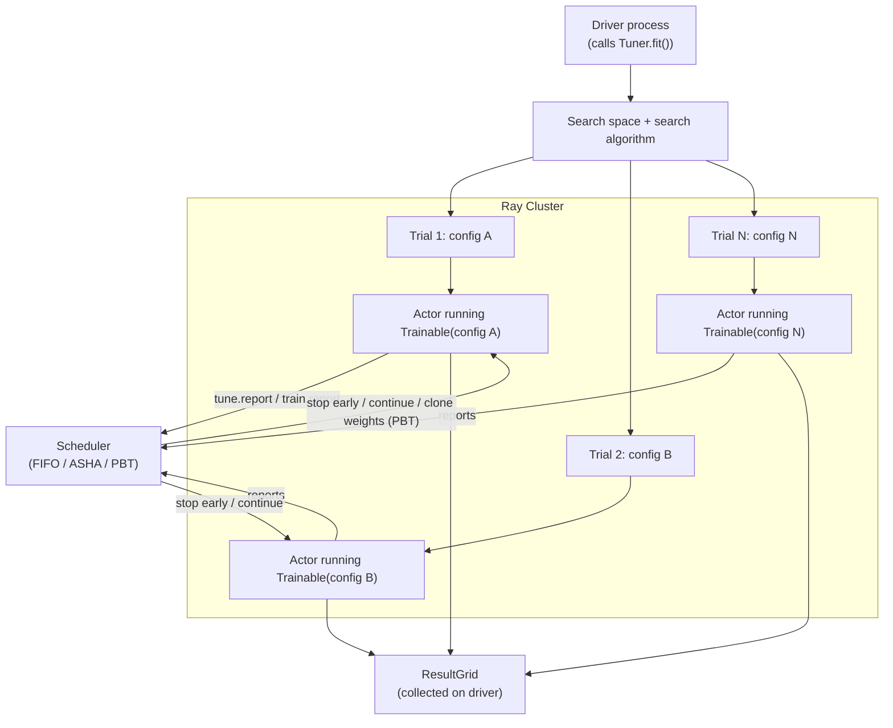

# Day 15 — Ray Tune: Resource-Aware Hyperparameter Optimization
### Sources: *Learning Ray* Ch.5 (Hyperparameter Optimization with Ray Tune); *Scaling Python with Ray* Ch.10 (Hyperparameter Tuning with Ray, within "How Ray Powers ML"); current Ray docs (docs.ray.io/en/latest/tune), 2026-09

> **API-freshness flag.** *Learning Ray* Ch.5 teaches Tune primarily through `tune.run(...)`, returning an `ExperimentAnalysis` object, and explicitly says (as of its writing) that `tune.run` was "still the more mature API" versus the newer `Tuner`/`ResultGrid` API. That has fully flipped since. Current Ray Tune's documented, recommended interface is the **`Tuner` class** (`tune.Tuner(...).fit()` → `ResultGrid`) — confirmed against current docs. `tune.run` / `ExperimentAnalysis` are the legacy path. Every concept below (search spaces, trainables, trials, search algorithms, schedulers) is unchanged; only the top-level entry point moved from `tune.run` to `Tuner`. Code samples below use current `Tuner` syntax; where the source books' examples use `tune.run`, that's noted explicitly.

---

## 1. Definitions and terminology

| Term | Definition |
|---|---|
| **Hyperparameter optimization (HPO)** | Systematically searching for the hyperparameter values (learning rate, regularization strength, layer width, etc.) that produce the best model performance — as distinct from *parameters*, which the training algorithm itself learns. |
| **Search space** | A dictionary describing the range/distribution each hyperparameter can be sampled from (`tune.uniform`, `tune.choice`, `tune.loguniform`, `tune.randint`, `tune.grid_search`, ...). |
| **Trainable** | Tune's formal name for "the thing being tuned": a function (or class) that takes a hyperparameter config, runs training/evaluation, and reports a score back to Tune. |
| **Trial** | One concrete execution of the Trainable with one sampled hyperparameter configuration. An HPO experiment is many trials. |
| **`Tuner`** | Current top-level API: bundles a Trainable (or a Ray Train `Trainer`), a search space, and tuning configuration; `.fit()` runs the experiment and returns a `ResultGrid`. |
| **`ResultGrid`** | Current results object from `Tuner.fit()` — holds every trial's outcome; `.get_best_result(metric=..., mode=...)` retrieves the winner. (Legacy equivalent: `ExperimentAnalysis` from `tune.run`.) |
| **Search algorithm** | The strategy for *choosing* which hyperparameter values to try next — random search (default), grid search, or Bayesian-optimization-family searchers (Optuna, Hyperopt, BayesOpt, Ax, ...). |
| **Scheduler** | The strategy for *managing trials once running* — most importantly, stopping unpromising trials early to save compute. FIFO (default, no early stopping) vs. ASHA, HyperBand, Population Based Training (PBT), PB2. |
| **`resources_per_trial` / trial resource requests** | How many CPUs/GPUs (fractional allowed) each trial consumes — determines how many trials run *concurrently* on a given cluster. |
| **Checkpointing (Tune)** | Periodic trial-state snapshots enabling resume-after-failure and, for schedulers like PBT, enabling the scheduler to *clone* a well-performing trial's state into a struggling one. |

---

## 2. Architecture and internal behavior



Key architectural facts:
- **Trials run on the driver's Ray Cluster as actors** (per *Learning Ray*: "Tune runs are started on the driver process... which spawns several worker processes (using Ray actors)"). Your Trainable definition lives on the driver and is shipped to workers — same serialization concerns as any other Ray remote call (Day 09/11).
- **Concurrency is resource-bound, not trial-count-bound.** If you request `resources_per_trial={"cpu": 2, "gpu": 0.5}` on a 12-CPU/2-GPU machine, exactly 4 trials can run concurrently (GPU is the binding constraint) — the *rest* of your `num_samples` queue and wait, they don't fail.
- **A scheduler observes reports mid-trial**, not just at completion. This is what makes early stopping possible: Tune sees an intermediate score, compares it against other trials' trajectories, and can kill a trial that's clearly underperforming *before* it finishes — the entire point of ASHA/HyperBand/PBT over plain random search.
- **Population Based Training (PBT) goes further than stopping**: it can *copy the weights/state of a well-performing trial into a struggling one*, then perturb its hyperparameters — trials aren't fully independent under PBT the way they are under ASHA.
- **Checkpointing cadence is dynamically adjusted** by Tune itself, targeting "at least 95% of time spent running trials, not storing checkpoints" — a deliberate throughput/durability tradeoff Tune makes for you.

---

## 3. How the concepts relate to each other

- **Day 14 (Ray Train):** the cleanest, most common pattern is `Tuner(trainer, param_space=...)` where `trainer` is a Ray Train `Trainer` (e.g. `XGBoostTrainer`) — each Tune trial becomes one full `Trainer.fit()` run, meaning each trial can itself be a *multi-worker distributed training job*. Concretely: `num_samples=10` trials × `ScalingConfig(num_workers=4)` each = up to 40 actors at once, in 10 independent, non-communicating groups of 4.
- **Day 13 (Ray Data):** the "training copies of a classifier in parallel" pattern from Day 13 §6 (load once, `.split()` across workers) is exactly what Tune+Train formalize — sharing one preprocessed Dataset across many trials instead of re-loading per trial.
- **Day 09 (tasks/actors):** every trial is an actor. Trial resource requests are Day 09/10's resource-declaration mechanism, applied per-trial instead of per-task.
- **Day 10 (scheduling):** Tune's own "scheduler" (ASHA/PBT/FIFO) is a *different* concept layered on top of Ray Core's scheduler — Ray Core decides *where/when* a trial's actor runs given its resource request; Tune's scheduler decides *whether that trial should keep running at all*. Don't conflate the two "schedulers."
- **Day 16 (Ray Serve):** not directly connected, but the *output* of a Tune experiment (best checkpoint) flows into the same Train→Checkpoint→Serve pipeline from Day 14 §8.
- **Track A (ML foundations):** Tune is the industrial-scale version of what you did by hand comparing DumbBaseline vs. ToyModel scores on Ch1/Ch2 — systematic search over a space instead of eyeballing one configuration at a time.

---

## 4. What needs to be understood deeply

**HPO is hard for reasons that have nothing to do with the tool.** *Learning Ray* lists them plainly, and they're worth internalizing rather than skimming: high-dimensional, possibly-correlated search spaces; each trial can be *expensive* (hours, not seconds) so you can't afford to run too many; resource contention across trials; the practical need for early-stopping, checkpoint/resume, and pause/resume tooling. Tune's feature set (search algorithms, schedulers, checkpointing) is a direct response to this list — reading it as "Tune has a lot of features" undersells it; read it as "distributed HPO has a lot of *hard problems*, and here's Tune's answer to each one."

**Random search is a legitimate baseline, not a placeholder to feel bad about.** The books are explicit that "picking parameters at random can work surprisingly well." The senior judgment call is knowing *when* to graduate to a Bayesian search algorithm (Optuna/Hyperopt/BayesOpt — informed sampling based on prior trial results) versus when random/grid search is genuinely sufficient for the search space size and trial budget you have. Reaching for Bayesian optimization by default, on a 2-hyperparameter search space with a cheap objective, is over-engineering.

**A scheduler and a search algorithm solve different problems and compose.** Search algorithm = "which configuration to try next." Scheduler = "should this already-running trial keep going." You can pair HyperBand (scheduler) with random search (search algorithm, the default) — the book's own example does exactly this, explicitly noting "we did not specify a search algorithm... Hyperband will run on parameters selected by random search." Not every scheduler-searcher pair is compatible; check Tune's compatibility matrix rather than assuming universal composability.

**Fractional resources are a real production lever, not a toy feature.** `resources_per_trial={"gpu": 0.5}` lets two trials share one GPU when neither saturates it alone — directly increasing trial throughput per dollar of GPU time, at the cost of some per-trial slowdown from contention. This is a genuine cost/throughput tradeoff a senior engineer should be making deliberately, not a setting to leave at the default.

---

## 5. Concepts that are easy to confuse

| Confusable pair | The distinction |
|---|---|
| **Search algorithm vs. scheduler** | Search algorithm picks *what* configuration a new trial gets. Scheduler decides *whether an existing trial continues*. Both act on the same experiment but at different decision points. |
| **`Tuner` (current) vs. `tune.run` (legacy, in the books)** | Same underlying concepts, different top-level API and results object (`ResultGrid` vs. `ExperimentAnalysis`). Don't mix the two in one script; pick `Tuner` for anything you write today. |
| **Tune `Trial` vs. Ray Train worker (Day 14)** | A trial is one *independent* hyperparameter configuration's full run. A Train worker is one of *several cooperating* actors *within* a single trial (if that trial wraps a multi-worker Trainer). Trials don't talk to each other (except under PBT); workers within one trial's Trainer explicitly synchronize. |
| **Tune checkpoint vs. Train checkpoint (Day 14)** | Same `Checkpoint` class, different role: a Tune checkpoint exists partly so the *scheduler* can compare/clone trial state (PBT) or resume after preemption; a Train checkpoint exists so the *final trained model* can be served. In a Tune-wrapped Train run, one checkpoint object often serves both purposes at once. |
| **Grid search vs. random search vs. Bayesian search** | Grid search = exhaustive over a discrete grid (expensive, no unseen combinations). Random search = i.i.d. sampling from the space (books' default, "surprisingly good"). Bayesian search = *informed* sampling using prior trial outcomes (Optuna/Hyperopt/BayesOpt/Ax) — strictly more sample-efficient per trial, at the cost of being sequential/harder to fully parallelize compared to naive random search. |
| **ASHA/HyperBand vs. PBT** | ASHA/HyperBand *kill* underperforming trials early — a one-directional pruning decision. PBT *also* copies a good trial's weights into a bad trial's slot and perturbs hyperparameters — trials under PBT are not independent training runs, they're a co-evolving population. |
| **`resources_per_trial` vs. `ScalingConfig.num_workers` (Day 14)** | If your Trainable *is* a Ray Train `Trainer`, both exist simultaneously and multiply: resource request per trial × number of concurrent trials × workers-per-trial (if wrapping a multi-worker Trainer) = total cluster footprint. Miscounting this is the most common "why did my cluster just get 40 actors from one `num_samples=10` call" surprise. |

---

## 6. Practical engineering patterns

**Pattern: current `Tuner` API, basic random search.**

```python
from ray import tune
from ray.tune import Tuner, TuneConfig
from ray.train import RunConfig

def objective(config):
    score = train_and_evaluate(config["lr"], config["dropout"])
    tune.report({"score": score})

tuner = Tuner(
    objective,
    param_space={
        "lr": tune.loguniform(1e-4, 1e-1),
        "dropout": tune.uniform(0.0, 0.5),
    },
    tune_config=TuneConfig(metric="score", mode="min", num_samples=20),
)
result_grid = tuner.fit()
best = result_grid.get_best_result(metric="score", mode="min")
print(best.config, best.metrics)
```

**Pattern: Bayesian search + ASHA early stopping, resource-aware.**

```python
from ray.tune.search.optuna import OptunaSearch
from ray.tune.schedulers import ASHAScheduler

tuner = Tuner(
    objective,
    param_space=search_space,
    tune_config=TuneConfig(
        metric="score",
        mode="min",
        search_alg=OptunaSearch(),
        scheduler=ASHAScheduler(),
        num_samples=100,
    ),
)
```

**Pattern: tuning a Ray Train `Trainer` directly (the Day 14 integration).**

```python
from ray.train.xgboost import XGBoostTrainer
from ray.train import ScalingConfig

trainer = XGBoostTrainer(
    label_column="is_fraud",
    datasets={"train": fraud_dataset},
    scaling_config=ScalingConfig(num_workers=2),
)
tuner = Tuner(
    trainer,
    param_space={
        "params": {
            "eta": tune.loguniform(1e-4, 1e-1),
            "max_depth": tune.randint(2, 10),
        }
    },
    tune_config=TuneConfig(num_samples=20, metric="train-logloss", mode="min"),
)
results = tuner.fit()
```

**Pattern: fractional GPU sharing for higher trial throughput.**

```python
tune_config = TuneConfig(num_samples=50)
# Combined with a per-trial resource request of {"gpu": 0.5}, two trials
# share each physical GPU — roughly 2x trial throughput on the same hardware,
# at the cost of some per-trial slowdown from contention.
```

---

## 7. Common mistakes and misconceptions

- **Writing new Tune code against `tune.run`/`ExperimentAnalysis`** because that's what a tutorial (including these source books) shows, without checking that `Tuner`/`ResultGrid` is now the documented path.
- **Treating every hyperparameter search as needing Bayesian optimization.** For small/cheap search spaces, random search is often just as good and trivially more parallel — reaching for Optuna by default is cargo-culting, not judgment.
- **Forgetting that `num_samples` × per-trial resource request × (workers-per-trial, if wrapping a Trainer) determines total cluster demand.** Launching a Tune experiment that silently requests far more actors than the cluster believes it should provision is a common "why is nothing running" debugging session (see §9).
- **Assuming a stopped/pruned trial (ASHA/HyperBand) was a bug.** Early stopping *working as intended* looks identical, at a glance, to a trial crashing — check whether the scheduler intentionally terminated it before treating it as a failure.
- **Using PBT without understanding it copies weights between trials.** PBT trial outcomes are not independent samples the way ASHA/random-search trials are — analyzing a PBT `ResultGrid` as if every row were an independent experiment misreads the data.
- **Not setting `mode` and `metric` consistently**, then being surprised `get_best_result()` returns the *worst* trial (asked for `mode="max"` when the metric should be minimized, or vice versa).
- **Downloading a shared dataset (e.g. MNIST) inside the Trainable without a local-cache guard.** The books flag this directly: without pre-downloading once outside Tune, multiple concurrent trial workers can race to download the same file, and one worker can end up reading a partially-written, corrupted copy.

---

## 8. Production considerations

- **Tune experiments are typically triggered as a discrete job**, not a long-running service — fits the same orchestration boundary as Ray Train (Day 14 §8): an orchestrator (Day 08) kicks off a tuning run, waits for the `ResultGrid`, and the pipeline proceeds with the winning checkpoint.
- **Cost accounting for HPO is a genuine budget line**, not an afterthought: `num_samples × per-trial-cost` is the real spend, and schedulers (ASHA/PBT) exist specifically to cut that spend by not letting bad trials run to completion. Choosing FIFO (no early stopping) on an expensive search space is a cost decision, whether or not it's made deliberately.
- **Experiment tracking integration** (MLflow/W&B/TensorBoard logger callbacks, same mechanism as Day 14) is what makes a Tune experiment's results auditable after the fact — "why did we pick these hyperparameters" needs an answer beyond "the `ResultGrid` said so, and we didn't keep it."
- **Fault tolerance for long HPO runs matters at the experiment level, not just the trial level.** Tune supports resuming an entire interrupted experiment (`resume=True` against a known log directory in the legacy API; equivalent restore mechanisms in `Tuner`) — worth knowing exists *before* a multi-day tuning run gets interrupted by a cluster event.
- **Resource multiplexing (fractional GPUs) is a capacity-planning decision** that trades single-trial latency for aggregate throughput — appropriate when you have many cheap-ish trials and constrained GPU count, inappropriate when a single trial already saturates a GPU's memory or compute.

---

## 9. Debugging and performance reasoning

| Symptom | Likely cause | Where to look |
|---|---|---|
| Fewer trials running concurrently than expected | Resource request per trial × concurrent trials exceeds cluster capacity — Tune is correctly queuing, not broken | `ray.cluster_resources()`; compute `available / resources_per_trial` by hand |
| Trial fails immediately, before your objective function's first line runs | Serialization error in the Trainable closure or config object | `ray.util.inspect_serializability` (Day 13/17) on the Trainable |
| A trial "disappears" partway through | Scheduler (ASHA/HyperBand/PBT) intentionally stopped it — not necessarily a bug | Check the scheduler's logs/decisions in the `ResultGrid`, not just the trial's own log |
| `get_best_result()` returns a clearly-worse trial | `mode`/`metric` mismatch, or metric name typo not caught until result-selection time | Re-check `TuneConfig(metric=..., mode=...)` against what your objective actually reports |
| Multiple workers race to download the same shared dataset, one gets a corrupted file | No local-cache guard before launching trials | Pre-download/pre-cache outside the Trainable, once, before calling `Tuner.fit()` |
| Experiment throughput far lower than `num_samples / trial_time` would suggest | Fractional-resource contention slowing every trial down, or a resource bottleneck other than the one you tuned (e.g. CPU-bound preprocessing feeding a GPU-bound model) | Profile one trial in isolation vs. under full concurrency; compare |

---

## 10. Examples and exercises

### Worked example — ASHA-scheduled search over your Day 07/Ch2-style fraud baseline

```python
from ray import tune
from ray.tune import Tuner, TuneConfig
from ray.tune.schedulers import ASHAScheduler
from sklearn.metrics import average_precision_score

def objective(config):
    model = train_fraud_model(
        max_depth=config["max_depth"],
        learning_rate=config["lr"],
        n_estimators=config["n_estimators"],
    )
    score = average_precision_score(y_val, model.predict_proba(X_val)[:, 1])
    tune.report({"pr_auc": score})

tuner = Tuner(
    objective,
    param_space={
        "max_depth": tune.randint(2, 12),
        "lr": tune.loguniform(1e-3, 3e-1),
        "n_estimators": tune.randint(50, 500),
    },
    tune_config=TuneConfig(
        metric="pr_auc",
        mode="max",
        num_samples=30,
        scheduler=ASHAScheduler(),
    ),
)
results = tuner.fit()
best = results.get_best_result(metric="pr_auc", mode="max")
print("Best PR-AUC:", best.metrics["pr_auc"], "config:", best.config)
```

Note the metric: PR-AUC, not accuracy — deliberately, because this is the same ~1% fraud-imbalance problem from Track A's Ch2. Tuning against accuracy on this dataset would just reward predicting "not fraud" every time.

### Exercises (unsolved)

1. Run the worked example above (or your own equivalent) twice: once with `TuneConfig(num_samples=30)` and default FIFO scheduling, once with `scheduler=ASHAScheduler()`. Compare total wall time and best score found. Does ASHA cost you any score for the time it saves — and can you tell from the `ResultGrid` which trials it killed early?
2. Deliberately misconfigure `mode` (e.g. `mode="min"` on a metric you want maximized) and observe what `get_best_result()` returns. Write down, in your own words, why this failure is easy to miss in a real codebase.
3. Set `resources_per_trial`/per-trial resource requests such that your cluster can run exactly 2 trials concurrently out of `num_samples=20`. Time the full experiment. Then double the per-trial resource request (halving concurrency) and time it again. Does wall time roughly double, and does that match your understanding of §8's capacity-planning framing?
4. Wrap a Day 14 `TorchTrainer` (with `ScalingConfig(num_workers=2)`) in a `Tuner` with `num_samples=5`. Before running, predict the total actor count Ray will try to provision. Run it, check the Ray Dashboard's actor count, and confirm your prediction.
5. Design (in writing) a PBT configuration for a neural-network training workload where trials are expensive (hours each). Explain specifically what "cloning a good trial's weights into a bad trial" buys you here that ASHA's plain early-stopping does not — and name one risk PBT introduces that ASHA doesn't have.
