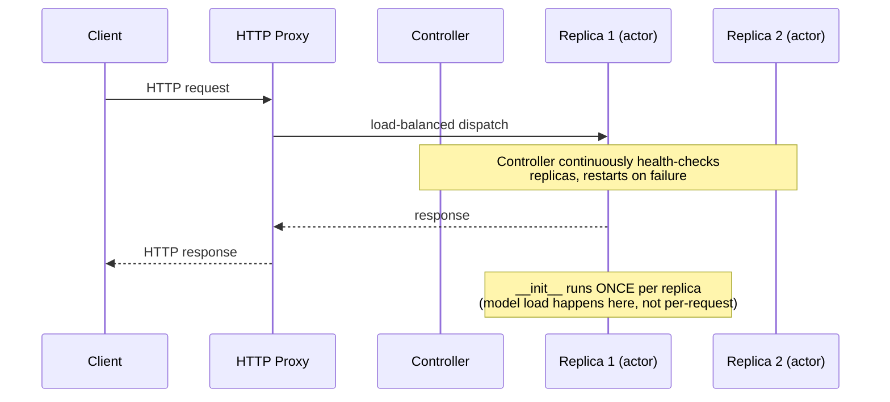
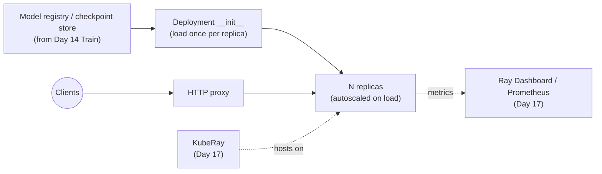

# Day 16 — Ray Serve: Online Inference
### Sources: *Learning Ray* Ch.8 (Online Inference with Ray Serve); *Scaling Python with Ray* Ch.7 (Implementing Microservices); current Ray docs (docs.ray.io/en/latest/serve), 2026-09

> **API-freshness flag.** The books' multi-model composition examples call a bound-deployment reference directly as `self._d.remote()` and `await final`, treating it like a plain Ray actor handle that returns an `ObjectRef` you `ray.get()`/`await`. Current Ray Serve formalizes this into the **`DeploymentHandle`** API: `serve.run()` and cross-deployment references now consistently hand you a `DeploymentHandle`, and calling it (`handle.remote(...)` or `handle.method_name.remote(...)`) returns a **`DeploymentResponse`** — an awaitable you `await` in async code or call `.result()` on synchronously, rather than a raw Ray `ObjectRef` you'd pass to `ray.get()`. The composition *patterns* below (pipelining, broadcasting, conditional routing) are unchanged and are Serve's actual differentiator — verify exact handle-call syntax against `docs.ray.io/en/latest/serve/model_composition.html` before shipping it.

---

## 1. Definitions and terminology

| Term | Definition |
|---|---|
| **Online inference** | Serving ML predictions behind a live API, where latency directly affects user experience — as opposed to batch inference (Day 13's `map_batches` pipelines), where throughput matters more than any single request's latency. |
| **Deployment** | Ray Serve's core primitive: a managed group of Ray actors (see **replica** below) that can be addressed as one unit, with requests load-balanced across them. Defined via `@serve.deployment` on a Python class or function. |
| **Replica** | One actor instance backing a deployment. `num_replicas=N` means N actor copies serving traffic in parallel. |
| **Controller** | A detached, Ray-managed actor that creates/updates replicas, broadcasts config changes, health-checks, and recovers from replica or node failure. The thing that makes "Ray Serve is fault-tolerant" concretely true. |
| **`.bind()`** | Instantiates a deployment with given constructor arguments *without running it* — produces a bound reference you can pass into another deployment's constructor (the mechanism behind multi-model composition) or hand to `serve.run()`. |
| **`DeploymentHandle`** | The current handle object you get back for calling one deployment from another (or from a driver script) — replaces the older, more implicit "call `.remote()` directly on a bound reference" pattern shown in the books. |
| **`DeploymentResponse`** | What calling a `DeploymentHandle` returns: an awaitable representing the in-flight call — `await` it (async) or `.result()` it (sync) to get the actual value. |
| **Request batching (`@serve.batch`)** | Server-side mechanism to accumulate multiple concurrent requests into one vectorized function call — `max_batch_size`, `batch_wait_timeout_s` (or current equivalent) control the size/latency tradeoff. |
| **`@serve.ingress(app)`** | Wraps a FastAPI app inside a deployment, so Serve handles the HTTP layer (routing, validation, docs) while your deployment handles inference. |
| **Deployment graph / model composition** | Wiring multiple deployments together (pipelining, broadcasting, conditional routing) via `.bind()` references passed between constructors — Serve's actual architectural differentiator from "just put a model behind Flask." |
| **Autoscaling (Serve)** | Dynamically adjusting `num_replicas` in response to request load, rather than running a fixed replica count sized for peak traffic at all times. |

---

## 2. Architecture and internal behavior



Key architectural facts:
- **A deployment maps one-to-one with an ML model *by convention*, not by requirement.** Deployments can contain arbitrary Python — business logic, validation, orchestration of other deployments — with no ML model at all. This is deliberate: Serve's job is composing *whatever* logic a real inference API needs, not just "host a model."
- **Constructor code runs exactly once per replica, at replica startup.** This is *why* Serve is the right place to load a large/slow-to-initialize model (Hugging Face pipeline, a GPU checkpoint) — pay that cost once per replica, not once per request. Contrast with Ray Data's `compute="tasks"` mistake from Day 13 — same underlying lesson (amortize expensive setup via an actor), different subsystem.
- **The controller is itself Ray-managed and restart-on-failure.** Serve's fault tolerance isn't "hope nothing crashes" — it's an explicit control loop: controller notices a dead replica or node, recreates it, traffic keeps flowing (possibly with a latency blip while the new replica's `__init__` reruns).
- **Deployment composition is a runtime call graph built from ordinary Python**, not a static YAML/config-defined pipeline. A deployment's `__call__`/handler method can conditionally decide, at request time, which downstream deployment(s) to call and in what order — this is what makes "conditional logic" (§6, Pattern 3) natural in Serve where it would be awkward in a purely declarative serving framework.
- **Scaling and resource allocation are per-deployment, independent knobs.** `num_replicas` and `ray_actor_options={"num_cpus": ..., "num_gpus": ...}` (or fractional GPU) are set per deployment in the graph — a cheap validation deployment and an expensive GPU model deployment in the same graph can (and should) have completely different resource footprints.

---

## 3. How the concepts relate to each other

- **Day 09 (tasks/actors):** a replica *is* an actor, full stop — everything about actor lifecycle, restart, and state from Day 09 applies directly. A Serve deployment is "an actor pool with HTTP routing and autoscaling wrapped around it."
- **Day 12 (fault tolerance):** the controller's replica-recreation behavior is Day 12's actor-restart material, operationalized into a production serving system. The question "does restarting a replica lose in-memory state" (Day 12) matters here concretely: a model loaded fresh in `__init__` is fine to lose; a request-scoped cache accumulated across many requests is not, unless deliberately made durable.
- **Day 14 (Ray Train):** the `Checkpoint` a Trainer produces is what a Serve deployment's `__init__` typically loads. This is the literal handoff point between "we trained a model" and "the model is live."
- **Day 13 (Ray Data):** conceptually parallel, not directly composed — Ray Data's `map_batches(compute="actors")` is *batch* inference's version of what Serve is for *online* inference; both exist because "load an expensive model once, reuse across many calls" is the same problem in two different latency regimes.
- **Day 17 (observability/production):** the Ray Dashboard's per-deployment/per-replica views, and KubeRay's production deployment story, are how a Serve application is actually operated once it's live — this file covers what to build, Day 17 covers how to run it in production and debug it when it misbehaves.

---

## 4. What needs to be understood deeply

**ML models are not useful in isolation, and Serve's whole design follows from that fact.** The books frame this precisely: a real inference API needs input validation, feature fetching, combining multiple models' outputs, and business rules woven *around* the ML — not just a bare model behind an endpoint. Reaching for a "single model, single endpoint" mental model when a real product need is "validate → sentiment-gate → broadcast to two models → combine" (the books' own worked NLP example, §10) will produce an architecture that fights the actual requirement.

**Constructor-time loading vs. request-time computation is the single most important cost/latency lever in Serve.** Get this wrong (load per-request) and every request pays model-load latency (seconds to minutes for large models) — effectively unusable for online inference. Get it right (load once in `__init__`) and only the forward pass itself is on the request's critical path.

**Batching trades latency for throughput, and the tradeoff is a real production decision, not free.** `@serve.batch(max_batch_size=10, batch_wait_timeout_s=0.1)` means: wait up to 100ms hoping to accumulate up to 10 requests into one vectorized call. On a lightly-loaded system, every request now pays up to 100ms of *extra* latency waiting for a batch that never fills — batching helps aggregate throughput and GPU utilization, but can hurt p50/p99 latency for individual requests under low load. Choosing batch size/timeout is a latency-vs-throughput decision that has to be made with your actual traffic pattern in mind, not copied from a tutorial.

**Composition patterns (pipelining, broadcasting, conditional) are not three unrelated features — they're the three shapes ordinary Python control flow naturally produces** when you call multiple deployment handles from one driver deployment: sequential calls (pipelining), concurrent calls gathered together (broadcasting), and an `if` before calling one handle or another (conditional). Internalizing that these are just "regular async Python, with each call happening to be a remote deployment" — not three separate Serve APIs to memorize — is the actual unlock here.

---

## 5. Concepts that are easy to confuse

| Confusable pair | The distinction |
|---|---|
| **Replica vs. deployment** | A deployment is the *logical* unit (e.g. "SentimentAnalysis"); a replica is *one actor instance* of it. `num_replicas=3` means one deployment, three replicas, load-balanced. |
| **Client-side batching vs. server-side batching (`@serve.batch`)** | Client-side: the caller bundles multiple inputs into one request (needs client cooperation). Server-side: Serve accumulates requests from possibly-many independent, uncoordinated clients into one batched call — the more generally useful pattern, since it requires no client changes. |
| **A Serve deployment vs. a plain Ray actor (Day 09)** | Mechanically a deployment *is* actors under the hood, but Serve adds HTTP routing, load balancing across replicas, health-checking/auto-restart, and autoscaling — capabilities a bare `@ray.remote` actor doesn't have out of the box. Use a plain actor for internal cluster-only stateful coordination; use Serve when you need an addressable, scalable, HTTP-reachable service. |
| **`DeploymentHandle` (current) vs. the books' bare `.remote()` call pattern** | Functionally similar intent (call another deployment, get a future back), but the current `DeploymentHandle`/`DeploymentResponse` pair is Serve's own typed abstraction rather than a raw Ray `ObjectRef` — don't mix `ray.get()` calls (Ray Core) with `DeploymentResponse.result()`/`await` calls (Serve) as if they were interchangeable. |
| **Serve's autoscaling vs. the Ray cluster autoscaler (Day 17)** | Serve autoscaling adjusts **replica count for one deployment** based on request load. The *cluster* autoscaler (Day 09's Ray Cluster material, Day 17) adjusts the number of **physical nodes** in the Ray Cluster based on aggregate resource demand across everything running on it — including, but not limited to, Serve replicas. Serve can scale replicas up only as far as the underlying cluster has room; past that, it's waiting on the cluster autoscaler, exactly like any other resource request (Day 10). |
| **Pipelining vs. broadcasting (composition patterns)** | Pipelining: output of model A *feeds into* model B — sequential, dependent. Broadcasting: the *same* input goes to models A and B *independently*, results combined afterward — parallel, independent. Awaiting A's result before calling B when you actually wanted broadcasting is a common, silent latency bug (turns a parallel call into an accidental sequential one). |

---

## 6. Practical engineering patterns

**Pattern: minimal deployment, model loaded once.**

```python
from ray import serve

@serve.deployment
class SentimentAnalysis:
    def __init__(self):
        self._classifier = load_pretrained_model()   # runs once per replica

    def __call__(self, request) -> str:
        text = request.query_params["input_text"]
        return self._classifier(text)[0]["label"]

app = SentimentAnalysis.bind()
# serve run module:app
```

**Pattern: scaling and resource allocation.**

```python
@serve.deployment(num_replicas=2, ray_actor_options={"num_cpus": 2})
class SentimentAnalysis:
    ...
```

**Pattern: server-side batching for GPU throughput.**

```python
@serve.deployment
class SentimentAnalysis:
    def __init__(self):
        self._classifier = load_pretrained_model()

    @serve.batch(max_batch_size=10, batch_wait_timeout_s=0.1)
    async def classify_batched(self, inputs: list[str]) -> list[str]:
        results = self._classifier(inputs)
        return [r["label"] for r in results]

    async def __call__(self, input_text: str) -> str:
        return await self.classify_batched(input_text)
```

**Pattern: composition — pipelining (sequential dependency).**

```python
@serve.deployment
class PipelineDriver:
    def __init__(self, model1, model2):
        self._m1 = model1     # DeploymentHandle
        self._m2 = model2     # DeploymentHandle

    async def __call__(self, request_input):
        intermediate = await self._m1.remote(request_input)
        final = await self._m2.remote(intermediate)
        return final

driver = PipelineDriver.bind(ModelA.bind(), ModelB.bind())
```

**Pattern: composition — broadcasting (independent, gathered).**

```python
@serve.deployment
class BroadcastDriver:
    def __init__(self, model1, model2):
        self._m1, self._m2 = model1, model2

    async def __call__(self, request_input):
        r1 = self._m1.remote(request_input)   # both fired concurrently —
        r2 = self._m2.remote(request_input)   # do NOT await one before starting the other
        return [await r1, await r2]
```

**Pattern: composition — conditional routing.**

```python
@serve.deployment
class ConditionalDriver:
    def __init__(self, cheap_model, expensive_model):
        self._cheap = cheap_model
        self._expensive = expensive_model

    async def __call__(self, request_input):
        if not passes_quality_gate(request_input):
            return {"error": "input rejected before expensive inference"}
        return await self._expensive.remote(request_input)
```

This is the license-plate/"reject bad images before the expensive pipeline" pattern from the books, generalized — cheap validation gating expensive compute is a recurring, valuable shape.

---

## 7. Common mistakes and misconceptions

- **Loading a model (or any expensive resource) inside the request handler instead of `__init__`.** Every request then pays load latency — this alone can be a 100–1000x latency regression versus loading once per replica.
- **Sequentially awaiting independent downstream calls when broadcasting was intended.** `await self._m1.remote(x); await self._m2.remote(x)` (each fully awaited before the next call starts) turns what should be parallel calls into accidental sequential ones, roughly doubling latency for no benefit.
- **Setting `@serve.batch` timeouts without considering low-traffic latency impact.** A `batch_wait_timeout_s=0.1` that's harmless under heavy load (batches fill almost instantly) becomes a mandatory 100ms tax on every request when traffic is light and batches rarely fill before the timeout.
- **Conflating Serve's per-deployment autoscaling with the cluster's node autoscaler**, then being confused when replica count won't grow past what the underlying cluster's current node count can host.
- **Forgetting that named/shared state inside a replica is replica-local**, not shared across replicas — a naive in-memory cache in `__init__` means each replica has its own independent cache, not one shared cache; can silently produce inconsistent-looking behavior ("it worked last time" — different replica, different cache state) that reads like a bug.
- **Treating the controller's automatic replica recovery as making Serve stateless-safe by default.** Recovery restarts the actor (and its `__init__`) — anything not persisted outside the replica (a request-scoped cache, accumulated in-memory counters) is gone on restart, same lesson as Day 12's actor-restart material.
- **Running the books' bare `.remote()`-on-a-bound-reference examples verbatim against current Ray** without checking whether the `DeploymentHandle`/`DeploymentResponse` API expects a slightly different call shape.

---

## 8. Production considerations



- **Serve is typically the long-running service** in a Ray-based ML platform, in contrast to Train/Tune (Day 14/15), which are typically discrete, triggered jobs. This distinction should drive operational thinking: Serve deployments need on-call attention, SLOs, and autoscaling policy in a way a batch training job usually doesn't.
- **Latency SLOs (p50/p95/p99) are the actual production metric, not average latency.** Server-side batching, replica count, and fractional-GPU sharing all trade against tail latency specifically — a change that improves average throughput can worsen p99 if it increases queueing under bursty traffic. (Day 17's debugging table covers where to actually look for this.)
- **Kubernetes deployment via KubeRay is the standard production path** (Day 17 covers this in depth) — `serve run`/local mode is for development; production Serve applications are typically deployed as part of a `RayService` custom resource that KubeRay manages, including rolling updates without downtime.
- **Security surface**: an inference endpoint is a network-reachable service by definition — the same authentication/exposure considerations from Day 17's Enterprise material (TLS, restricting who can reach the endpoint, not exposing the Ray Dashboard/job-submission port alongside it) apply directly to a production Serve deployment.
- **Cost is driven by replica count × resource-per-replica, sustained over uptime** — unlike a Train/Tune job that runs once and stops, a Serve deployment's cost accrues continuously, making autoscaling-to-actual-load a real cost lever, not just a performance one.
- **Composition graphs are also an operational/observability unit**: a multi-model pipeline (validation → sentiment gate → broadcast to summarizer + NER, the books' worked example) means a single slow or failing deployment anywhere in the graph affects every request that reaches it — tracing which deployment in a graph is the actual bottleneck/failure point is a Day 17 debugging skill this file sets up.

---

## 9. Debugging and performance reasoning

| Symptom | Likely cause | Where to look |
|---|---|---|
| First request after deploy is very slow, subsequent ones fast | Model/resource loading happened in the request path instead of (or in addition to) `__init__` — or this is simply first-replica cold start | Check whether `__init__` does the loading; check Ray Dashboard for replica start time vs. first-request time |
| p50 latency fine, p99 latency spikes under load | Batching timeout queueing effects, or replica count too low for concurrent request volume (queueing, not compute, is the bottleneck) | Ray Dashboard's per-deployment latency percentiles; compare against `@serve.batch` timeout settings |
| Broadcasting pattern is slower than expected, roughly sum-of-both-models instead of max-of-both | An `await` was placed before the second `.remote()` call, serializing what should be concurrent calls | Read the driver deployment's handler code line by line — confirm both `.remote()` calls happen before either is awaited |
| Replica count won't grow past N despite high load and autoscaling configured | Underlying Ray Cluster doesn't have room — Serve autoscaling and cluster autoscaling are two different layers (§5) | Check `ray.available_resources()` / cluster autoscaler logs, not just Serve's own autoscaling config |
| Inconsistent responses across identical requests | Replica-local state (a cache, a counter) differs between replicas — not a determinism bug in the model itself | Check whether `__init__` builds any in-memory state that should instead be shared/external (e.g. a real cache service) |
| A composed multi-model graph is slow, but you don't know which deployment | Bottleneck could be any node in the graph | Per-deployment latency breakdown in the Ray Dashboard; add explicit timing/logging around each `.remote()` call in the driver during investigation |

---

## 10. Examples and exercises

### Worked example — current-API composition: validate → sentiment gate → broadcast

```python
from ray import serve
from fastapi import FastAPI

app = FastAPI()

@serve.deployment
class SentimentGate:
    def __init__(self):
        self._classifier = load_sentiment_model()
    async def __call__(self, text: str) -> bool:
        return self._classifier(text)[0]["label"] == "POSITIVE"

@serve.deployment(num_replicas=2)
class Summarizer:
    def __init__(self):
        self._model = load_summarizer()
    async def __call__(self, text: str) -> str:
        return self._model(text)[0]["summary_text"]

@serve.deployment
class EntityRecognizer:
    def __init__(self):
        self._model = load_ner_model()
    async def __call__(self, text: str) -> list[str]:
        return [e["word"] for e in self._model(text)]

@serve.deployment
@serve.ingress(app)
class Driver:
    def __init__(self, gate, summarizer, ner):
        self._gate = gate
        self._summarizer = summarizer
        self._ner = ner

    @app.get("/")
    async def handle(self, text: str):
        is_positive = await self._gate.remote(text)
        if not is_positive:
            return {"success": False, "message": "gated on sentiment"}
        summary_resp = self._summarizer.remote(text)     # fired concurrently
        entities_resp = self._ner.remote(text)            # fired concurrently
        return {
            "success": True,
            "summary": await summary_resp,
            "named_entities": await entities_resp,
        }

driver = Driver.bind(SentimentGate.bind(), Summarizer.bind(), EntityRecognizer.bind())
```

### Exercises (unsolved)

1. Deploy a single model behind `@serve.deployment` with `num_replicas=1`, then bump to `num_replicas=4`. Load-test both (even a simple concurrent-requests script) and report throughput and p99 latency for each. Explain the gap using replica/actor reasoning from Day 09.
2. Implement server-side batching on a model of your choice. Benchmark request latency and throughput at `max_batch_size=1` (effectively no batching) vs. `max_batch_size=32` with a `batch_wait_timeout_s` you choose. At what request rate does batching start winning on throughput, and what does it cost you in latency at low request rates?
3. Build the broadcasting pattern (two independent downstream calls, combined). Deliberately introduce the "sequential await" bug (await the first before starting the second), measure the latency difference, then fix it. Quantify the regression.
4. Kill a replica actor mid-load-test (find its PID via the dashboard, `kill -9` it) with `num_replicas=3`. Document what happens to in-flight requests to that replica, and how quickly the controller restores full capacity.
5. Design (in writing) a conditional-routing deployment for a hypothetical fraud-scoring API: cheap rule-based pre-filter → expensive model only for transactions that pass the filter → human-review queue for borderline scores. Name which composition pattern(s) from this file each stage uses, and where you'd put a latency SLO given the pre-filter is meant to protect the expensive stage from load.
