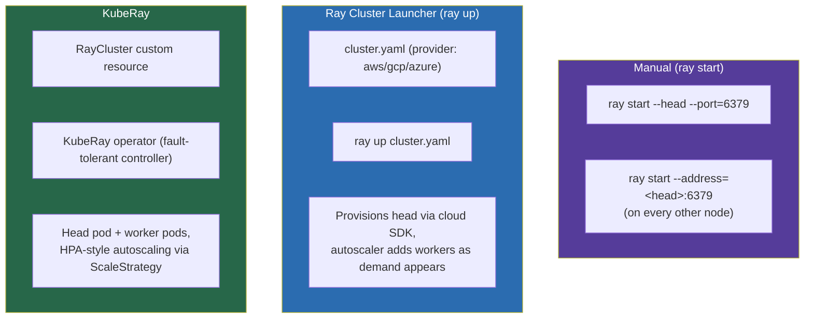
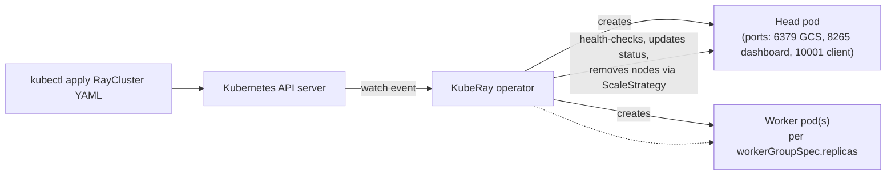
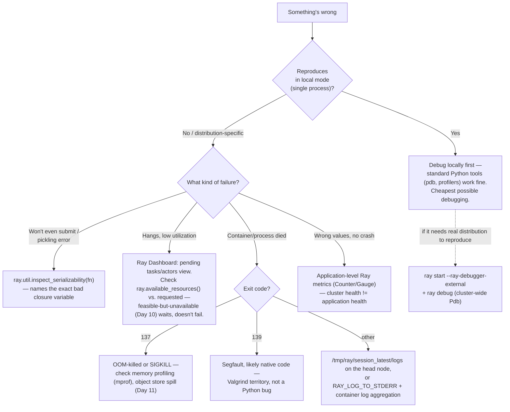

# Day 17 — Production Observability, Debugging, and Deployment Thinking
### Sources: *Learning Ray* Ch.9 (Ray Clusters); *Scaling Python with Ray* Ch.12 (Ray in the Enterprise), Appendix B (Installing and Deploying Ray), Appendix C (Debugging with Ray); current Ray docs (docs.ray.io/en/latest/ray-observability), 2026-09; Kleppmann, *Designing Data-Intensive Applications* (1st ed., 2017) Ch.1 pp.17-20 — the elastic-vs-manually-scaled distinction and the Operability principle — for general reliability/operability framing. (The newer Kleppmann/Riccomini edition in the library is an EPUB the available tooling can't parse; this citation is grounded in the 2018-printing PDF instead, read directly.)

> **API-freshness note.** This file is less API-code-heavy than Days 13–16 — it's mostly architecture, CLI workflow, and diagnostic reasoning, which has drifted far less than the ML-library APIs. The one confirmed drift point: the Ray Dashboard itself was, per *Scaling Python with Ray*, "being overhauled" at time of writing — expect the current dashboard's exact screens/labels to differ from any screenshot in either book, though the *underlying concepts* (Dashboard, State API, Prometheus export, per-actor/task views) are current and stable. KubeRay's CRD API version has also moved past the `v1alpha1` shown in the books' examples — check current KubeRay docs for the live `apiVersion` before applying any YAML from here verbatim.

---

## 1. Definitions and terminology

| Term | Definition |
|---|---|
| **Head node / GCS** | The node running the Global Control Store — Ray's cluster-wide metadata service (Day 10 material). `ray start --head` launches it. |
| **KubeRay** | The community-maintained Kubernetes operator for Ray. Defines a `RayCluster` custom resource; a fault-tolerant controller manages provisioning, scaling, and lifecycle. |
| **Ray Cluster Launcher** | A CLI tool (`ray up`/`ray down`) that provisions cloud VMs directly (AWS/GCP/Azure/etc.) via the provider's SDK, installs Ray, and starts the cluster — the non-Kubernetes alternative to KubeRay. |
| **Autoscaler (Ray)** | The process that adds/removes worker nodes based on pending task/actor/placement-group resource demand, bin-packing demand onto the smallest sufficient set of nodes, and removing workers idle past `idle_timeout_minutes`. |
| **Ray Dashboard** | Ray's built-in web UI (default port 8265) — cluster/task/actor/memory state, logs, and (with the job submission API) a way to submit and monitor jobs remotely. |
| **State API** | Programmatic/CLI access to the same live cluster state the Dashboard renders (`ray list tasks`, `ray list actors`, etc., or `ray.util.state` in Python) — the Dashboard's data source, usable headlessly. |
| **Prometheus export** | Ray's metrics can be scraped by Prometheus (disabled by default; enabled via `ray[default]` install + `--metrics-export-port`), enabling Grafana dashboards and, critically, **alerting** — something the Dashboard alone cannot do. |
| **Ephemeral vs. permanent cluster** | Ephemeral: spun up per-job, torn down after — lower cost, no multitenancy headaches, no cross-run caching. Permanent: long-lived, shared — avoids cluster startup latency, enables long-lived actors/shared caches, but accumulates configuration drift and multitenancy/security burden. |
| **`inspect_serializability`** | A `ray.util` diagnostic function that reports *exactly which captured object* in a function/closure is failing to pickle — the standard first move on any serialization error. |
| **`ray debug`** | Ray's integrated, cluster-wide Pdb-based debugger — set breakpoints that work across distributed tasks, unlike a normal single-machine Python debugger. |
| **Multitenancy (Ray's model)** | Ray isolates *jobs* by binding separate workers per job (reducing accidental leakage) but does **not** isolate system-level libraries (e.g. CUDA) between tenants, and **named actors break isolation entirely** (any job on the cluster can call a named actor). Explicitly described in the source material as "locks on doors... keep honest people honest," not a security boundary. |

---

## 2. Architecture and internal behavior

### 2.1 Three ways to stand up a cluster



Ray is explicitly **not opinionated** about which of these you use — commercial managed options (Anyscale, Domino) exist too. What differs across the three is *who* provisions the underlying compute (you, by hand; a cloud SDK, via the launcher; or Kubernetes, via KubeRay) — the Ray processes themselves (GCS, Raylet, workers — Day 10) are identical underneath any of the three.

### 2.2 KubeRay's operator loop



Three ways to *run* work against a live KubeRay cluster, each with a distinct tradeoff:

| Method | How | Tradeoff |
|---|---|---|
| `kubectl exec` into the head pod | Direct Python interpreter on the head | Simplest for interactive poking; not how you'd run production jobs |
| **Ray Job Submission** (`ray job submit`, port 8265) | Port-forward the dashboard/job port, `ray job submit --working-dir=. -- python script.py` | The recommended production path — ships your code, runs it, streams logs, survives your local terminal disconnecting |
| **Ray Client** (port 10001) | `ray.init(address="ray://...")` from your laptop | Convenient for interactive development against a remote cluster; matching Ray/Python **minor versions** between client and cluster is required |

### 2.3 The autoscaler's actual algorithm (worth knowing precisely, not just "it scales")

The autoscaler looks at **pending** tasks/actors/placement groups (not current utilization in isolation) and runs a **bin-packing** heuristic: add the *minimum* set of nodes that can satisfy outstanding demand, respecting user-specified min/max workers and heterogeneous node-type definitions. Idle workers (no assigned work) past `idle_timeout_minutes` are removed. The head node is **never** autoscaled away.

This is the same "feasible vs. available resources" reasoning from Day 10, now with a temporal dimension: a request that's feasible-but-not-currently-available doesn't fail, it *waits* while the autoscaler provisions more capacity — up to the configured max.

---

## 3. How the concepts relate to each other

- **Day 10 (scheduling, GCS, Raylet):** everything in §2 is that architecture, operationalized — the head node *is* where the GCS lives; the autoscaler is a control loop sitting on top of the same feasible/available resource distinction from Day 10.
- **Day 12 (fault tolerance):** the KubeRay controller's replica/pod recreation and the Serve controller (Day 16) are both instances of the same "detached, Ray-managed, restart-on-failure controller" pattern — recognizing it once here means recognizing it everywhere it recurs.
- **Day 13/14/15/16 (Data/Train/Tune/Serve):** every debugging technique in §5 below (`inspect_serializability`, `ray debug`, the Dashboard's actor/task views) applies identically regardless of which higher-level library triggered the failure — a serialization error from a Ray Data `map_batches` closure and one from a Serve deployment constructor are diagnosed with the *same* tool.
- **Day 08 (orchestration, Track A/B DE material):** Ray Job Submission is how an external orchestrator (Airflow, etc.) actually triggers Ray work — this is the concrete mechanism behind the "orchestrator triggers a Ray job" arrows drawn in Day 14/15/16's production diagrams.
- **Distributed systems fundamentals (Kleppmann, Ch.1):** the ephemeral-vs-permanent cluster tradeoff (§4) maps onto two things Kleppmann names directly, not a database-specific parallel dressed up as general theory. First, the *elastic vs. manually-scaled* distinction (p.17): elastic systems add/remove resources automatically but can hide operational surprises, manual scaling is simpler and more predictable — the same axis as choosing ephemeral (automatic, disposable) vs. permanent (manually provisioned, stable) Ray clusters. Second, the **Operability** principle (pp.19-20), whose own list names "avoiding dependency on individual machines" and "self-healing... but also giving administrators manual control over the system state" as hallmarks of good operability. An ephemeral cluster takes "avoiding dependency on individual machines" to its limit — it discards the whole cluster rather than nursing any part of it. A permanent cluster instead takes on the rest of that same list as a standing cost: configuration management, security patching, monitoring, preserving institutional knowledge of a long-lived system — precisely where the §4 table's "configuration drift" and "multitenancy burden" rows come from.

---

## 4. What needs to be understood deeply

**Ray's default security posture is "get started easily," not "production-safe by default."** No authentication between client and server out of the box — "anyone who can connect to your Ray server can potentially submit jobs and execute arbitrary code." This is not a bug, it's an explicit tradeoff toward frictionless local development, and the burden shifts entirely to you (TLS between client/head, or network-level restriction via ingress/VPN) before a cluster is reachable from anywhere untrusted. Assuming Ray is "secure by default" the way, say, a managed cloud database might be, is a genuine production risk.

**Multitenancy in Ray is isolation-by-convention, explicitly weaker than isolation-by-architecture.** Separate workers per job reduces *accidental* leakage; it does not prevent a determined actor. Named actors are called out specifically as breaking isolation — any job on a shared cluster can call a named actor, and because Ray relies on `cloudpickle` throughout, a malicious named actor is a code-execution vector. The source material's own recommendation, given this, is blunt: for real multitenancy requirements, use **multitenant Kubernetes/YARN** rather than leaning on Ray's own weak isolation. This is a load-bearing architectural decision, not a minor caveat.

**Ephemeral vs. permanent clusters is a first-order architecture decision with a real comparison table (reproduced from the source, it's worth internalizing directly):**

| Dimension | Ephemeral | Permanent |
|---|---|---|
| Resource cost | Normally lower | Higher if resource leaks block autoscale-down |
| Library isolation | Flexible, including native libs | Only venv/Conda-level |
| Trying new Ray versions | Easy, may need code changes | Higher overhead |
| Longest actor life | Ephemeral (dies with cluster) | "Permanent" (survives across jobs) |
| Shared actors across jobs | No | Yes |
| Time to launch new application | Potentially long (cloud-dependent) | Varies, often fast |
| Data read amortization | No — every cluster re-reads shared data | Possible, if well structured |

The senior call here is recognizing which axis actually matters for your workload — a nightly batch job cares about cost and version flexibility (favor ephemeral); a low-latency Serve deployment (Day 16) cares about launch time and shared-actor state (favor permanent, or at least long-lived).

**Ray's own dependency security posture is a real, named operational concern, not paranoia.** *Scaling Python with Ray* is explicit: Ray's default requirements pull in some libraries container scanners flag (naming the historical Log4j issue as an example), and because some are bundled into Ray's own wheel, you sometimes cannot simply upgrade the dependency — you have to rebuild Ray from source with a patched version. This is a real supply-chain-security tradeoff of depending on a large framework with bundled native dependencies, worth knowing about *before* a security scan surprises you mid-deployment.

---

## 5. Concepts that are easy to confuse

| Confusable pair | The distinction |
|---|---|
| **Ray Dashboard vs. State API** | The Dashboard is the *rendering* of cluster state in a browser. The State API (`ray list tasks`, `ray.util.state`) is the same underlying data, usable **headlessly** — in scripts, CI, or alerting logic. The Dashboard is for a human looking; the State API is for automation. |
| **Ray's own metrics/Dashboard vs. Prometheus/Grafana integration** | The Dashboard is *built in* but has **no alerting capability** — "helpful only when you already know something is wrong." Prometheus export (disabled by default) plus Grafana is what actually enables paging someone *before* a human happens to look at the Dashboard. Treating the Dashboard as sufficient production monitoring is a gap, not a simplification. |
| **Ray Cluster Launcher vs. KubeRay** | Both provision clusters, but the launcher talks directly to a cloud provider's SDK (AWS/GCP/Azure VMs); KubeRay talks to the Kubernetes API and manages pods. If your org already standardizes on Kubernetes, KubeRay composes with existing tooling (Helm, GitOps, cluster autoscalers) in a way the standalone launcher doesn't. |
| **Ray Job Submission vs. Ray Client** | Job Submission *ships your code* to run on the cluster and is designed for production/CI use (survives disconnection, streams logs back). Ray Client keeps your driver running *locally* and executes remote calls against a cluster over the network — convenient for interactive development, fragile for anything long-running (network blip = broken session), and requires matching Python/Ray versions. |
| **`ray.util.inspect_serializability` vs. a generic pickling error message** | The generic error tells you pickling failed. `inspect_serializability` tells you **which specific captured variable** in your closure is the culprit (e.g., a `multiprocessing.Pool` captured from enclosing scope) — always reach for it before guessing. |
| **Container exit code 137 vs. 139** | 137 = OOM-killed or `kill -9` (SIGKILL, not ignorable). 139 = segmentation fault, usually a null-pointer dereference in *native* code (not pure Python). Different failure class, different debugging path (memory profiling vs. native-code tools like Valgrind) — conflating them wastes debugging time on the wrong tool. |
| **Ephemeral cluster's "no cross-run caching" vs. a Ray Data Dataset's in-memory sharing (Day 13)** | Day 13's "load once, share by reference across many workers" benefit is *within one cluster's lifetime*. It does not survive the cluster being torn down — an ephemeral cluster re-pays that load cost on every single run, which is exactly the "data read amortization: No" row in the table above. |

---

## 6. Practical engineering patterns

**Pattern: production job submission against a KubeRay cluster.**

```bash
kubectl port-forward service/raycluster-complete-head-svc 8265:8265
export RAY_ADDRESS="http://localhost:8265"
ray job submit --working-dir=. -- python script.py
# ray job logs <job-id>
# ray job status <job-id>
# ray job stop <job-id>
```

**Pattern: diagnosing a serialization error before it ships.**

```python
pool = Pool(5)
def special_business(x):
    def inc(y):
        return y + x
    return pool.map(inc, range(0, x))

ray.util.inspect_serializability(special_business)
# !!! FAIL serialization: pool objects cannot be passed between processes or pickled
#     Serializing 'pool' <multiprocessing.pool.Pool state=RUN pool_size=5>...
```

**Pattern: custom application-level Prometheus metrics** (cluster metrics alone don't tell you the *application* is healthy — "a cluster with low memory usage because all jobs are stuck might look good at the cluster level"):

```python
from ray.util.metrics import Counter, Gauge

@ray.remote
class AccountActor:
    def __init__(self, name):
        self.failed_withdrawals = Counter(
            "failed_withdrawals",
            description="Number of failed withdrawals.",
            tag_keys=("actor_name",),
        )
        self.failed_withdrawals.set_default_tags({"actor_name": name})

    def withdraw(self, account, amount):
        if not self._sufficient_funds(account, amount):
            self.failed_withdrawals.inc()
            raise ValueError("insufficient funds")
        ...
```

**Pattern: propagating credentials without hardcoding them.**

```python
ray.init(
    runtime_env={
        "env_vars": {
            "AWS_ACCESS_KEY_ID": fetch_from_secret_store(),
            "AWS_SECRET_ACCESS_KEY": fetch_from_secret_store(),
        }
    }
)
```

**Pattern: remote cluster-wide debugging.**

```bash
ray start --head --ray-debugger-external   # on launch
ray debug                                   # from the head node, once running
```

**Pattern: reading exit codes correctly in a launch script.**

```bash
[raycommand] || (error=$?; echo "Ray exited with $error"; exit $error)
```

---

## 7. Common mistakes and misconceptions

- **Assuming the Ray Dashboard is sufficient production monitoring.** It cannot alert. Without Prometheus export + Grafana (or equivalent), you find out about problems when someone happens to look, not when they start.
- **Exposing the Ray Dashboard/job-submission port (8265) publicly without authentication or network restriction.** It binds to `localhost` by default for a reason — same endpoint that lets you submit jobs lets an attacker submit jobs.
- **Relying on named actors for cross-job communication on a genuinely multitenant cluster**, not realizing this is documented as breaking tenant isolation.
- **Debugging a "distributed" failure with distributed tools first.** The source material's own advice: reproduce locally, in Ray's local mode, *before* reaching for `ray debug` or remote profiling — most bugs aren't actually about distribution and are far cheaper to find single-machine.
- **Chasing a pickling error by trial-and-error removal of code**, instead of running `inspect_serializability` immediately, which usually names the exact offending captured variable.
- **Treating a green `ray up`/`kubectl apply` as "the cluster is ready."** The source material flags this directly for KubeRay: `kubectl get service` succeeding doesn't mean pods are `Running` yet — image pulls for Ray's (large) Docker images take real time.
- **Choosing permanent clusters by default "to avoid cold starts," without weighing the multitenancy and configuration-drift costs** the comparison table in §4 makes explicit.
- **Assuming exit code 0 always means success in a shell pipeline** — a script wrapped in a pipeline can misreport; explicitly capturing and propagating `$?` (the exit-code pattern in §6) is the fix, not an optional nicety.

---

## 8. Production considerations

This file *is* the production-considerations file for the whole Ray Core cluster — a few things worth stating at the platform level rather than per-symptom:

- **CI/CD**: the simplest path is treating Ray-in-local-mode as an ordinary Python dependency in your test suite; for testing actual distributed behavior, submit real (small) jobs via the Job Submission API and assert on results — this is how you get CI coverage of distribution-specific bugs (serialization, actor placement) that local-mode tests can't catch.
- **Credentials for multitenant data access** (§6's `runtime_env.env_vars` pattern) get complicated fast in a multitenant cluster — "keeping track of separate credentials can become a headache," stated candidly in the source material. This is a real argument *for* ephemeral, single-tenant clusters in credential-sensitive contexts.
- **Logging architecture**: Ray workers' stdout/stderr do **not** land where you'd naively expect (the initial container's logs) because Ray launches worker processes separately from container startup — you need either the aggregated log directory (`/tmp/ray/session_latest/logs`, mountable to a sidecar log-shipper) or `RAY_LOG_TO_STDERR=1` plus a container-log aggregation tool. Getting this wrong means "the logs I need don't exist where I'm looking," not "the job didn't log anything."
- **The autoscaler is a cost lever as much as a reliability one** — `min_workers`/`max_workers` and `idle_timeout_minutes` directly determine how much you pay for idle capacity vs. how much cold-start latency new work incurs.
- **This file's material is exactly Day 20's capstone checklist**: architecture diagram, data contract, Spark job, Ray stage, benchmark, failure-semantics report, observability/debugging notes, runbook — the observability and debugging patterns here are load-bearing for that final deliverable, not optional polish.

---

## 9. Debugging and performance reasoning

A decision tree for "something's wrong," roughly in the order the source material itself recommends triaging:



| Symptom | Likely cause | Where to look |
|---|---|---|
| Job submission succeeds but nothing seems to run | Requested resources not currently available (Day 10 feasible-vs-available) | Dashboard pending-resources view; `ray.available_resources()` |
| Serialization/pickling error at job start | Closure captured something non-picklable | `ray.util.inspect_serializability` |
| Container exits 137 | OOM or SIGKILL | Memory profiler (`mprof`); object store spill metrics (Day 11) |
| Container exits 139 | Native segfault | Valgrind or equivalent native tooling — not a pure-Python fix |
| "The logs aren't there" | Worker stdout/stderr not captured the way you expected | `/tmp/ray/session_latest/logs`, or `RAY_LOG_TO_STDERR=1` |
| Cluster looks healthy (Dashboard green) but the application isn't producing correct output | Cluster-level metrics don't reflect application-level correctness | Add application-specific Ray metrics (Counter/Gauge) rather than trusting infra metrics alone |
| Remote debugger only shows one machine's state | Using a normal single-machine Python debugger against a distributed failure | `ray debug` (cluster-wide) instead, after confirming the bug doesn't reproduce locally first |

---

## 10. Examples and exercises

### Worked example — full triage of a "job submitted, nothing happens" incident

```bash
# 1. Confirm the job is actually queued, not silently failed
ray job status raysubmit_XXXX

# 2. Check cluster resource pressure
python -c "import ray; ray.init(address='auto'); print(ray.available_resources())"

# 3. If resources are the bottleneck, check whether the autoscaler is even
#    trying to add capacity (cloud-provider quota, wrong node-type spec, etc.)
ray exec cluster.yaml 'tail -n 100 -f /tmp/ray/session_latest/logs/monitor*'

# 4. If resources look fine, check for a stuck task specifically
ray list tasks --filter "state=PENDING"
```

### Exercises (unsolved)

1. Deliberately write a `@ray.remote` function that closes over a non-serializable object (a DB connection, a `threading.Lock`, an open file handle). Run `ray.util.inspect_serializability` on it before ever calling `.remote()`, and confirm it names the exact offending variable.
2. Start a local Ray cluster, submit a job that requests more CPUs than your machine has. Confirm it queues rather than errors, then watch it start once you free up resources (kill something else) or reduce the request. Document what you observed in the Dashboard's pending-resources view.
3. Add a custom application-level `Counter` metric to any actor from an earlier day's exercise (Day 09–16). Deliberately trigger the failure path it counts, and confirm the metric increments — via `ray.util.metrics`, without needing a full Prometheus/Grafana stack to verify it's wired correctly.
4. Write out (as a short design doc, not code) the production-readiness checklist for a hypothetical Spark+Ray workload going live: authentication posture, ephemeral-vs-permanent cluster choice with your reasoning, logging architecture, and what a first on-call alert should be able to tell you within 60 seconds. Ground every decision in a specific fact from §4/§8 above, not general instinct.
5. Deliberately cause an OOM in a small local Ray job (allocate a large object repeatedly without releasing it) and confirm the exit code you see matches 137 from this file's table. Then research (docs, or your own knowledge) how Ray's object-store spilling (Day 11) is supposed to prevent exactly this — and explain, in your own words, why it didn't prevent it in your deliberately-constructed case.
